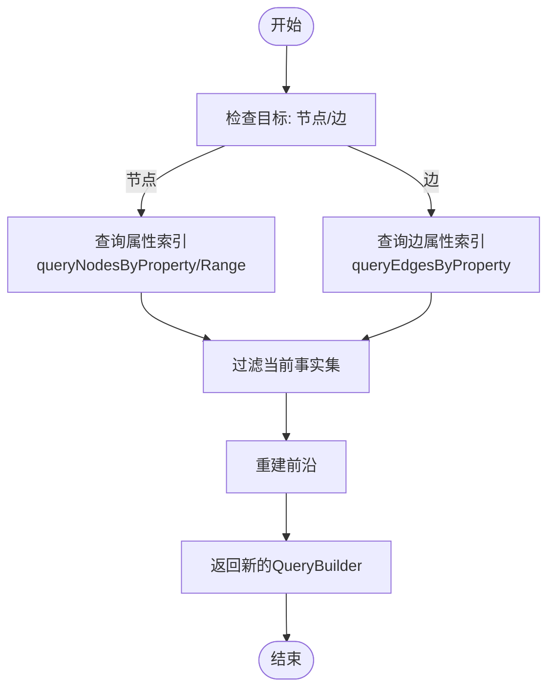

# 链式查询构建器

<cite>
**本文档引用的文件**
- [queryBuilder.ts](file://src/query/queryBuilder.ts)
- [persistentStore.ts](file://src/storage/persistentStore.ts)
- [synapseDb.ts](file://src/synapseDb.ts)
</cite>

## 目录
1. [介绍](#介绍)
2. [核心组件分析](#核心组件分析)
3. [链式调用语法实现机制](#链式调用语法实现机制)
4. [方法语义与执行流程](#方法语义与执行流程)
5. [前端游标在路径遍历中的作用](#前端游标在路径遍历中的作用)
6. [多条件组合查询示例](#多条件组合查询示例)
7. [属性索引下推优化](#属性索引下推优化)
8. [异步迭代器与批量流式处理](#异步迭代器与批量流式处理)
9. [事务快照一致性保障](#事务快照一致性保障)

## 介绍
`QueryBuilder` 类是 SynapseDB 查询系统的核心 DSL 接口，提供了一套流畅、直观的链式调用语法，用于构建复杂的图数据查询。它支持 `find().where().follow().limit()` 等操作，使开发者能够以声明式的方式表达查询逻辑。该类不仅封装了底层存储的复杂性，还通过一系列优化技术（如属性索引下推、快照隔离）确保了查询的高效性和一致性。

**Section sources**
- [queryBuilder.ts](file://src/query/queryBuilder.ts#L38-L812)
- [synapseDb.ts](file://src/synapseDb.ts#L234-L282)

## 核心组件分析
`QueryBuilder` 的核心在于其内部状态管理，主要包括三个关键部分：事实集（facts）、前沿（frontier）和方向（orientation）。事实集存储当前查询匹配的所有三元组记录；前沿是一个节点 ID 的集合，代表了当前查询结果的“边界”，是进行下一步联想查询（如 `follow`）的起点；方向则定义了在重建前沿时应关注主语、宾语还是两者。


**Diagram sources**
- [queryBuilder.ts](file://src/query/queryBuilder.ts#L38-L812)
- [persistentStore.ts](file://src/storage/persistentStore.ts#L61-L904)

**Section sources**
- [queryBuilder.ts](file://src/query/queryBuilder.ts#L38-L812)
- [persistentStore.ts](file://src/storage/persistentStore.ts#L61-L904)

## 链式调用语法实现机制
`QueryBuilder` 实现链式调用的关键在于其所有查询方法都遵循一个统一的模式：**不可变性** 和 **返回新实例**。每个方法（如 `where`, `limit`, `follow`）都不会修改当前实例的状态，而是基于当前状态创建一个新的 `QueryBuilder` 实例，并将新的查询上下文传递给它。这种设计保证了查询过程的可预测性和线程安全性。

例如，在 `find().where().follow()` 调用链中：
1.  `find()` 返回一个初始的 `QueryBuilder`。
2.  `where()` 方法接收这个实例，应用过滤条件，计算出新的事实集和前沿，然后构造并返回一个全新的 `QueryBuilder`。
3.  `follow()` 方法再对这个新实例进行操作，以此类推。


**Diagram sources**
- [queryBuilder.ts](file://src/query/queryBuilder.ts#L138-L158)
- [queryBuilder.ts](file://src/query/queryBuilder.ts#L643-L645)
- [queryBuilder.ts](file://src/query/queryBuilder.ts#L244-L261)

**Section sources**
- [queryBuilder.ts](file://src/query/queryBuilder.ts#L138-L158)
- [queryBuilder.ts](file://src/query/queryBuilder.ts#L643-L645)
- [queryBuilder.ts](file://src/query/queryBuilder.ts#L244-L261)

## 方法语义与执行流程
### where 方法
`where` 方法接受一个谓词函数，对当前的事实集进行过滤。其内部流程为：首先调用 `pin()` 固定事务快照，然后使用 `Array.filter` 应用用户提供的谓词，最后调用 `rebuildFrontier` 根据新的事实集和原始方向重建前沿，并返回一个包含新上下文的新 `QueryBuilder` 实例。

### follow 方法
`follow` 方法用于执行一次“联想”查询，即沿着指定的关系谓词向前推进。其核心是 `traverse` 私有方法。它会遍历当前的 `frontier` 中的每一个节点ID，将其作为主语(subject)，结合谓词ID，向 `PersistentStore` 发起查询，获取所有匹配的三元组。这些新获取的三元组构成了新的事实集，而它们的宾语(object)ID 则构成了新的 `frontier`。

### limit, skip, take 方法
这三个方法用于控制结果集的大小和分页。
-   `limit(n)`：返回前 n 条记录。
-   `skip(n)`：跳过前 n 条记录。
-   `take(n)`：等同于 `limit(n)`，提供更符合流式处理习惯的别名。
它们的实现都是通过 `Array.slice` 操作当前的事实集，然后重建前沿。

### union 方法
`union` 方法用于合并两个查询结果集，并自动去重。它利用一个 `Map` 结构，以三元组的键（通过 `encodeTripleKey` 生成）作为唯一标识，将两个查询结果集中的记录插入其中，从而天然地实现了去重。最后，将 `Map` 中的值转换回数组，形成新的事实集。

**Section sources**
- [queryBuilder.ts](file://src/query/queryBuilder.ts#L138-L158)
- [queryBuilder.ts](file://src/query/queryBuilder.ts#L643-L645)
- [queryBuilder.ts](file://src/query/queryBuilder.ts#L244-L261)
- [queryBuilder.ts](file://src/query/queryBuilder.ts#L161-L179)
- [queryBuilder.ts](file://src/query/queryBuilder.ts#L269-L286)
- [queryBuilder.ts](file://src/query/queryBuilder.ts#L264-L266)

## 前端游标在路径遍历中的作用
前端游标（frontier）是 `QueryBuilder` 实现多跳路径遍历的核心机制。它充当了查询的“探针头”或“活动边界”。在每次 `follow` 或 `followReverse` 操作后，旧的 `frontier` 被消耗，而新查询到的三元组的另一端节点（宾语或主语）则被收集起来，成为新的 `frontier`。

这种设计使得连续的 `follow` 调用能够像波浪一样在网络中层层推进。例如，在查询“A认识的人工作在哪里”的场景中：
1.  第一次 `follow('knows')` 后，`frontier` 变成了 A 认识的所有人（如 B, C）。
2.  第二次 `follow('worksAt')` 时，系统会以 B 和 C 作为主语，查找他们的工作单位，最终得到结果。

`anchor` 方法允许显式设置初始的 `frontier`，这对于精确控制查询的起点至关重要。

**Section sources**
- [queryBuilder.ts](file://src/query/queryBuilder.ts#L38-L812)
- [queryBuilder.ts](file://src/query/queryBuilder.ts#L1151-L1166)
- [queryBuilder.ts](file://src/query/queryBuilder.ts#L1168-L1178)

## 多条件组合查询示例
以下代码展示了如何组合使用多个方法来构建一个复杂的查询：

```typescript
// 查找所有年龄大于30岁且喜欢咖啡的人的朋友
const friends = db.find({ predicate: 'likes', object: 'Coffee' })
  .whereNodeProperty({ propertyName: 'age', range: { min: 30 } })
  .followReverse('likes') // 找到喜欢咖啡的人
  .follow('knows') // 找到这些人的朋友
  .whereLabel('ActiveUser') // 过滤出活跃用户
  .limit(10); // 只取前10个结果

for await (const friend of friends) {
  console.log(friend);
}
```

**Section sources**
- [queryBuilder.ts](file://src/query/queryBuilder.ts#L317-L387)
- [queryBuilder.ts](file://src/query/queryBuilder.ts#L389-L454)
- [queryBuilder.ts](file://src/query/queryBuilder.ts#L456-L516)

## 属性索引下推优化
`whereProperty` 方法是性能优化的关键。它不依赖于对整个事实集进行全表扫描和逐条判断，而是直接利用底层的 `PropertyIndex` 进行高效的索引查询。

其执行流程如下：
1.  根据属性名和操作符（=, >, < 等），调用 `PropertyIndex` 的 `queryNodesByProperty` 或 `queryNodesByRange` 方法，快速获取所有满足条件的节点ID集合。
2.  使用这个ID集合，对当前的事实集进行过滤，检查每条三元组的主语或宾语ID是否存在于该集合中。
3.  由于索引查询的时间复杂度远低于全表扫描，这极大地提升了查询性能，尤其是在数据量庞大的情况下。



**Diagram sources**
- [queryBuilder.ts](file://src/query/queryBuilder.ts#L317-L387)
- [persistentStore.ts](file://src/storage/persistentStore.ts#L61-L904)

**Section sources**
- [queryBuilder.ts](file://src/query/queryBuilder.ts#L317-L387)
- [persistentStore.ts](file://src/storage/propertyStore.ts)

## 异步迭代器与批量流式处理
为了应对大数据集的内存压力，`QueryBuilder` 提供了强大的流式处理能力。

-   `[Symbol.asyncIterator]`：实现了异步迭代器协议，允许使用 `for await...of` 循环逐条处理结果，避免一次性将所有数据加载到内存。
-   `batch(size)`：提供了更高层次的流式接口，可以按批次（batch）获取数据。它在内部使用 `setImmediate` 添加微小延迟，有助于事件循环的调度，防止长时间运行的同步操作阻塞其他任务。

这两个特性使得 `QueryBuilder` 能够高效地处理数百万甚至上亿条记录的查询，而不会导致内存溢出。

```mermaid
flowchart TD
    Start([开始]) --> Pin["固定快照 pin()"]
    Pin --> InitOffset["初始化偏移量 offset = 0"]
    InitOffset --> CheckEnd{"offset < 总数?"}
    CheckEnd -->|否| UnpinAndEnd["释放快照 unpin()<br/>结束"]
    CheckEnd -->|是| SliceBatch["切片获取一批数据"]
