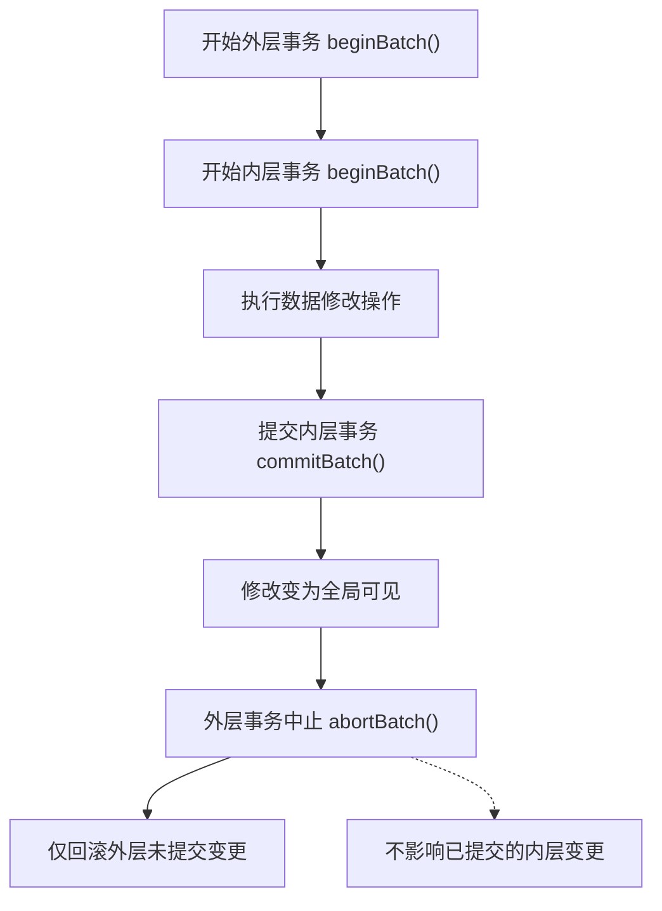
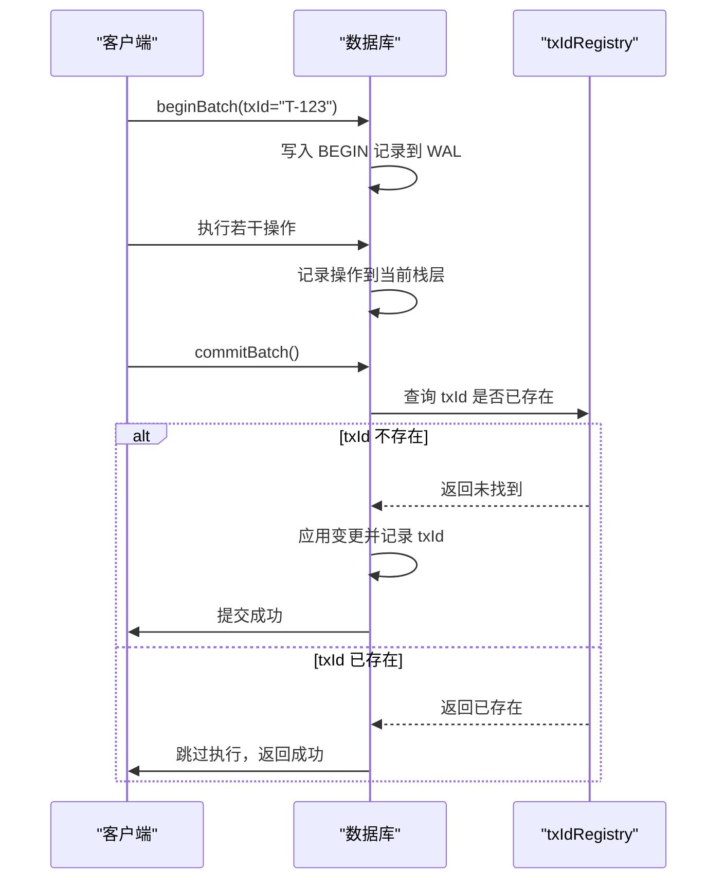
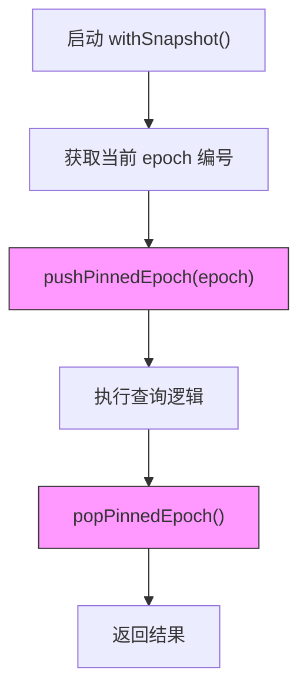
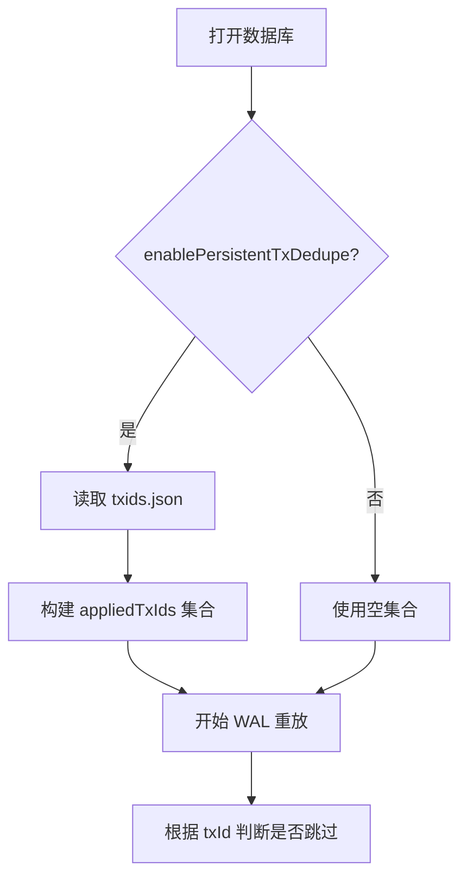
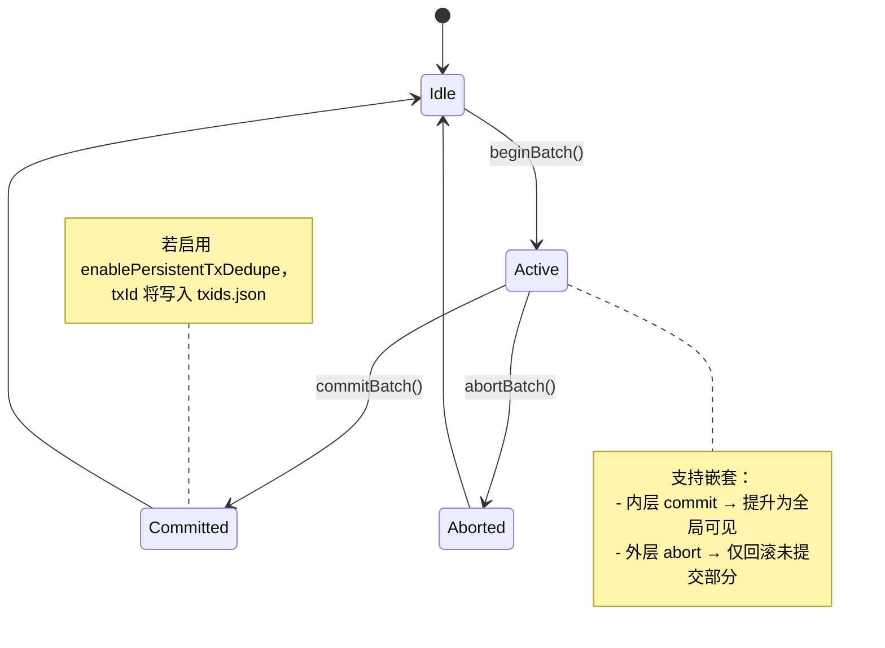

# 事务模型

<cite>
**本文档引用的文件**
- [wal.ts](file://src/storage/wal.ts)
- [txidRegistry.ts](file://src/storage/txidRegistry.ts)
- [openOptions.ts](file://src/types/openOptions.ts)
</cite>

## 目录
1. [引言](#引言)
2. [嵌套事务机制](#嵌套事务机制)
3. [幂等提交实现](#幂等提交实现)
4. [读快照隔离原理](#读快照隔离原理)
5. [持久化去重配置](#持久化去重配置)
6. [WAL日志与事务状态追踪](#wal日志与事务状态追踪)
7. [事务状态机图示](#事务状态机图示)
8. [典型并发场景示例](#典型并发场景示例)
9. [异常处理策略](#异常处理策略)
10. [结论](#结论)

## 引言
SynapseDB 提供了一套完整的事务处理能力，支持嵌套事务、幂等提交和读取快照隔离。本文档全面阐述其事务模型的核心机制，包括基于 WAL（Write-Ahead Log）的日志记录、txStack 层次化管理、epoch 版本控制以及 txIdRegistry 去重注册表的实现方式。通过分析关键源码路径，帮助开发者深入理解事务语义并正确使用相关 API。

## 嵌套事务机制
SynapseDB 支持多层嵌套事务，通过 `batchDepth` 计数和 `txStack` 暂存栈实现层次化管理。每当调用 `beginBatch()` 时，系统会在 WAL 中写入一个 `BEGIN` 记录，并将当前操作上下文压入事务栈。内层事务的变更被暂存在栈顶层级中，直到提交或中止。

当内层事务执行 `commitBatch()` 时，其修改会立即提升为全局可见，即使外层事务后续调用 `abortBatch()` 也不会回滚这些已提交的更改。这种“内层提交对外层 abort 隔离”的行为确保了部分成功语义的可靠性。

**Diagram sources**
- [wal.ts](file://src/storage/wal.ts#L145-L320)

**Section sources**
- [wal.ts](file://src/storage/wal.ts#L96-L99)
- [wal.ts](file://src/storage/wal.ts#L101-L103)
- [wal.ts](file://src/storage/wal.ts#L110-L112)

## 幂等提交实现
为了防止重复写入，SynapseDB 实现了基于 `txIdRegistry` 的幂等提交机制。用户在调用 `beginBatch()` 时可传入唯一 `txId`，系统在重放 WAL 日志时会检查该 ID 是否已存在于已提交集合中。

若发现重复 `txId`，则整个事务的所有操作将被跳过，从而保证“最多一次”执行语义。这一机制依赖于 `WalReplayer.replay()` 方法中的 `appliedTxIds` 集合进行内存级去重判断。

**Diagram sources**
- [wal.ts](file://src/storage/wal.ts#L145-L320)
- [txidRegistry.ts](file://src/storage/txidRegistry.ts#L17-L25)

**Section sources**
- [wal.ts](file://src/storage/wal.ts#L145-L320)
- [txidRegistry.ts](file://src/storage/txidRegistry.ts#L17-L25)
- [txidRegistry.ts](file://src/storage/txidRegistry.ts#L55-L76)

## 读快照隔离原理
SynapseDB 实现了读取快照隔离（Snapshot Isolation），确保长时间运行的查询在整个执行过程中看到一致的数据视图。该机制基于 epoch 版本控制和 `pinnedEpochStack` 固定机制。

当调用 `withSnapshot()` 时，系统会获取当前的 `epoch` 编号，并将其推入 `pinnedEpochStack`。在此期间，任何后台维护任务（如 compaction 或 GC）都不会推进 manifest 版本，从而防止索引结构变化导致查询结果不一致。

快照期间的数据可见性规则如下：
- 只能看到在快照开始前已提交的数据；
- 快照期间的新写入对当前查询不可见；
- 多次查询在同一快照回调内返回相同结果。

**Diagram sources**
- [synapseDb.ts](file://src/synapseDb.ts#L468-L510)

**Section sources**
- [synapseDb.ts](file://src/synapseDb.ts#L468-L510)
- [query_snapshot_isolation.test.ts](file://tests/system/query_snapshot_isolation.test.ts#L20-L58)
- [snapshot_memory_basic.test.ts](file://tests/system/snapshot_memory_basic.test.ts#L0-L42)

## 持久化去重配置
通过 `openOptions` 中的 `enablePersistentTxDedupe` 配置项，可以启用跨数据库重启的持久化去重功能。当此选项设为 `true` 时，系统会在 `<db>.pages/txids.json` 文件中持久化已提交的事务 ID。

每次成功提交带有 `txId` 的事务后，系统会异步调用 `writeTxIdRegistry()` 将其加入注册表。重启后，`readTxIdRegistry()` 会在 WAL 重放前加载历史 txId 集合，用于去重判断。

启用该功能会带来轻微的存储开销和启动延迟，但能有效应对崩溃恢复场景下的重复提交问题。

**Diagram sources**
- [openOptions.ts](file://src/types/openOptions.ts#L98-L98)
- [txidRegistry.ts](file://src/storage/txidRegistry.ts#L17-L25)

**Section sources**
- [openOptions.ts](file://src/types/openOptions.ts#L98-L98)
- [txidRegistry.ts](file://src/storage/txidRegistry.ts#L17-L25)
- [README.md](file://README.md#L124-L152)

## WAL日志与事务状态追踪
所有事务操作均通过 `wal.ts` 中的 `appendBegin`、`appendCommit` 和 `appendAbort` 方法记录到 WAL 文件中。每种操作对应特定的记录类型：

- `0x40`: BEGIN - 标志事务开始，携带可选 `txId` 和 `sessionId`
- `0x41`: COMMIT - 标志事务提交
- `0x42`: ABORT - 标志事务中止

这些记录按顺序追加至 `.wal` 文件，形成事务状态变迁的历史轨迹。在数据库恢复时，`WalReplayer.replay()` 会逐条解析这些记录，重建最终一致状态。

例如，在 `wal_abort_semantics.test.ts` 测试中验证了属性操作的 ABORT 行为：设置节点属性后若中止事务，则属性变更会被完全回滚。

**Section sources**
- [wal.ts](file://src/storage/wal.ts#L96-L99)
- [wal.ts](file://src/storage/wal.ts#L101-L103)
- [wal.ts](file://src/storage/wal.ts#L110-L112)
- [wal.ts](file://src/storage/wal.ts#L145-L320)
- [wal_abort_semantics.test.ts](file://tests/integration/storage/wal_abort_semantics.test.ts#L124-L170)

## 事务状态机图示
以下为 SynapseDB 事务的状态迁移图：

**Diagram sources**
- [wal.ts](file://src/storage/wal.ts#L3-L10)
- [wal.ts](file://src/storage/wal.ts#L96-L99)
- [wal.ts](file://src/storage/wal.ts#L101-L103)
- [wal.ts](file://src/storage/wal.ts#L110-L112)

## 典型并发场景示例
### 场景一：长查询与后台维护并发
一个长时间运行的链式查询（如 `find().follow().all()`）与后台 compaction 同时发生。由于 `withSnapshot()` 固定了 `epoch`，查询始终基于初始版本的索引结构，避免了因页面合并导致的结果不一致。

### 场景二：失败重试与幂等提交
客户端因网络故障重试同一事务请求。只要携带相同的 `txId`，即使数据库已重启，WAL 重放阶段也会识别出该事务已执行，自动跳过重复操作，防止数据重复插入。

### 场景三：混合操作的原子性回滚
在一个批次中同时添加事实和设置属性。若中途调用 `abortBatch()`，所有变更（包括三元组增删和属性更新）都将被完整回滚，保持事务的原子性。

**Section sources**
- [query_snapshot_isolation.test.ts](file://tests/system/query_snapshot_isolation.test.ts#L220-L264)
- [wal_abort_semantics.test.ts](file://tests/integration/storage/wal_abort_semantics.test.ts#L124-L170)
- [README.md](file://README.md#L124-L152)

## 异常处理策略
- **WAL 校验失败**：若记录的 checksum 不匹配，`WalReplayer` 会立即停止重放，保证数据完整性。
- **文件读取异常**：`readTxIdRegistry` 在无法读取 `txids.json` 时返回空集合，不影响主流程。
- **同步写入失败**：`appendCommitDurable()` 使用 `fsync` 确保持久性，失败时抛出异常。
- **资源清理**：`finally` 块确保文件句柄始终关闭，防止泄漏。

**Section sources**
- [wal.ts](file://src/storage/wal.ts#L145-L320)
- [txidRegistry.ts](file://src/storage/txidRegistry.ts#L27-L49)

## 结论
SynapseDB 的事务模型结合了嵌套事务、幂等提交和读快照隔离三大核心特性，提供了强一致性保障的同时兼顾