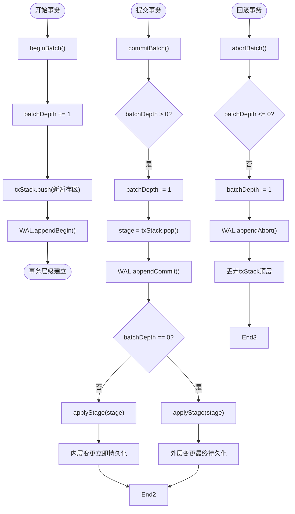
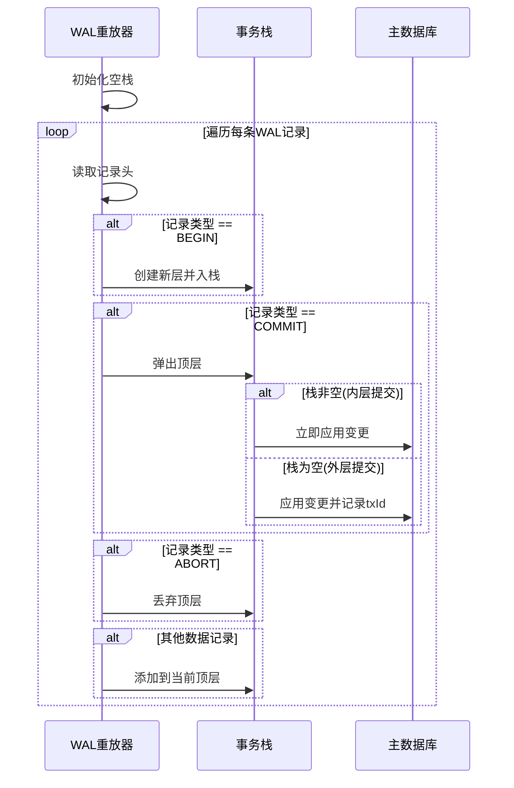

# 嵌套事务

<cite>
**本文档引用的文件**
- [synapseDb.ts](file://src/synapseDb.ts)
- [persistentStore.ts](file://src/storage/persistentStore.ts)
- [wal.ts](file://src/storage/wal.ts)
- [txidRegistry.ts](file://src/storage/txidRegistry.ts)
- [wal_nested_bug_reproduce.test.ts](file://tests/integration/storage/wal_nested_bug_reproduce.test.ts)
</cite>

## 目录
1. [简介](#简介)
2. [核心机制分析](#核心机制分析)
3. [WAL日志与崩溃恢复](#wal日志与崩溃恢复)
4. [事务ID幂等性管理](#事务id幂等性管理)
5. [典型使用场景](#典型使用场景)
6. [异常处理与性能考量](#异常处理与性能考量)
7. [结论](#结论)

## 简介
SynapseDB实现了层次化的嵌套事务模型，通过`beginBatch`、`commitBatch`和`abortBatch`方法支持多层事务的精细控制。该机制不仅保证了ACID特性，还通过独特的内层提交立即生效策略，在复杂业务逻辑中提供了灵活的数据一致性保障。

## 核心机制分析

SynapseDB的嵌套事务基于两个核心数据结构：`batchDepth`计数器和`txStack`暂存栈。当调用`beginBatch`时，系统会递增`batchDepth`并创建新的事务上下文压入`txStack`；每次`commitBatch`或`abortBatch`则对应一次出栈操作。



**Diagram sources**
- [persistentStore.ts](file://src/storage/persistentStore.ts#L714-L773)

**Section sources**
- [persistentStore.ts](file://src/storage/persistentStore.ts#L714-L773)
- [synapseDb.ts](file://src/synapseDb.ts#L460-L470)

### 内层事务提交设计决策
与传统嵌套事务不同，SynapseDB在内层`commitBatch`时即刻将变更应用到主存储（`applyStage`），而非仅标记为"准备提交"。这一设计确保了：
- **隔离性增强**：已提交的内层事务不受外层`abortBatch`影响
- **语义清晰**：符合开发者对"提交即永久生效"的直觉预期
- **恢复简单**：WAL重放时无需复杂的两阶段提交协议

该行为通过`commitBatch`中的条件判断实现：无论`batchDepth`是否为0，都会执行`applyStage(stage)`。

## WAL日志与崩溃恢复

Write-Ahead Logging (WAL) 是保证事务持久性和崩溃恢复一致性的关键组件。WAL记录按特定顺序写入，并在数据库重启时重放以重建状态。

### 日志记录类型
| 记录类型 | 十六进制码 | 触发时机 |
|---------|-----------|--------|
| BEGIN_BATCH | 0x40 | 调用`beginBatch()`时 |
| COMMIT_BATCH | 0x41 | 调用`commitBatch()`时 |
| ABORT_BATCH | 0x42 | 调用`abortBatch()`时 |

### 重放语义
WAL重放器维护一个栈式结构来模拟嵌套事务的层次关系：



**Diagram sources**
- [wal.ts](file://src/storage/wal.ts#L248-L278)
- [wal.ts](file://src/storage/wal.ts#L274-L302)

**Section sources**
- [wal.ts](file://src/storage/wal.ts#L0-L419)

## 事务ID幂等性管理

为防止重复处理同一逻辑事务，SynapseDB引入了`txId`机制，配合`txidRegistry`实现跨会话的幂等控制。

### 工作流程
1. `commitBatch`时若提供`txId`，异步将其写入`txids.json`
2. WAL重放时先读取已知`txId`集合
3. 仅当`txId`未存在于集合中时才应用对应变更
4. 将新提交的`txId`加入集合并持久化

### 注册表结构
```json
{
  "version": 1,
  "max": 1000,
  "txIds": [
    {
      "id": "unique-tx-123",
      "ts": 1700000000000,
      "sessionId": "client-a"
    }
  ]
}
```

**Section sources**
- [txidRegistry.ts](file://src/storage/txidRegistry.ts#L0-L77)
- [persistentStore.ts](file://src/storage/persistentStore.ts#L734-L777)

## 典型使用场景

### 外层回滚不影响内层提交
以下测试用例验证了核心语义：

```typescript
// 外层事务
db.beginBatch({ txId: 'outer' });

// 内层提交 - 应保留
db.beginBatch({ txId: 'inner-commit' });
db.addFact({ subject: 'InnerCommitted', predicate: 'test', object: 'should-survive' });
db.commitBatch(); // 变更立即持久化

// 内层中止 - 应丢弃
db.beginBatch({ txId: 'inner-abort' });
db.addFact({ subject: 'InnerAborted', predicate: 'test', object: 'should-die' });
db.abortBatch(); // 仅丢弃本层

// 外层中止
db.abortBatch(); // 不影响已提交的内层事务

// 重启后验证
expect(db.find({ subject: 'InnerCommitted' }).all()).toHaveLength(1);
expect(db.find({ subject: 'InnerAborted' }).all()).toHaveLength(0);
```

**Section sources**
- [wal_nested_bug_reproduce.test.ts](file://tests/integration/storage/wal_nested_bug_reproduce.test.ts#L0-L105)

## 异常处理与性能考量

### 深度限制
虽然代码未显式限制嵌套深度，但实际受内存约束。建议业务逻辑避免过深嵌套（>10层）。

### 异常处理策略
- `abortBatch`在`batchDepth<=0`时直接返回，防止栈溢出
- `txidRegistry`操作包裹在try-catch中，故障不影响主流程
- WAL校验失败时停止重放，保证数据完整性

### 性能影响
- **内层提交开销**：每次`commitBatch`都触发`applyStage`，可能增加I/O
- **WAL大小**：所有BEGIN/COMMIT/ABORT均记录，长期运行需定期清理
- **txId注册表**：大量事务可能导致`txids.json`膨胀，可通过`max`参数截断

**Section sources**
- [persistentStore.ts](file://src/storage/persistentStore.ts#L765-L773)
- [txidRegistry.ts](file://src/storage/txidRegistry.ts#L51-L76)

## 结论
SynapseDB的嵌套事务机制通过`batchDepth`与`txStack`的协同工作，实现了既安全又灵活的多层事务管理。其创新的内层提交立即生效设计，结合WAL的日志重放语义和`txId`幂等控制，为复杂应用场景提供了强大的数据一致性保障。开发者可据此构建可靠的业务逻辑，同时应注意合理设计事务边界以优化性能。