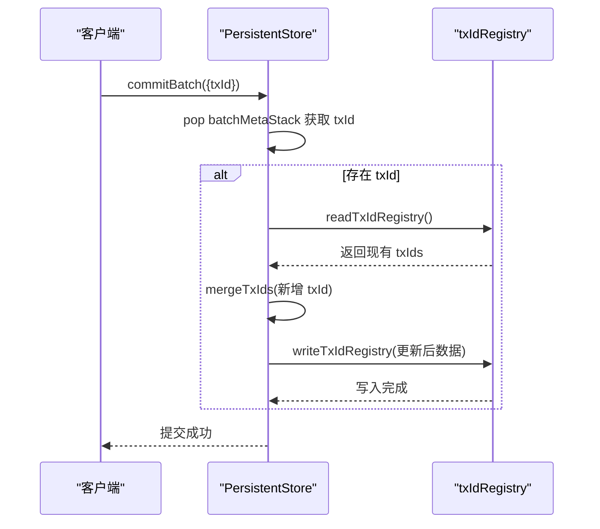

# 幂等提交

<cite>
**本文档引用的文件**
- [txidRegistry.ts](file://src/storage/txidRegistry.ts)
- [persistentStore.ts](file://src/storage/persistentStore.ts)
- [openOptions.ts](file://src/types/openOptions.ts)
- [wal.ts](file://src/storage/wal.ts)
</cite>

## 目录
1. [引言](#引言)
2. [事务幂等性保障机制概述](#事务幂等性保障机制概述)
3. [txId注册表持久化去重逻辑](#txid注册表持久化去重逻辑)
4. [enablePersistentTxDedupe配置项详解](#enablepersistenttxdedupe配置项详解)
5. [性能开销与调优建议](#性能开销与调优建议)
6. [故障恢复案例分析](#故障恢复案例分析)
7. [分布式环境下的最佳实践](#分布式环境下的最佳实践)
8. [结论](#结论)

## 引言
SynapseDB 是一个嵌入式三元组知识库，支持高并发、快照隔离和持久化存储。在分布式系统或高可用场景中，网络波动、服务重启可能导致客户端重复提交同一事务，从而引发数据重复插入问题。为解决此问题，SynapseDB 提供了基于 `txId` 的事务幂等性保障机制，确保即使在异常情况下重复提交相同事务，也仅会执行一次。

本文档深入解析 SynapseDB 中通过 `txIdRegistry` 实现的持久化去重逻辑，涵盖注册流程、异步合并策略、错误容忍设计及配置启用条件，并结合实际案例说明其防护作用，最后提供性能调优与跨进程安全的最佳实践。

## 事务幂等性保障机制概述
SynapseDB 的事务幂等性依赖于 `commitBatch` 方法中的 `txIdRegistry` 机制实现。当用户开启 `enablePersistentTxDedupe` 配置并传入唯一 `txId` 时，系统会在每次成功提交后将该 `txId` 持久化记录至磁盘文件 `txids.json`。后续若检测到已存在的 `txId`，则跳过执行，防止重复写入。

核心组件包括：
- **txIdRegistry**: 管理已提交事务 ID 的注册与查询。
- **PersistentStore.commitBatch**: 在提交阶段异步写入 `txId` 到注册表。
- **WalReplayer**: 启动时重放 WAL 日志，利用注册表过滤已应用的事务。

该机制不仅适用于单机重启场景，也能有效应对主从切换、负载均衡导致的重复请求。

**Section sources**
- [persistentStore.ts](file://src/storage/persistentStore.ts#L727-L763)
- [txidRegistry.ts](file://src/storage/txidRegistry.ts#L17-L49)
- [openOptions.ts](file://src/types/openOptions.ts#L98-L98)

## txId注册表持久化去重逻辑

### 注册流程
当调用 `commitBatch` 完成最外层事务提交时，若存在 `txId`，系统会触发以下异步操作：

1. **读取现有注册表**：调用 `readTxIdRegistry(directory)` 从索引目录下的 `txids.json` 文件加载当前所有已知 `txId`。
2. **合并新事务ID**：使用 `mergeTxIds(reg, items, max)` 函数将本次提交的 `txId` 和可选 `sessionId` 添加到注册表中，避免重复。
3. **持久化更新**：通过 `writeTxIdRegistry(directory, data)` 将更新后的注册表写回磁盘，采用原子重命名（rename）保证写入完整性。



**Diagram sources**
- [persistentStore.ts](file://src/storage/persistentStore.ts#L727-L763)
- [txidRegistry.ts](file://src/storage/txidRegistry.ts#L17-L49)

### 异步合并策略
注册表的更新是异步进行的，不影响主事务提交性能。`commitBatch` 中通过 `void (async () => { ... })()` 包裹整个注册逻辑，确保不会阻塞主线程。

`mergeTxIds` 函数负责合并逻辑：
- 使用 `Set` 快速判断是否已存在相同 `txId`。
- 若不存在，则添加新条目并记录时间戳 `ts` 和 `sessionId`。
- 根据 `maxRememberTxIds` 配置截断旧记录，保留最近 N 个事务 ID。

此策略既保证了幂等性窗口的可控性，又避免无限增长导致磁盘占用过高。

**Section sources**
- [txidRegistry.ts](file://src/storage/txidRegistry.ts#L55-L76)
- [persistentStore.ts](file://src/storage/persistentStore.ts#L727-L763)

### 错误容忍设计
整个注册过程具备良好的容错能力：
- **读取失败处理**：`readTxIdRegistry` 捕获异常后返回空注册表 `{ version: 1, txIds: [] }`，不影响正常提交。
- **写入失败静默忽略**：`writeTxIdRegistry` 外层 try-catch 捕获所有错误，即使写入失败也不中断事务提交流程。
- **WAL 重放兼容**：启动时 `WalReplayer.replay(knownTxIds)` 接收已知 `txId` 集合，在重放过程中自动跳过已提交事务，防止重复执行。

这种“尽力而为”的设计原则确保了系统的健壮性和可用性优先。

**Section sources**
- [txidRegistry.ts](file://src/storage/txidRegistry.ts#L17-L25)
- [wal.ts](file://src/storage/wal.ts#L142-L321)

## enablePersistentTxDedupe配置项详解

### 启用条件
`enablePersistentTxDedupe` 是 `SynapseDBOpenOptions` 接口中的布尔字段，默认值为 `false`。必须显式设置为 `true` 才能激活跨周期的事务幂等去重功能。

```typescript
await SynapseDB.open('/path/to/db', {
  enablePersistentTxDedupe: true,
  maxRememberTxIds: 5000
});
```

一旦启用，系统将在数据库打开时自动加载 `txids.json` 文件，并在每次提交时更新该文件。

### 高可用场景下的防护作用
在微服务架构中，由于网络超时或服务重启，客户端可能多次发送相同的事务请求。启用 `enablePersistentTxDedupe` 后，SynapseDB 能够识别这些重复请求并直接返回成功，而无需重新执行写入操作。

例如，在订单创建场景中，即使因网关重试导致同一笔订单被提交三次，数据库也只会插入一条记录，其余两次将被幂等机制拦截，从而避免库存扣减错误等问题。

**Section sources**
- [openOptions.ts](file://src/types/openOptions.ts#L98-L98)
- [persistentStore.ts](file://src/storage/persistentStore.ts#L99-L238)

## 性能开销与调优建议

### 读写性能开销
- **写入开销**：每次提交需额外执行一次 JSON 文件读写，但由于是异步非阻塞操作，对主流程影响极小。
- **读取开销**：启动时加载 `txids.json` 的时间取决于文件大小，通常在毫秒级。
- **内存占用**：内存中维护一个 `Set<string>` 存储最近的 `txId`，默认最多 1000 个，每个 ID 按平均 36 字节计算，总内存约 36KB。

### 磁盘空间占用
`txids.json` 文件以 JSON 格式存储，每条记录包含 `id`、`ts`、`sessionId` 字段。假设每条记录平均 100 字节，保存 1000 条记录约为 100KB。可通过调整 `maxRememberTxIds` 控制最大尺寸。

### 调优建议
| 参数 | 建议值 | 说明 |
|------|--------|------|
| `maxRememberTxIds` | 1000~5000 | 根据业务重试窗口设定，过大增加 I/O 开销，过小可能导致漏判 |
| `enablePersistentTxDedupe` | 生产环境必开 | 特别是在分布式部署或有重试机制的系统中 |
| `durable` in `commitBatch` | 可选开启 | 若需强持久性保障，可设 `durable: true` 触发 fsync |

**Section sources**
- [openOptions.ts](file://src/types/openOptions.ts#L128-L138)
- [txidRegistry.ts](file://src/storage/txidRegistry.ts#L55-L76)

## 故障恢复案例分析
考虑如下故障场景：某金融交易系统使用 SynapseDB 记录转账日志，某次转账因网络中断未能及时收到响应，客户端发起重试。

**未启用幂等保护的情况**：
- 第一次提交：成功写入 WAL，但响应丢失。
- 第二次提交：再次写入相同事务，导致双倍记账。
- 结果：资金重复扣除，造成严重后果。

**启用幂等保护后**：
- 第一次提交：`txId="txn-001"` 成功写入并记录至 `txids.json`。
- 第二次提交：系统检测到 `txn-001` 已存在，跳过执行，直接返回成功。
- 结果：仅生成一笔有效交易，保障数据一致性。

此外，在数据库崩溃重启后，`WalReplayer` 会根据 `txids.json` 中的已知集合过滤掉已提交事务，确保恢复过程不会重复应用。

**Section sources**
- [wal.ts](file://src/storage/wal.ts#L142-L321)
- [persistentStore.ts](file://src/storage/persistentStore.ts#L99-L238)

## 分布式环境下的最佳实践

### txId生成规范
- **全局唯一性**：推荐使用 UUID v4 或雪花算法生成 `txId`，确保跨服务不冲突。
- **语义清晰**：可结合业务类型+时间戳+随机数构造，如 `pay-20240501-abc123`。
- **长度适中**：控制在 64 字符以内，便于日志追踪和存储优化。

### 会话生命周期管理
- **绑定 sessionId**：建议同时传递 `sessionId`，用于审计和调试，定位具体客户端会话。
- **短期缓存校验**：除持久化注册表外，可在应用层短期缓存最近提交的 `txId`，减少磁盘 I/O。
- **清理策略**：定期归档历史 `txId`，保留足够覆盖最大重试周期即可，避免无限累积。

### 跨进程调用安全性
- **共享存储路径**：多个进程访问同一数据库实例时，`txids.json` 自动成为共享状态，天然支持跨进程幂等。
- **锁机制配合**：启用 `enableLock: true` 防止并发写入冲突，确保注册表更新的原子性。
- **监控告警**：记录幂等拦截次数，作为潜在异常流量的预警指标。

**Section sources**
- [openOptions.ts](file://src/types/openOptions.ts#L110-L118)
- [persistentStore.ts](file://src/storage/persistentStore.ts#L714-L725)

## 结论
SynapseDB 通过 `txIdRegistry` 实现了一套高效、可靠的事务幂等性保障机制。该机制以低性能代价提供了精确一次（exactly-once）的执行语义，特别适用于高可用、分布式系统中的关键数据写入场景。

通过合理配置 `enablePersistentTxDedupe` 和 `maxRememberTxIds`，并遵循 `txId` 生成与会话管理的最佳实践，开发者可以有效防止因网络重试、服务重启等原因导致的数据重复问题，显著提升系统的稳定性和数据一致性。

未来可进一步优化方向包括支持 TTL 自动清理过期 `txId`、引入 Bloom Filter 加速内存查重等。