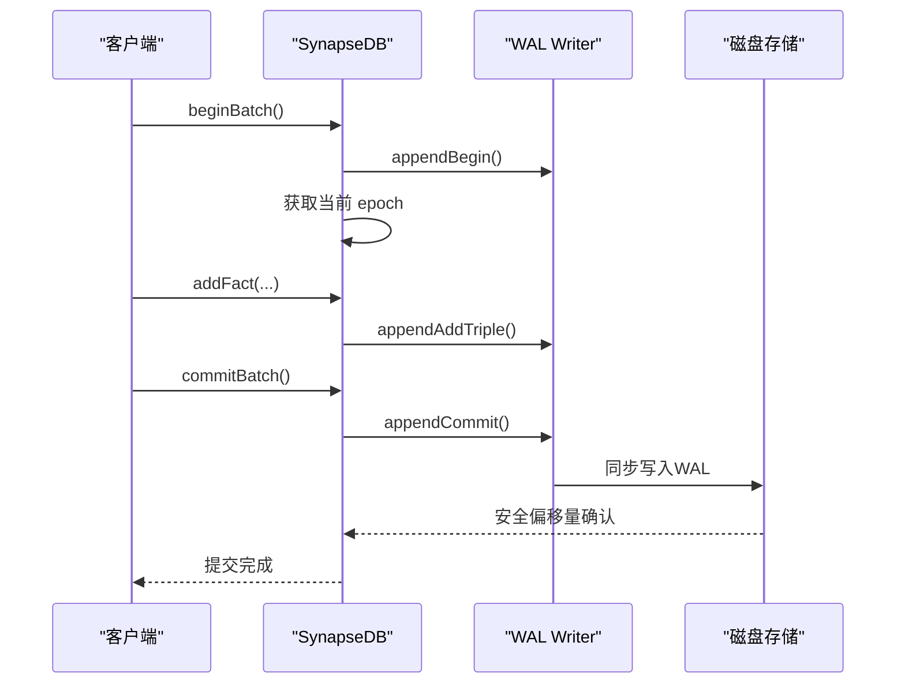

# 读快照隔离

<cite>
**本文档引用的文件**
- [persistentStore.ts](file://src/storage/persistentStore.ts)
- [queryBuilder.ts](file://src/query/queryBuilder.ts)
- [wal.ts](file://src/storage/wal.ts)
- [synapseDb.ts](file://src/synapseDb.ts)
- [snapshot_memory_basic.test.ts](file://tests/system/snapshot_memory_basic.test.ts)
- [query_snapshot_isolation.test.ts](file://tests/system/query_snapshot_isolation.test.ts)
</cite>

## 目录
1. [引言](#引言)
2. [epoch版本控制机制](#epoch版本控制机制)
3. [pinnedEpochStack的作用](#pinnedeochstack的作用)
4. [WAL日志与事务开始时的epoch获取](#wal日志与事务开始时的epoch获取)
5. [并发读写行为示例](#并发读写行为示例)
6. [写倾斜风险与规避建议](#写倾斜风险与规避建议)
7. [性能影响与适用场景](#性能影响与适用场景)

## 引言
SynapseDB 实现了读快照隔离（Snapshot Isolation）以确保在长时间运行的查询中，数据视图的一致性和稳定性。该机制通过 epoch 版本控制、pinnedEpochStack 固定以及 WAL 日志结构协同工作，为每个查询分配一致的时间视点，并防止被垃圾回收或后台维护操作干扰。本文将深入解析其实现原理。

## epoch版本控制机制
SynapseDB 使用 `currentEpoch` 字段来跟踪数据库状态的版本。每当分页索引发生变更（如 compaction 或 flush 操作），系统会生成新的 manifest 文件并递增 `currentEpoch`。查询在执行期间通过检查 `pinnedEpochStack` 是否为空来决定是否使用当前最新的 epoch 视图：

- 当 `pinnedEpochStack.length === 0` 时，系统按节流策略调用 `refreshReadersIfEpochAdvanced()` 方法，刷新 reader 并更新到最新 epoch。
- 若 `pinnedEpochStack.length > 0`，则表示存在固定快照，查询将基于栈顶的 epoch 值进行一致性读取，忽略后续的 manifest 更新。

此机制确保在整个遍历过程中看到的数据状态是静态且一致的。

**Section sources**
- [persistentStore.ts](file://src/storage/persistentStore.ts#L816-L827)
- [persistentStore.ts](file://src/storage/persistentStore.ts#L1305-L1317)

## pinnedEpochStack的作用
`pinnedEpochStack` 是一个用于管理快照生命周期的栈结构，其主要作用是在长时间运行的查询中固定特定的 epoch，防止该 epoch 被垃圾回收器误删。具体实现如下：

- 在 `withSnapshot` 调用开始时，`pushPinnedEpoch(epoch)` 将当前 epoch 推入栈中，并增加 `snapshotRefCount` 计数。
- 如果这是第一个快照，则同时注册当前进程为 reader，通知系统有活跃读取者存在。
- 查询结束后，`popPinnedEpoch()` 弹出栈顶 epoch，减少计数；当计数归零且之前已注册，则注销 reader 身份。

这种设计保证了即使后台正在进行 compaction 或 GC 操作，只要仍有查询依赖旧 epoch 的数据，这些数据就不会被清理。

**Section sources**
- [persistentStore.ts](file://src/storage/persistentStore.ts#L90-L90)
- [persistentStore.ts](file://src/storage/persistentStore.ts#L1355-L1378)
- [persistentStore.ts](file://src/storage/persistentStore.ts#L1320-L1352)

## WAL日志与事务开始时的epoch获取
SynapseDB 利用 WAL（Write-Ahead Log）记录所有写操作，包括添加/删除三元组和属性修改。WAL v2 支持嵌套事务语义和幂等性保障，确保崩溃恢复后数据完整性。

当事务开始时，系统通过 `getCurrentEpoch()` 获取当前的 epoch 值，并将其传递给 `withSnapshot` 上下文。这一过程结合了以下规则：
- 所有查询首先尝试从磁盘上的分页索引读取数据（`queryFromDisk`），避免内存状态变化带来的不一致。
- 可见性判断基于 tombstone 集合：若某条记录已被标记删除（tombstone 存在），即使存在于历史页中也不可见。
- 新写入的数据仅对提交后的事务可见，未提交前保留在暂存区（txStack）中。

因此，在同一 snapshot 内发起的多次查询始终基于相同的 epoch 和磁盘视图，不受外部写入影响。



**Diagram sources**
- [wal.ts](file://src/storage/wal.ts#L142-L321)
- [persistentStore.ts](file://src/storage/persistentStore.ts#L927-L980)

**Section sources**
- [wal.ts](file://src/storage/wal.ts#L3-L10)
- [wal.ts](file://src/storage/wal.ts#L19-L19)
- [persistentStore.ts](file://src/storage/persistentStore.ts#L1379-L1381)

## 并发读写行为示例
考虑如下场景：一个长查询正在遍历大量数据的同时，另一个线程执行写入和 compaction 操作。

```typescript
// 查询线程
await db.withSnapshot(async (snap) => {
  const q1 = snap.find({ subject: 'S', predicate: 'R' });
  await sleep(1200);
  const q2 = q1.follow('R');
  expect(q2.all().map(x => x.object)).toEqual(['O1','O2','O3','O4','O5']);
});

// 写入与维护线程
for (let i = 9; i <= 12; i++) {
  db.addFact({ subject: 'Root', predicate: 'connects', object: `Node${i}` });
}
await db.flush();
await autoCompact(dbPath, { respectReaders: true });
```

在此情况下：
- 快照内的查询结果不受新写入影响，仍返回初始的 8 条记录。
- 外部查询可立即看到新增的 4 条记录。
- compaction 操作尊重 `respectReaders` 策略，不会清理被 pinned 的旧页面。

这体现了快照隔离的核心优势：读写不阻塞，且读操作具有强一致性视图。

**Section sources**
- [query_snapshot_isolation.test.ts](file://tests/system/query_snapshot_isolation.test.ts#L220-L264)
- [snapshot_memory_basic.test.ts](file://tests/system/snapshot_memory_basic.test.ts#L0-L42)

## 写倾斜风险与规避建议
尽管快照隔离提供了良好的读一致性，但仍可能引发写倾斜（Write Skew）问题。例如两个并发事务基于同一快照读取数据并独立更新不同部分，最终导致逻辑冲突。

### 示例
假设账户 A 和 B 总余额需保持 ≥ 100：
```ts
// 事务1
const a = db.find({subject:'A', pred:'balance'}).all()[0];
if (a.value >= 50) db.setNodeProperties(a.subjectId, {value: a.value - 50});

// 事务2
const b = db.find({subject:'B', pred:'balance'}).all()[0];
if (b.value >= 60) db.setNodeProperties(b.subjectId, {value: b.value - 60});
```
若初始各为 80，则两者均可成功提交，总余额变为 70，违反约束。

### 规避建议
1. **显式锁定**：在关键路径上使用 `beginBatch` + `commitBatch(durable=true)` 确保串行化。
2. **应用层校验**：提交前重新读取相关数据验证前提条件。
3. **避免长事务**：缩短 `withSnapshot` 范围，减少冲突窗口。

## 性能影响与适用场景
### 性能影响
- **正面**：快照隔离允许无锁读取，极大提升高并发读场景下的吞吐量。
- **负面**：长期持有 pinned epoch 会延迟 compaction 和 GC，可能导致存储膨胀。

### 适用场景
- **数据分析与报表生成**：需要稳定视图的大规模扫描。
- **复杂链式查询**：多步导航类操作要求中间结果一致。
- **跨微服务只读副本**：提供时间点一致的导出接口。

综上所述，SynapseDB 的读快照隔离机制在保证一致性的同时兼顾性能，适用于大多数 OLAP 类工作负载。

**Section sources**
- [synapseDb.ts](file://src/synapseDb.ts#L477-L491)
- [persistentStore.ts](file://src/storage/persistentStore.ts#L1355-L1378)