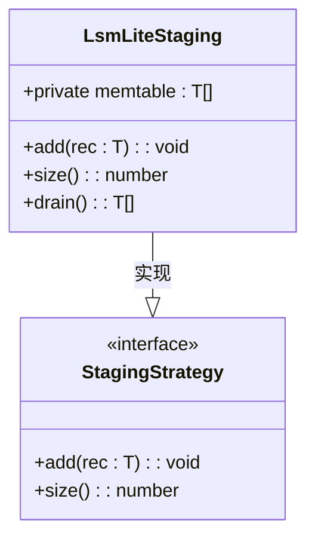
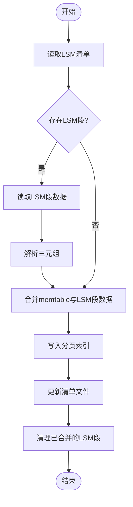
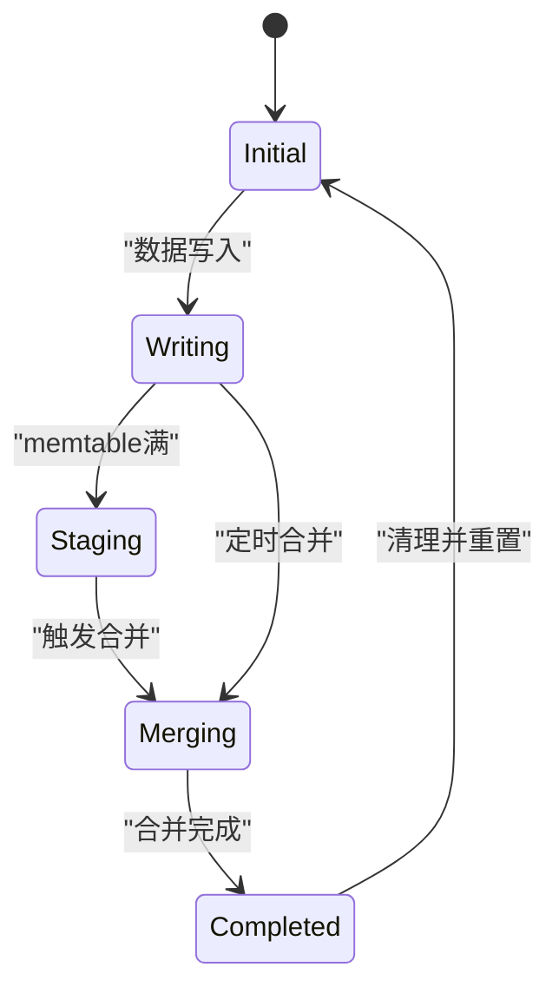

# LSM-Lite合并策略

<cite>
**本文档引用的文件**
- [staging.ts](file://src/storage/staging.ts)
- [persistentStore.ts](file://src/storage/persistentStore.ts)
</cite>

## 目录
1. [简介](#简介)
2. [LSM-Lite设计思想与实现细节](#lsm-lite设计思想与实现细节)
3. [LsmLiteStaging机制分析](#lsmlitestaging机制分析)
4. [自动合并（auto-compact）联动关系](#自动合并auto-compact联动关系)
5. [appendPagedIndexesFromStaging中的实验性合并逻辑](#appendpagedindexesfromstaging中的实验性合并逻辑)
6. [LSM-Lite状态流转图](#lsm-lite状态流转图)
7. [写放大评估](#写放大评估)
8. [适用场景建议](#适用场景建议)

## 简介
LSM-Lite是一种轻量级的合并策略，专为嵌入式场景设计，旨在简化传统LSM树的复杂性，同时保持高效的数据写入和查询性能。该策略通过暂存写入数据并以批量方式合并至分页索引，有效减少了随机I/O操作，提升了系统的整体性能。

## LSM-Lite设计思想与实现细节
LSM-Lite的设计核心在于其简洁性和高效性。与传统的LSM树相比，LSM-Lite避免了复杂的多层结构和频繁的合并操作，而是采用了一种更为直接的方法来处理数据写入和合并。具体来说，LSM-Lite通过一个简单的内存表（memtable）来暂存写入的数据，当达到一定阈值时，将这些数据批量合并到分页索引中。这种方法不仅减少了磁盘I/O次数，还降低了系统开销，特别适合资源受限的嵌入式环境。

**Section sources**
- [staging.ts](file://src/storage/staging.ts#L14-L29)
- [persistentStore.ts](file://src/storage/persistentStore.ts#L1463-L1466)

## LsmLiteStaging机制分析
`LsmLiteStaging`类是LSM-Lite策略的核心组件之一，负责管理内存中的暂存数据。它实现了`StagingStrategy`接口，提供了基本的添加、获取大小和清空功能。每当有新的数据写入时，`LsmLiteStaging`会将其添加到内部的`memtable`数组中。当需要进行合并时，可以通过调用`drain`方法取出并清空当前的`memtable`，然后将这些数据批量写入分页索引。

**Diagram sources**
- [staging.ts](file://src/storage/staging.ts#L14-L29)

**Section sources**
- [staging.ts](file://src/storage/staging.ts#L14-L29)

## 自动合并（auto-compact）联动关系
在LSM-Lite中，自动合并（auto-compact）机制与`LsmLiteStaging`紧密配合，确保数据能够及时从内存表合并到持久化存储中。当`LsmLiteStaging`中的数据量达到预设阈值或经过一段时间后，系统会触发自动合并过程。这一过程首先读取现有的LSM段，尝试将它们与当前的`memtable`一起合并到分页索引中。这样不仅可以减少磁盘上的碎片，还能提高后续查询的效率。

**Section sources**
- [persistentStore.ts](file://src/storage/persistentStore.ts#L316-L434)

## appendPagedIndexesFromStaging中的实验性合并逻辑
`appendPagedIndexesFromStaging`方法是LSM-Lite中实现数据合并的关键部分。该方法首先检查是否存在现有的LSM段，并尝试将这些段与当前的`memtable`一起合并到分页索引中。具体步骤如下：
1. 读取LSM清单文件，获取所有已存在的LSM段信息。
2. 对每个LSM段，读取其内容并解析成三元组列表。
3. 将这些三元组与`memtable`中的数据一起写入分页索引。
4. 更新清单文件，记录新的分页索引位置。
5. 清理已合并的LSM段及其清单文件。

尽管这一机制目前仍处于实验阶段，但它展示了LSM-Lite在未来可能的发展方向，即更加智能和高效的合并策略。

**Diagram sources**
- [persistentStore.ts](file://src/storage/persistentStore.ts#L316-L434)

**Section sources**
- [persistentStore.ts](file://src/storage/persistentStore.ts#L316-L434)

## LSM-Lite状态流转图
LSM-Lite的状态流转主要包括以下几个阶段：
1. **初始状态**：数据库启动时，加载必要的配置和数据结构。
2. **写入状态**：新数据被写入`memtable`，同时记录WAL日志。
3. **暂存状态**：当`memtable`达到阈值时，进入暂存状态，准备合并。
4. **合并状态**：触发自动合并，将`memtable`和现有LSM段数据批量写入分页索引。
5. **完成状态**：合并完成后，更新清单文件，清理临时数据，返回初始状态。

**Diagram sources**
- [persistentStore.ts](file://src/storage/persistentStore.ts#L316-L434)
- [staging.ts](file://src/storage/staging.ts#L14-L29)

## 写放大评估
写放大是指在数据写入过程中，实际写入磁盘的数据量远大于用户请求写入的数据量的现象。在LSM-Lite中，由于采用了批量合并的方式，写放大现象得到了显著缓解。每次合并操作都会将多个小的写入请求聚合成一次大的写入操作，从而减少了磁盘I/O次数。此外，通过合理设置`memtable`的大小和合并频率，可以进一步优化写放大问题，提升系统性能。

**Section sources**
- [persistentStore.ts](file://src/storage/persistentStore.ts#L316-L434)

## 适用场景建议
LSM-Lite因其简洁高效的特点，特别适用于以下几种场景：
- **嵌入式设备**：资源有限的环境中，LSM-Lite能够提供良好的性能表现，同时占用较少的系统资源。
- **高写入负载**：对于需要频繁写入数据的应用，LSM-Lite通过批量合并有效减少了磁盘I/O，提高了写入速度。
- **实时查询需求**：虽然LSM-Lite主要关注写入性能，但其分页索引的设计也保证了较快的查询响应时间，适合需要实时查询的应用。

综上所述，LSM-Lite作为一种轻量级的合并策略，在保持高性能的同时，极大地简化了系统架构，非常适合应用于各种资源受限的场景。

**Section sources**
- [persistentStore.ts](file://src/storage/persistentStore.ts#L316-L434)
- [staging.ts](file://src/storage/staging.ts#L14-L29)