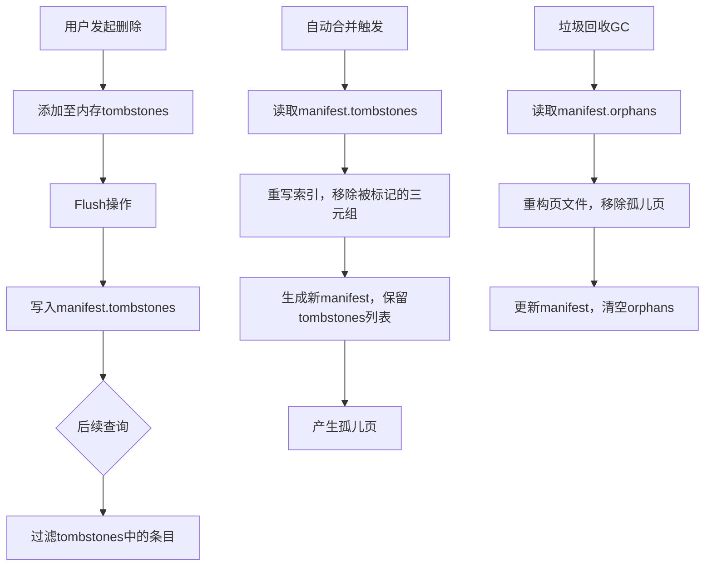
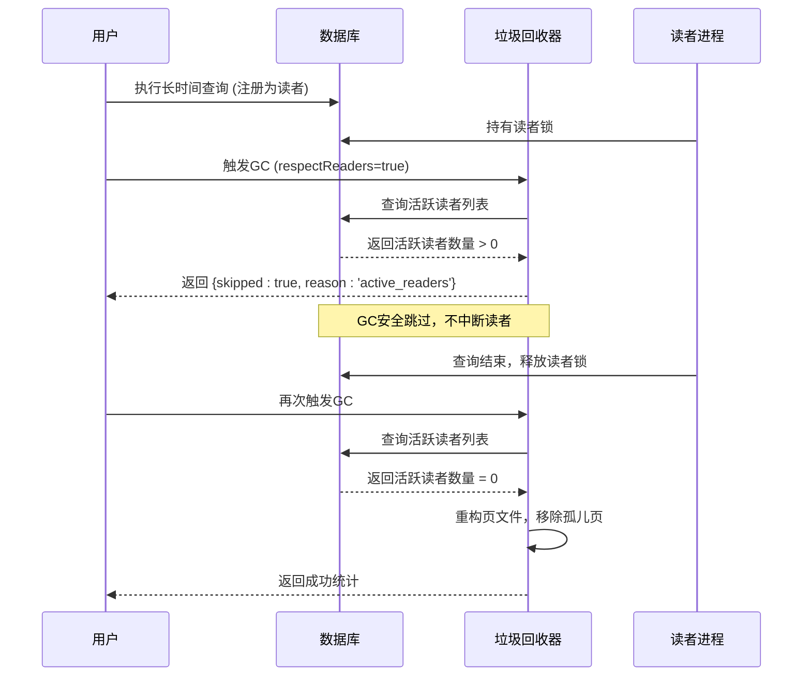

# Tombstone与垃圾回收机制

<cite>
**本文档引用的文件**
- [persistentStore.ts](file://src/storage/persistentStore.ts)
- [pagedIndex.ts](file://src/storage/pagedIndex.ts)
- [compaction.ts](file://src/maintenance/compaction.ts)
- [gc.ts](file://src/maintenance/gc.ts)
- [gc_pages.test.ts](file://tests/integration/maintenance/gc_pages.test.ts)
</cite>

## 目录
1. [Tombstone标记机制与一致性读取](#tombstone标记机制与一致性读取)
2. [垃圾回收与自动合并协同流程](#垃圾回收与自动合并协同流程)
3. [Tombstone在分页索引中的持久化](#tombstone在分页索引中的持久化)
4. [Tombstone累积的影响与优化](#tombstone累积的影响与优化)
5. [GC操作的安全边界与读者隔离](#gc操作的安全边界与读者隔离)

## Tombstone标记机制与一致性读取

在SynapseDB中，删除操作并非物理移除数据，而是通过逻辑标记实现。当调用`deleteFact`方法时，系统会将待删除三元组的ID组合编码为字符串键，并添加到内存中的`tombstones`集合（一个Set结构）中。该集合在每次`flush`操作时，会被序列化并写入分页索引的manifest文件中，其字段名为`tombstones`，类型为`Array<[number, number, number]>`，即由三个数字组成的元组数组。

在执行查询时，无论是全量查询还是条件查询，系统都会在返回结果前检查每个候选三元组是否存在于`tombstones`集合中。例如，在`query`和`streamQuery`等方法中，均包含`!this.tombstones.has(encodeTripleKey(t))`的过滤条件。这确保了即使底层存储文件中仍存在已删除的事实，它们也不会被重新查询到，从而实现了逻辑删除的一致性语义。

**本节内容来源**
- [persistentStore.ts](file://src/storage/persistentStore.ts#L74-L74)
- [persistentStore.ts](file://src/storage/persistentStore.ts#L242-L257)
- [persistentStore.ts](file://src/storage/persistentStore.ts#L316-L434)
- [pagedIndex.ts](file://src/storage/pagedIndex.ts#L329-L329)

## 垃圾回收与自动合并协同流程

垃圾回收（GC）与自动合并（auto-compact）是两个独立但可协同工作的维护任务。自动合并的核心函数`compactDatabase`负责重写分页索引，以消除重复数据和过期的`tombstones`。在合并过程中，它会创建一个基于当前manifest中`tombstones`的`Set`结构，用于在聚合三元组时过滤掉已被标记删除的条目。统计信息`removedByTombstones`记录了因`tombstone`而被移除的三元组数量。

自动合并可以配置`tombstoneRatioThreshold`参数，当某个索引顺序中被`tombstone`覆盖的三元组比例超过此阈值时，将触发对该顺序的重写。完成合并后，新的manifest会保留原有的`tombstones`列表，这意味着`tombstones`本身不会被清除。

随后，垃圾回收函数`garbageCollectPages`可以被调用。它的主要职责是清理“孤儿页”（orphans），即在增量合并后不再被引用的旧页面。GC过程会重构页文件，仅保留manifest中`lookups`所指向的有效页面，从而收缩文件体积。值得注意的是，GC本身并不清理`tombstones`集合，它依赖于先进行的合并操作来减少无效数据。

**Diagram sources**
- [compaction.ts](file://src/maintenance/compaction.ts#L45-L45)
- [compaction.ts](file://src/maintenance/compaction.ts#L60-L64)
- [gc.ts](file://src/maintenance/gc.ts#L20-L115)
- [pagedIndex.ts](file://src/storage/pagedIndex.ts#L333-L333)

**Section sources**
- [compaction.ts](file://src/maintenance/compaction.ts#L48-L339)
- [gc.ts](file://src/maintenance/gc.ts#L20-L115)

## Tombstone在分页索引中的持久化

`tombstones`集合的持久化与分页索引的刷新（`flush`）操作紧密耦合。其核心在于`appendPagedIndexesFromStaging`方法。该方法在每次`flush`时被调用，负责将内存中的暂存数据（staging）合并到分页索引中。

在构建新的manifest时，如果参数`includeTombstones`为true，则会将内存中的`tombstones`集合转换为符合`PagedIndexManifest`接口的格式。具体流程是：遍历`tombstones`中的每个键，使用`decodeTripleKey`将其解析回三元组ID，然后构造成`[subjectId, predicateId, objectId]`形式的元组，并赋值给`newManifest.tombstones`。最后，这个包含最新`tombstones`列表的manifest会被原子性地写入磁盘。

此外，在数据库打开时，如果检测到现有的manifest中包含`tombstones`，`hydratePagedReaders`方法会将其反向加载回内存的`tombstones`集合中，确保重启后逻辑删除状态得以恢复。

**本节内容来源**
- [persistentStore.ts](file://src/storage/persistentStore.ts#L316-L434)
- [persistentStore.ts](file://src/storage/persistentStore.ts#L242-L257)
- [pagedIndex.ts](file://src/storage/pagedIndex.ts#L324-L333)

## Tombstone累积的影响与优化

尽管`tombstones`机制保证了数据一致性，但其累积会带来负面影响。首先，`tombstones`列表本身会占用存储空间，随着删除操作增多而不断增长。其次，在查询时，系统需要对每个候选三元组执行哈希查找以判断其是否在`tombstones`集合中，这增加了CPU开销，可能影响查询性能。

目前的代码设计中，`tombstones`的清理并非由GC或合并操作直接完成。一种潜在的优化策略是引入一个时间窗口或版本号机制，定期清理那些远早于所有现存数据快照的`tombstones`，因为这些`tombstones`已经不可能再影响任何历史查询。然而，根据现有代码，这一功能尚未实现，`tombstones`列表只会增长，不会自动缩减。

监控方面，可以通过检查`manifest.tombstones`的长度来评估其累积程度。同时，`compactDatabase`返回的`CompactStats`中的`removedByTombstones`指标可以反映合并操作清理了多少无效数据，间接衡量`tombstones`的有效性。

**本节内容来源**
- [persistentStore.ts](file://src/storage/persistentStore.ts#L74-L74)
- [compaction.ts](file://src/maintenance/compaction.ts#L45-L45)
- [compaction.ts](file://src/maintenance/compaction.ts#L30-L30)

## GC操作的安全边界与读者隔离

`gc_pages.test.ts`测试用例明确展示了GC操作的安全边界和读者隔离机制。测试的核心是`garbageCollectPages`函数的`respectReaders`选项。

在`afterEach`钩子中，测试框架会尝试强制清理`readers`目录下的所有文件，这模拟了其他进程或线程作为“读者”的存在。当调用`garbageCollectPages`时，如果传入`{ respectReaders: true }`，函数会首先调用`getActiveReaders`检查是否存在活跃的读者。如果存在，GC操作将立即跳过并返回一个带有`skipped: true`和`reason: 'active_readers'`的统计对象，而不是强行中断读者进行文件重写。

这确保了在有并发读取操作时，GC不会破坏数据文件的稳定性，实现了安全的读者隔离。只有在确认没有活跃读者的情况下，GC才会执行文件的重构和重命名操作，保证了操作的原子性和安全性。

**Diagram sources**
- [gc.ts](file://src/maintenance/gc.ts#L20-L115)
- [gc_pages.test.ts](file://tests/integration/maintenance/gc_pages.test.ts#L0-L80)

**Section sources**
- [gc.ts](file://src/maintenance/gc.ts#L20-L115)
- [gc_pages.test.ts](file://tests/integration/maintenance/gc_pages.test.ts#L0-L80)