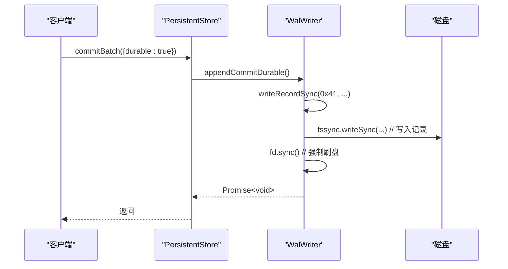
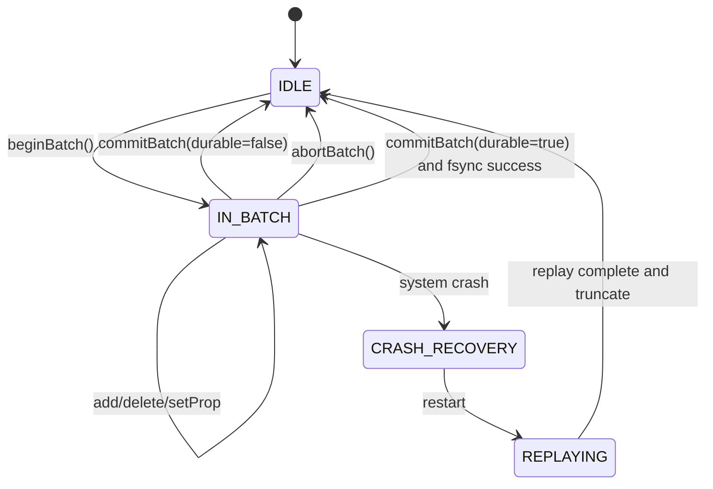

# 写前日志（WAL v2）机制

<cite>
**本文档引用文件**   
- [wal.ts](file://src/storage/wal.ts)
- [persistentStore.ts](file://src/storage/persistentStore.ts)
</cite>

## 目录
1. [引言](#引言)
2. [WAL v2 核心设计与实现](#wal-v2-核心设计与实现)
3. [WalWriter 类初始化流程](#walwriter-类初始化流程)
4. [日志记录格式详解](#日志记录格式详解)
5. [批次提交与嵌套事务语义处理](#批次提交与嵌套事务语义处理)
6. [WAL 重放器（WalReplayer）工作机制](#wal-重放器walreplayer工作机制)
7. [append 系列方法与 commit/abort 交互逻辑](#append-系列方法与-commitabort-交互逻辑)
8. [durable 标志对 fsync 行为的影响](#durable-标志对-fsync-行为的影响)
9. [持久化存储中的 WAL 集成点](#持久化存储中的-wal-集成点)
10. [WAL 文件结构图](#wal-文件结构图)
11. [状态转换图](#状态转换图)
12. [典型故障场景下的恢复路径分析](#典型故障场景下的恢复路径分析)
13. [幂等性设计与并发控制策略](#幂等性设计与并发控制策略)

## 引言
写前日志（Write-Ahead Log, WAL）是 SynapseDB 实现数据持久性、崩溃恢复和事务语义保障的核心机制。WAL v2 版本在原有基础上进行了重构，增强了对嵌套事务的支持，并通过更精细的控制标志提升了系统的可靠性与性能。该机制确保所有修改操作在真正写入主数据库之前，先被安全地记录到日志文件中，从而在系统发生崩溃时能够准确恢复至一致状态。

## WAL v2 核心设计与实现
WAL v2 的设计目标是提供一个高效、可靠且支持复杂事务语义的日志系统。其核心组件包括 `WalWriter` 和 `WalReplayer`，分别负责日志的写入和重放。日志文件以二进制格式存储，包含魔数（MAGIC）、版本号（WAL_VERSION）和一系列带有类型、长度和校验和的记录。这种设计保证了日志的可识别性和完整性。

**Section sources**
- [wal.ts](file://src/storage/wal.ts#L1-L420)

## WalWriter 类初始化流程
`WalWriter` 类的初始化通过静态方法 `open(dbPath)` 完成。该方法首先尝试打开已存在的 `.wal` 文件并读取头部信息。如果文件不存在或头部信息不匹配（如魔数错误），则创建新文件并写入标准头部。初始化过程中会检查文件大小以确定起始偏移量，确保从正确位置开始追加新记录。整个过程封装了文件系统异常处理，保证了初始化的健壮性。

**Section sources**
- [wal.ts](file://src/storage/wal.ts#L26-L59)

## 日志记录格式详解
WAL v2 定义了多种日志记录类型，每种类型由一个字节的类型码标识：
- **Add (0x10)**: 记录新增三元组（subject, predicate, object）。
- **Delete (0x20)**: 记录删除三元组。
- **SetProps (0x30/0x31)**: 分别用于设置节点和边的属性，包含ID和JSON序列化的属性值。
- **Begin (0x40)**: 标记一个事务批次的开始，可携带 `txId` 和 `sessionId` 元信息。
- **Commit (0x41)**: 标记一个事务批次的成功提交。
- **Abort (0x42)**: 标记一个事务批次的回滚。

每个记录由固定头（9字节：1字节类型 + 4字节长度 + 4字节校验和）和变长有效载荷组成，采用小端序编码。

**Section sources**
- [wal.ts](file://src/storage/wal.ts#L63-L112)

## 批次提交与嵌套事务语义处理
SynapseDB 支持通过 `beginBatch()` 和 `commitBatch()/abortBatch()` 方法进行显式批次管理。这允许将多个写操作合并为一个原子单元。`PersistentStore` 维护了一个 `txStack` 来支持嵌套事务。当调用 `beginBatch()` 时，一个新的暂存层被推入栈中；`commitBatch()` 会弹出顶层并根据当前嵌套深度决定是否立即应用到主存（内层提交）或延迟到最外层提交。`abortBatch()` 则直接丢弃顶层暂存，实现部分回滚。

**Section sources**
- [persistentStore.ts](file://src/storage/persistentStore.ts#L714-L773)

## WAL 重放器（WalReplayer）工作机制
`WalReplayer` 负责在数据库启动时重放未持久化的日志，以恢复内存状态。它通过一个栈式结构 `stack` 来模拟事务的嵌套执行。重放过程逐条读取日志记录：
- 遇到 `BEGIN` 记录时，创建一个新层并压入栈。
- 遇到 `COMMIT` 记录时，弹出顶层。若栈非空（内层提交），则立即将变更应用到全局结果集；若栈为空（最外层提交），则检查 `txId` 是否已存在（幂等性），避免重复应用。
- 遇到 `ABORT` 记录时，直接丢弃顶层。
- 数据变更记录（Add/Delete/SetProps）根据当前栈深度决定是暂存于当前层还是直接加入全局结果集。
重放器还会计算 `safeOffset`，用于截断尾部不完整的记录，确保下次打开的幂等性。

**Section sources**
- [wal.ts](file://src/storage/wal.ts#L142-L321)

## append 系列方法与 commit/abort 交互逻辑
所有的写操作（如 `addFact`, `deleteFact`, `setNodeProperties`）在 `PersistentStore` 中都会首先调用对应的 `wal.appendXxx()` 方法，将操作记录到日志文件。这些 `append` 操作是同步的，但不会立即触发磁盘刷写（fsync）。`commitBatch()` 或 `abortBatch()` 的调用才是决定这批操作命运的关键：
- `commitBatch()` 会追加一条 `COMMIT` 记录，标志着这批操作的完成。
- `abortBatch()` 会追加一条 `ABORT` 记录，通知重放器忽略之前的变更。
这种分离设计使得日志写入可以批量化，提高了吞吐量。

**Section sources**
- [persistentStore.ts](file://src/storage/persistentStore.ts#L436-L773)

## durable 标志对 fsync 行为的影响
`commitBatch()` 方法接受一个可选的 `durable` 选项。当 `options.durable` 为 `true` 时，系统会调用 `wal.appendCommitDurable()`。此方法在写入 `COMMIT` 记录后，会立即执行 `fd.sync()`，强制将日志文件的所有更改刷新到物理磁盘。这确保了即使在系统崩溃的情况下，已确认的提交也不会丢失，提供了最强的持久性保证。反之，若 `durable` 为 `false` 或未指定，则仅写入日志而不强制刷盘，性能更高但风险略增。



**Diagram sources **
- [wal.ts](file://src/storage/wal.ts#L105-L108)
- [persistentStore.ts](file://src/storage/persistentStore.ts#L727-L763)

## 持久化存储中的 WAL 集成点
WAL 机制深度集成在 `PersistentStore` 的生命周期中。在 `open()` 方法中，`PersistentStore` 会实例化 `WalWriter` 并立即启动 `WalReplayer` 进行日志重放。重放的结果（新增事实、删除事实、属性变更等）会被直接应用到内存中的数据结构（如 `triples`, `properties`）。重放完成后，系统会根据 `safeOffset` 截断日志文件，并更新 `txId` 注册表以维护跨周期的幂等性。此后，所有的写操作都遵循“先写日志”的原则。

**Section sources**
- [persistentStore.ts](file://src/storage/persistentStore.ts#L99-L238)

## WAL 文件结构图
```mermaid
erDiagram
    HEADER ||--o{ RECORD : "contains"
    RECORD ||--o{ PAYLOAD : "has"
    class HEADER {
        "string magic = \"SYNWAL\""
        "uint32 version = 2"
    }
    class RECORD {
        "uint8 type"
        "uint32 length"
        "uint32 checksum"
        "*PAYLOAD payload"
    }
    class PAYLOAD {
        "<<abstract>>"
    }
    class ADD_PAYLOAD {
        "string subject"
        "string predicate"
        "string object"
    }
    class SET_NODE_PROPS_PAYLOAD {
        "uint32 nodeId"
        "json props"
    }
    class BEGIN_PAYLOAD {
        "string? txId"
        "string? sessionId"
    }
    class DELETE_PAYLOAD {
    }
    class SET_EDGE_PROPS_PAYLOAD {
    }
    class COMMIT_PAYLOAD {
    }
    class ABORT_PAYLOAD {
    }
    PAYLOAD }|-- ADD_PAYLOAD : "type=0x10"
    PAYLOAD }|-- DELETE_PAYLOAD : "type=0x20"
    PAYLOAD }|-- SET_NODE_PROPS_PAYLOAD : "type=0x30"
    PAYLOAD }|-- SET_EDGE_PROPS_PAYLOAD : "type=0x31"
    PAYLOAD }|-- BEGIN_PAYLOAD : "type=0x40"
    PAYLOAD }|-- COMMIT_PAYLOAD : "type=0x41"
    PAYLOAD }|-- ABORT_PAYLOAD : "type=0x42"
```

**Diagram sources **
- [wal.ts](file://src/storage/wal.ts#L1-L420)

## 状态转换图


**Diagram sources **
- [wal.ts](file://src/storage/wal.ts#L142-L321)
- [persistentStore.ts](file://src/storage/persistentStore.ts#L99-L238)

## 典型故障场景下的恢复路径分析
假设一个事务批次包含两次 `addFact` 操作，但在第二次 `addFact` 后、`commitBatch` 前发生系统崩溃。
1.  **崩溃时**: WAL 文件包含两个 `ADD` 记录，但缺少 `COMMIT` 记录。
2.  **重启时**: `WalReplayer` 开始重放。它成功读取并处理了两个 `ADD` 记录，但由于后续没有 `COMMIT` 记录（或遇到损坏/不完整记录而停止），`safeOffset` 将停留在最后一个完整记录之后。
3.  **恢复后**: `PersistentStore` 调用 `wal.truncateTo(safeOffset)`，将日志文件截断到最后一个完整记录处。由于没有遇到 `COMMIT`，这两个 `ADD` 操作不会被应用到主存，数据库状态如同该事务从未开始，保证了原子性。

**Section sources**
- [wal.ts](file://src/storage/wal.ts#L142-L321)

## 幂等性设计与并发控制策略
WAL v2 通过 `txId` 实现了跨数据库重启的幂等性。`WalReplayer` 在重放 `COMMIT` 记录时，会检查 `knownTxIds` 集合（来自 `txidRegistry`），如果发现 `txId` 已存在，则跳过该次提交，防止重复执行。此外，`PersistentStore` 在打开时会检查锁文件和非空 WAL，防止无锁模式下出现并发写入的风险。`writeRecordSync` 使用底层文件描述符的同步写，避免了跨进程读取的竞争条件。

**Section sources**
- [wal.ts](file://src/storage/wal.ts#L142-L321)
- [persistentStore.ts](file://src/storage/persistentStore.ts#L99-L238)