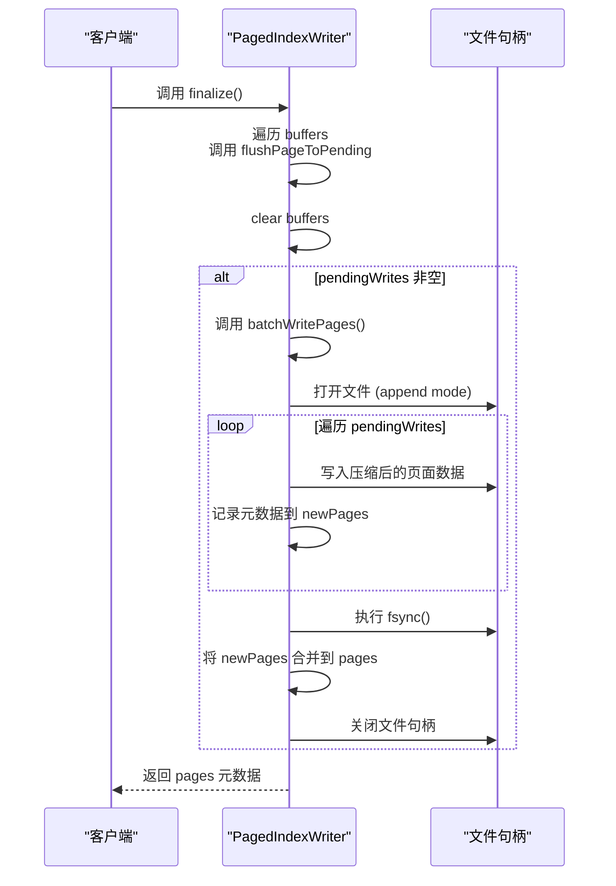

# 分页索引写入器

<cite>
**Referenced Files in This Document **   
- [pagedIndex.ts](file://src/storage/pagedIndex.ts)
- [tripleIndexes.ts](file://src/storage/tripleIndexes.ts)
</cite>

## 目录
1. [简介](#简介)
2. [核心组件](#核心组件)
3. [数据注入与缓冲管理](#数据注入与缓冲管理)
4. [页面划分与刷新机制](#页面划分与刷新机制)
5. [批量写入与原子性同步](#批量写入与原子性同步)
6. [压缩与校验机制](#压缩与校验机制)
7. [性能影响评估](#性能影响评估)
8. [异常处理建议](#异常处理建议)

## 简介
`PagedIndexWriter` 是 SynapseDB 存储层中的一个关键组件，负责高效地将有序三元组（OrderedTriple）持久化到磁盘。该类通过分页机制、批量写入和压缩技术，显著提升了大规模图数据写入的 I/O 效率与系统吞吐量。本文档旨在深入解析其内部实现机制，涵盖从数据注入、缓冲管理、页面划分到最终落盘的完整流程，并分析其在性能优化和数据完整性保障方面的设计策略。

## 核心组件

`PagedIndexWriter` 的核心由多个私有字段构成，共同协作完成高效的索引写入任务：

- `buffers`: 一个 `Map<number, OrderedTriple[]>` 类型的映射表，用于暂存尚未达到页面容量阈值的有序三元组。键为 `primaryValue`（主键值），值为对应的三元组数组。
- `pendingWrites`: 一个对象数组，存储已达到刷新条件但尚未写入文件的页面数据，包含 `primary` 值和 `entries` 条目。
- `pages`: 一个 `PageMeta[]` 数组，记录所有已成功写入文件的页面元数据，包括偏移量、长度和校验码等信息。
- `pageSize`: 定义每个页面可容纳的最大三元组数量，是触发 `flushPageToPending` 操作的关键阈值。
- `compression`: 配置项，指定数据压缩所使用的编解码器（如 Brotli）和压缩等级。

这些组件协同工作，实现了内存缓冲、异步刷新和批量落盘的流水线式处理。

**Section sources**
- [pagedIndex.ts](file://src/storage/pagedIndex.ts#L28-L129)

## 数据注入与缓冲管理

### push 接口的数据注入流程

`push` 方法是外部向 `PagedIndexWriter` 注入数据的主要入口。其流程如下：
1.  根据传入的 `primary` 值，在 `buffers` 映射中查找或创建一个对应的三元组数组。
2.  将新的 `OrderedTriple` 对象推入该数组。
3.  检查当前数组的长度是否达到了预设的 `pageSize`。
4.  如果达到阈值，则立即调用 `flushPageToPending(primary)` 方法，将该 `primary` 值对应的所有缓冲数据转移到待写入队列中。

此设计确保了单个页面内的数据量不会无限增长，维持了良好的内存使用效率。

```mermaid
flowchart TD
Start([开始: push(triple, primary)]) --> FindBuffer["在 buffers 中查找 primary 对应的数组"]
FindBuffer --> CreateArray{"数组存在?"}
CreateArray --> |否| NewArray["创建新数组并加入 buffers"]
CreateArray --> |是| UseExisting["使用现有数组"]
NewArray --> AddTriple
UseExisting --> AddTriple
AddTriple["将 triple 添加到数组末尾"] --> CheckSize{"数组长度 >= pageSize?"}
CheckSize --> |否| End([结束])
CheckSize --> |是| Flush["调用 flushPageToPending(primary)"]
Flush --> End
```

**Diagram sources **
- [pagedIndex.ts](file://src/storage/pagedIndex.ts#L43-L53)

**Section sources**
- [pagedIndex.ts](file://src/storage/pagedIndex.ts#L43-L53)

## 页面划分与刷新机制

### 基于 primaryValue 的页面划分

`PagedIndexWriter` 采用了一种基于 `primaryValue` 的逻辑页面划分策略。每一个唯一的 `primaryValue` 对应一个独立的缓冲区（即 `buffers` 中的一个条目）。这种设计使得数据能够根据其主键值进行自然的分组和排序，为后续的快速查询奠定了基础。

### flushPageToPending 操作

当某个 `primaryValue` 对应的缓冲区大小达到 `pageSize` 时，`flushPageToPending` 方法被触发。该方法的核心作用是将内存中的数据从“活跃缓冲区”安全地转移到“待写入队列”中：
1.  获取 `buffers` 中指定 `primary` 的条目。
2.  创建一个该条目的深拷贝（`[...entries]`），以避免后续对原始缓冲区的修改影响待写入数据。
3.  将这个拷贝后的条目推入 `pendingWrites` 队列。
4.  清空原始缓冲区（`entries.length = 0`），使其可以接收新的数据。

这一操作实现了内存的循环利用，并将写入压力从高频的单次插入分散到低频的批量操作上。

**Section sources**
- [pagedIndex.ts](file://src/storage/pagedIndex.ts#L72-L81)

## 批量写入与原子性同步

### finalize 方法的整体流程

`finalize` 方法标志着一批数据写入的结束。它执行以下关键步骤：
1.  **收尾刷新**：遍历 `buffers` 中所有剩余的、未满页的数据，强制调用 `flushPageToPending`，确保所有数据都进入待写入队列。
2.  **清空缓冲**：调用 `this.buffers.clear()`，释放内存。
3.  **批量写入**：如果 `pendingWrites` 队列非空，则调用 `batchWritePages` 方法进行一次性落盘。
4.  **返回元数据**：返回一份 `pages` 数组的副本，供调用者获取所有已写入页面的元信息。



**Diagram sources **
- [pagedIndex.ts](file://src/storage/pagedIndex.ts#L55-L70)

**Section sources**
- [pagedIndex.ts](file://src/storage/pagedIndex.ts#L55-L70)

### batchWritePages 的 I/O 优化策略

`batchWritePages` 方法是性能优化的核心，它通过以下三个步骤极大提升了 I/O 效率：
1.  **单次文件句柄打开**：在整个方法生命周期内，仅通过 `fs.open` 打开一次目标文件。这避免了为每个页面单独打开/关闭文件所带来的巨大系统调用开销。
2.  **多段数据连续写入**：在一个 `try` 块内，循环遍历 `pendingWrites` 队列中的所有页面。对于每一页，计算其在文件中的起始偏移量（`currentOffset`），然后直接调用 `handle.write` 进行追加写入。由于文件是以追加模式打开的，且偏移量被精确控制，这些页面会按顺序紧密排列。
3.  **最终一次 fsync**：在所有页面数据都写入操作系统缓存后，才执行一次 `await handle.sync()`。`fsync` 是一个非常耗时的操作，因为它要求操作系统将缓存中的数据真正刷写到物理磁盘。通过将其延迟到最后并只执行一次，而不是每个页面都执行，I/O 性能得到了质的飞跃。

此外，为了保证元数据更新的原子性，该方法采用了“先写数据，再更新内存”的策略：
- 在 `try` 块中，所有写入成功的页面元数据首先被收集到一个临时数组 `newPages` 中。
- 只有当 `fsync` 成功执行后，才会将 `newPages` 中的内容合并到实例的 `pages` 数组中。
- 这样，即使在 `fsync` 之前发生崩溃，内存中的 `pages` 数组也不会包含任何未持久化的元数据，从而保证了数据的一致性。

**Section sources**
- [pagedIndex.ts](file://src/storage/pagedIndex.ts#L83-L128)

## 压缩与校验机制

### 压缩（compressBuffer）

在数据写入磁盘前，`PagedIndexWriter` 会调用 `compressBuffer` 函数对原始二进制数据进行压缩。该函数支持多种压缩算法（目前主要为 Brotli），并通过 `CompressionOptions` 配置压缩等级。压缩能有效减少磁盘空间占用和 I/O 传输量，尤其对于具有大量重复模式的三元组数据效果显著。

### CRC 校验

为了保障数据在持久化过程中的完整性，系统引入了 CRC32 校验机制：
1.  在 `batchWritePages` 中，每个页面的数据被压缩后，会立即计算其 CRC32 校验码。
2.  该校验码作为 `crc32` 字段，与 `offset`、`length` 等信息一同被记录在 `PageMeta` 元数据中。
3.  当 `PagedIndexReader` 读取数据时，会重新计算读取到的压缩数据块的 CRC32，并与元数据中的值进行比对。如果不匹配，则跳过该页，防止损坏的数据污染查询结果。

这种机制为数据的可靠性和系统的健壮性提供了重要保障。

**Section sources**
- [pagedIndex.ts](file://src/storage/pagedIndex.ts#L386-L394)
- [pagedIndex.ts](file://src/storage/pagedIndex.ts#L418-L424)
- [pagedIndex.ts](file://src/storage/pagedIndex.ts#L7-L13)