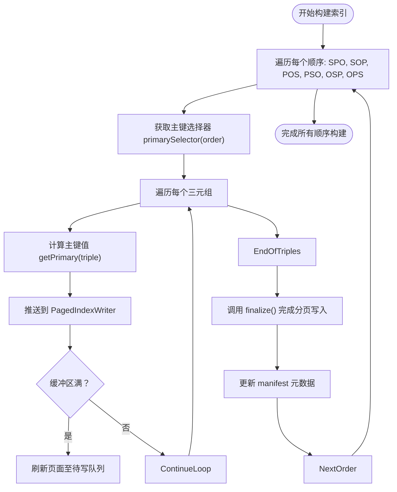
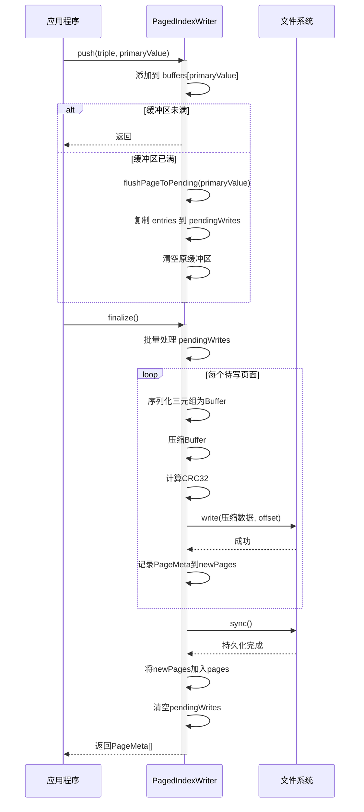
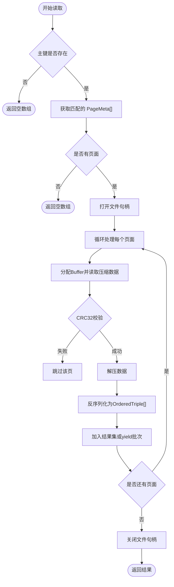
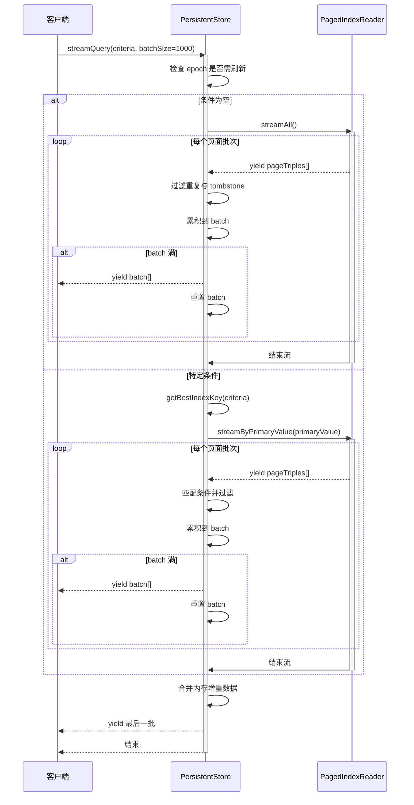
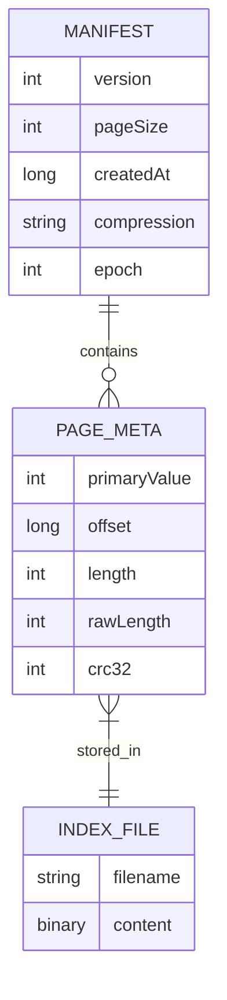

# 分页索引系统

<cite>
**本文档引用的文件**
- [pagedIndex.ts](file://src/storage/pagedIndex.ts)
- [persistentStore.ts](file://src/storage/persistentStore.ts)
- [tripleIndexes.ts](file://src/storage/tripleIndexes.ts)
- [compaction.ts](file://src/maintenance/compaction.ts)
</cite>

## 目录
1. [简介](#简介)
2. [核心组件](#核心组件)
3. [多顺序索引构建与索引选择算法](#多顺序索引构建与索引选择算法)
4. [PagedIndexWriter 与 PagedIndexReader 工作机制](#pagedindexwriter-与-pagedindexreader-工作机制)
5. [索引创建与增量合并流程](#索引创建与增量合并流程)
6. [查询执行与流式响应](#查询执行与流式响应)
7. [索引布局与I/O访问模式](#索引布局与io访问模式)
8. [性能调优建议](#性能调优建议)

## 简介
分页索引（PagedIndex）是SynapseDB中用于高效存储和查询三元组数据的核心组件。该系统通过将有序三元组分割成固定大小的数据页面，并结合压缩、校验和元数据管理，实现了高性能的范围扫描与低内存开销的流式查询。本文档全面解析其设计原理与运行机制。

## 核心组件

分页索引系统由多个关键类构成：`PagedIndexWriter`负责将有序三元组写入并生成分页文件；`PagedIndexReader`提供基于主键快速定位和读取数据块的能力；`PersistentStore`协调索引的创建、合并与查询；`TripleIndexes`管理内存中的暂存索引结构。

**本节来源**
- [pagedIndex.ts](file://src/storage/pagedIndex.ts#L28-L284)
- [persistentStore.ts](file://src/storage/persistentStore.ts#L0-L1665)
- [tripleIndexes.ts](file://src/storage/tripleIndexes.ts#L0-L363)

## 多顺序索引构建与索引选择算法

### 多顺序索引（SPO/SOP/POS/PSO/OSP/OPS）构建过程
系统支持六种不同的三元组排序方式：SPO（主语-谓词-宾语）、SOP（主语-宾语-谓词）、POS（谓词-宾语-主语）、PSO（谓词-主语-宾语）、OSP（宾语-主语-谓词）、OPS（宾语-谓词-主语）。每种顺序对应一个独立的分页索引文件，允许根据查询条件选择最优访问路径。

在索引构建阶段，无论是全量重建还是增量合并，都会遍历所有六种顺序，使用`primarySelector`函数确定当前顺序下的主键字段，然后将三元组按主键分组并填充到相应页面中。

**图表来源**
- [persistentStore.ts](file://src/storage/persistentStore.ts#L259-L314)
- [persistentStore.ts](file://src/storage/persistentStore.ts#L316-L434)

### primarySelector 与 getBestIndexKey 索引选择算法
#### primarySelector
`primarySelector`函数根据索引顺序返回对应的主键提取函数：
- 对于 `SPO` 和 `SOP`，主键为 `subjectId`
- 对于 `POS` 和 `PSO`，主键为 `predicateId`
- 对于 `OSP` 和 `OPS`，主键为 `objectId`

此函数决定了三元组如何被分组到不同页面中。

#### getBestIndexKey
`getBestIndexKey`函数根据查询条件选择最合适的索引顺序，其优先级策略如下：
1. 若同时指定主语和谓词，则选择 `SPO`
2. 若同时指定主语和宾语，则选择 `SOP`
3. 若同时指定谓词和宾语，则选择 `POS`
4. 若仅指定主语，则选择 `SPO`
5. 若仅指定谓词，则选择 `POS`
6. 若仅指定宾语，则选择 `OSP`
7. 默认选择 `SPO`

该算法确保查询能利用最长的前缀匹配来加速检索。

**本节来源**
- [compaction.ts](file://src/maintenance/compaction.ts#L14-L20)
- [tripleIndexes.ts](file://src/storage/tripleIndexes.ts#L214-L227)

## PagedIndexWriter 与 PagedIndexReader 工作机制

### PagedIndexWriter 写入机制
`PagedIndexWriter`采用双缓冲机制处理写入请求：
1. **push 方法**：接收三元组及其主键值，将其添加到对应主键的缓冲区。
2. **缓冲区管理**：当某个主键的缓冲区达到`pageSize`时，触发`flushPageToPending`，将该批次复制到待写队列。
3. **批量写入**：`finalize`方法统一处理所有待写页面，通过单次文件打开、多次写入、一次`fsync`的方式提高I/O效率。
4. **原子性保障**：在`batchWritePages`中，先将新页面元数据收集到临时数组，待`sync`成功后再原子性地更新实例状态。

此外，系统还对写入数据进行压缩（可选Brotli）和CRC32校验码计算，以节省空间并保证数据完整性。

**图表来源**
- [pagedIndex.ts](file://src/storage/pagedIndex.ts#L28-L129)

### PagedIndexReader 读取机制
`PagedIndexReader`通过主键快速定位和读取数据块，支持同步、异步及流式接口：
- **read(primaryValue)**：异步读取指定主键的所有三元组，逐页加载并解压，跳过校验失败的页。
- **readSync(primaryValue)**：同步版本，适用于需要阻塞等待结果的场景。
- **streamByPrimaryValue(primaryValue)**：流式迭代器，按页返回三元组批次，避免大结果集导致内存溢出。
- **readAllStreaming()**：流式读取整个索引文件，逐页处理，适合全量扫描任务。

读取过程中会自动进行数据解压和反序列化，并过滤掉已被逻辑删除（tombstone）的条目。

**图表来源**
- [pagedIndex.ts](file://src/storage/pagedIndex.ts#L136-L284)

## 索引创建与增量合并流程

### buildPagedIndexes 与 appendPagedIndexesFromStaging 协作方式
系统通过`buildPagedIndexes`和`appendPagedIndexesFromStaging`两个方法实现索引的初始化创建与后续增量合并。

#### buildPagedIndexes
用于首次构建或重建所有分页索引：
1. 从主存储文件读取历史三元组数据。
2. 遍历六种索引顺序，分别为每种顺序创建`PagedIndexWriter`。
3. 使用`primarySelector`确定主键，将三元组推送给写入器。
4. 调用`finalize`完成写入，并更新`manifest`元数据。

#### appendPagedIndexesFromStaging
用于将内存中的暂存索引（staging）和LSM段合并到现有分页索引中：
1. 读取当前`manifest`，继承配置如`pageSize`和`compression`。
2. 创建`lookupMap`映射现有页面元数据。
3. 合并来自`this.indexes`（内存暂存）和LSM段的数据。
4. 为每种顺序创建新的`PagedIndexWriter`，写入增量数据。
5. 将新生成的页面追加到对应顺序的页面列表中。
6. 更新`manifest`的`epoch`版本号，触发读者刷新。

两者协同工作，使得数据库能够在不影响查询可用性的前提下，持续将内存增量持久化到磁盘索引中。

**本节来源**
- [persistentStore.ts](file://src/storage/persistentStore.ts#L259-L314)
- [persistentStore.ts](file://src/storage/persistentStore.ts#L316-L434)

## 查询执行与流式响应

### streamQuery 与 query 方法
系统提供了`streamQuery`和`query`两种查询接口，分别支持流式响应和即时返回完整结果集。

#### query 方法
`query`方法首先检查是否需要刷新读者视图（基于`epoch`），然后根据查询条件选择最佳索引顺序。它优先从分页索引读取数据，再合并内存中的增量数据，并通过`tombstones`集合过滤已删除条目，最终返回去重后的结果。

#### streamQuery 方法
`streamQuery`专为大数据集设计，返回一个异步生成器，按批次产出结果：
1. 对于全量查询，通过`spoReader.streamAll()`流式读取SPO索引。
2. 对于条件查询，使用`getBestIndexKey`选择最优索引，并通过`streamByPrimaryValue`按主键流式读取。
3. 在流式读取的同时，合并内存增量数据，确保查询一致性。
4. 每累积达到`batchSize`数量的结果即`yield`一次，避免内存峰值过高。

这种设计使得即使面对海量数据，也能以恒定内存消耗完成查询。

**本节来源**
- [persistentStore.ts](file://src/storage/persistentStore.ts#L505-L624)
- [persistentStore.ts](file://src/storage/persistentStore.ts#L816-L921)

## 索引布局与I/O访问模式

### 索引布局示意图
分页索引的物理布局包含以下组成部分：
- **数据文件**：每个索引顺序（如SPO.idxpage）存储实际的三元组页面。
- **Manifest 文件**（index-manifest.json）：记录全局配置（pageSize、compression）、各顺序的页面元数据（PageMeta）、tombstones 删除标记及 epoch 版本。
- **页面结构**：每个页面包含多个三元组（12字节/个），经压缩后写入文件，附带CRC32校验码。
- **元数据管理**：`PageMeta`记录每个页面的主键值、文件偏移、压缩长度等信息，供快速定位。

### I/O访问模式分析
- **写入模式**：`PagedIndexWriter`采用追加写（append）和批量`fsync`，最大化顺序写性能。
- **读取模式**：`PagedIndexReader`根据主键查找`PageMeta`，然后随机读取文件特定偏移处的页面，适合SSD环境。
- **流式扫描**：`readAllStreaming`和`streamAll`按页面顺序连续读取，充分利用预读机制。
- **并发控制**：通过`epoch`机制和`manifest`原子更新，实现读者无锁访问，写者独占控制。

**图表来源**
- [pagedIndex.ts](file://src/storage/pagedIndex.ts#L324-L333)
- [pagedIndex.ts](file://src/storage/pagedIndex.ts#L7-L13)

## 性能调优建议
1. **页面大小选择**：`pageSize`影响内存占用与I/O粒度。较小页面提高缓存命中率但增加元数据开销；较大页面提升顺序读写吞吐但可能浪费I/O带宽。建议根据平均查询行数调整，默认1024条。
2. **压缩策略**：启用Brotli压缩可显著减少存储空间和I/O量，尤其适合高冗余数据。权衡CPU成本与I/O收益，推荐等级4-6。
3. **索引选择优化**：确保查询条件能命中`getBestIndexKey`的高优先级分支（如SPO），避免全表扫描。
4. **批量写入**：应用层应尽量批量提交三元组，减少`PagedIndexWriter`的`finalize`调用频率。
5. **流式查询**：对于可能返回大量结果的查询，务必使用`streamQuery`而非`query`，防止内存溢出。
6. **定期合并**：通过`compactDatabase`定期合并碎片化页面，清除`tombstones`，维持查询性能稳定。

**本节来源**
- [pagedIndex.ts](file://src/storage/pagedIndex.ts#L20-L24)
- [persistentStore.ts](file://src/storage/persistentStore.ts#L259-L314)
- [compaction.ts](file://src/maintenance/compaction.ts#L0-L340)