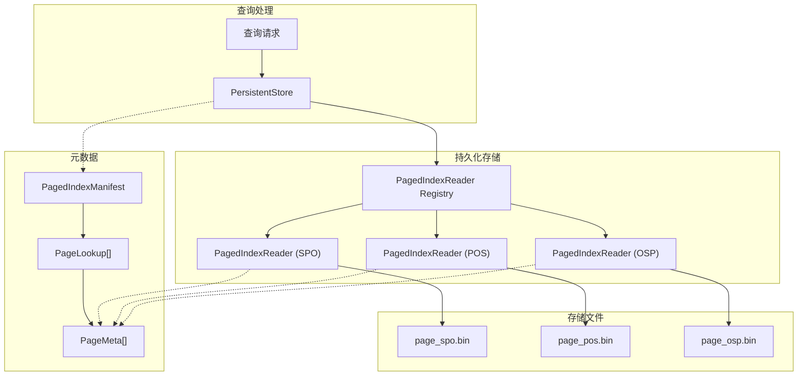
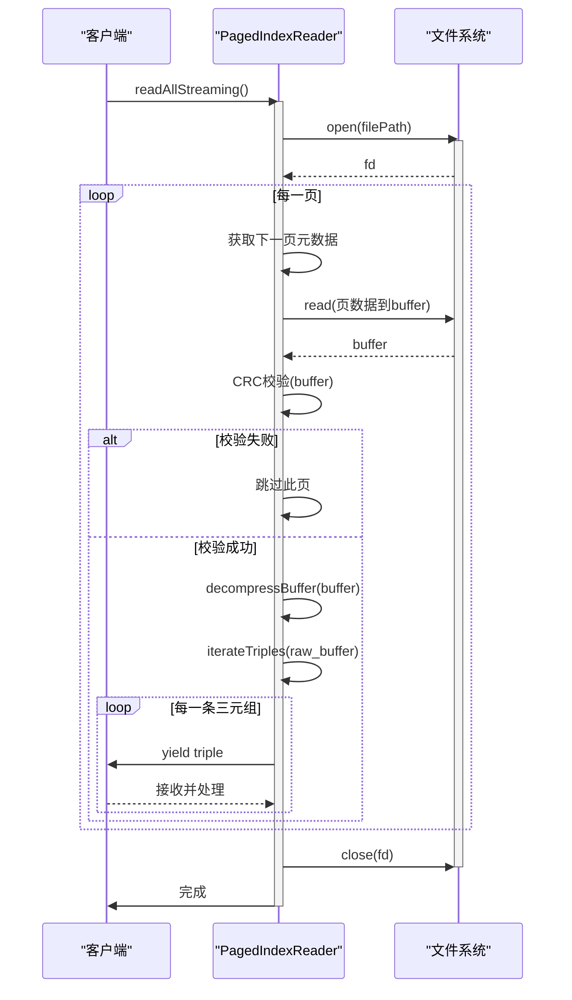
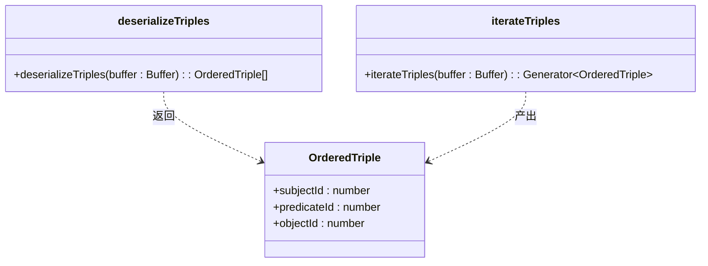
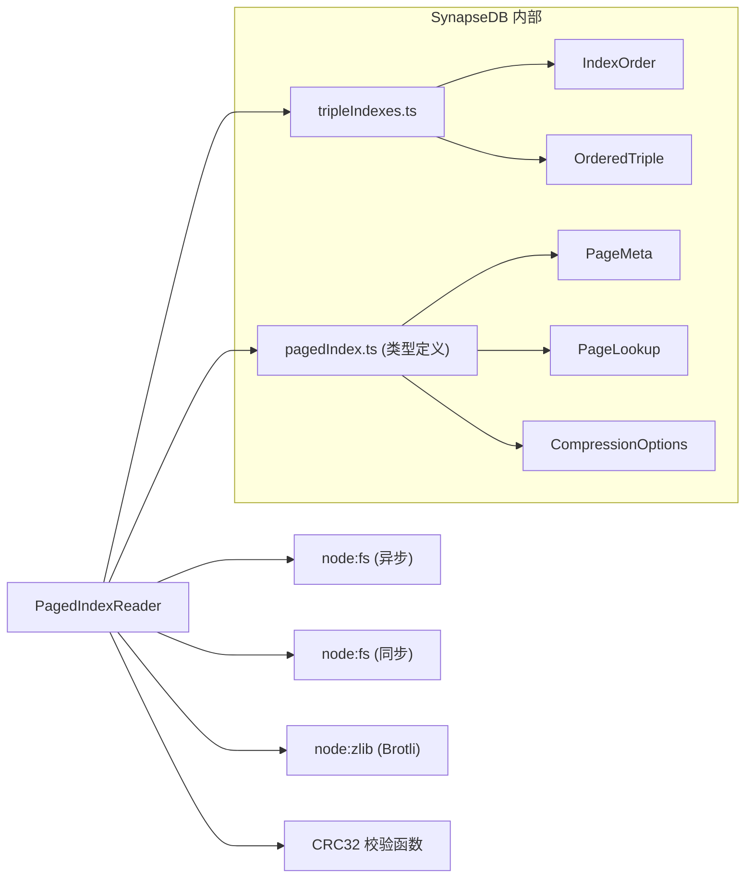

# 分页索引读取器

<cite>
**本文档引用的文件**
- [pagedIndex.ts](file://src/storage/pagedIndex.ts)
- [tripleIndexes.ts](file://src/storage/tripleIndexes.ts)
- [persistentStore.ts](file://src/storage/persistentStore.ts)
- [compaction.ts](file://src/maintenance/compaction.ts)
- [check.ts](file://src/maintenance/check.ts)
</cite>

## 目录
1. [简介](#简介)
2. [核心组件](#核心组件)
3. [架构概述](#架构概述)
4. [详细组件分析](#详细组件分析)
5. [依赖分析](#依赖分析)
6. [性能考量](#性能考量)
7. [故障排除指南](#故障排除指南)
8. [结论](#结论)

## 简介
`PagedIndexReader` 是 SynapseDB 存储层中的关键组件，用于高效读取按主键分页存储的三元组数据。它利用 `PageLookup` 元数据实现对特定 `primaryValue` 对应数据页的快速定位，并支持同步、异步、流式等多种读取模式，兼顾性能与内存效率。该设计在大规模图数据查询中尤为重要，能够有效避免全量加载带来的内存压力。

## 核心组件
`PagedIndexReader` 的核心在于其基于 `PageMeta` 和 `PageLookup` 结构的元数据驱动读取机制。通过将数据按 `primaryValue` 划分为独立页面并记录其偏移量和长度，实现了对目标数据的精准定位与按需加载。结合压缩与 CRC 校验，进一步优化了 I/O 效率与数据完整性。

**Section sources**
- [pagedIndex.ts](file://src/storage/pagedIndex.ts#L7-L18)

## 架构概述
`PagedIndexReader` 作为持久化存储 `PersistentStore` 的一部分，与 `PagedIndexWriter` 配合工作，共同管理分页索引文件。`PersistentStore` 在查询时根据查询条件选择最优的索引顺序（如 SPO, POS），并通过对应的 `PagedIndexReader` 实例读取匹配的数据页，最终与内存中的增量数据合并后返回结果。



**Diagram sources**
- [persistentStore.ts](file://src/storage/persistentStore.ts#L259-L276)
- [pagedIndex.ts](file://src/storage/pagedIndex.ts#L15-L18)

## 详细组件分析

### PagedIndexReader 分析
`PagedIndexReader` 类提供了多种读取接口，以适应不同的使用场景。

#### 基于 PageLookup 的快速定位
`PagedIndexReader` 的构造函数接收一个 `PageLookup` 对象，其中包含了所有数据页的元信息（`PageMeta`）。当调用 `read(primaryValue)` 方法时，它首先在 `lookup.pages` 数组中过滤出所有 `primaryValue` 匹配的页面元数据。这种查找是 O(n) 的，但由于 `primaryValue` 通常对应一个或少数几个连续的页面，实际开销很小，从而实现了对指定数据页的快速定位。

```mermaid
flowchart TD
Start([read(primaryValue)]) --> Filter["Filter lookup.pages<br/>by primaryValue"]
Filter --> HasPages{"Found Pages?"}
HasPages --> |No| ReturnEmpty["Return []"]
HasPages --> |Yes| OpenFile["Open file handle"]
OpenFile --> ReadLoop["For each page in meta:"]
ReadLoop --> AllocBuffer["Alloc buffer of page.length"]
AllocBuffer --> ReadData["Read data from offset"]
ReadData --> CheckCRC["Check CRC32?"]
CheckCRC --> |Invalid| SkipPage["Skip this page"]
CheckCRC --> |Valid| Decompress["Decompress buffer"]
Decompress --> Deserialize["Deserialize to OrderedTriples"]
Deserialize --> AppendResult["Append to result array"]
AppendResult --> NextPage
NextPage --> ReadLoop
ReadLoop --> EndLoop
EndLoop --> CloseFile["Close file handle"]
CloseFile --> ReturnResult["Return result"]
ReturnEmpty --> End([Exit])
ReturnResult --> End
```

**Diagram sources**
- [pagedIndex.ts](file://src/storage/pagedIndex.ts#L136-L173)

#### 按需加载与解压
`read` 方法的核心流程是按需加载。对于每一个匹配的页面，它只分配恰好大小的缓冲区，从文件的指定偏移量 (`offset`) 读取指定长度 (`length`) 的压缩数据。随后，通过 `decompressBuffer` 函数（目前使用 Brotli）解压数据，最后调用 `deserializeTriples` 将二进制流反序列化为 `OrderedTriple` 对象数组。整个过程避免了不必要的内存占用。

**Section sources**
- [pagedIndex.ts](file://src/storage/pagedIndex.ts#L175-L200)

#### 内存友好的流式迭代
`readAllStreaming` 方法通过生成器函数 (`async *`) 实现了真正的流式处理。它逐页读取、解压数据，然后使用 `iterateTriples` 生成器逐条解析三元组并 `yield` 出去。这种方式的关键优势在于：
1.  **避免大数组创建**：`iterateTriples` 不会一次性将所有三元组放入一个数组，而是边解析边产出。
2.  **分批处理**：即使单个页面很大，也是分批次（每页一批）进行 I/O 和解压，不会阻塞事件循环太久。
3.  **低内存占用**：任何时候内存中只存在当前正在处理的页面数据和少量中间对象，非常适合处理远超内存容量的大规模查询。



**Diagram sources**
- [pagedIndex.ts](file://src/storage/pagedIndex.ts#L202-L224)

#### 同步与异步版本的使用场景
`PagedIndexReader` 提供了同步 (`readSync`, `readAllSync`) 和异步 (`read`, `readAll`, `readAllStreaming`) 两种 API。
*   **异步版本**：适用于大多数情况，尤其是在服务器端应用中。它们不会阻塞主线程，允许 Node.js 处理其他 I/O 操作，保证了应用的响应性和可扩展性。
*   **同步版本**：主要用于工具脚本、CLI 命令或某些必须在同步上下文中执行的场景（例如，在 `PersistentStore` 的 `getByCriteria` 方法中，为了简化逻辑而使用 `readSync`）。在高并发服务中应谨慎使用，以免造成性能瓶颈。

**Section sources**
- [pagedIndex.ts](file://src/storage/pagedIndex.ts#L226-L255)

#### 分批返回结果的优势
`streamByPrimaryValue` 和 `streamAll` 方法返回的是 `AsyncGenerator<OrderedTriple[], void, unknown>`，即每次 `yield` 一个 `OrderedTriple` 数组（批次）。
*   **`streamByPrimaryValue`**：针对单个 `primaryValue`，将属于该主键的所有页面数据分批返回。这使得上层应用可以按“主键”为单位进行处理，便于实现分页或渐进式渲染。
*   **`streamAll`**：遍历所有唯一的 `primaryValue`，并复用 `streamByPrimaryValue` 来流式读取全部数据。它的优势在于：
    1.  **可控的内存峰值**：每次只处理一个 `primaryValue` 的数据，避免了同时加载多个主键数据导致的内存激增。
    2.  **更好的资源调度**：I/O 操作被分散到多个小批次中，更利于操作系统和 V8 引擎进行资源管理和垃圾回收。

**Section sources**
- [pagedIndex.ts](file://src/storage/pagedIndex.ts#L257-L284)

#### 低内存开销的反序列化机制
`deserializeTriples` 和 `iterateTriples` 两个函数共同构成了高效的反序列化管道。
*   **`deserializeTriples`**：接受一个完整的解压后缓冲区，计算出三元组的数量 (`count = buffer.length / 12`)，然后在一个循环中，通过 `buffer.readUInt32LE(offset)` 依次读取每个三元组的三个 32 位整数 ID，并将其推入一个数组中返回。这是一个典型的批量反序列化过程。
*   **`iterateTriples`**：与前者不同，它是一个生成器函数。它同样计算 `count`，但在循环中使用 `yield` 关键字逐个产生三元组对象。这使得调用者可以在不等待所有数据反序列化完成的情况下就开始处理第一批数据，极大地降低了延迟和内存占用。



**Diagram sources**
- [pagedIndex.ts](file://src/storage/pagedIndex.ts#L290-L321)

## 依赖分析
`PagedIndexReader` 依赖于多个核心模块和外部库。


**Diagram sources**
- [pagedIndex.ts](file://src/storage/pagedIndex.ts#L0-L41)
- [tripleIndexes.ts](file://src/storage/tripleIndexes.ts#L0-L6)

## 性能考量
*   **元数据缓存**：`PageLookup` 应尽可能常驻内存，避免每次读取都重新解析。
*   **压缩权衡**：使用 `brotli` 可以显著减少磁盘 I/O 和存储空间，但会增加 CPU 解压开销。`none` 模式则相反。应根据 I/O 密集度和 CPU 负载选择合适的压缩级别。
*   **页面大小**：`pageSize` 影响单个页面的大小和数量。过小会导致元数据膨胀和随机 I/O 增多；过大则可能浪费内存（读取少量数据却要加载一整页）。需要根据典型查询模式进行调优。
*   **流式处理**：对于大数据集，优先使用 `readAllStreaming` 或 `streamAll`，避免 `readAll` 导致的内存溢出。

**Section sources**
- [pagedIndex.ts](file://src/storage/pagedIndex.ts#L381-L384)

## 故障排除指南
*   **CRC 校验失败**：`read` 和 `readAllStreaming` 方法内置了 CRC32 校验逻辑。如果某页数据的校验和与元数据中记录的不符，该页会被自动跳过，不会影响其他页面的读取。这提供了一定程度的容错能力，防止损坏的数据污染查询结果。
*   **错误恢复策略**：当遇到无法打开文件或读取失败等严重错误时，上层系统（如 `PersistentStore`）会回退到仅使用内存中的 WAL 数据进行查询，确保服务的基本可用性。管理员可以使用 `cli/check.ts` 中的检查工具来诊断索引文件的完整性，并使用 `repair` 功能尝试重建索引。

**Section sources**
- [pagedIndex.ts](file://src/storage/pagedIndex.ts#L185-L188)
- [check.ts](file://src/maintenance/check.ts#L78-L100)
- [persistentStore.ts](file://src/storage/persistentStore.ts#L854-L880)

## 结论
`PagedIndexReader` 的设计体现了高性能存储系统的关键思想：通过精细的元数据管理实现快速定位，通过按需加载和流式处理控制内存消耗，通过压缩和校验平衡 I/O 与 CPU 开销。其提供的多样化 API 满足了从简单查询到大规模流式分析的不同需求，是 SynapseDB 实现高效图数据访问的基础。