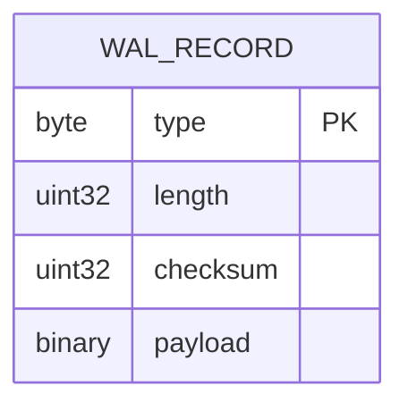
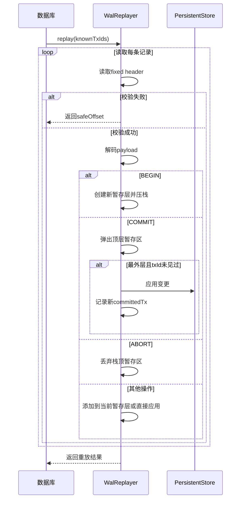
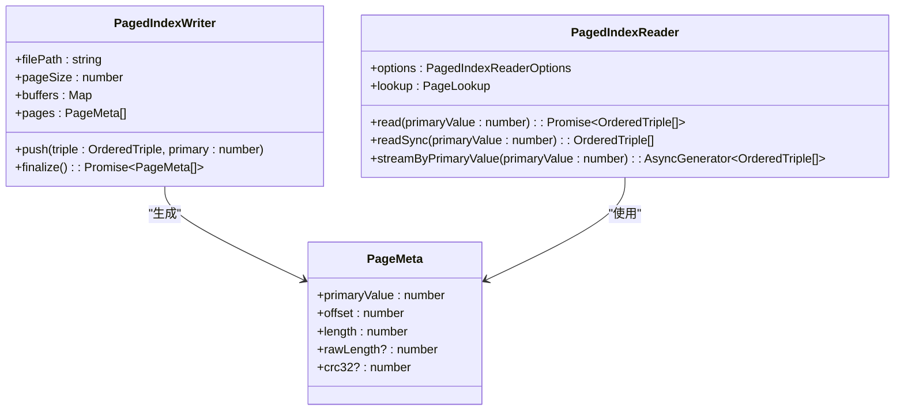

# 存储机制

<cite>
**本文档引用的文件**  
- [persistentStore.ts](file://src/storage/persistentStore.ts)
- [wal.ts](file://src/storage/wal.ts)
- [pagedIndex.ts](file://src/storage/pagedIndex.ts)
- [tripleStore.ts](file://src/storage/tripleStore.ts)
- [propertyStore.ts](file://src/storage/propertyStore.ts)
</cite>

## 目录
1. [引言](#引言)
2. [写前日志（WAL v2）机制](#写前日志-wal-v2-机制)
3. [分页索引（PagedIndex）设计](#分页索引-pagedindex-设计)
4. [LSM-Lite轻量级合并策略](#lsm-lite轻量级合并策略)
5. [tombstone机制与垃圾回收](#tombstone机制与垃圾回收)
6. [索引构建流程分析](#索引构建流程分析)
7. [存储层级与I/O路径](#存储层级与io路径)
8. [结论](#结论)

## 引言
SynapseDB采用混合持久化架构，结合了写前日志（WAL）、分页索引和轻量级LSM结构，以实现高性能、高可靠的数据存储。本文档深入解析其核心存储机制，重点阐述WAL v2的工作流程、多顺序分页索引的设计原理、LSM-Lite的权衡取舍以及tombstone删除机制，为开发者提供底层数据流动与耐久性保证的完整视图。

## 写前日志（WAL v2）机制

### 日志记录类型与格式
SynapseDB的WAL v2采用二进制格式，包含固定头部和可变负载。头部由1字节的记录类型、4字节的负载长度和4字节的校验和组成。支持以下记录类型：
- **AddTriple (0x10)**：记录三元组的添加操作。
- **DeleteTriple (0x20)**：记录三元组的删除操作。
- **SetNodeProps (0x30)**：记录节点属性的更新。
- **SetEdgeProps (0x31)**：记录边属性的更新。
- **BeginBatch (0x40)**：标记一个批次事务的开始。
- **CommitBatch (0x41)**：标记一个批次事务的提交。
- **AbortBatch (0x42)**：标记一个批次事务的回滚。



**Diagram sources**
- [wal.ts](file://src/storage/wal.ts#L26-L140)

### 批次提交语义
WAL支持嵌套事务批次。`beginBatch`方法会向WAL追加一条`BEGIN`记录，并将当前上下文压入事务栈。`commitBatch`方法根据参数决定是否调用`appendCommitDurable`，后者在写入`COMMIT`记录后立即执行`fsync`，确保提交的耐久性。内层`COMMIT`会直接提升其变更到全局可见，使其不受外层`ABORT`的影响，这与传统数据库的保存点（savepoint）语义一致。

**Section sources**
- [persistentStore.ts](file://src/storage/persistentStore.ts#L99-L238)
- [wal.ts](file://src/storage/wal.ts#L26-L140)

### 崩溃恢复与重放机制
数据库打开时，`PersistentStore.open`会创建`WalReplayer`实例来重放WAL。重放过程维护一个栈式暂存区，用于处理嵌套批次。当遇到`COMMIT`记录时，如果栈深度为0（最外层），则检查`txId`是否已存在去重集，若不存在则应用变更并将其加入去重集；若栈深度大于0，则直接应用变更。`ABORT`记录会丢弃栈顶的暂存区。此机制确保了幂等性和崩溃一致性。



**Diagram sources**
- [wal.ts](file://src/storage/wal.ts#L142-L321)
- [persistentStore.ts](file://src/storage/persistentStore.ts#L99-L238)

### 截断不完整记录的安全策略
`WalReplayer`在重放过程中会持续更新`safeOffset`，该值指向最后一条通过校验的完整记录的末尾。重放完成后，`PersistentStore`会调用`wal.truncateTo(safeOffset)`，将WAL文件截断至此位置。这一策略确保了任何因崩溃而产生的不完整记录都会被安全地移除，防止下次启动时出现解析错误，从而保证了打开操作的幂等性。

**Section sources**
- [persistentStore.ts](file://src/storage/persistentStore.ts#L99-L238)
- [wal.ts](file://src/storage/wal.ts#L142-L321)

## 分页索引（PagedIndex）设计

### 多顺序索引支持高效查询
SynapseDB通过六种预定义的顺序（SPO, SOP, POS, PSO, OSP, OPS）构建分页索引。每个顺序对应一个独立的`.idxpage`文件。例如，SPO索引按主键`subjectId`排序，使得所有以特定主体开头的三元组都物理上相邻，极大提升了基于主体的范围查询效率。查询引擎通过`getBestIndexKey`函数选择最优索引，实现高效的谓词下推。

**Section sources**
- [pagedIndex.ts](file://src/storage/pagedIndex.ts#L28-L129)
- [tripleIndexes.ts](file://src/storage/tripleIndexes.ts)

### 页面大小与压缩选项
页面大小（`pageSize`）是影响性能的关键参数，默认为1024个条目。较大的页面能减少随机I/O次数，提高顺序扫描吞吐量，但会增加单次读取的延迟和内存占用。较小的页面则相反。系统支持`brotli`压缩，可在`compression`选项中配置。压缩能显著减少磁盘空间占用和I/O带宽，但会增加CPU开销。用户需根据工作负载（读密集 vs 写密集）和硬件资源进行权衡。



**Diagram sources**
- [pagedIndex.ts](file://src/storage/pagedIndex.ts#L28-L129)
- [pagedIndex.ts](file://src/storage/pagedIndex.ts#L136-L284)

## LSM-Lite轻量级合并策略

### 设计权衡与传统LSM的区别
LSM-Lite是一种实验性的轻量级合并策略，旨在平衡写入放大和查询延迟。与传统LSM不同，它不强制要求多级合并（compaction）。在`stagingMode === 'lsm-lite'`时，`PersistentStore`会初始化一个`LsmLiteStaging`实例。每次写入不仅进入`TripleIndexes`暂存区，还会旁路收集到LSM的memtable中。`flush`操作会将memtable内容序列化为段文件（segment file）并写入清单（manifest），但这些段文件不会立即参与查询。只有在后续的`appendPagedIndexesFromStaging`调用中，系统才会尝试读取这些段文件，将其与暂存区数据一并合并到分页索引中，然后清理旧段。这种设计避免了复杂的后台合并进程，降低了实现复杂度，但可能牺牲了部分写入吞吐量。

**Section sources**
- [persistentStore.ts](file://src/storage/persistentStore.ts#L99-L238)
- [persistentStore.ts](file://src/storage/persistentStore.ts#L1388-L1451)

## tombstone机制与垃圾回收

### 删除操作中的作用
SynapseDB不立即从磁盘物理删除三元组，而是采用逻辑删除。`deleteFactDirect`方法会将待删除三元组的编码键（`encodeTripleKey`）加入内存中的`tombstones`集合，并标记`dirty`标志。在后续的查询（如`query`、`streamQuery`）中，系统会检查结果集中的三元组是否存在于`tombstones`中，若存在则过滤掉。这种方式避免了昂贵的原地更新或文件重写，实现了快速删除。

### 垃圾回收时机
`tombstones`集合本身会在`appendPagedIndexesFromStaging`方法中被持久化到新的`PagedIndexManifest`的`tombstones`字段里。然而，真正的物理垃圾回收（即从分页索引中永久移除被删除的三元组）并未在提供的代码中明确实现。通常，这需要一个独立的维护任务（maintenance task），在确认没有更早的快照依赖这些已删除数据后，才能安全地重建索引或合并段文件，从而清除`tombstones`。

**Section sources**
- [persistentStore.ts](file://src/storage/persistentStore.ts#L99-L238)
- [persistentStore.ts](file://src/storage/persistentStore.ts#L316-L434)

## 索引构建流程分析

### buildPagedIndexes方法
`buildPagedIndexes`方法负责全量重建分页索引。它首先从主存储文件中反序列化出历史三元组数据，然后为每种顺序（SPO, SOP等）创建一个`PagedIndexWriter`。遍历所有三元组，根据当前顺序确定主键（primary key），并将三元组推入对应的writer。最终，writer将缓冲区内的数据批量写入文件，并生成包含页面元数据（`PageMeta`）的数组。最后，将所有信息汇总成`PagedIndexManifest`并写入磁盘。

**Section sources**
- [persistentStore.ts](file://src/storage/persistentStore.ts#L259-L314)

### appendPagedIndexesFromStaging方法
`appendPagedIndexesFromStaging`方法负责增量更新分页索引。它读取现有的`PagedIndexManifest`，获取各顺序的现有页面列表。然后，它会尝试读取LSM段文件（如果存在），将其中的三元组与`TripleIndexes`暂存区中的数据合并。对于每种顺序，创建一个新的`PagedIndexWriter`，将合并后的数据写入新的页面文件。新生成的页面元数据会被追加到现有列表中，并递增`epoch`号。最后，写入包含更新后`tombstones`的新manifest，并重新加载`PagedIndexReader`。

```mermaid
flowchart TD
    Start([开始]) --> ReadManifest["读取现有 manifest"]
    ReadManifest --> InitMap["初始化 lookupMap"]
    InitMap --> ReadLSMSegments["读取 LSM 段文件"]
    ReadLSMSegments --> ProcessOrders["遍历 SPO/SOP/... 顺序"]
    ProcessOrders --> CheckData{"有暂存或LSM数据?"}
    CheckData -->|否| NextOrder
    CheckData -->