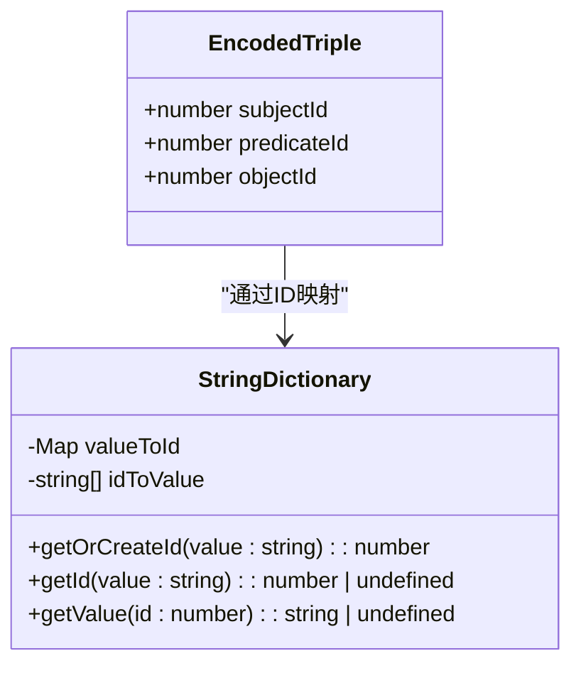
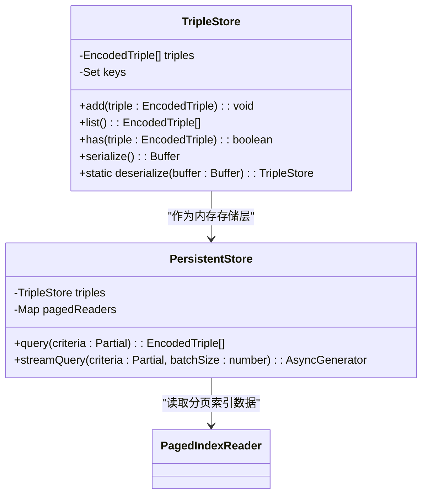
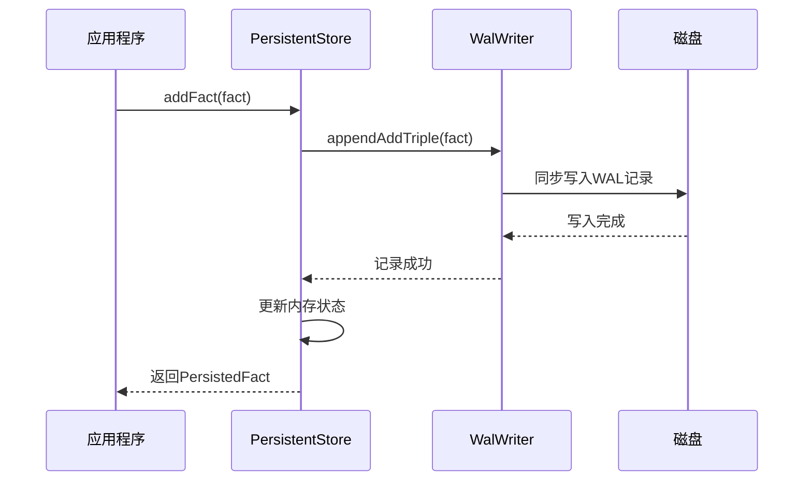

# 三元组存储

<cite>
**本文档引用的文件**   
- [tripleStore.ts](file://src/storage/tripleStore.ts)
- [persistentStore.ts](file://src/storage/persistentStore.ts)
- [layout.ts](file://src/storage/layout.ts)
- [tripleIndexes.ts](file://src/storage/tripleIndexes.ts)
- [wal.ts](file://src/storage/wal.ts)
- [pagedIndex.ts](file://src/storage/pagedIndex.ts)
- [dictionary.ts](file://src/storage/dictionary.ts)
- [propertyStore.ts](file://src/storage/propertyStore.ts)
- [synapseDb.ts](file://src/synapseDb.ts)
</cite>

## 目录
1. [数据结构设计](#数据结构设计)
2. [内存管理机制](#内存管理机制)
3. [持久化与WAL日志](#持久化与wal日志)
4. [磁盘物理布局](#磁盘物理布局)
5. [查询优化与索引](#查询优化与索引)
6. [事务与一致性](#事务与一致性)

## 数据结构设计

SynapseDB中的SPO（主语-谓语-宾语）三元组通过`EncodedTriple`接口进行定义，该接口使用数值ID而非字符串来表示实体，从而显著提升性能。每个三元组由`subjectId`、`predicateId`和`objectId`三个数字字段组成，这些ID通过`StringDictionary`映射到实际的字符串值。



**图源**
- [tripleStore.ts](file://src/storage/tripleStore.ts#L0-L4)
- [dictionary.ts](file://src/storage/dictionary.ts#L10-L20)

**节源**
- [tripleStore.ts](file://src/storage/tripleStore.ts#L0-L4)
- [dictionary.ts](file://src/storage/dictionary.ts#L10-L80)

## 内存管理机制

`TripleStore`类负责在内存中管理三元组数据。它维护一个`EncodedTriple[]`数组和一个用于快速查重的`Set<string>`键集合。新增三元组时，系统会先检查是否已存在相同组合，避免重复插入。此外，`PersistentStore`类通过分页索引（Paged Index）协同工作，将历史数据存储于磁盘，仅将增量数据保留在内存中，以优化内存使用效率。



**图源**
- [tripleStore.ts](file://src/storage/tripleStore.ts#L6-L66)
- [persistentStore.ts](file://src/storage/persistentStore.ts#L61-L1633)

**节源**
- [tripleStore.ts](file://src/storage/tripleStore.ts#L6-L66)
- [persistentStore.ts](file://src/storage/persistentStore.ts#L61-L1633)

## 持久化与WAL日志

为了保障数据的持久性，SynapseDB采用预写式日志（Write-Ahead Logging, WAL）机制。所有对三元组的修改操作（如`addFact`和`deleteFact`）首先被记录到WAL文件中，然后再应用到内存或磁盘。这种设计确保了即使在系统崩溃的情况下，也能通过重放WAL日志恢复未落盘的数据变更。



**图源**
- [persistentStore.ts](file://src/storage/persistentStore.ts#L436-L467)
- [wal.ts](file://src/storage/wal.ts#L96-L99)

**节源**
- [persistentStore.ts](file://src/storage/persistentStore.ts#L436-L467)
- [wal.ts](file://src/storage/wal.ts#L96-L99)

## 磁盘物理布局

根据`layout.ts`文件中的定义，SynapseDB的数据库文件具有固定的头部结构，包含魔数、版本号以及各数据段的偏移量和长度信息。三元组数据存储在名为`triples`的段中，其内容为序列化的`EncodedTriple`数组。分页索引则独立存放于`.pages`目录下，每个索引文件按特定顺序（如SPO、POS等）组织三元组，便于高效查询。

```mermaid
erDiagram
    FILE_HEADER ||--o{ TRIPLES_SEGMENT : 包含
    FILE_HEADER ||--o{ INDEXES_DIRECTORY : 包含
    INDEXES_DIRECTORY ||--o{ SPO_INDEX : 包含
    INDEXES_DIRECTORY ||--o{