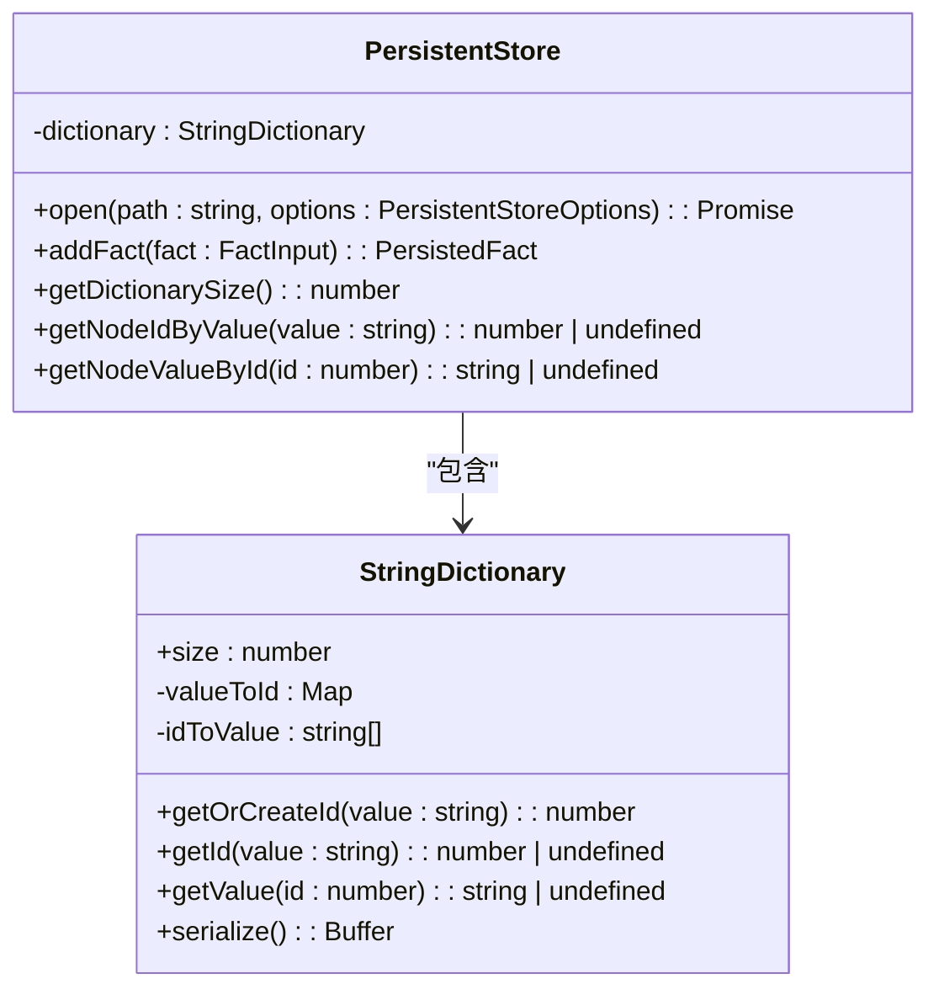
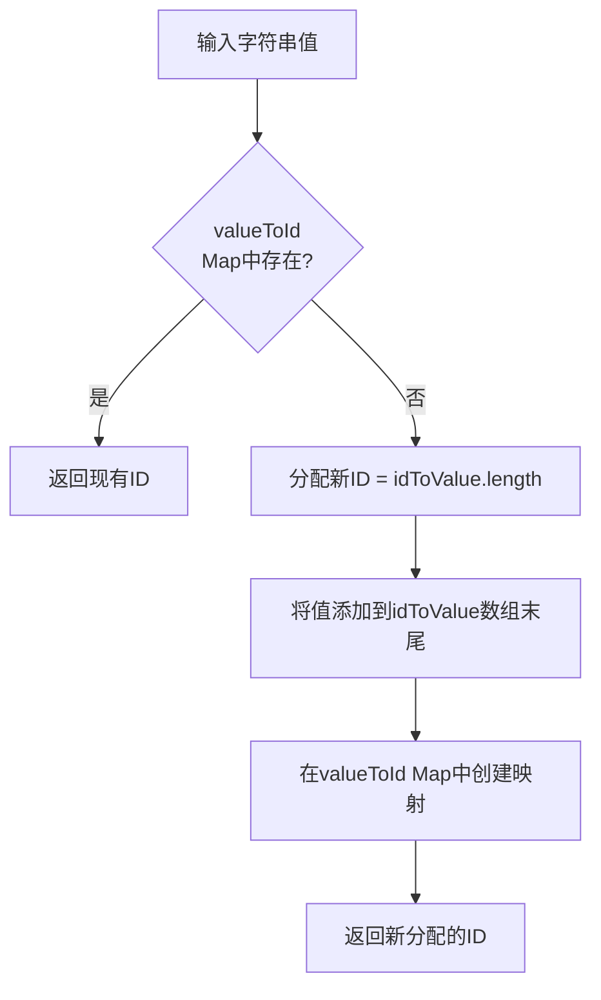
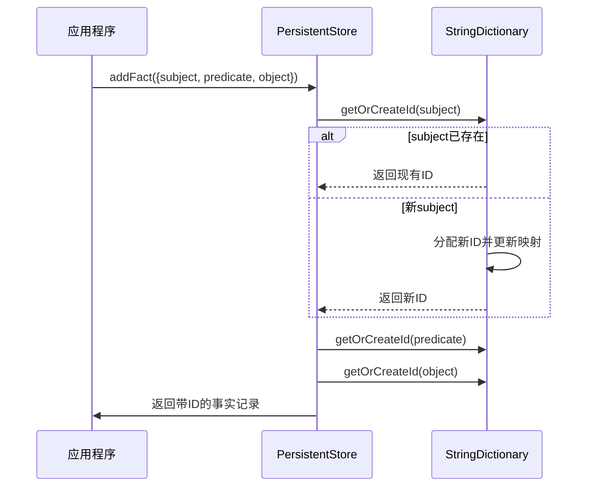
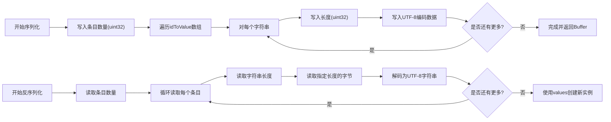
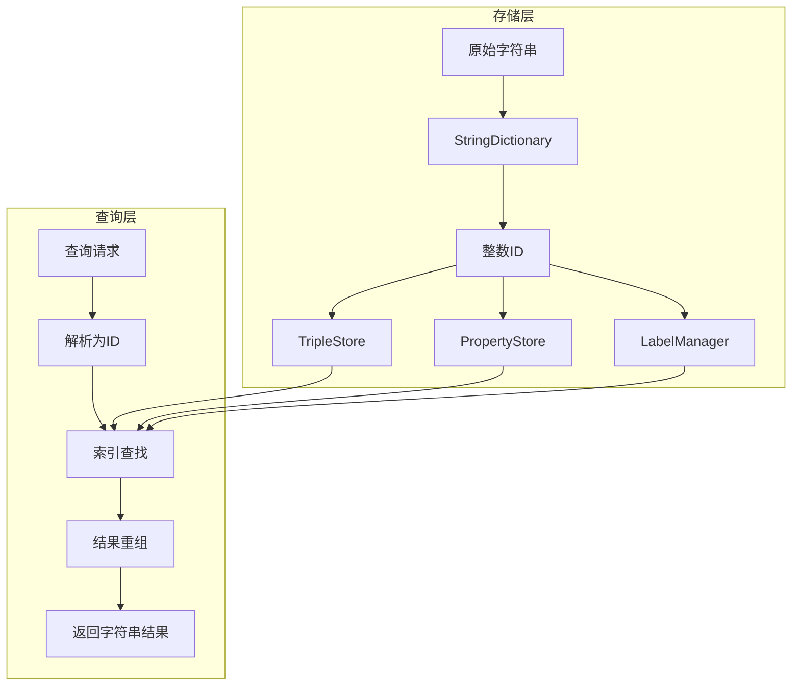

# 字符串字典映射

<cite>
**本文档引用的文件**
- [dictionary.ts](file://src/storage/dictionary.ts)
- [persistentStore.ts](file://src/storage/persistentStore.ts)
</cite>

## 目录
1. [简介](#简介)
2. [核心组件分析](#核心组件分析)
3. [双向映射结构](#双向映射结构)
4. [自动注册机制](#自动注册机制)
5. [序列化与反序列化流程](#序列化与反序列化流程)
6. [存储优化与索引加速](#存储优化与索引加速)
7. [内存占用评估模型](#内存占用评估模型)
8. [性能调优建议](#性能调优建议)
9. [调试技巧](#调试技巧)

## 简介
字符串字典映射是SynapseDB中实现高效数据存储和查询的核心机制。通过StringDictionary类，系统能够将频繁出现的字符串值转换为紧凑的整数ID，从而显著减少存储空间占用并提升索引查找性能。该机制在数据库初始化、数据插入、查询处理等关键环节发挥着重要作用，确保了跨会话的一致性和高性能的数据操作能力。

## 核心组件分析

StringDictionary类作为SynapseDB中的基础数据结构，负责管理字符串与其对应整数ID之间的映射关系。它被PersistentStore类所使用，在数据库打开时进行反序列化，并在整个生命周期中维护这个映射表。这种设计使得所有字符串比较和查找操作都可以转化为更高效的整数运算。

**图示来源**
- [dictionary.ts](file://src/storage/dictionary.ts#L5-L79)
- [persistentStore.ts](file://src/storage/persistentStore.ts#L61-L1633)

**章节来源**
- [dictionary.ts](file://src/storage/dictionary.ts#L5-L79)
- [persistentStore.ts](file://src/storage/persistentStore.ts#L61-L1633)

## 双向映射结构

StringDictionary采用两种互补的数据结构来实现高效的双向映射：`valueToId`是一个Map对象，用于快速查找字符串对应的ID；`idToValue`是一个数组，用于根据ID快速获取原始字符串值。这种组合提供了O(1)时间复杂度的查找性能，同时保证了内存使用的效率。

当需要获取某个字符串的ID时，系统首先检查`valueToId`映射是否存在该条目。如果存在，则直接返回对应的ID；否则，会分配一个新的ID并将新条目添加到两个映射中。相反地，通过ID查找字符串值的操作可以直接通过数组索引完成，这是非常高效的操作。

**图示来源**
- [dictionary.ts](file://src/storage/dictionary.ts#L7-L8)
- [dictionary.ts](file://src/storage/dictionary.ts#L19-L29)

**章节来源**
- [dictionary.ts](file://src/storage/dictionary.ts#L7-L8)
- [dictionary.ts](file://src/storage/dictionary.ts#L19-L29)

## 自动注册机制

`getOrCreateId`方法实现了智能的自动注册功能。每当有新的事实（fact）被插入时，系统会对subject、predicate和object三个字段分别调用此方法。如果字符串已经存在于字典中，就复用其ID；如果是首次出现，则自动为其分配一个唯一的递增ID。

这一机制确保了去重效果，相同的字符串总是映射到同一个ID，无论它们出现在多少个不同的三元组中。这不仅减少了存储开销，还提高了后续查询的效率，因为可以基于整数ID进行快速比较和连接操作。

**图示来源**
- [persistentStore.ts](file://src/storage/persistentStore.ts#L436-L467)
- [dictionary.ts](file://src/storage/dictionary.ts#L19-L29)

**章节来源**
- [persistentStore.ts](file://src/storage/persistentStore.ts#L436-L467)
- [dictionary.ts](file://src/storage/dictionary.ts#L19-L29)

## 序列化与反序列化流程

为了确保跨会话一致性，StringDictionary实现了完整的序列化和反序列化能力。`serialize`方法将当前字典状态转换为Buffer格式，先写入条目总数，然后依次写入每个字符串的长度和UTF-8编码内容。`deserialize`静态方法则从Buffer重建整个字典实例。

在PersistentStore.open过程中，系统从存储文件读取字典部分并调用deserialize方法恢复状态。这样即使在重启后，也能保持原有的字符串-ID映射关系，保证了数据的一致性和连续性。

**图示来源**
- [dictionary.ts](file://src/storage/dictionary.ts#L39-L78)
- [persistentStore.ts](file://src/storage/persistentStore.ts#L99-L238)

**章节来源**
- [dictionary.ts](file://src/storage/dictionary.ts#L39-L78)
- [persistentStore.ts](file://src/storage/persistentStore.ts#L99-L238)

## 存储优化与索引加速

字符串字典映射在减少存储开销和加速索引查找方面具有关键价值。通过将变长字符串替换为固定大小的整数ID（通常为32位），大大降低了三元组存储所需的空间。此外，整数比较比字符串比较快得多，特别是在大规模数据集上进行排序和连接操作时。

在构建分页索引时，系统利用这些整数ID作为排序键，实现了高效的范围查询和顺序扫描。同时，属性索引和标签索引也受益于这种映射机制，能够更快地定位相关实体。

**图示来源**
- [persistentStore.ts](file://src/storage/persistentStore.ts#L259-L314)
- [persistentStore.ts](file://src/storage/persistentStore.ts#L1520-L1530)

**章节来源**
- [persistentStore.ts](file://src/storage/persistentStore.ts#L259-L314)
- [persistentStore.ts](file://src/storage/persistentStore.ts#L1520-L1530)

## 内存占用评估模型

StringDictionary的内存占用主要由两部分组成：`valueToId` Map和`idToValue`数组。假设平均字符串长度为L字节，字典中有N个唯一字符串，则粗略估算如下：

- `idToValue`数组：约消耗N * (指针大小 + 字符串对象开销)
- `valueToId` Map：约消耗N * (哈希表条目开销 + 字符串引用 + 整数ID)

实际内存使用还会受到JavaScript引擎内部实现细节的影响。可以通过调用`getDictionarySize()`方法获取当前字典大小，结合应用程序的字符串分布特征来进行更精确的容量规划。

**章节来源**
- [persistentStore.ts](file://src/storage/persistentStore.ts#L636-L638)

## 性能调优建议

对于大规模数据导入场景，建议采取以下性能优化措施：
1. 预加载常用词汇到初始字典中，避免频繁动态扩展
2. 使用批量事务提交以减少WAL写入次数
3. 合理配置分页索引大小，平衡内存使用和I/O效率
4. 定期执行压缩操作以消除冗余条目

监控字典增长趋势，适时考虑重新组织或分割大型字典，有助于维持长期运行的性能稳定性。

**章节来源**
- [persistentStore.ts](file://src/storage/persistentStore.ts#L316-L434)

## 调试技巧

为了便于审计和迁移，可以导出字典内容进行分析。虽然没有直接的导出方法，但可以通过以下方式实现：
1. 获取字典大小并通过getValue逐个提取内容
2. 在测试环境中模拟open过程观察反序列化行为
3. 利用现有的序列化格式直接读取存储文件中的字典部分

这些技术可用于验证数据完整性、分析字符串分布特征或准备迁移脚本。

**章节来源**
- [dictionary.ts](file://src/storage/dictionary.ts#L55-L78)
- [persistentStore.ts](file://src/storage/persistentStore.ts#L99-L238)