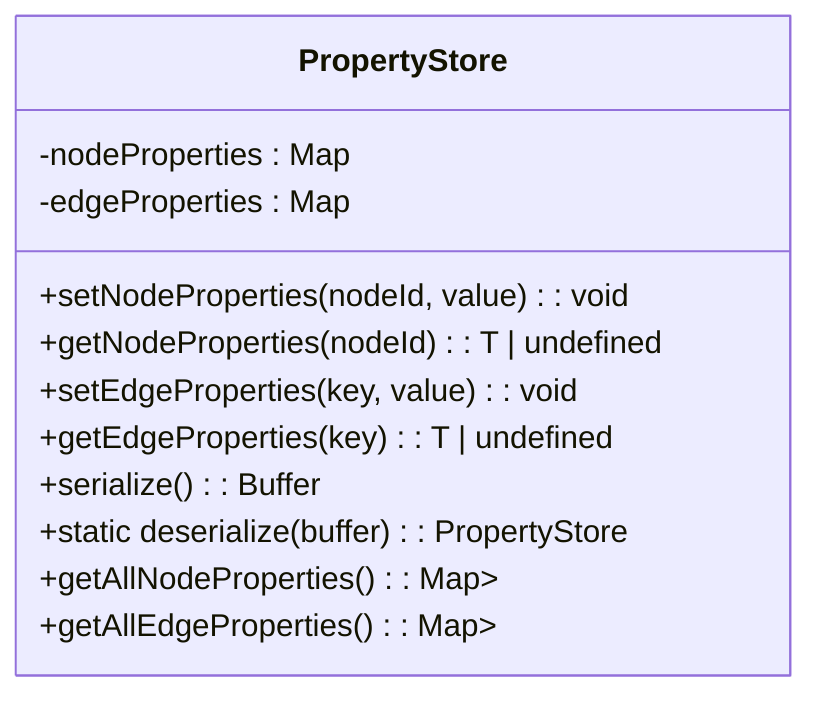
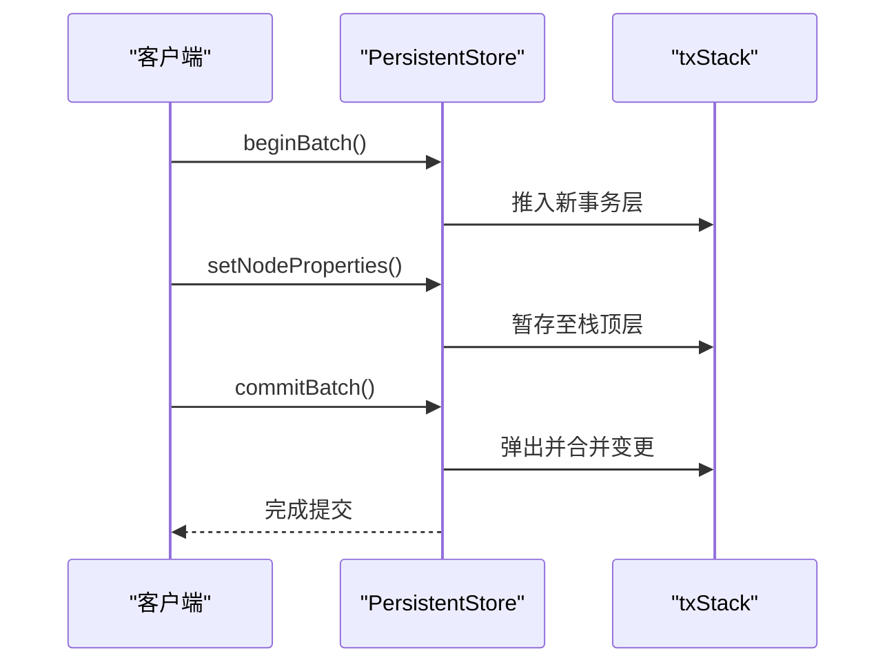
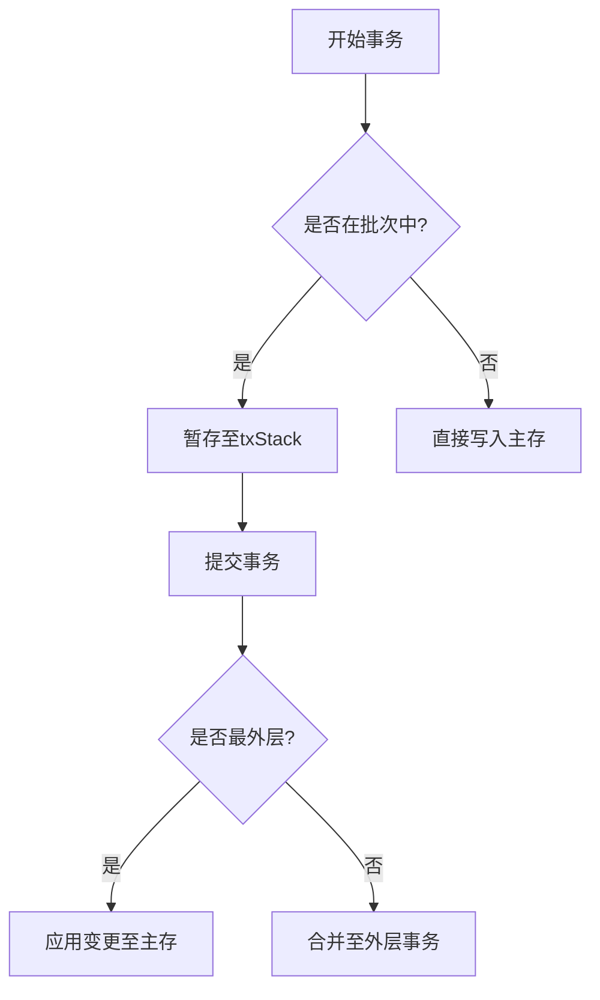
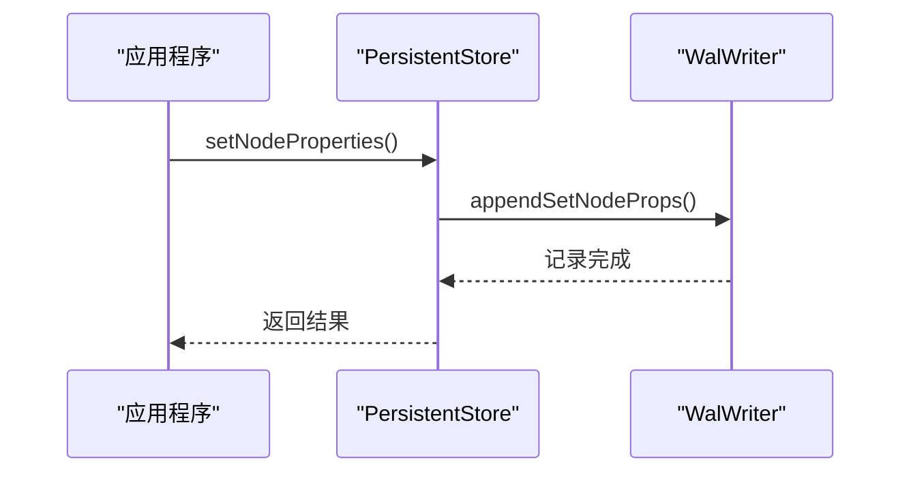
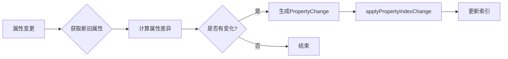

# 属性管理

<cite>
**本文档引用的文件**  
- [propertyStore.ts](file://src/storage/propertyStore.ts)
- [persistentStore.ts](file://src/storage/persistentStore.ts)
- [wal.ts](file://src/storage/wal.ts)
</cite>

## 目录
1. [简介](#简介)
2. [核心组件分析](#核心组件分析)
3. [属性存储架构](#属性存储架构)
4. [事务与暂存机制](#事务与暂存机制)
5. [WAL日志与持久化](#wal日志与持久化)
6. [属性索引更新流程](#属性索引更新流程)
7. [典型使用场景](#典型使用场景)
8. [错误处理与性能优化](#错误处理与性能优化)

## 简介
本文档系统化地介绍了SynapseDB中节点与边属性的存储架构，深入解析了PropertyStore类的设计原理、PersistentStore中的事务暂存栈（txStack）机制、WAL日志记录流程以及属性索引的动态更新策略。通过结合代码结构和运行时行为，全面阐述了属性管理在嵌套事务、查询性能和数据一致性方面的实现逻辑。

## 核心组件分析

### PropertyStore 类设计原理
`PropertyStore` 是属性管理的核心数据结构，负责组织节点和边的动态属性。其内部采用两个独立的Map结构分别存储：

- **nodeProperties**: `Map<number, Buffer>`，以节点ID为键，序列化后的属性数据为值
- **edgeProperties**: `Map<string, Buffer>`，以三元组键（subjectId:predicateId:objectId）为键，序列化后的属性数据为值

该设计实现了高效的属性存取操作，并通过版本控制机制（`__v`字段）确保每次更新都能被正确追踪。



**图表来源**
- [propertyStore.ts](file://src/storage/propertyStore.ts#L45-L174)

**节来源**
- [propertyStore.ts](file://src/storage/propertyStore.ts#L45-L174)

### PersistentStore 与 txStack 机制
`PersistentStore` 类提供了事务级别的属性管理能力，其中 `txStack` 是支持嵌套事务的关键数据结构。它是一个数组栈，每个元素代表一个事务层级的暂存状态，包含新增事实、删除事实、节点属性和边属性的变更集合。

当执行 `beginBatch()` 时，新的事务层被推入栈顶；`commitBatch()` 将当前层的变更合并到外层或主存；`abortBatch()` 则直接丢弃当前层的所有变更。



**图表来源**
- [persistentStore.ts](file://src/storage/persistentStore.ts#L61-L1633)

**节来源**
- [persistentStore.ts](file://src/storage/persistentStore.ts#L61-L1633)

## 属性存储架构

### 动态属性接口
`PropertyStore` 提供了统一的接口来支持动态属性的赋值与检索：

- `setNodeProperties(nodeId, value)`: 设置指定节点的属性，自动处理JSON序列化和版本递增
- `getNodeProperties(nodeId)`: 获取指定节点的属性，返回解码后的对象
- `setEdgeProperties(key, value)`: 设置指定边的属性
- `getEdgeProperties(key)`: 获取指定边的属性

这些接口屏蔽了底层Buffer操作的复杂性，使上层调用更加直观。

**节来源**
- [propertyStore.ts](file://src/storage/propertyStore.ts#L45-L174)

### 序列化与反序列化
属性数据在内存中以Buffer形式存储，通过 `encodeJson` 和 `decodeJson` 函数进行序列化与反序列化。`encodeJson` 在原始数据外包裹 `{__v: version, data: value}` 结构，实现简单的版本控制；`decodeJson` 则提取 `data` 字段返回实际属性对象。

## 事务与暂存机制

### 嵌套事务下的属性暂存
在嵌套事务场景下，所有属性变更首先暂存在 `txStack` 的栈顶层，而非立即写入主存。这保证了内层事务的修改对外不可见，直到最外层事务提交。



**图表来源**
- [persistentStore.ts](file://src/storage/persistentStore.ts#L61-L1633)

**节来源**
- [persistentStore.ts](file://src/storage/persistentStore.ts#L61-L1633)

### 变更合并逻辑
`applyStage` 方法负责将暂存的变更应用到主存。对于属性变更，它会：
1. 获取旧属性用于索引比较
2. 调用 `properties.setNodeProperties` 更新属性
3. 触发 `updateNodePropertyIndex` 更新相关索引

此过程确保了数据一致性和索引同步。

**节来源**
- [persistentStore.ts](file://src/storage/persistentStore.ts#L1468-L1504)

## WAL日志与持久化

### 日志记录流程
每次属性变更都会触发WAL（Write-Ahead Log）记录。`WalWriter` 类负责将操作类型和参数写入 `.wal` 文件，确保即使系统崩溃也能通过重放日志恢复数据。

关键日志类型包括：
- `0x30`: setNodeProps
- `0x31`: setEdgeProps
- `0x40`: beginBatch
- `0x41`: commitBatch
- `0x42`: abortBatch



**图表来源**
- [wal.ts](file://src/storage/wal.ts#L0-L420)

**节来源**
- [wal.ts](file://src/storage/wal.ts#L0-L420)

### 事务提交与持久化
当调用 `commitBatch(durable=true)` 时，不仅写入COMMIT日志，还会调用 `fd.sync()` 确保操作系统将数据刷入磁盘，实现持久化保障。

## 属性索引更新流程

### 索引更新机制
属性变更会触发相应的索引更新：

- `updateNodePropertyIndex`: 比较新旧属性差异，生成 `PropertyChange` 并交由 `propertyIndexManager` 处理
- `updateEdgePropertyIndex`: 同样逻辑处理边属性变更

这两个方法通过对比 `oldKeys` 和 `newKeys` 集合，仅对实际发生变化的属性执行索引操作，避免不必要的开销。



**图表来源**
- [persistentStore.ts](file://src/storage/persistentStore.ts#L1577-L1632)

**节来源**
- [persistentStore.ts](file://src/storage/persistentStore.ts#L1577-L1632)

### 查询性能影响
属性索引的建立显著提升了基于属性的查询性能。例如 `queryBuilder.whereProperty('age', '>', 18)` 可以利用索引快速定位符合条件的节点，而无需全表扫描。但频繁的属性更新也会带来索引维护成本，需权衡使用。

## 典型使用场景

### 为人物节点添加属性
```typescript
// 创建人物节点
const personId = store.getNodeIdByValue("Alice");

// 添加姓名和年龄属性
store.setNodeProperties(personId, {
  name: "Alice",
  age: 30,
  labels: ["Person"]
});
```

### 为关系边设置权重
```typescript
// 获取三元组键
const edgeKey = { subjectId: aliceId, predicateId: knowsId, objectId: bobId };

// 设置权重属性
store.setEdgeProperties(edgeKey, {
  weight: 0.8,
  since: "2023-01-01"
});
```

**节来源**
- [persistentStore.ts](file://src/storage/persistentStore.ts#L61-L1633)

## 错误处理与性能优化

### 错误处理建议
- 在调用 `setNodeProperties` 前验证节点是否存在
- 处理WAL写入失败的可能性，特别是在高并发场景
- 注意事务嵌套深度，避免栈溢出

### 性能优化提示
- 批量操作使用 `beginBatch`/`commitBatch` 减少WAL I/O次数
- 避免在单个属性中存储过大对象
- 合理设计属性名称，便于索引利用
- 定期执行 `rebuildPropertyIndex` 维护索引效率

**节来源**
- [persistentStore.ts](file://src/storage/persistentStore.ts#L1520-L1530)