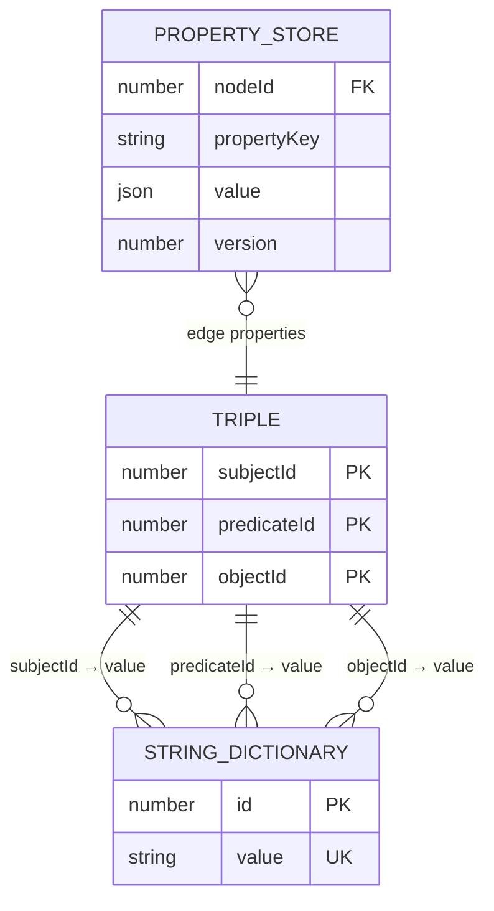
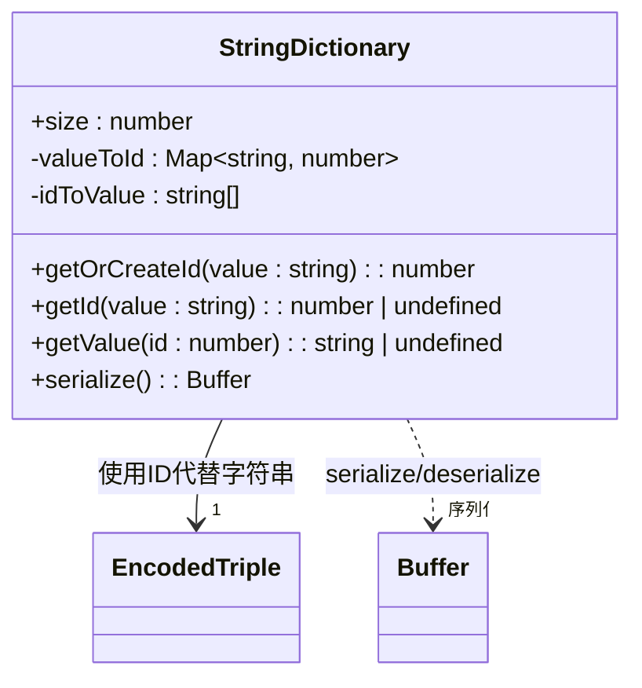
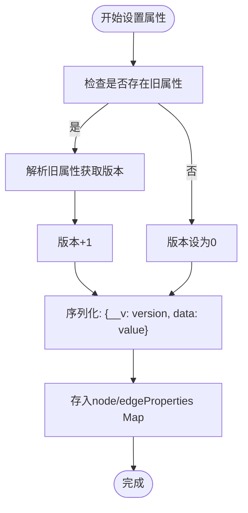
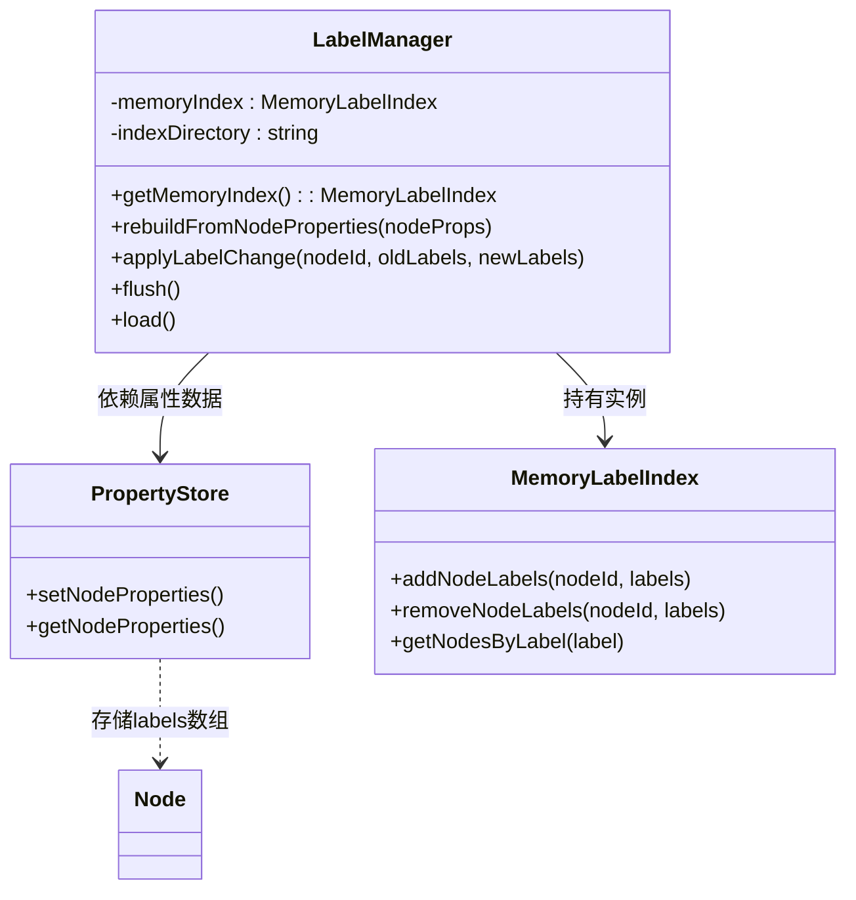
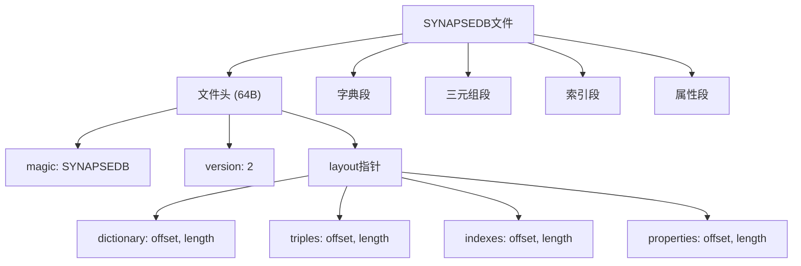

# 数据模型

<cite>
**本文档引用的文件**
- [dictionary.ts](file://src/storage/dictionary.ts)
- [persistentStore.ts](file://src/storage/persistentStore.ts)
- [propertyStore.ts](file://src/storage/propertyStore.ts)
- [tripleStore.ts](file://src/storage/tripleStore.ts)
- [layout.ts](file://src/storage/layout.ts)
- [labels.ts](file://src/graph/labels.ts)
</cite>

## 目录
1. [三元组数据结构与SPO模型](#三元组数据结构与spo模型)
2. [字符串字典映射机制](#字符串字典映射机制)
3. [节点与边属性存储机制](#节点与边属性存储机制)
4. [标签系统实现逻辑](#标签系统实现逻辑)
5. [内存与磁盘数据布局一致性](#内存与磁盘数据布局一致性)
6. [数据库文件组织结构](#数据库文件组织结构)

## 三元组数据结构与SPO模型

SynapseDB采用Subject-Predicate-Object（SPO）三元组模型作为核心数据结构，用于表示图中的实体关系。每个三元组由三个数值ID组成：`subjectId`、`predicateId`和`objectId`，分别对应主语、谓词和宾语的唯一标识。

该模型通过`EncodedTriple`接口定义，所有图数据均以这种紧凑的数值形式存储，极大提升了序列化效率和查询性能。在物理存储层面，三元组被组织为12字节的固定长度记录（每个ID占4字节），便于高效读写与索引构建。



**图表来源**
- [tripleStore.ts](file://src/storage/tripleStore.ts#L6-L66)
- [propertyStore.ts](file://src/storage/propertyStore.ts#L45-L174)
- [dictionary.ts](file://src/storage/dictionary.ts#L5-L79)

**本节来源**
- [tripleStore.ts](file://src/storage/tripleStore.ts#L6-L66)

## 字符串字典映射机制

为了优化存储空间并提升查询速度，SynapseDB使用`StringDictionary`类将字符串值映射为整数ID。这一过程通过双向哈希表实现：`valueToId`映射字符串到ID，`idToValue`数组按ID索引存储原始字符串。

当添加新的事实（fact）时，系统调用`getOrCreateId()`方法检查字符串是否已存在。若存在则复用其ID；否则分配新ID并插入字典。这种设计确保相同字符串在整个数据库中始终对应同一ID，支持高效的等值比较和索引查找。

字典的序列化格式包含：
- 4字节：条目总数
- 每个条目：
  - 4字节：字符串UTF-8编码长度
  - N字节：实际编码内容

反序列化时按顺序重建两个映射结构，保证ID与字符串的一一对应关系。



**图表来源**
- [dictionary.ts](file://src/storage/dictionary.ts#L5-L79)

**本节来源**
- [dictionary.ts](file://src/storage/dictionary.ts#L5-L79)

## 节点与边属性存储机制

属性存储由`PropertyStore`类负责管理，支持为节点和边附加任意JSON结构的元数据。其实现基于两个独立的Map：
- `nodeProperties`: 以节点ID为键，存储序列化后的属性数据
- `edgeProperties`: 以三元组组合键（`subjectId:predicateId:objectId`）为键，存储边属性

### 属性序列化格式

#### 节点属性
- 4字节：节点数量
- 每个节点：
  - 4字节：节点ID
  - 4字节：属性数据长度
  - N字节：序列化属性（含版本号）

#### 边属性
- 4字节：边数量
- 每条边：
  - 4字节：subjectId
  - 4字节：predicateId
  - 4字节：objectId
  - 4字节：属性数据长度
  - N字节：序列化属性（含版本号）

属性值采用带版本控制的JSON封装格式：`{"__v": version, "data": {...}}`，每次更新自动递增版本号，支持乐观并发控制。



**图表来源**
- [propertyStore.ts](file://src/storage/propertyStore.ts#L45-L174)

**本节来源**
- [propertyStore.ts](file://src/storage/propertyStore.ts#L45-L174)

## 标签系统实现逻辑

标签系统由`LabelManager`类实现，提供基于内存的标签索引功能。标签信息实际作为节点属性的一部分进行持久化存储（如`labels: ["User", "Admin"]`），而`LabelManager`负责维护一个高效的内存索引结构`MemoryLabelIndex`，支持快速按标签查询节点。

### 实现特点
- **异步重建**：通过`rebuildFromNodeProperties()`从现有属性重建索引
- **变更应用**：`applyLabelChange()`处理标签增删，同步更新内存索引
- **未来扩展**：预留`flush()`和`load()`接口，支持未来持久化能力

标签索引不单独占用额外磁盘空间，而是依赖属性存储机制，实现了功能与性能的平衡。



**图表来源**
- [labels.ts](file://src/graph/labels.ts#L252-L318)

**本节来源**
- [labels.ts](file://src/graph/labels.ts#L252-L318)

## 内存与磁盘数据布局一致性

`PersistentStore`类协调内存与磁盘之间的数据一致性，确保二者在逻辑上保持统一视图。其核心组件包括：
- `dictionary`: 字符串字典（内存+磁盘）
- `triples`: 增量三元组（内存）
- `properties`: 属性存储（内存+磁盘）
- `indexes`: 分页索引（磁盘为主，内存缓存）

### 一致性保障机制
1. **WAL日志**：所有写操作先写入预写式日志（WAL），确保崩溃恢复能力
2. **事务暂存栈**：支持嵌套批次操作，最外层commit才落盘
3. **分页索引**：历史数据通过分页索引访问，增量数据保留在内存
4. **Manifest管理**：通过`PagedIndexManifest`跟踪索引版本与epoch

打开数据库时，系统首先从主文件反序列化字典、属性和索引，然后重放WAL日志恢复未持久化的变更，最终形成一致的内存状态。

**本节来源**
- [persistentStore.ts](file://src/storage/persistentStore.ts#L61-L855)

## 数据库文件组织结构

数据库文件遵循固定的二进制布局，由头部和多个段组成。`layout.ts`定义了完整的文件结构规范：

### 文件头（64字节）
- 魔数（Magic Header）："SYNAPSEDB"
- 版本号：当前为2
- 布局信息：各段偏移与长度

### 数据段
| 段名 | 描述 |
|------|------|
| dictionary | 字符串字典序列化数据 |
| triples | 历史三元组数据（已逐步迁移至分页索引） |
| indexes | 索引元数据（PagedIndexManifest） |
| properties | 节点与边属性数据 |

### 接口定义
```typescript
interface FileLayout {
  dictionary: SectionPointer;
  triples: SectionPointer;
  indexes: SectionPointer;
  properties: SectionPointer;
}

interface SectionPointer {
  offset: number; // 相对于文件起始位置
  length: number; // 数据长度
}
```

此布局由`createEmptyLayout()`初始化，并在`readStorageFile()`和`writeStorageFile()`中用于定位各段数据，确保跨平台兼容性和读写一致性。



**图表来源**
- [layout.ts](file://src/storage/layout.ts#L9-L14)

**本节来源**
- [layout.ts](file://src/storage/layout.ts#L9-L29)