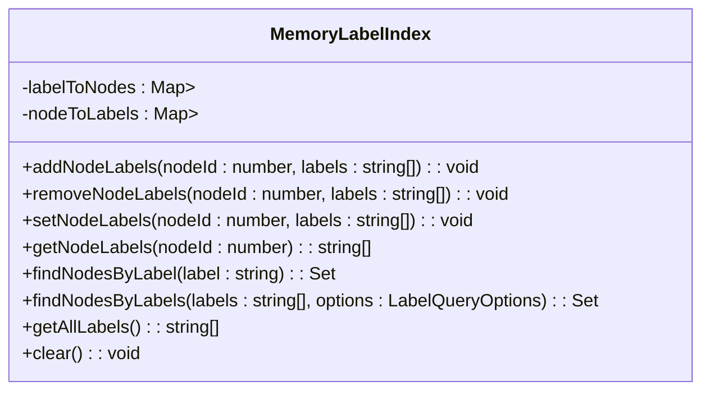
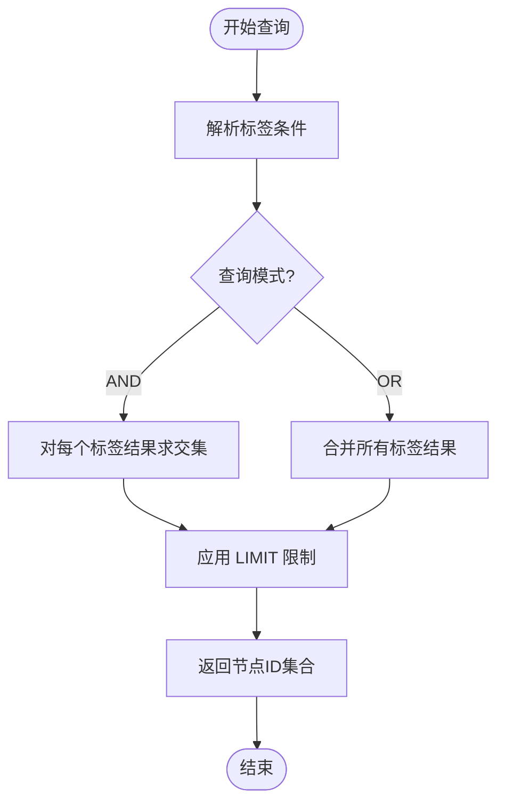
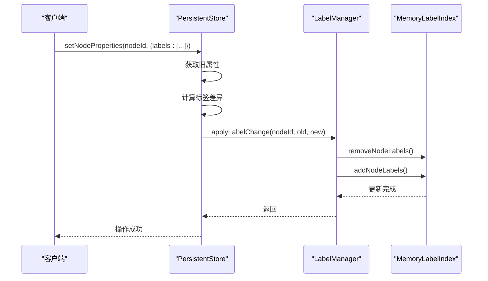

# 标签系统

<cite>
**本文档中引用的文件**
- [labels.ts](file://src/graph/labels.ts)
- [persistentStore.ts](file://src/storage/persistentStore.ts)
</cite>

## 目录
1. [简介](#简介)
2. [核心组件](#核心组件)
3. [标签管理机制](#标签管理机制)
4. [标签查询执行流程](#标签查询执行流程)
5. [生命周期与持久化集成](#生命周期与持久化集成)
6. [实践指南](#实践指南)
7. [限制与替代方案](#限制与替代方案)

## 简介
SynapseDB 的标签系统提供了一种基于属性的节点分类机制，支持高效的多标签管理和查询。该系统通过内存索引实现快速访问，并与属性系统深度集成，能够在设置特定属性时自动触发标签归类。本文档详细说明了标签系统的内部工作原理、API 使用方式以及最佳实践。

## 核心组件

标签系统主要由两个核心类构成：`MemoryLabelIndex` 和 `LabelManager`。前者负责维护内存中的标签到节点和节点到标签的双向映射关系，后者则作为外部接口，协调索引重建、变更应用及未来的持久化操作。

**Section sources**
- [labels.ts](file://src/graph/labels.ts#L42-L247)
- [labels.ts](file://src/graph/labels.ts#L252-L318)

## 标签管理机制

### 内存标签索引（MemoryLabelIndex）
`MemoryLabelIndex` 类实现了标签数据的核心存储结构：
- 使用 `Map<string, Set<number>>` 维护 **标签 → 节点ID集合** 的映射
- 使用 `Map<number, Set<string>>` 维护 **节点ID → 标签集合** 的映射
- 支持添加、移除、替换标签等基本操作，并自动处理去重和排序

当节点的 `labels` 属性被设置为字符串数组时，系统会自动将这些值注册为其标签。例如，执行 `setNodeProperties(nodeId, { labels: ['Person', 'Employee'] })` 会使得该节点同时拥有 `Person` 和 `Employee` 两个标签。



**Diagram sources**
- [labels.ts](file://src/graph/labels.ts#L42-L247)

### 隐式标签创建
标签的创建是隐式的，完全依赖于节点的 `labels` 属性。只要该属性存在且为字符串数组，其元素就会被视为标签。这种设计实现了与属性系统的无缝集成，无需额外的 API 调用即可完成标签分配。

## 标签查询执行流程

### 查询接口
通过 `find().label('LabelName')` 形式的链式调用发起标签查询。底层实际调用了 `MemoryLabelIndex` 的 `findNodesByLabel` 或 `findNodesByLabels` 方法。

### 执行步骤
1. **解析标签条件**：提取查询中指定的一个或多个标签名称。
2. **模式判断**：根据选项确定使用交集（AND）还是并集（OR）模式进行匹配。
3. **索引查找**：
   - 对于单个标签，直接从 `labelToNodes` 映射中获取对应的节点 ID 集合。
   - 对于多个标签，在 AND 模式下对各标签的结果集求交集；在 OR 模式下求并集。
4. **结果过滤**：应用 `limit` 限制返回结果数量。
5. **返回结果**：输出符合条件的节点 ID 集合。



**Diagram sources**
- [labels.ts](file://src/graph/labels.ts#L100-L150)

**Section sources**
- [labels.ts](file://src/graph/labels.ts#L100-L150)

## 生命周期与持久化集成

### PersistentStore 中的标签管理器
在数据库启动时，`PersistentStore` 实例化 `LabelManager` 并将其挂载为私有成员：

```typescript
store.labelManager = new LabelManager(indexDirectory);
```

### 索引重建
在数据库打开过程中，系统会从持久化的节点属性中重建标签索引：

```typescript
await this.labelManager.rebuildFromNodeProperties(nodeProperties);
```

此过程遍历所有节点的 `labels` 属性，并调用 `MemoryLabelIndex.addNodeLabels` 建立初始索引。

### 动态更新
每当节点属性发生变化时，`PersistentStore.updateNodeLabelIndex` 方法会被调用，比较新旧 `labels` 属性的差异，并仅将变化部分提交给 `LabelManager.applyLabelChange` 进行增量更新。



**Diagram sources**
- [persistentStore.ts](file://src/storage/persistentStore.ts#L1556-L1572)
- [labels.ts](file://src/graph/labels.ts#L290-L310)

**Section sources**
- [persistentStore.ts](file://src/storage/persistentStore.ts#L1520-L1530)
- [persistentStore.ts](file://src/storage/persistentStore.ts#L1556-L1572)

## 实践指南

### 标签命名规范
- 使用 PascalCase 或 snake_case 保持一致性
- 避免特殊字符，建议仅使用字母、数字和下划线
- 标签名应具有语义清晰性，如 `User`, `Product`, `ActiveCustomer`

### 多标签组合查询
支持通过 `find().labels(['A', 'B'], { mode: 'AND' })` 实现复杂筛选：
- `mode: 'AND'`：返回同时具有 A 和 B 标签的节点
- `mode: 'OR'`：返回具有 A 或 B 标签的任一节点
- 可结合 `limit` 参数控制返回数量

### 性能影响评估
- **优点**：标签查询时间复杂度接近 O(1)，适合高频查询场景
- **缺点**：每个标签变更都会触发索引更新，频繁修改可能导致性能下降
- **建议**：对于静态分类使用标签，动态状态建议使用普通属性

## 限制与替代方案

### 当前实现限制
- **不支持显式删除标签**：无法单独调用“删除标签”操作，只能通过修改 `labels` 属性间接实现。
- **无持久化支持**：目前 `LabelManager.flush()` 和 `load()` 方法为空实现，重启后需重新构建索引。
- **内存占用**：所有标签索引驻留在内存中，大规模图谱可能消耗较多 RAM。

### 替代方案
针对上述限制，可采取以下策略：
- **标签删除**：读取当前 `labels` 数组，过滤掉目标标签后重新设置。
- **索引加速恢复**：确保 `labels` 属性已正确写入，利用 `rebuildFromNodeProperties` 快速重建。
- **监控内存使用**：定期调用 `getStats()` 获取标签统计信息，评估资源消耗。

**Section sources**
- [labels.ts](file://src/graph/labels.ts#L300-L318)
- [labels.ts](file://src/graph/labels.ts#L200-L210)