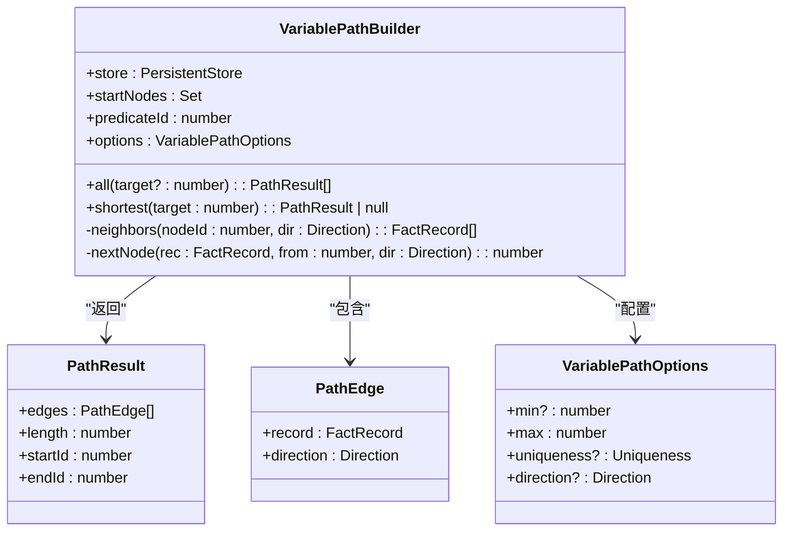
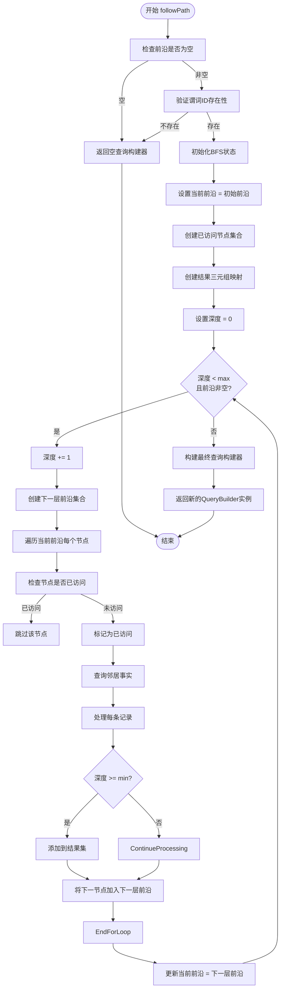

# BFS变长路径遍历

<cite>
**本文档引用文件**  
- [variable.ts](file://src/query/path/variable.ts)
- [queryBuilder.ts](file://src/query/queryBuilder.ts)
</cite>

## 目录
1. [引言](#引言)
2. [核心组件分析](#核心组件分析)
3. [VariablePathBuilder实现机制](#variablepathbuilder实现机制)
4. [QueryBuilder.followPath优化策略](#querybuilderfollowpath优化策略)
5. [使用示例与行为影响](#使用示例与行为影响)
6. [性能最佳实践](#性能最佳实践)

## 引言
本文深入解析基于广度优先搜索（BFS）的变长路径查找实现机制，重点阐述`VariablePathBuilder`类中`all()`和`shortest()`方法如何通过分层扩展、前沿集合管理与访问去重策略实现[min..max]跳数范围内的路径发现。详细说明`followPath`在`QueryBuilder`中的优化实现，包括按层推进逻辑、visited节点集合控制、结果三元组收集时机以及深度限制处理。

**Section sources**
- [variable.ts](file://src/query/path/variable.ts#L24-L109)
- [queryBuilder.ts](file://src/query/queryBuilder.ts#L707-L775)

## 核心组件分析

### VariablePathBuilder 类结构


**Diagram sources**
- [variable.ts](file://src/query/path/variable.ts#L5-L10)
- [variable.ts](file://src/query/path/variable.ts#L12-L22)

### QueryBuilder.followPath 方法流程


**Diagram sources**
- [queryBuilder.ts](file://src/query/queryBuilder.ts#L707-L775)

## VariablePathBuilder实现机制

### all() 方法执行流程
`all()`方法采用广度优先搜索策略，在指定的最小和最大跳数范围内发现所有符合条件的路径。其核心机制包括：

1. **队列驱动的BFS遍历**：使用FIFO队列管理待探索的路径状态
2. **分层扩展控制**：通过`depth`变量精确控制搜索层级
3. **访问去重策略**：根据`uniqueness`选项维护节点或边的访问状态
4. **路径结果收集**：当达到最小跳数要求时开始收集有效路径

该方法支持目标节点过滤，可选择性地只返回到达特定目标节点的路径。

**Section sources**
- [variable.ts](file://src/query/path/variable.ts#L50-L108)

### shortest() 方法实现
`shortest()`方法依赖于`all()`方法的结果，通过以下步骤找到最短路径：
1. 调用`all(target)`获取所有可达路径
2. 若无结果则返回null
3. 按路径长度升序排序
4. 返回第一条（最短）路径

此实现确保了在存在多条路径时能够准确返回跳数最少的一条。

**Section sources**
- [variable.ts](file://src/query/path/variable.ts#L109-L114)

## QueryBuilder.followPath优化策略

### 分层推进逻辑
`followPath`方法实现了优化的BFS遍历，其关键特征包括：

- **按层扩展**：每次循环处理完整的一层节点，避免重复探索
- **前沿集合管理**：使用`currentFrontier`和`nextFrontier`两个集合交替推进
- **单次访问保证**：通过`visited`集合防止对同一节点的重复扩展，有效避免指数级爆炸

### 访问控制与结果收集
- **节点级去重**：`visited`集合确保每个节点在整个搜索过程中仅被处理一次
- **延迟结果收集**：只有当当前深度达到`min`值时才开始收集"最后一跳"的边
- **深度限制处理**：严格遵守`max`深度限制，超过后立即终止搜索

这种设计在保证正确性的同时显著提升了性能，特别适合大规模图数据的遍历场景。

**Section sources**
- [queryBuilder.ts](file://src/query/queryBuilder.ts#L707-L775)

## 使用示例与行为影响

### 多跳关系挖掘示例
```typescript
// 查找从Alice出发，经过1-3跳"knows"关系的所有路径
const paths = db.find({ subject: 'Alice' })
  .followPath('knows', { min: 1, max: 3 });

// 进一步筛选结果
paths.where((fact) => fact.object.startsWith('C'));
```

### 方向性约束影响
- **forward（正向）**：从主体到客体的方向遍历
- **reverse（反向）**：从客体到主体的方向遍历

方向性设置直接影响路径扩展的方向和结果集构成。

### 唯一性约束行为
- **NODE**：确保路径中不包含重复节点（默认）
- **EDGE**：确保路径中不包含重复边
- **NONE**：允许节点和边的重复访问

不同唯一性约束会影响路径的连通性和搜索空间大小。

**Section sources**
- [variable.ts](file://src/query/path/variable.ts#L5-L10)
- [queryBuilder.ts](file://src/query/queryBuilder.ts#L707-L775)

## 性能最佳实践

### 避免性能爆炸建议
1. **合理设置深度范围**：避免过大的`max`值导致搜索空间指数增长
2. **利用节点去重**：保持默认的`NODE`唯一性约束以减少冗余计算
3. **前置过滤条件**：在`followPath`前使用`where`等方法缩小初始前沿
4. **适时终止搜索**：当找到足够结果时及时中断后续处理

### 推荐配置模式
- 对于局部邻域分析：`{ min: 1, max: 2 }`
- 对于中程关系发现：`{ min: 1, max: 3 }`
- 对于全局连通性检测：配合其他过滤条件使用适当较大的`max`值

这些实践有助于在查询效率和结果完整性之间取得平衡。

**Section sources**
