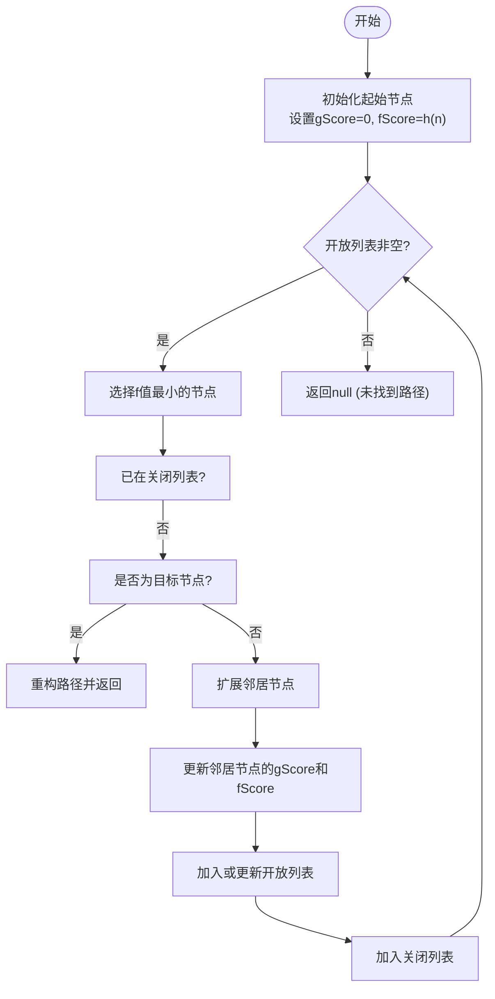
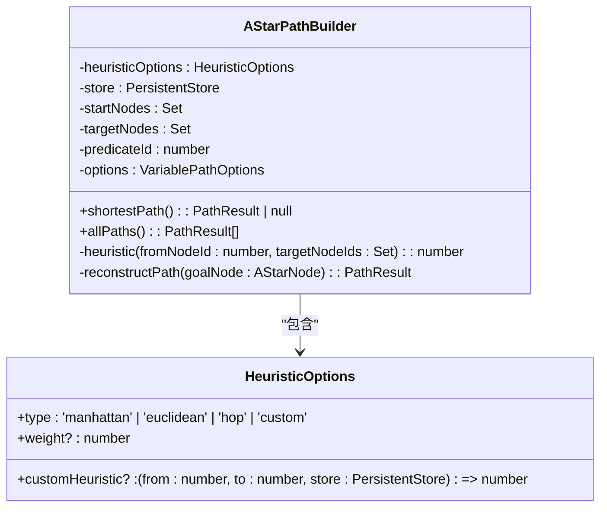
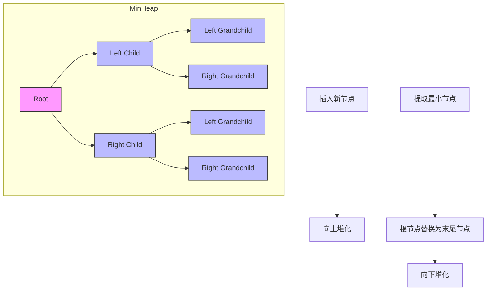
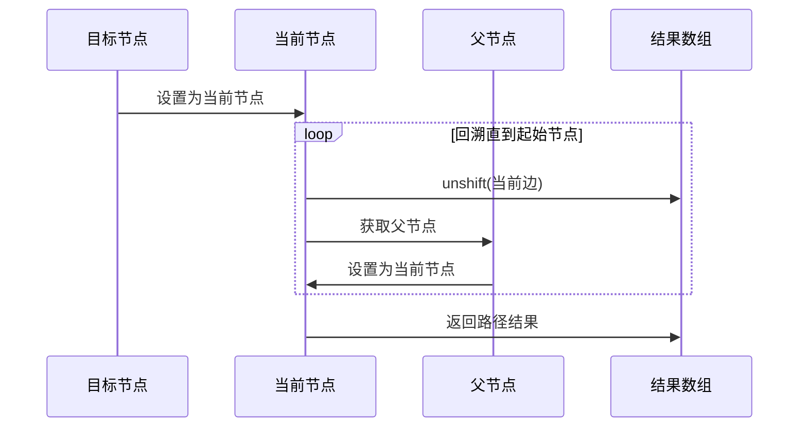

# 加权路径与A*算法

<cite>
**本文档引用文件**
- [astar.ts](file://src/query/path/astar.ts)
- [minHeap.ts](file://src/utils/minHeap.ts)
- [astar_path.test.ts](file://tests/integration/query/path/astar_path.test.ts)
</cite>

## 目录
1. [引言](#引言)
2. [核心组件分析](#核心组件分析)
3. [AStarPathBuilder实现原理](#astarpathbuilder实现原理)
4. [启发式函数设计](#启发式函数设计)
5. [优先队列与MinHeap使用](#优先队列与minheap使用)
6. [路径重建机制](#路径重建机制)
7. [性能对比与优化建议](#性能对比与优化建议)
8. [测试验证与正确性保证](#测试验证与正确性保证)
9. [总结](#总结)

## 引言
A*启发式搜索算法是一种在加权图中寻找最短路径的高效算法，结合了Dijkstra算法的准确性和贪心最佳优先搜索的效率。本系统通过`AStarPathBuilder`类实现了该算法，并利用启发式函数h(n)来估算从当前节点到目标节点的距离，从而指导搜索方向，提高搜索效率。

## 核心组件分析
系统中的A*算法主要由以下几个核心组件构成：`AStarPathBuilder`负责整体路径搜索流程；`HeuristicOptions`定义了启发式函数的类型和参数；`AStarNode`表示搜索过程中的节点状态；以及用于优化性能的`MinHeap`最小堆结构。

**Section sources**
- [astar.ts](file://src/query/path/astar.ts#L26-L33)
- [minHeap.ts](file://src/utils/minHeap.ts#L4-L113)

## AStarPathBuilder实现原理
`AStarPathBuilder`是A*算法的核心实现类，它接收存储实例、起始节点集、目标节点集、谓词ID及路径选项等参数进行初始化。其`shortestPath()`方法采用开放列表（openSet）和关闭列表（closedSet）管理待探索和已探索的节点。

算法以f(n)=g(n)+h(n)作为评估函数，其中g(n)是从起点到当前节点的实际代价，h(n)是启发式估计值。每次迭代选择f值最小的节点展开邻居节点，并更新它们的gScore和fScore。当找到目标节点且满足最小路径长度要求时，调用`reconstructPath()`重构完整路径。

**Diagram sources**
- [astar.ts](file://src/query/path/astar.ts#L148-L258)

**Section sources**
- [astar.ts](file://src/query/path/astar.ts#L35-L268)

## 启发式函数设计
启发式函数的设计对A*算法的性能至关重要。系统支持多种启发式函数类型：

- **hop**: 跳数启发式，相同节点为0，否则为1
- **manhattan**: 曼哈顿距离，基于节点ID差值的简化版本
- **euclidean**: 欧几里得距离，同样基于节点ID的简化计算
- **custom**: 自定义启发式函数

此外，还提供了`createGraphDistanceHeuristic`函数，基于图的连接性通过BFS采样估算距离。启发式权重因子可调节h(n)的影响程度，低权重更接近Dijkstra算法，高权重则更具贪心特性。

**Diagram sources**
- [astar.ts](file://src/query/path/astar.ts#L26-L33)
- [astar.ts](file://src/query/path/astar.ts#L35-L268)

**Section sources**
- [astar.ts](file://src/query/path/astar.ts#L79-L146)

## 优先队列与MinHeap使用
虽然当前实现使用数组排序方式维护开放列表，但系统提供了`MinHeap`类可用于优化优先级队列操作。`MinHeap`实现了标准的最小堆数据结构，支持O(log n)时间复杂度的插入和删除操作。

若将`MinHeap`应用于A*算法，可显著提升大规模图搜索的性能。每个堆元素为`AStarNode`，比较依据为fScore值。这避免了每次迭代都需要对整个开放列表进行排序的操作，特别是在节点数量较多的情况下优势明显。

**Diagram sources**
- [minHeap.ts](file://src/utils/minHeap.ts#L4-L113)

**Section sources**
- [minHeap.ts](file://src/utils/minHeap.ts#L4-L113)

## 路径重建机制
路径重建通过回溯父节点链完成。`reconstructPath()`方法从目标节点开始，沿着parent指针逐级向上追溯，同时收集每条边的信息。由于需要按顺序返回路径，使用unshift()方法将边逆序添加到结果数组中。

该机制确保了路径的连续性和正确性，最终返回包含所有边、路径长度、起始和结束节点ID的`PathResult`对象。对于零长度路径（起始即目标），直接返回空边数组和相应节点ID。

**Diagram sources**
- [astar.ts](file://src/query/path/astar.ts#L259-L267)

**Section sources**
- [astar.ts](file://src/query/path/astar.ts#L259-L267)

## 性能对比与优化建议
相较于BFS，在带权边场景下A*算法具有明显优势。测试表明，A*能够更快地收敛到最优解，尤其在复杂图结构中表现突出。通过合理设计启发式函数，可以大幅减少搜索空间。

性能调优建议：
1. 使用`MinHeap`替代数组排序以优化开放列表操作
2. 设计更精确的启发式函数（如地理空间坐标计算）
3. 调整启发式权重平衡探索与利用
4. 对于静态图可预计算部分启发式信息

当启发函数失效（如过度低估或高估）时，可能导致搜索效率下降甚至无法找到最优解。此时应检查启发式函数的可采纳性（admissibility），确保h(n)≤实际代价。

**Section sources**
- [astar_path.test.ts](file://tests/integration/query/path/astar_path.test.ts#L347-L389)

## 测试验证与正确性保证
系统通过全面的单元测试验证A*算法的正确性。测试用例覆盖基础功能、不同启发式函数、算法正确性对比、性能基准等多个方面。

关键测试包括：
- 验证能否找到最短路径
- 处理零长度路径和无路径情况
- 不同启发式函数的有效性
- 与单向BFS和双向BFS的结果一致性对比
- 性能基准测试

这些测试确保了算法在各种边界条件下的稳定性和可靠性。

**Section sources**
- [astar_path.test.ts](file://tests/integration/query/path/astar_path.test.ts#L0-L510)

## 总结
A*算法通过结合实际代价g(n)和启发式估计h(n)，实现了高效的加权图路径搜索。系统实现充分考虑了灵活性和可扩展性，支持多种启发式函数类型和自定义配置。尽管当前优先队列实现有优化空间，但整体架构清晰，易于维护和改进。未来可通过引入更高效的优先队列结构进一步提升性能。