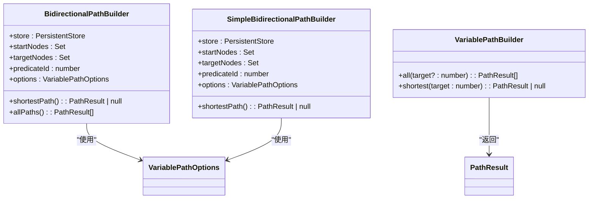
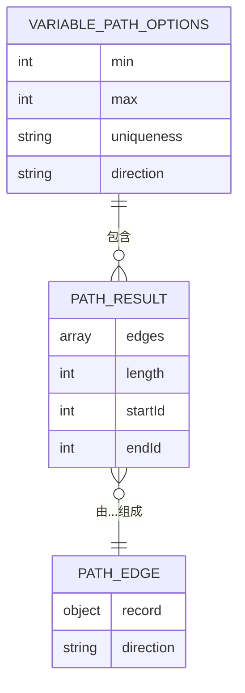
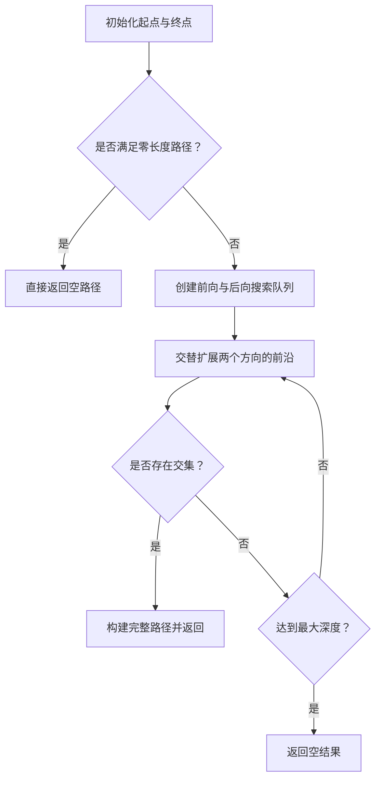
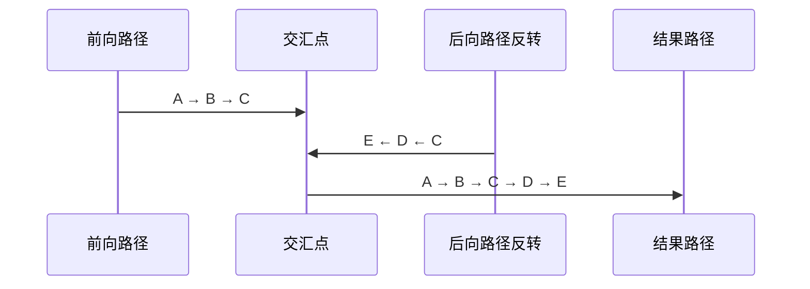

# 双向最短路径搜索

<cite>
**本文档引用的文件**  
- [bidirectional.ts](file://src/query/path/bidirectional.ts)
- [bidirectionalSimple.ts](file://src/query/path/bidirectionalSimple.ts)
- [variable.ts](file://src/query/path/variable.ts)
- [bidirectional_path.test.ts](file://tests/integration/query/path/bidirectional_path.test.ts)
- [astar_path.test.ts](file://tests/integration/query/path/astar_path.test.ts)
</cite>

## 目录
1. [引言](#引言)  
2. [核心组件分析](#核心组件分析)  
3. [双向BFS算法机制详解](#双向bfs算法机制详解)  
4. [性能对比与适用场景](#性能对比与适用场景)  
5. [调试技巧与典型失败模式](#调试技巧与典型失败模式)  
6. [结论](#结论)

## 引言
在图数据库中，最短路径查询是常见且关键的操作。传统的单向广度优先搜索（BFS）虽然直观有效，但在稀疏图或深度较大的情况下可能面临指数级的时间复杂度增长。为解决这一问题，本项目实现了**双向BFS算法**，通过从起点和终点同时展开搜索，显著减少搜索空间和执行时间。

本文将深入分析 `BidirectionalPathBuilder` 类如何实现高效的双向搜索策略，探讨其前向与后向前沿集合的交替扩展机制、相遇条件判断逻辑及路径拼接规则，并结合测试用例说明其在实际应用中的优势与边界。

**Section sources**  
- [bidirectional.ts](file://src/query/path/bidirectional.ts#L1-L302)  
- [bidirectionalSimple.ts](file://src/query/path/bidirectionalSimple.ts#L1-L150)

## 核心组件分析

### BidirectionalPathBuilder 类结构
该类封装了完整的双向BFS最短路径查找逻辑，支持可配置的最小/最大跳数限制、节点/边唯一性约束以及方向控制。



**Diagram sources**  
- [bidirectional.ts](file://src/query/path/bidirectional.ts#L61-L300)  
- [bidirectionalSimple.ts](file://src/query/path/bidirectionalSimple.ts#L36-L148)  
- [variable.ts](file://src/query/path/variable.ts#L24-L109)

### 关键数据结构定义
路径搜索涉及多个核心接口，用于描述路径选项、边信息和结果格式。



**Diagram sources**  
- [variable.ts](file://src/query/path/variable.ts#L5-L22)

## 双向BFS算法机制详解

### 搜索流程概览
双向BFS的核心思想是从源点和目标点**同时启动两个独立的BFS过程**，分别维护各自的访问状态和搜索队列。当两个搜索前沿在中间某节点相遇时，即可合并路径得到最终解。



**Diagram sources**  
- [bidirectional.ts](file://src/query/path/bidirectional.ts#L61-L146)

### 前沿集合的交替扩展机制
算法采用双队列结构，在每一层迭代中分别处理前向和后向的当前层级节点：

1. **初始化阶段**：将所有起始节点加入前向队列，所有目标节点加入后向队列。
2. **逐层扩展**：每轮循环中，先扩展前向队列中当前深度的所有节点，再扩展后向队列中对应深度的节点。
3. **状态更新**：每个新访问的节点及其路径信息被记录在 `forwardVisited` 和 `backwardVisited` 映射表中，便于后续交叉检查。

此机制确保了搜索过程始终保持对称性，避免一方过度扩展导致效率下降。

**Section sources**  
- [bidirectional.ts](file://src/query/path/bidirectional.ts#L117-L146)

### 相遇条件判断逻辑
相遇检测发生在每次前沿扩展之后，通过遍历前向已访问节点映射，检查其是否也存在于后向访问记录中：

```typescript
private findIntersection(
  forwardVisited: Map<number, BidirectionalState>,
  backwardVisited: Map<number, BidirectionalState>,
  minLength: number,
): IntersectionPoint | null {
  for (const [nodeId, forwardState] of forwardVisited.entries()) {
    const backwardState = backwardVisited.get(nodeId);
    if (backwardState) {
      const totalLength = forwardState.depth + backwardState.depth;
      if (totalLength >= minLength) {
        return { forwardState, backwardState, meetingNode: nodeId };
      }
    }
  }
  return null;
}
```

只有当交汇点形成的总路径长度不小于用户指定的最小跳数时，才视为有效解。

**Section sources**  
- [bidirectional.ts](file://src/query/path/bidirectional.ts#L206-L226)

### 路径拼接规则
一旦发现交汇点，需将两条子路径正确拼接成完整路径：

1. **前向路径**：保持原有顺序输出。
2. **后向路径**：由于是从目标反向搜索而来，必须进行**边方向反转**并逆序排列。
3. **去重处理**：交汇节点仅保留一次。



**Diagram sources**  
- [bidirectional.ts](file://src/query/path/bidirectional.ts#L228-L258)

## 性能对比与适用场景

### 时间复杂度优化分析
传统单向BFS的时间复杂度为 $O(b^d)$，其中 $b$ 是分支因子，$d$ 是路径深度。而双向BFS将其降低至 $O(b^{d/2})$，因为两个搜索过程只需各自行进一半距离即可相遇。

例如，在一个平均出度为3、最短路径长度为6的图中：
- 单向搜索最多需探索 $3^6 = 729$ 个节点；
- 双向搜索每侧最多探索 $3^3 = 27$ 个节点，合计约54次操作，效率提升超过13倍。

### 内存开销与权衡
尽管时间效率大幅提升，但双向BFS需要维护两套独立的状态映射（`forwardVisited`, `backwardVisited`），内存占用约为单向BFS的两倍。此外，还需额外存储路径历史以支持拼接。

因此，在以下场景推荐使用双向搜索：
- ✅ 点到点最短路径查询（尤其是长路径）
- ✅ 图结构较稀疏或深度较大
- ❌ 多目标路径枚举（此时单向BFS更优）
- ❌ 极小图或最大跳数≤1的情况（直接查邻接关系即可）

**Section sources**  
- [bidirectional.ts](file://src/query/path/bidirectional.ts#L1-L302)  
- [bidirectional_path.test.ts](file://tests/integration/query/path/bidirectional_path.test.ts#L223-L258)

## 调试技巧与典型失败模式

### 如何验证路径正确性
可通过集成测试断言路径长度一致性来验证算法正确性：

```ts
// 测试双向BFS与单向BFS结果一致
const bidirectionalPath = bidirectional.shortestPath();
const unidirectionalPath = unidirectional.shortest(targetId);
expect(bidirectionalPath!.length).toBe(unidirectionalPath!.length);
```

同时应检查路径中无重复节点（根据唯一性设置）。

**Section sources**  
- [bidirectional_path.test.ts](file://tests/integration/query/path/bidirectional_path.test.ts#L134-L178)

### 典型失败模式分析
| 失败模式 | 原因 | 解决方案 |
|--------|------|---------|
| 返回空路径 | 未满足最小跳数要求 | 检查 `min` 参数设置 |
| 性能退化 | 图过小或路径极短 | 对 max=1 场景启用直连检测优化 |
| 内存溢出 | 搜索深度过大 | 设置合理 `max` 上限 |
| 方向错误 | 边方向未正确反转 | 确保 `reverseDirection()` 正确调用 |

建议在生产环境中结合日志监控和性能采样工具定位异常。

**Section sources**  
- [bidirectionalSimple.ts](file://src/query/path/bidirectionalSimple.ts#L65-L148)  
- [bidirectional_path.test.ts](file://tests/integration/query/path/bidirectional_path.test.ts#L250-L258)

## 结论
双向BFS是一种高效求解点到点最短路径的算法策略，特别适用于深度较大、结构稀疏的图数据场景。`BidirectionalPathBuilder` 的实现充分考虑了实际工程需求，包括灵活的路径约束、正确的方向处理和高效的交汇检测机制。

对于大多数最短路径查询任务，尤其是在已知目标节点的情况下，应优先选择双向搜索策略以获得显著的性能提升。未来可进一步引入启发式函数（如A*）与双向框架结合，实现更智能的路径规划。