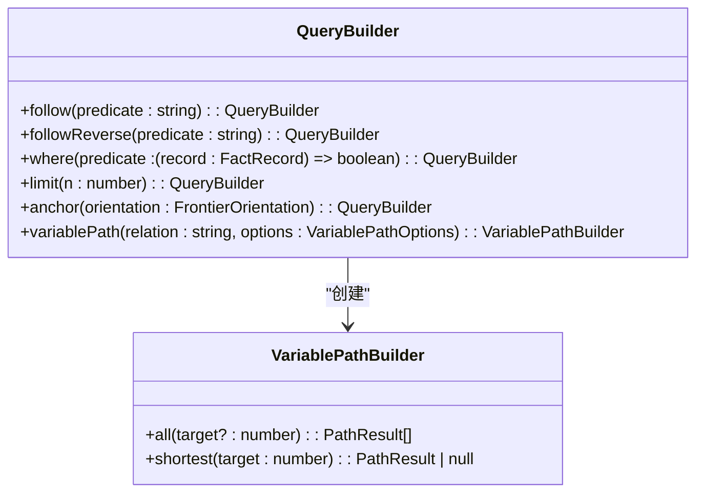
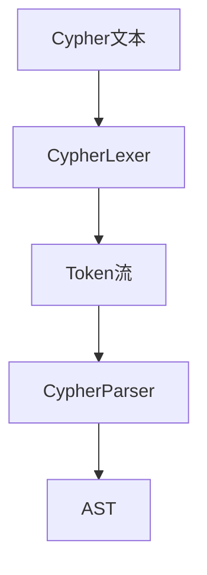
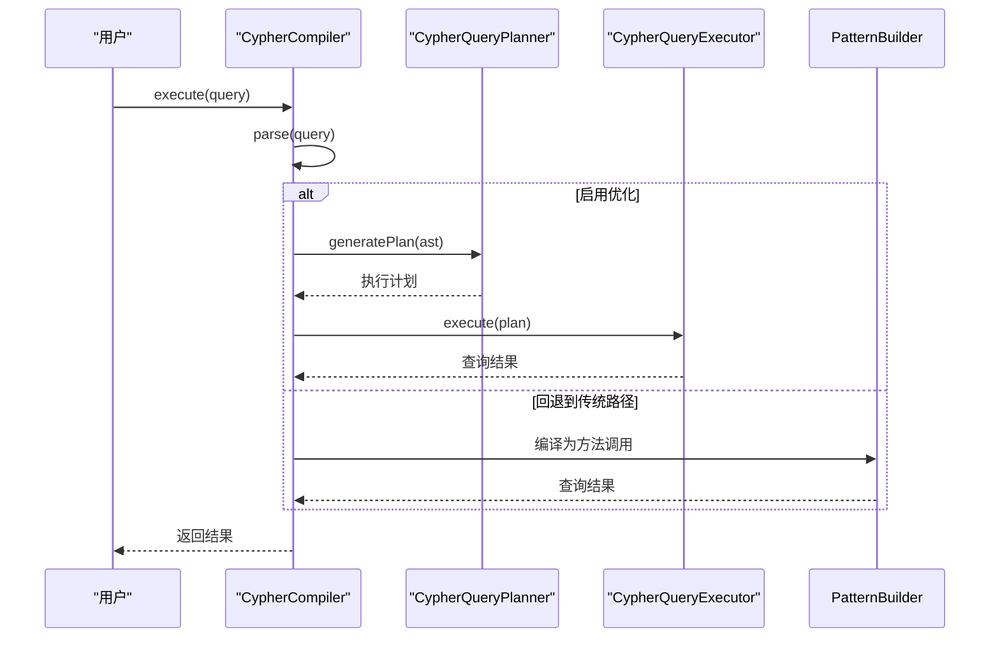
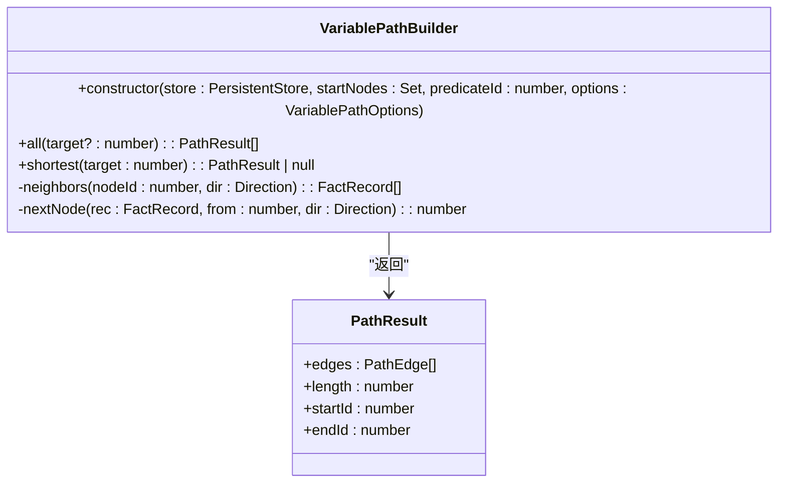
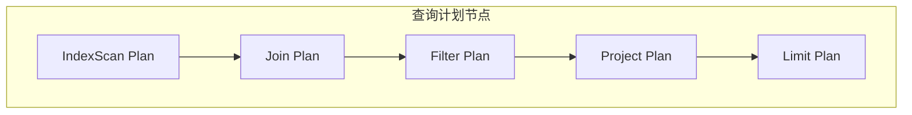

# 查询范式

<cite>
**本文档引用的文件**
- [queryBuilder.ts](file://src/query/queryBuilder.ts)
- [persistentStore.ts](file://src/storage/persistentStore.ts)
- [variable.ts](file://src/query/path/variable.ts)
- [compiler.ts](file://src/query/pattern/compiler.ts)
- [parser.ts](file://src/query/pattern/parser.ts)
- [planner.ts](file://src/query/pattern/planner.ts)
- [executor.ts](file://src/query/pattern/executor.ts)
- [hotness.ts](file://src/storage/hotness.ts)
</cite>

## 目录
1. [引言](#引言)
2. [链式查询API设计哲学](#链式查询api设计哲学)
3. [模式匹配查询执行流程](#模式匹配查询执行流程)
4. [变量长度路径查找实现](#变量长度路径查找实现)
5. [查询编译与优化机制](#查询编译与优化机制)
6. [数据流转与存储访问](#数据流转与存储访问)
7. [热度统计与访问优化](#热度统计与访问优化)
8. [性能调优建议](#性能调优建议)
9. [结论](#结论)

## 引言

SynapseDB提供了一套完整的查询范式，支持多种查询方式及其内部执行机制。本文档系统化介绍SynapseDB的查询能力，重点讲解链式查询API（QueryBuilder）的设计哲学、模式匹配查询的词法分析与语法解析过程、变量长度路径查找的实现策略，以及查询过程中如何利用热度统计进行访问优化。

SynapseDB的查询系统分为两个主要部分：编程式的链式查询API和声明式的模式匹配查询。链式查询API提供了直观的方法链调用方式，而模式匹配查询则支持类似Cypher的文本查询语法。两者在底层共享相同的执行引擎和优化机制，确保了查询性能的一致性。

**Section sources**
- [queryBuilder.ts](file://src/query/queryBuilder.ts#L38-L812)
- [compiler.ts](file://src/query/pattern/compiler.ts#L0-L785)

## 链式查询API设计哲学

SynapseDB的链式查询API基于`QueryBuilder`类实现，采用流畅接口（Fluent Interface）设计模式，允许通过方法链的方式构建复杂查询。这种设计使得查询构建过程更加直观和可读。

### 操作符组合逻辑

`QueryBuilder`的核心设计理念是将每个查询操作视为一个转换函数，接收当前查询状态并返回新的查询状态。这种不可变的设计确保了查询构建过程的线程安全性和可预测性。

**Diagram sources**
- [queryBuilder.ts](file://src/query/queryBuilder.ts#L38-L812)
- [variable.ts](file://src/query/path/variable.ts#L24-L109)

#### 联想查询操作符

`follow`和`followReverse`是核心的联想查询操作符，用于实现图遍历功能：

- `follow(predicate)`：正向遍历，从主体节点到客体节点
- `followReverse(predicate)`：反向遍历，从客体节点到主体节点

这两个操作符都基于私有的`traverse`方法实现，通过谓词ID在存储层进行高效查询。

#### 过滤与限制操作符

`where`和`limit`操作符用于过滤和限制查询结果：

- `where(predicate)`：基于自定义谓词函数过滤结果集
- `limit(n)`：限制返回结果的数量

这些操作符在执行时会重建前沿集合（frontier），为后续的遍历操作提供新的起点。

#### 锚点操作符

`anchor(orientation)`操作符用于重新定义查询的前沿方向，支持`subject`、`object`或`both`三种模式。这对于复杂的多跳查询非常有用，可以精确控制遍历的方向。

**Section sources**
- [queryBuilder.ts](file://src/query/queryBuilder.ts#L38-L812)

## 模式匹配查询执行流程

SynapseDB的模式匹配查询支持类似Cypher的文本查询语法，通过一套完整的编译执行流程将其转换为高效的查询计划。

### 词法分析与语法解析

模式匹配查询的执行始于词法分析和语法解析阶段。`CypherLexer`负责将输入的Cypher文本分解为标记流，`CypherParser`则将标记流解析为抽象语法树（AST）。

**Diagram sources**
- [lexer.ts](file://src/query/pattern/lexer.ts#L0-L541)
- [parser.ts](file://src/query/pattern/parser.ts#L0-L799)

### 执行计划生成

解析得到的AST被传递给`CypherCompiler`，由其生成可执行的查询计划。编译器支持两种执行路径：

1. **传统路径**：直接映射到`PatternBuilder`的API调用
2. **优化路径**：通过`CypherQueryPlanner`生成优化的执行计划

**Diagram sources**
- [compiler.ts](file://src/query/pattern/compiler.ts#L0-L785)
- [planner.ts](file://src/query/pattern/planner.ts#L0-L480)
- [executor.ts](file://src/query/pattern/executor.ts#L0-L438)

**Section sources**
- [compiler.ts](file://src/query/pattern/compiler.ts#L0-L785)
- [parser.ts](file://src/query/pattern/parser.ts#L0-L799)

## 变量长度路径查找实现

变量长度路径查找是图数据库的核心功能之一，SynapseDB通过`VariablePathBuilder`类实现了这一功能。

### 实现策略

`VariablePathBuilder`采用广度优先搜索（BFS）算法实现变量长度路径查找，支持最小和最大跳数限制，以及节点或边的唯一性约束。

**Diagram sources**
- [variable.ts](file://src/query/path/variable.ts#L24-L109)

### 算法细节

变量长度路径查找的核心算法如下：

1. 初始化队列，包含所有起始节点
2. 对于每一层扩展：
   - 遍历当前前沿的所有节点
   - 查找满足谓词条件的邻居节点
   - 根据唯一性约束过滤结果
   - 将新节点加入下一层前沿
3. 收集满足跳数范围的结果

该实现通过节点级去重防止爆炸性重复扩展，确保了算法的效率。

**Section sources**
- [variable.ts](file://src/query/path/variable.ts#L24-L109)
- [match.ts](file://src/query/pattern/match.ts#L0-L235)

## 查询编译与优化机制

SynapseDB的查询优化机制基于成本模型，旨在生成最高效的执行计划。

### 查询计划器

`CypherQueryPlanner`是查询优化的核心组件，负责生成基于成本的执行计划。其主要优化策略包括：

- **智能起始点选择**：基于索引统计选择最优的起始节点
- **连接顺序优化**：根据成本模型确定最佳的连接顺序
- **谓词下推**：将过滤条件尽可能提前执行
- **执行计划缓存**：避免重复的计划生成开销

**Diagram sources**
- [planner.ts](file://src/query/pattern/planner.ts#L0-L480)

### 统计信息收集

查询计划器依赖于数据库的统计信息来做出优化决策，包括：

- 总节点数和总关系数
- 标签分布统计
- 关系类型分布
- 属性值的区分度

这些统计信息在查询执行前自动收集，为成本估算提供依据。

**Section sources**
- [planner.ts](file://src/query/pattern/planner.ts#L0-L480)
- [executor.ts](file://src/query/pattern/executor.ts#L0-L438)

## 数据流转与存储访问

查询过程中的数据流转从高层API到底层存储，涉及多个层次的转换和优化。

### 数据流路径

**Diagram sources**
- [queryBuilder.ts](file://src/query/queryBuilder.ts#L38-L812)
- [persistentStore.ts](file://src/storage/persistentStore.ts#L816-L921)

### 存储查询机制

`PersistentStore.query`方法是查询执行的最终落脚点，它结合了内存数据和磁盘索引的优势：

1. **快照查询**：使用纯磁盘查询，避免内存依赖
2. **分页索引**：通过PagedIndexReader高效读取历史数据
3