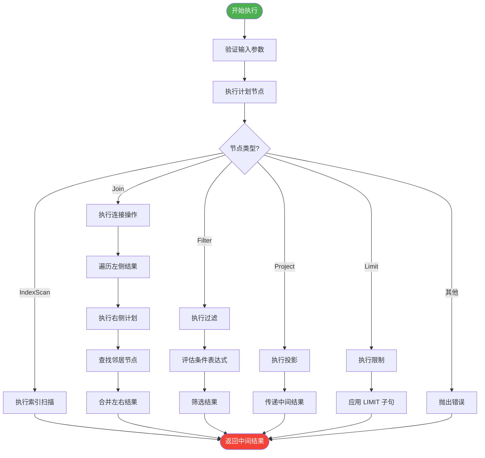
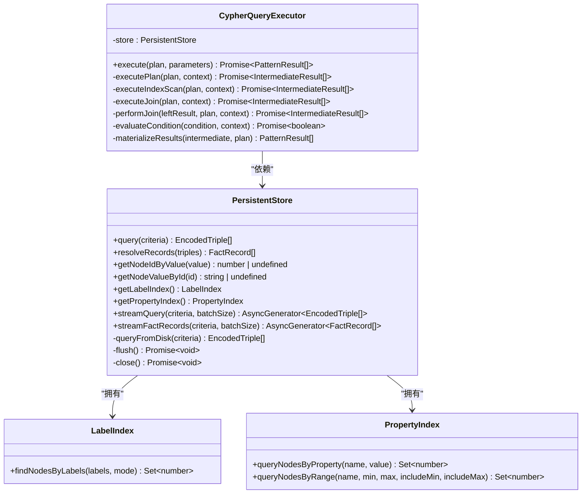

# 执行引擎

<cite>
**本文档引用的文件**
- [executor.ts](file://src/query/pattern/executor.ts)
- [persistentStore.ts](file://src/storage/persistentStore.ts)
- [iterator.ts](file://src/query/iterator.ts)
</cite>

## 目录
1. [简介](#简介)
2. [执行阶段概述](#执行阶段概述)
3. [迭代器模式与遍历机制](#迭代器模式与遍历机制)
4. [PersistentStore 数据访问](#persistentstore-数据访问)
5. [结果集流式处理与内存管理](#结果集流式处理与内存管理)
6. [多跳查询扩展过程](#多跳查询扩展过程)
7. [事务快照一致性保证](#事务快照一致性保证)
8. [性能瓶颈识别与监控](#性能瓶颈识别与监控)

## 简介
本文件全面介绍 SynapseDB 中模式匹配查询的执行阶段，重点阐述 `CypherQueryExecutor` 如何驱动编译后的查询计划在存储引擎上运行。文档详细说明了迭代器模式在节点和关系遍历中的应用、通过 `PersistentStore` 接口访问底层数据的机制、结果集的流式处理策略以及延迟计算特性。同时结合代码逻辑展示了多跳查询的逐层扩展过程，并解释了与事务快照的一致性保障机制。最后讨论了执行过程中的性能瓶颈识别方法，包括慢查询日志和执行统计信息。

## 执行阶段概述
模式匹配查询的执行由 `CypherQueryExecutor` 类驱动，该类接收一个由查询规划器生成的执行计划（`PlanNode`），并递归地执行各个计划节点以生成最终结果。整个执行流程基于算子模型，支持多种操作类型，如索引扫描、连接、过滤、投影和限制等。

执行入口是 `execute` 方法，它接受一个查询计划和参数对象，初始化执行上下文后调用 `executePlan` 进行递归执行。每个计划节点根据其类型分发到相应的执行方法，例如 `IndexScan` 节点调用 `executeIndexScan`，`Join` 节点调用 `executeJoin`，以此类推。这种结构化的执行方式使得查询可以高效地分解为基本操作单元，并逐级组合结果。

最终的结果物化通过 `materializeResults` 完成，将中间结果中绑定的节点 ID 映射回实际的节点值，形成用户可见的输出格式。

**Section sources**
- [executor.ts](file://src/query/pattern/executor.ts#L34-L437)

## 迭代器模式与遍历机制
SynapseDB 在查询执行过程中广泛采用迭代器模式来实现对图数据的高效遍历。虽然核心遍历逻辑主要在 `CypherQueryExecutor` 内部通过递归调用完成，但系统也提供了专门的工具模块 `iterator.ts` 来支持流式迭代的扁平化处理。

`flattenBatches` 函数是一个典型的流式迭代器工具，它可以将来自 `streamFactRecords` 的批量异步迭代器（`AsyncIterable<FactRecord[]>`）转换为逐条记录的异步生成器（`AsyncGenerator<FactRecord>`）。这使得上层应用能够以统一的方式处理大规模数据集，而无需一次性加载所有结果到内存中。

在 `CypherQueryExecutor` 的具体实现中，`performJoin` 方法体现了迭代器的核心思想：对于左侧结果集中的每一条中间结果，都会启动一次对右侧计划的“遍历”过程，查找符合条件的邻居节点，并将其与左侧结果进行连接。这一过程本质上是一种嵌套循环连接（Nested Loop Join），其中外层循环对应左子树结果，内层循环则动态执行右子树计划并产生匹配项。

**Diagram sources**
- [executor.ts](file://src/query/pattern/executor.ts#L34-L437)

**Section sources**
- [executor.ts](file://src/query/pattern/executor.ts#L34-L437)
- [iterator.ts](file://src/query/iterator.ts#L1-L23)

## PersistentStore 数据访问
`PersistentStore` 是 SynapseDB 的核心存储接口，负责管理图数据的持久化和查询。查询执行器通过该接口访问底层数据，包括三元组（subject-predicate-object）、属性、标签和索引。

关键的数据访问方法包括：
- `query(criteria)`：根据给定条件同步查询编码后的三元组数组。该方法会优先使用分页索引（PagedIndexReader）进行高效查找，并合并内存中的增量数据。
- `resolveRecords(triples)`：将编码的三元组列表解析为包含完整属性信息的 `FactRecord` 对象数组。
- `getNodeIdByValue(value)` 和 `getNodeValueById(id)`：用于在字符串值和内部整数 ID 之间进行双向映射。
- `getLabelIndex()` 和 `getPropertyIndex()`：分别获取标签索引和属性索引的内存视图，用于加速基于标签或属性的查询。

当执行索引扫描（`IndexScan`）时，执行器会根据计划中的索引类型（label、property 或 full）调用相应的索引查询方法。例如，在按属性查询时，会调用 `propertyIndex.queryNodesByProperty` 来快速定位满足条件的节点集合。

**Diagram sources**
- [persistentStore.ts](file://src/storage/persistentStore.ts#L61-L1633)
- [executor.ts](file://src/query/pattern/executor.ts#L34-L437)

**Section sources**
- [persistentStore.ts](file://src/storage/persistentStore.ts#L61-L1633)

## 结果集流式处理与内存管理
为了应对大规模图数据查询可能带来的内存压力，SynapseDB 实现了流式处理机制。`PersistentStore` 提供了 `streamQuery` 和 `streamFactRecords` 两个异步生成器方法，允许客户端以分批的方式消费查询结果。

`streamQuery` 按指定批次大小（默认 1000）从分页索引或内存中读取编码的三元组，而 `streamFactRecords` 则在此基础上进一步解析为包含属性的完整记录。这种方式避免了一次性将全部结果加载到内存中，显著降低了内存峰值占用。

此外，系统还采用了延迟计算（Lazy Evaluation）策略。查询计划的执行是惰性的，只有在需要获取结果时才会真正触发数据读取和处理。例如，`executeLimit` 方法直接对子计划的结果数组进行切片操作，而不是逐个生成再计数，从而提高了效率。

内存管理方面，系统通过 `tombstones` 集合跟踪已删除的三元组，并在查询结果中过滤掉这些“墓碑”条目。同时，WAL（Write-Ahead Log）重放机制确保了崩溃恢复后内存状态的一致性。

**Section sources**
- [persistentStore.ts](file://src/storage/persistentStore.ts#L816-L921)
- [persistentStore.ts](file://src/storage/persistentStore.ts#L1107-L1121)
- [iterator.ts](file://src/query/iterator.ts#L1-L23)

## 多跳查询扩展过程
多跳查询的执行通过递归的 `executeJoin` 和 `performJoin` 方法实现。以一个两跳查询为例（如 `(a)-[r1]->(b)-[r2]->(c)`），执行过程如下：

1. 首先执行左侧单跳模式 `(a)-[r1]->(b)`，生成一组中间结果，每个结果包含变量 `a` 和 `b` 绑定的节点 ID。
2. 对于每一个左侧结果，执行器会以该结果的绑定上下文为基础，执行右侧单跳模式 `(b)-[r2]->(c)`。
3. 在 `performJoin` 中，系统根据关系方向和类型构造查询条件（`criteria`），调用 `store.query` 查找所有满足条件的三元组。
4. 对于每一个找到的三元组，提取目标节点 ID（即 `c`），并与右侧计划的执行结果进行匹配和连接。
5. 最终将左侧和右侧的绑定合并，形成包含 `a`、`b`、`c` 三个变量的新中间结果。

这个过程可以自然地扩展到任意深度的多跳查询，每一跳都作为前一跳结果的“延续”被执行，形成了逐层扩展的执行链。

**Section sources**
- [executor.ts](file://src/query/pattern/executor.ts#L34-L437)

## 事务快照一致性保证
`PersistentStore` 通过快照隔离（Snapshot Isolation）机制来保证查询的一致性。当一个查询在事务上下文中执行时，可以通过固定当前