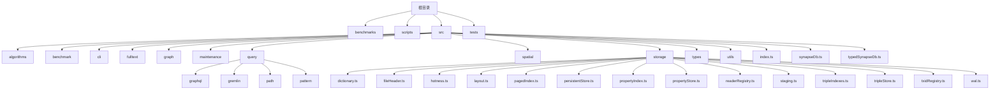
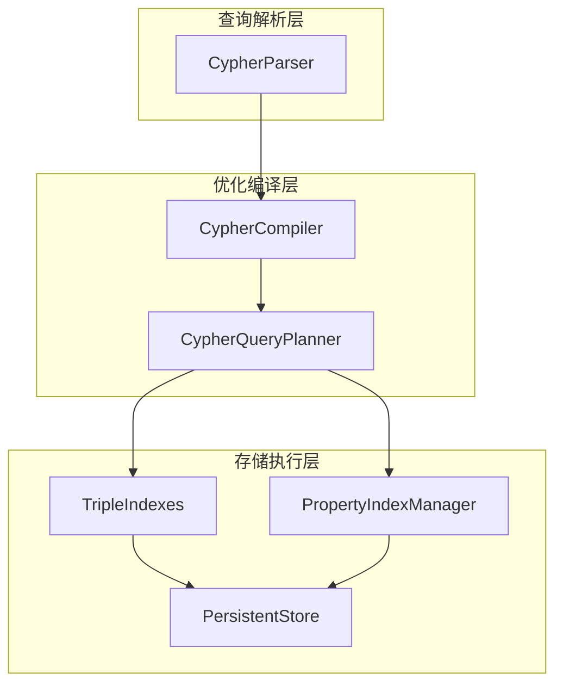
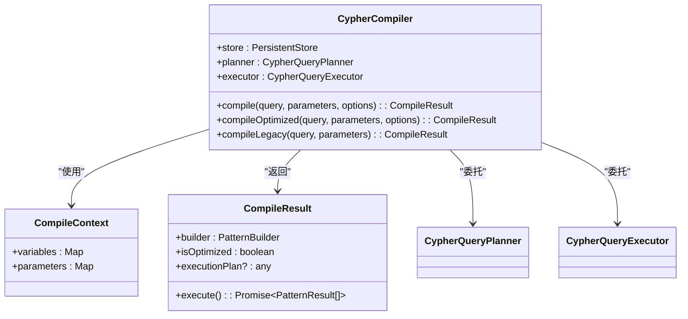
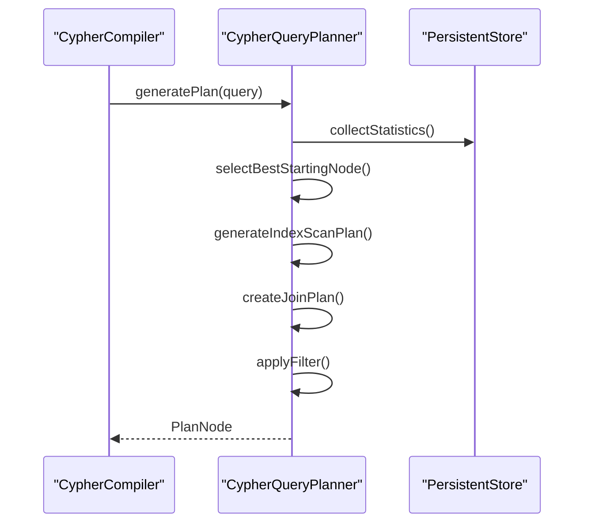
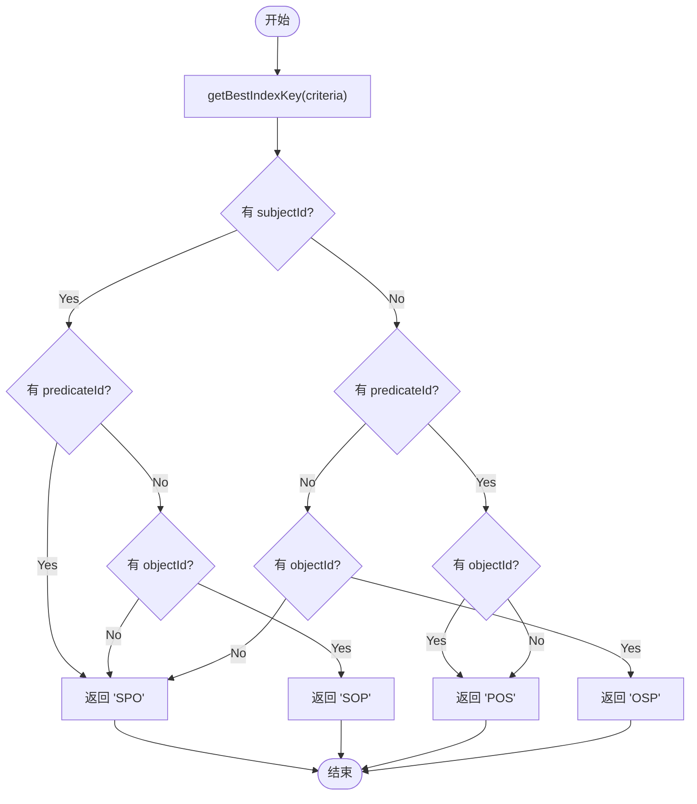
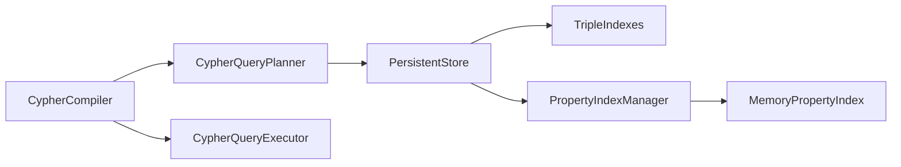

# 执行计划编译器

<cite>
**本文档引用的文件**
- [compiler.ts](file://src/query/pattern/compiler.ts)
- [planner.ts](file://src/query/pattern/planner.ts)
- [tripleIndexes.ts](file://src/storage/tripleIndexes.ts)
- [propertyIndex.ts](file://src/storage/propertyIndex.ts)
</cite>

## 目录
1. [简介](#简介)
2. [项目结构](#项目结构)
3. [核心组件](#核心组件)
4. [架构概述](#架构概述)
5. [详细组件分析](#详细组件分析)
6. [依赖分析](#依赖分析)
7. [性能考虑](#性能考虑)
8. [故障排除指南](#故障排除指南)
9. [结论](#结论)

## 简介
本文档系统化讲解了在编译阶段如何将抽象语法树（AST）转换为可执行的查询计划。重点描述了基于成本的查询优化策略，包括索引选择、访问顺序重排和谓词下推等技术。文档详细说明了 `compiler.ts` 如何与 `planner.ts` 协作生成最优执行路径，并深入探讨了三元组索引（tripleIndexes）和属性索引（propertyIndex）的利用机制。通过具体案例展示了从模式到存储层指令（如 scan、seek）的映射过程，同时讨论了变量作用域管理和中间结果传递机制。此外，还涵盖了编译期错误检测，例如未定义变量引用或类型不匹配等问题。

## 项目结构
本项目的目录结构清晰地划分了不同功能模块，主要包括算法、基准测试、命令行接口、全文检索、图处理、维护工具、查询引擎、空间数据处理以及存储系统等。其中，与执行计划编译相关的核心代码位于 `/src/query/pattern/` 和 `/src/storage/` 目录下。

**图表来源**
- [project_structure](file://project_structure)

**章节来源**
- [src/query/pattern/compiler.ts](file://src/query/pattern/compiler.ts)
- [src/query/pattern/planner.ts](file://src/query/pattern/planner.ts)
- [src/storage/tripleIndexes.ts](file://src/storage/tripleIndexes.ts)
- [src/storage/propertyIndex.ts](file://src/storage/propertyIndex.ts)

## 核心组件
该系统的核心组件包括 Cypher 查询编译器（CypherCompiler）、查询计划器（CypherQueryPlanner）、三元组索引（TripleIndexes）和属性索引（MemoryPropertyIndex）。这些组件协同工作，实现了从高级查询语言到低级存储操作的高效转换。

**章节来源**
- [src/query/pattern/compiler.ts](file://src/query/pattern/compiler.ts#L65-L750)
- [src/query/pattern/planner.ts](file://src/query/pattern/planner.ts#L90-L403)
- [src/storage/tripleIndexes.ts](file://src/storage/tripleIndexes.ts#L1-L363)
- [src/storage/propertyIndex.ts](file://src/storage/propertyIndex.ts#L1-L754)

## 架构概述
整个系统的架构可以分为三层：查询解析层、优化编译层和存储执行层。查询解析层负责将 Cypher 文本转换为 AST；优化编译层则利用 planner 和 compiler 组件进行查询优化并生成执行计划；存储执行层通过 tripleIndexes 和 propertyIndex 实现高效的底层数据访问。

**图表来源**
- [src/query/pattern/compiler.ts](file://src/query/pattern/compiler.ts#L65-L750)
- [src/query/pattern/planner.ts](file://src/query/pattern/planner.ts#L90-L403)

**章节来源**
- [src/query/pattern/compiler.ts](file://src/query/pattern/compiler.ts#L65-L750)
- [src/query/pattern/planner.ts](file://src/query/pattern/planner.ts#L90-L403)

## 详细组件分析
### Cypher 编译器分析
Cypher 编译器是连接高级查询语言与底层执行引擎的关键桥梁。它接收由解析器生成的 AST，并根据配置决定是否启用优化路径。

#### 对象导向组件：

**图表来源**
- [src/query/pattern/compiler.ts](file://src/query/pattern/compiler.ts#L65-L750)

**章节来源**
- [src/query/pattern/compiler.ts](file://src/query/pattern/compiler.ts#L65-L750)

### 查询计划器分析
查询计划器负责生成基于成本的最优执行计划。它通过统计信息估算不同执行路径的成本，并选择最有效的方案。

#### API/服务组件：

**图表来源**
- [src/query/pattern/planner.ts](file://src/query/pattern/planner.ts#L90-L403)

**章节来源**
- [src/query/pattern/planner.ts](file://src/query/pattern/planner.ts#L90-L403)

### 存储索引分析
存储层的索引机制对于查询性能至关重要。三元组索引支持多种排序方式以适应不同的查询模式，而属性索引则提供了基于属性值的快速查找能力。

#### 复杂逻辑组件：

**图表来源**
- [src/storage/tripleIndexes.ts](file://src/storage/tripleIndexes.ts#L1-L363)

**章节来源**
- [src/storage/tripleIndexes.ts](file://src/storage/tripleIndexes.ts#L1-L363)

## 依赖分析
各组件之间的依赖关系如下图所示，形成了一个清晰的调用链路。编译器依赖于计划器和执行器，而计划器又依赖于存储系统的统计信息和索引机制。

**图表来源**
- [src/query/pattern/compiler.ts](file://src/query/pattern/compiler.ts#L65-L750)
- [src/query/pattern/planner.ts](file://src/query/pattern/planner.ts#L90-L403)
- [src/storage/tripleIndexes.ts](file://src/storage/tripleIndexes.ts#L1-L363)
- [src/storage/propertyIndex.ts](file://src/storage/propertyIndex.ts#L1-L754)

**章节来源**
- [src/query/pattern/compiler.ts](file://src/query/pattern/compiler.ts#L65-L750)
- [src/query/pattern/planner.ts](file://src/query/pattern/planner.ts#L90-L403)
- [src/storage/tripleIndexes.ts](file://src/storage/tripleIndexes.ts#L1-L363)
- [src/storage/propertyIndex.ts](file://src/storage/propertyIndex.ts#L1-L754)

## 性能考虑
为了确保查询性能，系统采用了多种优化策略。首先，通过缓存执行计划避免重复计算；其次，利用统计信息进行基于成本的优化决策；最后，采用高效的索引结构减少磁盘 I/O 操作。特别是在大规模数据集上，这些优化措施能够显著提升查询响应速度。

## 故障排除指南
在使用过程中可能遇到的常见问题包括未定义变量引用、类型不匹配以及索引缺失等。建议检查以下几点：
- 确保所有变量在使用前已正确定义
- 验证参数类型与预期一致
- 确认相关索引已正确创建并加载

**章节来源**
- [src/query/pattern/compiler.ts](file://src/query/pattern/compiler.ts#L65-L750)
- [src/query/pattern/planner.ts](file://src/query/pattern/planner.ts#L90-L403)

## 结论
综上所述，SynapseDB 的执行计划编译器通过精心设计的架构实现了高效的查询处理能力。其核心优势在于灵活的优化策略和强大的索引支持，使得复杂查询能够在短时间内得到响应。未来可进一步完善统计信息收集机制，提高成本模型的准确性，从而实现更优的查询计划生成。