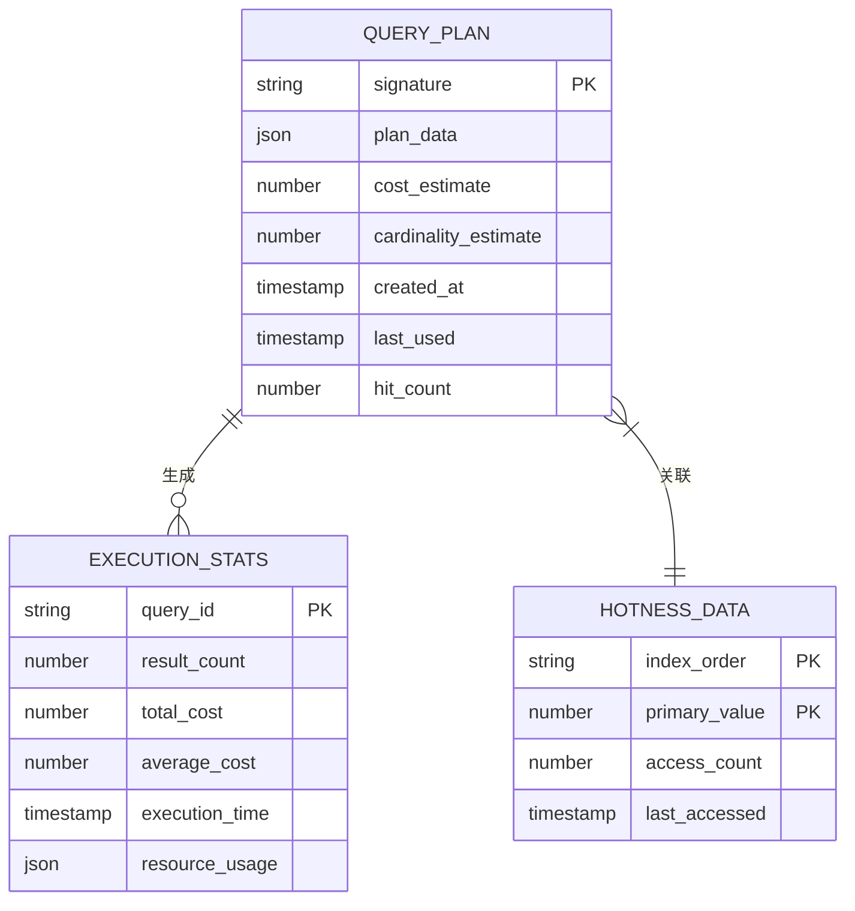

# 模式匹配查询

<cite>
**本文档引用文件**   
- [lexer.ts](file://src/query/pattern/lexer.ts)
- [parser.ts](file://src/query/pattern/parser.ts)
- [ast.ts](file://src/query/pattern/ast.ts)
- [compiler.ts](file://src/query/pattern/compiler.ts)
- [planner.ts](file://src/query/pattern/planner.ts)
- [executor.ts](file://src/query/pattern/executor.ts)
- [match.ts](file://src/query/pattern/match.ts)
- [persistentStore.ts](file://src/storage/persistentStore.ts)
</cite>

## 目录
1. [介绍](#介绍)
2. [词法分析](#词法分析)
3. [语法解析](#语法解析)
4. [执行计划生成](#执行计划生成)
5. [模式查询执行](#模式查询执行)
6. [错误处理与安全防护](#错误处理与安全防护)
7. [性能监控与优化](#性能监控与优化)

## 介绍
本系统实现了完整的Cypher风格模式匹配查询流程，从文本模式字符串的词法分析开始，经过抽象语法树构建、执行计划生成，最终完成查询执行。整个流程支持复杂的图模式语法如(a:Person)-[r:KNOWS]->(b:Company)，并提供了变量绑定、标签过滤和关系方向处理等核心功能。

**Section sources**
- [lexer.ts](file://src/query/pattern/lexer.ts#L1-L20)
- [parser.ts](file://src/query/pattern/parser.ts#L1-L50)

## 词法分析
词法分析器(CypherLexer)负责将输入的Cypher查询字符串分解为有意义的标记(token)序列。分析过程包括空白字符跳过、注释处理、字符串字面量解析、数字字面量识别以及关键字和标识符的区分。

```mermaid
flowchart TD
Start([开始]) --> ReadChar["读取下一个字符"]
ReadChar --> IsWhitespace{"是否为空白字符?"}
IsWhitespace --> |是| SkipWS["跳过空白字符"]
SkipWS --> ReadChar
IsWhitespace --> |否| IsComment{"是否为注释?"}
IsComment --> |是| SkipComment["跳过注释"]
SkipComment --> ReadChar
IsComment --> |否| IsString{"是否为字符串?"}
IsString --> |是| ParseString["解析字符串字面量"]
ParseString --> AddToken["添加STRING标记"]
AddToken --> ReadChar
IsString --> |否| IsNumber{"是否为数字?"}
IsNumber --> |是| ParseNumber["解析数字字面量"]
ParseNumber --> AddNumber["添加NUMBER标记"]
AddNumber --> ReadChar
IsNumber --> |否| IsIdentifier{"是否为标识符?"}
IsIdentifier --> |是| ParseIdentifier["解析标识符/关键字"]
ParseIdentifier --> AddID["添加IDENTIFIER标记"]
AddID --> ReadChar
IsIdentifier --> |否| IsOperator{"是否为操作符?"}
IsOperator --> |是| ParseOperator["解析操作符"]
ParseOperator --> AddOp["添加操作符标记"]
AddOp --> ReadChar
IsOperator --> |否| EndLoop["循环结束"]
EndLoop --> AddEOF["添加EOF标记"]
AddEOF --> ReturnTokens["返回标记数组"]
```

**Diagram sources **
- [lexer.ts](file://src/query/pattern/lexer.ts#L160-L540)

**Section sources**
- [lexer.ts](file://src/query/pattern/lexer.ts#L160-L540)

## 语法解析
语法解析器(CypherParser)采用递归下降方法，将词法分析产生的标记流转换为抽象语法树(AST)。解析过程从根节点CypherQuery开始，逐步构建MatchClause、NodePattern、RelationshipPattern等结构。

**Diagram sources **
- [parser.ts](file://src/query/pattern/parser.ts#L64-L1060)
- [ast.ts](file://src/query/pattern/ast.ts#L1-L375)

**Section sources**
- [parser.ts](file://src/query/pattern/parser.ts#L64-L1060)
- [ast.ts](file://src/query/pattern/ast.ts#L1-L375)

## 执行计划生成
编译器(CypherCompiler)将AST转换为可执行的存储层查询指令，并利用查询计划器进行优化。计划生成过程包括索引选择、连接顺序优化和谓词下推等策略。

**Diagram sources **
- [compiler.ts](file://src/query/pattern/compiler.ts#L65-L750)
- [planner.ts](file://src/query/pattern/planner.ts#L60-L480)

**Section sources**
- [compiler.ts](file://src/query/pattern/compiler.ts#L65-L750)
- [planner.ts](file://src/query/pattern/planner.ts#L60-L480)

## 模式查询执行
执行器(CypherQueryExecutor)基于生成的执行计划高效执行查询，通过索引扫描、连接、过滤等算子完成数据检索。执行过程与PersistentStore交互，利用分页索引和属性索引进行优化。

**Diagram sources **
- [executor.ts](file://src/query/pattern/executor.ts#L34-L437)
- [match.ts](file://src/query/pattern/match.ts#L21-L234)
- [persistentStore.ts](file://src/storage/persistentStore.ts#L61-L1633)

**Section sources**
- [executor.ts](file://src/query/pattern/executor.ts#L34-L437)
- [match.ts](file://src/query/pattern/match.ts#L21-L234)
- [persistentStore.ts](file://src/storage/persistentStore.ts#L61-L1633)

## 错误处理与安全防护
系统实现了全面的错误处理机制和注入防护措施。在词法分析阶段检测非法字符，在语法解析阶段验证语句结构，在执行阶段处理各种异常情况。

**Diagram sources **
- [lexer.ts](file://src/query/pattern/lexer.ts#L160-L540)
- [parser.ts](file://src/query/pattern/parser.ts#L64-L1060)
- [compiler.ts](file://src/query/pattern/compiler.ts#L65-L750)

**Section sources**
- [lexer.ts](file://src/query/pattern/lexer.ts#L160-L540)
- [parser.ts](file://src/query/pattern/parser.ts#L64-L1060)
- [compiler.ts](file://src/query/pattern/compiler.ts#L65-L750)

## 性能监控与优化
系统提供详细的性能监控功能，包括执行统计信息收集、查询计划缓存和热点数据跟踪。通过这些机制实现持续的性能优化。

**Diagram sources **
- [planner.ts](file://src/query/pattern/planner.ts#L60-L480)
- [executor.ts](file://src/query/pattern/executor.ts#L34-L437)
- [persistentStore.ts](file://src/storage/persistentStore.ts#L61-L1633)

**Section sources**
- [planner.ts](file://src/query/pattern/planner.ts#L60-L480)
- [executor.ts](file://src/query/pattern/executor.ts#L34-L437)
- [persistentStore.ts](file://src/storage/persistentStore.ts#L61-L1633)