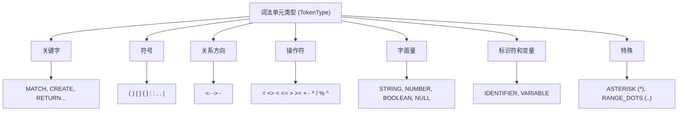
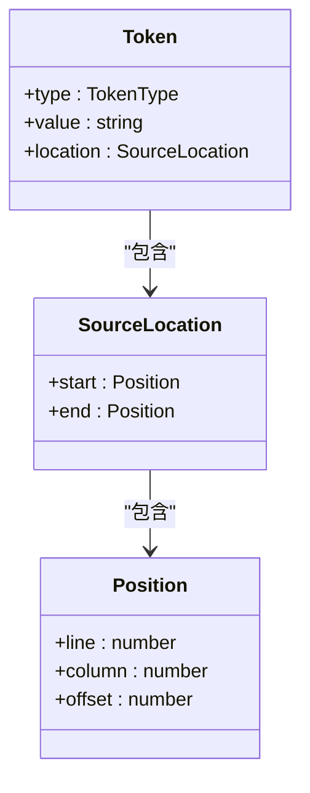
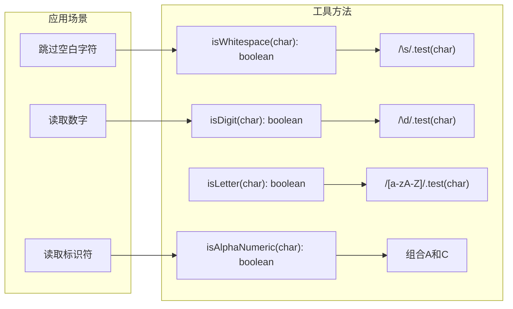
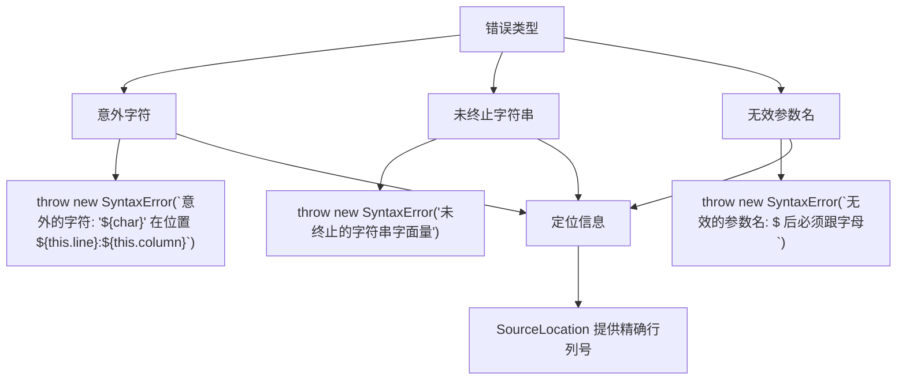
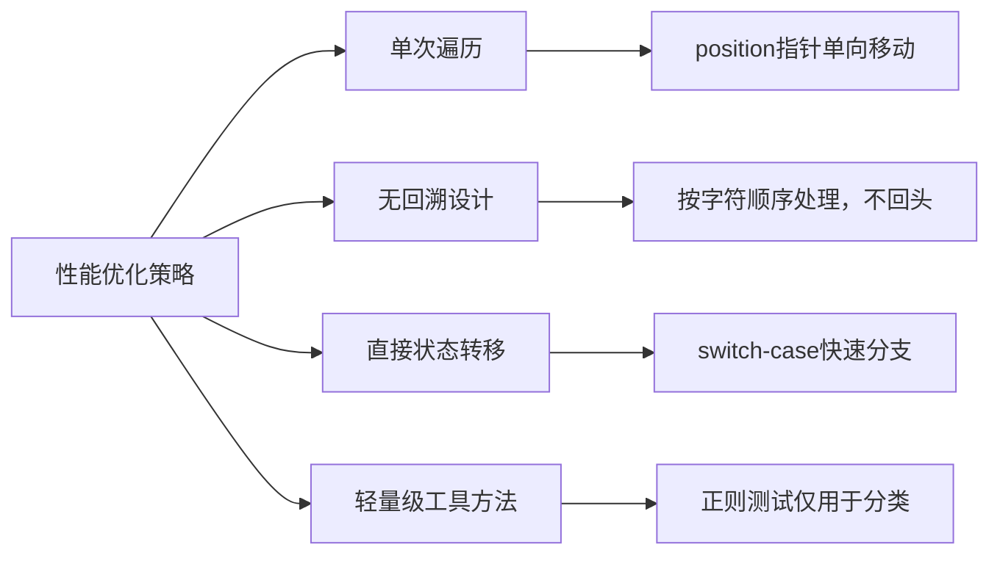
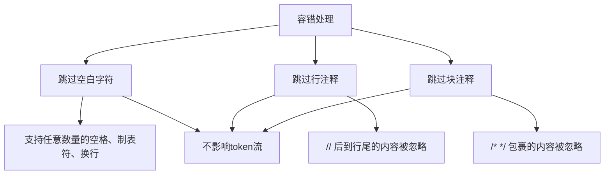
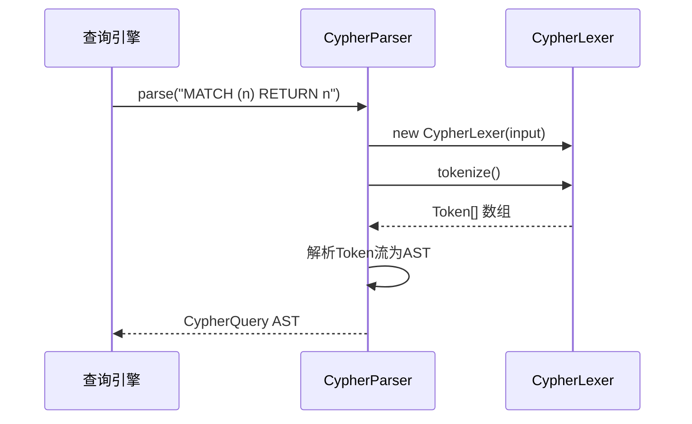

# 词法分析器

<cite>
**本文档中引用的文件**
- [lexer.ts](file://src/query/pattern/lexer.ts)
- [parser.ts](file://src/query/pattern/parser.ts)
- [ast.ts](file://src/query/pattern/ast.ts)
</cite>

## 目录
1. [简介](#简介)
2. [核心组件](#核心组件)
3. [词法单元类型定义](#词法单元类型定义)
4. [状态机与扫描逻辑](#状态机与扫描逻辑)
5. [正则表达式在token识别中的应用](#正则表达式在token识别中的应用)
6. [错误处理机制](#错误处理机制)
7. [性能优化策略](#性能优化策略)
8. [语法容错设计](#语法容错设计)
9. [实际输入输出示例](#实际输入输出示例)
10. [与语法分析模块的接口契约](#与语法分析模块的接口契约)

## 简介
本技术文档深入解析SynapseDB中Cypher模式匹配查询的词法分析阶段。重点阐述如何将原始的模式字符串（如'(a:Person)-[r:KNOWS]->(b:Company)'）分解为有意义的词法单元（tokens），包括标识符、标签、关系类型、方向符号等。文档详细说明了`lexer.ts`中的状态机设计和扫描逻辑，解释其在性能优化和语法容错方面的实现策略，并提供实际输入输出示例。

## 核心组件

词法分析器的核心功能由`CypherLexer`类实现，该类负责将输入的Cypher查询文本转换为结构化的标记流（Token Stream）。此过程是整个查询解析流程的第一步，为后续的语法分析和执行计划生成奠定基础。

**Section sources**
- [lexer.ts](file://src/query/pattern/lexer.ts#L160-L540)

## 词法单元类型定义

词法分析器通过`TokenType`联合类型定义了所有可能的词法单元类别，这些类别涵盖了Cypher查询语言的全部语法元素。



**Diagram sources**
- [lexer.ts](file://src/query/pattern/lexer.ts#L12-L103)

每个词法单元都封装为一个`Token`对象，包含类型、值和位置信息：



**Diagram sources**
- [lexer.ts](file://src/query/pattern/lexer.ts#L106-L110)
- [ast.ts](file://src/query/pattern/ast.ts#L10-L25)

## 状态机与扫描逻辑

词法分析器采用基于字符流的状态机模型进行扫描，其核心方法`nextToken()`根据当前字符决定下一步操作。

```mermaid
flowchart TD
Start([开始]) --> CheckWhitespace{"空白字符?"}
CheckWhitespace --> |是| SkipWS[跳过空白]
CheckWhitespace --> |否| CheckComment{"行注释//" or 块注释/*?}
CheckComment --> |是| SkipComment[跳过注释]
CheckComment --> |否| CheckString{"引号 ' 或 \" ?"}
CheckString --> |是| ReadString[读取字符串]
CheckString --> |否| CheckDigit{"数字?"}
CheckDigit --> |是| ReadNumber[读取数字]
CheckDigit --> |否| CheckParam{"$ 参数?"}
CheckParam --> |是| ReadParam[读取参数]
CheckParam --> |否| CheckLetter{"字母?"}
CheckLetter --> |是| ReadIdentifier[读取标识符]
CheckLetter --> |否| CheckTwoChar{"双字符操作符?"}
CheckTwoChar --> |是| HandleTwoChar[处理双字符]
CheckTwoChar --> |否| HandleSingleChar[处理单字符]
HandleSingleChar --> Default{"默认情况"}
Default --> Error[抛出语法错误]
SkipWS --> End([返回null])
SkipComment --> End
ReadString --> End([返回STRING token])
ReadNumber --> End([返回NUMBER token])
ReadParam --> End([返回VARIABLE token])
ReadIdentifier --> End([返回IDENTIFIER token])
HandleTwoChar --> End([返回对应token])
HandleSingleChar --> End([返回对应token])
Error --> End
```

**Diagram sources**
- [lexer.ts](file://src/query/pattern/lexer.ts#L196-L309)

## 正则表达式在token识别中的应用

词法分析器利用正则表达式进行高效的字符类别判断，这是实现高性能扫描的关键。



**Diagram sources**
- [lexer.ts](file://src/query/pattern/lexer.ts#L488-L540)

## 错误处理机制

词法分析器实现了严格的错误检测和报告机制，能够对非法字符或格式错误做出响应。



**Diagram sources**
- [lexer.ts](file://src/query/pattern/lexer.ts#L330)
- [lexer.ts](file://src/query/pattern/lexer.ts#L376)
- [lexer.ts](file://src/query/pattern/lexer.ts#L442)

## 性能优化策略

词法分析器通过多种策略实现高性能，包括单次遍历、避免回溯和高效的状态转移。



**Diagram sources**
- [lexer.ts](file://src/query/pattern/lexer.ts#L160-L230)

## 语法容错设计

尽管词法分析器保持严格性，但在某些情况下表现出一定的容错能力，主要体现在对空白字符和注释的处理上。



**Diagram sources**
- [lexer.ts](file://src/query/pattern/lexer.ts#L200-L225)

## 实际输入输出示例

以下是一些典型的输入字符串及其对应的词法分析结果。

### 基础模式解析
输入：`(a:Person)-[r:KNOWS]->(b:Company)`

```mermaid
flowchart LR
Input["(a:Person)-[r:KNOWS]->(b:Company)"] --> T1["LEFT_PAREN '('"]
T1 --> T2["IDENTIFIER 'a'"]
T2 --> T3["COLON ':'"]
T3 --> T4["IDENTIFIER 'Person'"]
T4 --> T5["RIGHT_PAREN ')'"]
T5 --> T6["DASH '-'"]
T6 --> T7["LEFT_BRACKET '['"]
T7 --> T8["IDENTIFIER 'r'"]
T8 --> T9["COLON ':'"]
T9 --> T10["IDENTIFIER 'KNOWS'"]
T10 --> T11["RIGHT_BRACKET ']'"]
T11 --> T12["RIGHT_ARROW '->'"]
T12 --> T13["LEFT_PAREN '('"]
T13 --> T14["IDENTIFIER 'b'"]
T14 --> T15["COLON ':'"]
T15 --> T16["IDENTIFIER 'Company'"]
T16 --> T17["RIGHT_PAREN ')'"]
T17 --> T18["EOF ''"]
```



**Diagram sources**
- [lexer.ts](file://src/query/pattern/lexer.ts#L267-L309)
- [lexer.ts](file://src/query/pattern/lexer.ts#L227-L265)

### 属性映射解析
输入：`{name: "Alice", age: 30}`

```mermaid
flowchart LR
Input["{name: \"Alice\", age: 30}"] --> T1["LEFT_BRACE '{'"]
T1 --> T2["IDENTIFIER 'name'"]
T2 --> T3["COLON ':'"]
T3 --> T4["STRING 'Alice'"]
T4 --> T5["COMMA ','"]
T5 --> T6["IDENTIFIER 'age'"]
T6 --> T7["COLON ':'"]
T7 --> T8["NUMBER '30'"]
T8 --> T9["RIGHT_BRACE '}'"]
T9 --> T10["EOF ''"]
```

**Diagram sources**
- [lexer.ts](file://src/query/pattern/lexer.ts#L334-L390)

## 与语法分析模块的接口契约

词法分析器与语法分析器之间存在明确的接口契约，确保数据的正确传递和处理。



词法分析器输出的`Token[]`数组作为语法分析器的输入，两者通过`Token`接口和`TokenType`枚举进行类型安全的交互。

**Diagram sources**
- [lexer.ts](file://src/query/pattern/lexer.ts#L160-L230)
- [parser.ts](file://src/query/pattern/parser.ts#L64-L1060)

**Section sources**
- [lexer.ts](file://src/query/pattern/lexer.ts#L160-L540)
- [parser.ts](file://src/query/pattern/parser.ts#L64-L1060)