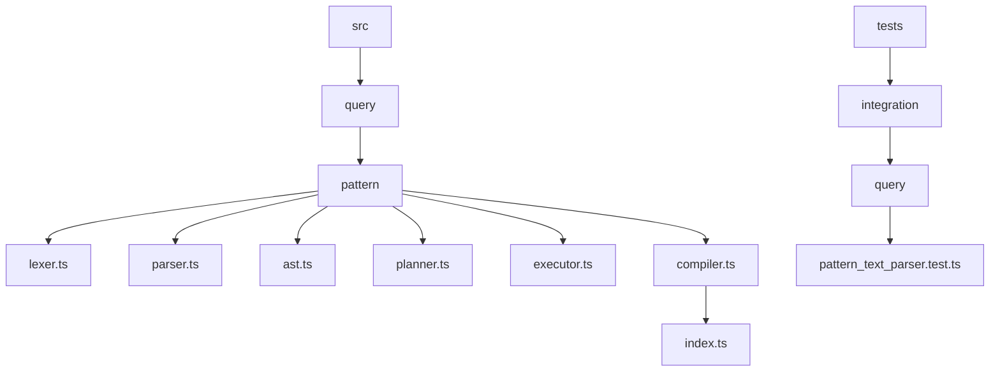
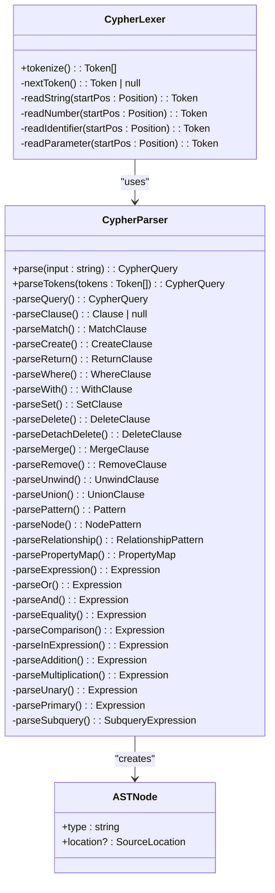
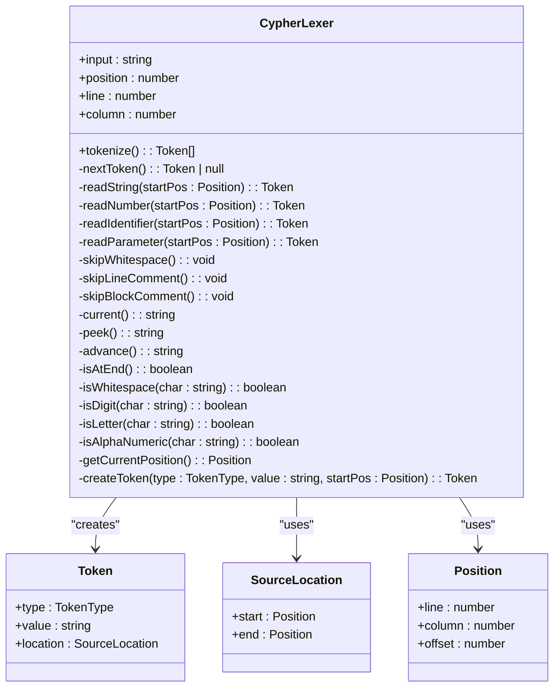
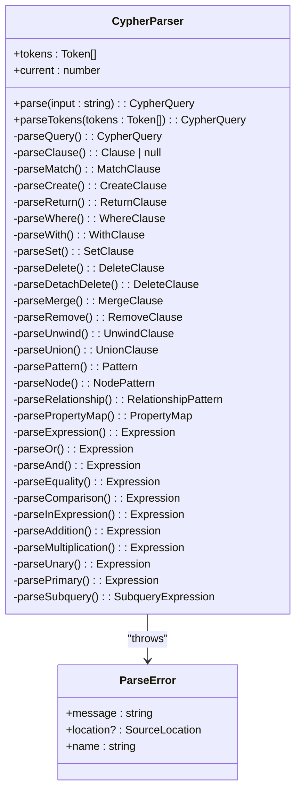
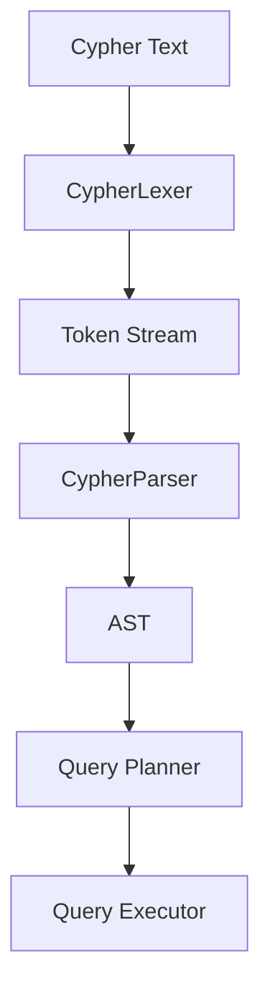

# 语法分析器

<cite>
**本文档中引用的文件**   
- [parser.ts](file://src/query/pattern/parser.ts)
- [ast.ts](file://src/query/pattern/ast.ts)
- [lexer.ts](file://src/query/pattern/lexer.ts)
</cite>

## 目录
1. [简介](#简介)
2. [项目结构](#项目结构)
3. [核心组件](#核心组件)
4. [架构概述](#架构概述)
5. [详细组件分析](#详细组件分析)
6. [依赖分析](#依赖分析)
7. [性能考虑](#性能考虑)
8. [故障排除指南](#故障排除指南)
9. [结论](#结论)

## 简介
本文档详细阐述了语法分析器如何将词法分析生成的token流构建成抽象语法树（AST）。重点解析递归下降解析技术的应用，展示节点、关系、路径等结构在AST中的表示方式。说明变量绑定（如'a', 'r'）、标签过滤（':Person'）和方向性（'->' vs '-')的语义捕获过程。结合parser.ts代码，分析错误恢复机制和语法验证规则，例如未闭合括号或无效关系声明的处理。阐明AST结构如何为后续编译阶段提供语义清晰的中间表示。

## 项目结构
本项目采用模块化设计，主要功能集中在`src/query/pattern/`目录下，包含词法分析、语法分析、执行和查询计划等核心组件。测试文件位于`tests/integration/query/`目录下，用于验证各组件的功能正确性。

**Diagram sources**
- [parser.ts](file://src/query/pattern/parser.ts)
- [ast.ts](file://src/query/pattern/ast.ts)
- [lexer.ts](file://src/query/pattern/lexer.ts)

**Section sources**
- [parser.ts](file://src/query/pattern/parser.ts)
- [ast.ts](file://src/query/pattern/ast.ts)
- [lexer.ts](file://src/query/pattern/lexer.ts)

## 核心组件
语法分析器的核心组件包括词法分析器（Lexer）、语法分析器（Parser）和抽象语法树（AST）定义。这些组件协同工作，将Cypher查询文本转换为结构化的AST，供后续的查询计划和执行使用。

**Section sources**
- [parser.ts](file://src/query/pattern/parser.ts#L0-L1062)
- [ast.ts](file://src/query/pattern/ast.ts#L0-L376)
- [lexer.ts](file://src/query/pattern/lexer.ts#L0-L542)

## 架构概述
语法分析器采用递归下降算法，将标记流解析为AST。支持的语法模式包括节点、关系和完整模式。词法分析器将Cypher文本转换为标记流，语法分析器则根据这些标记构建AST。

**Diagram sources**
- [parser.ts](file://src/query/pattern/parser.ts#L0-L1062)
- [ast.ts](file://src/query/pattern/ast.ts#L0-L376)
- [lexer.ts](file://src/query/pattern/lexer.ts#L0-L542)

## 详细组件分析
### 词法分析器分析
词法分析器负责将Cypher文本转换为标记流。它识别关键字、符号、字面量和标识符，并提供位置信息用于错误报告。

#### 词法分析器类图

**Diagram sources**
- [lexer.ts](file://src/query/pattern/lexer.ts#L0-L542)

**Section sources**
- [lexer.ts](file://src/query/pattern/lexer.ts#L0-L542)

### 语法分析器分析
语法分析器使用递归下降算法解析标记流为AST。它支持多种子句类型，包括MATCH、CREATE、RETURN、WHERE等。

#### 语法分析器类图

**Diagram sources**
- [parser.ts](file://src/query/pattern/parser.ts#L0-L1062)

**Section sources**
- [parser.ts](file://src/query/pattern/parser.ts#L0-L1062)

### 抽象语法树分析
抽象语法树定义了Cypher查询的结构。它包括查询根节点、子句类型、模式定义、表达式系统等。

#### 抽象语法树类图

```mermaid
classDiagram
class ASTNode {
+type : string
+location? : SourceLocation
}
class CypherQuery {
+type : 'CypherQuery'
+clauses : Clause[]
}
class Clause {
<<interface>>
}
class MatchClause {
+type : 'MatchClause'
+optional : boolean
+pattern : Pattern
}
class CreateClause {
+type : 'CreateClause'
+pattern : Pattern
}
class ReturnClause {
+type : 'ReturnClause'
+distinct : boolean
+items : ReturnItem[]
+orderBy? : OrderByClause
+limit? : number
+skip? : number
}
class WhereClause {
+type : 'WhereClause'
+expression : Expression
}
class WithClause {
+type : 'WithClause'
+distinct : boolean
+items : ReturnItem[]
+where? : WhereClause
+orderBy? : OrderByClause
+limit? : number
+skip? : number
}
class SetClause {
+type : 'SetClause'
+items : SetItem[]
}
class DeleteClause {
+type : 'DeleteClause'
+detach : boolean
+expressions : Expression[]
}
class MergeClause {
+type : 'MergeClause'
+pattern : Pattern
+onCreate? : OnClause
+onMatch? : OnClause
}
class RemoveClause {
+type : 'RemoveClause'
+items : RemoveItem[]
}
class UnwindClause {
+type : 'UnwindClause'
+expression : Expression
+alias : string
}
class UnionClause {
+type : 'UnionClause'
+all : boolean
+query : CypherQuery
}
class Pattern {
+type : 'Pattern'
+elements : PathElement[]
}
class PathElement {
<<interface>>
}
class NodePattern {
+type : 'NodePattern'
+variable? : string
+labels : string[]
+properties? : PropertyMap
}
class RelationshipPattern {
+type : 'RelationshipPattern'
+variable? : string
+types : string[]
+direction : Direction
+properties? : PropertyMap
+variableLength? : VariableLength
}
class Expression {
<<interface>>
}
class Literal {
+type : 'Literal'
+value : string | number | boolean | null
+raw : string
}
class Variable {
+type : 'Variable'
+name : string
}
class PropertyAccess {
+type : 'PropertyAccess'
+object : Expression
+property : string
}
class BinaryExpression {
+type : 'BinaryExpression'
+operator : BinaryOperator
+left : Expression
+right : Expression
}
class UnaryExpression {
+type : 'UnaryExpression'
+operator : UnaryOperator
+argument : Expression
}
class FunctionCall {
+type : 'FunctionCall'
+name : string
+arguments : Expression[]
}
class ListExpression {
+type : 'ListExpression'
+elements : Expression[]
}
class MapExpression {
+type : 'MapExpression'
+properties : PropertyPair[]
}
class SubqueryExpression {
+type : 'SubqueryExpression'
+operator : SubqueryOperator
+query : SubqueryPattern
}
class CaseExpression {
+type : 'CaseExpression'
+expression? : Expression
+whenClauses : WhenClause[]
+elseExpression? : Expression
}
class ParameterExpression {
+type : 'ParameterExpression'
+name : string
}
CypherQuery --> Clause : "contains"
MatchClause --> Pattern : "has"
CreateClause --> Pattern : "has"
ReturnClause --> ReturnItem : "contains"
WithClause --> ReturnItem : "contains"
WithClause --> WhereClause : "has"
SetClause --> SetItem : "contains"
DeleteClause --> Expression : "contains"
MergeClause --> Pattern : "has"
MergeClause --> OnClause : "has"
RemoveClause --> RemoveItem : "contains"
UnwindClause --> Expression : "has"
UnionClause --> CypherQuery : "has"
Pattern --> PathElement : "contains"
NodePattern --> PropertyMap : "has"
RelationshipPattern --> PropertyMap : "has"
RelationshipPattern --> VariableLength : "has"
BinaryExpression --> Expression : "left"
BinaryExpression --> Expression : "right"
UnaryExpression --> Expression : "argument"
FunctionCall --> Expression : "arguments"
ListExpression --> Expression : "elements"
MapExpression --> PropertyPair : "properties"
SubqueryExpression --> SubqueryPattern : "has"
CaseExpression --> WhenClause : "contains"
CaseExpression --> Expression : "elseExpression"
PropertyAccess --> Expression : "object"
```

**Diagram sources**
- [ast.ts](file://src/query/pattern/ast.ts#L0-L376)

**Section sources**
- [ast.ts](file://src/query/pattern/ast.ts#L0-L376)

## 依赖分析
语法分析器依赖于词法分析器生成的标记流，并将解析结果构建成抽象语法树。这些组件之间的依赖关系确保了查询文本能够被正确解析和验证。

**Diagram sources**
- [parser.ts](file://src/query/pattern/parser.ts#L0-L1062)
- [lexer.ts](file://src/query/pattern/lexer.ts#L0-L542)

**Section sources**
- [parser.ts](file://src/query/pattern/parser.ts#L0-L1062)
- [lexer.ts](file://src/query/pattern/lexer.ts#L0-L542)

## 性能考虑
语法分析器的性能主要取决于递归下降算法的效率和标记流的处理速度。通过优化词法分析器和语法分析器的实现，可以提高查询解析的速度。

## 故障排除指南
当遇到语法错误时，语法分析器会抛出ParseError异常，并提供错误位置信息。可以通过检查错误消息和位置信息来定位和修复语法错误。

**Section sources**
- [parser.ts](file://src/query/pattern/parser.ts#L0-L1062)

## 结论
语法分析器通过递归下降算法将词法分析生成的token流构建成抽象语法树（AST）。它支持多种Cypher语法模式，并提供了详细的错误恢复机制和语法验证规则。AST结构为后续编译阶段提供了语义清晰的中间表示，确保了查询的正确性和高效性。