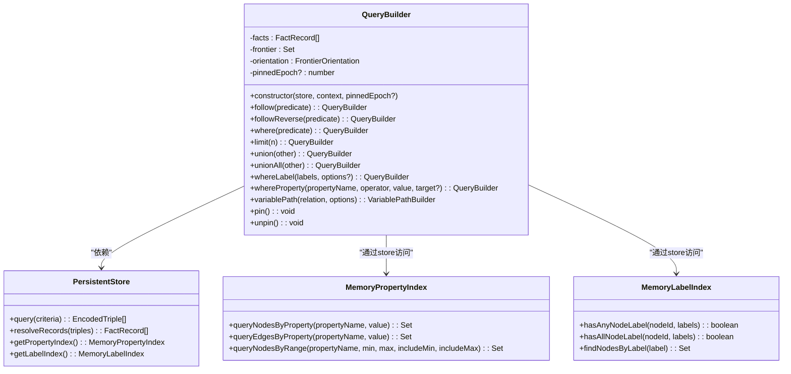

# 链式查询API

<cite>
**本文档引用文件**   
- [queryBuilder.ts](file://src/query/queryBuilder.ts)
- [persistentStore.ts](file://src/storage/persistentStore.ts)
- [propertyIndex.ts](file://src/storage/propertyIndex.ts)
- [labels.ts](file://src/graph/labels.ts)
- [synapseDb.ts](file://src/synapseDb.ts)
- [readerRegistry.ts](file://src/storage/readerRegistry.ts)
</cite>

## 目录
1. [引言](#引言)
2. [QueryBuilder核心设计](#querybuilder核心设计)
3. [链式方法语义与组合逻辑](#链式方法语义与组合逻辑)
4. [前端沿机制与图遍历](#前端沿机制与图遍历)
5. [多跳查询与路径构建](#多跳查询与路径构建)
6. [异步迭代与流式处理](#异步迭代与流式处理)
7. [快照一致性与事务隔离](#快照一致性与事务隔离)
8. [最佳实践与性能优化](#最佳实践与性能优化)

## 引言
本技术文档深入解析SynapseDB中`QueryBuilder`类的设计与实现，重点阐述其作为链式查询核心的建造者模式应用。文档详细说明了`follow/followReverse`、`where/limit`、`anchor`等方法的语义与组合逻辑，解释了前端沿（frontier）机制如何支持高效的图遍历。通过代码示例展示了多跳查询、属性过滤、标签匹配和结果合并（union/unionAll）的实际用法。分析了异步迭代器与流式处理（batch/take/skip）在大数据集上的性能优势。说明了pin/unpin机制如何保障快照一致性，并与withSnapshot事务隔离协同工作。最后提供了常见查询模式的最佳实践、性能陷阱及优化建议。

## QueryBuilder核心设计

`QueryBuilder`是SynapseDB中实现链式查询的核心组件，采用建造者模式（Builder Pattern）构建复杂的图查询操作。它封装了查询上下文（QueryContext），包括当前的事实记录集（facts）、前沿节点集合（frontier）和方向锚点（orientation）。该类通过不可变性设计确保每次方法调用都返回一个新的`QueryBuilder`实例，从而支持安全的链式调用。

**图表来源**
- [queryBuilder.ts](file://src/query/queryBuilder.ts#L38-L812)
- [persistentStore.ts](file://src/storage/persistentStore.ts#L61-L838)
- [propertyIndex.ts](file://src/storage/propertyIndex.ts#L36-L318)
- [labels.ts](file://src/graph/labels.ts#L42-L247)

**章节来源**
- [queryBuilder.ts](file://src/query/queryBuilder.ts#L38-L812)

## 链式方法语义与组合逻辑

`QueryBuilder`提供了一系列语义清晰的链式方法，允许用户以声明式的方式构建复杂查询。这些方法遵循函数式编程原则，每个操作都基于当前状态生成新的查询构建器，而不会修改原始状态。

### 联想查询方法
`follow`和`followReverse`方法用于执行单跳图遍历。`follow`从当前前沿节点出发，沿着指定关系谓词向前扩展；`followReverse`则反向追溯。这两个方法利用`PersistentStore`的索引机制高效检索相关三元组，并更新前沿集合。

### 过滤与限制方法
`where`方法接受一个谓词函数，对当前事实集进行过滤。`limit`和`skip`方法分别用于限制结果数量和跳过前N个结果，支持分页查询。`take`是`limit`的别名，增强了API的可读性。

### 结果合并方法
`union`和`unionAll`方法用于合并两个查询结果集。`union`会自动去重，而`unionAll`则保留所有重复项。这两种操作在处理并行查询路径或聚合多个数据源时非常有用。

**图表来源**
- [queryBuilder.ts](file://src/query/queryBuilder.ts#L38-L812)

**章节来源**
- [queryBuilder.ts](file://src/query/queryBuilder.ts#L38-L812)

## 前端沿机制与图遍历

前端沿（Frontier）机制是`QueryBuilder`实现高效图遍历的核心。它维护了一个动态的节点ID集合，代表了当前查询的"边界"或"前沿"。这个机制使得多跳查询能够逐层扩展，避免了全图扫描的开销。

### 前沿构建与重建
当创建一个新的`QueryBuilder`实例时，会根据初始事实集和锚定方向（`FrontierOrientation`）构建初始前沿。`buildInitialFrontier`函数负责此任务，它根据`subject`、`object`或`both`策略提取节点ID。在每次遍历操作后，`rebuildFrontier`函数会根据新获取的事实记录重建前沿集合。

### 方向锚定
`anchor`方法允许用户显式设置前沿的方向锚点。这对于控制后续`follow`操作的遍历方向至关重要。例如，在执行`followReverse`后，将锚点设为`subject`可以确保下一次正向遍历从正确的节点开始。

**图表来源**
- [queryBuilder.ts](file://src/query/queryBuilder.ts#L1151-L1178)

**章节来源**
- [queryBuilder.ts](file://src/query/queryBuilder.ts#L38-L812)

## 多跳查询与路径构建

`QueryBuilder`支持复杂的多跳查询和路径分析功能。`followPath`方法允许用户指定跳数范围（min..max），执行广度优先搜索（BFS）来发现满足条件的所有路径。该方法内部实现了防环机制，避免节点的重复扩展导致无限循环。

### 变长路径构建器
`variablePath`方法返回一个`VariablePathBuilder`实例，专门用于处理变长路径查询。它支持不同的唯一性约束（NODE、EDGE、NONE），可以在查找最短路径或所有可能路径之间灵活切换。`shortest`方法利用BFS的特性，保证返回的结果是最短路径。

### 属性与标签过滤
`whereProperty`和`whereLabel`方法将查询能力从结构层面扩展到属性层面。它们利用内存中的属性索引（MemoryPropertyIndex）和标签索引（MemoryLabelIndex）实现高效的过滤操作。特别是`whereProperty`支持等值和范围查询，极大地增强了查询表达力。

**图表来源**
- [queryBuilder.ts](file://src/query/queryBuilder.ts#L38-L812)
- [variable.ts](file://src/query/path/variable.ts#L24-L109)

**章节来源**
- [queryBuilder.ts](file://src/query/queryBuilder.ts#L38-L812)

## 异步迭代与流式处理

为了应对大数据集的内存压力，`QueryBuilder`实现了完整的异步迭代器协议（Async Iterator Protocol）。`Symbol.asyncIterator`方法允许用户以流式方式消费查询结果，每次只加载一个批次的数据到内存中。

### 批量处理
`batch`方法提供了更细粒度的流式控制，允许用户指定批次大小。这在处理海量数据时尤为重要，可以有效控制内存使用并实现背压（backpressure）机制。结合`setImmediate`的微任务调度，确保了长时间运行的查询不会阻塞事件循环。

### 性能优势
流式处理的主要性能优势体现在三个方面：首先，它显著降低了峰值内存占用；其次，它可以实现早期结果返回，提高用户体验；最后，它支持无限数据流的处理，突破了内存容量的限制。

**图表来源**
- [queryBuilder.ts](file://src/query/queryBuilder.ts#L38-L812)

**章节来源**
- [queryBuilder.ts](file://src/query/queryBuilder.ts#L38-L812)

## 快照一致性与事务隔离

`QueryBuilder`通过pin/unpin机制与`withSnapshot`事务隔离协同工作，保障了查询的快照一致性。这一机制确保了在长时间运行的查询过程中，即使数据库发生并发写入，查询结果也能保持一致性和可重复性。

### Pin/Unpin机制
`pin`和`unpin`方法管理着一个内存级的epoch栈。当查询开始时，`pin`方法将当前的epoch推入栈中；查询结束后，`unpin`方法将其弹出。这期间，`PersistentStore`会阻止底层存储结构的刷新，确保查询始终基于同一个数据快照。

### withSnapshot事务
`withSnapshot`方法在更高层次上协调了快照语义。它首先获取当前epoch，然后注册当前进程为读者，最后执行用户提供的查询函数。在整个过程中，系统会确保相关的分页索引（PagedIndexReader）保持固定，直到快照结束。

**图表来源**
- [queryBuilder.ts](file://src/query/queryBuilder.ts#L38-L812)
- [synapseDb.ts](file://src/synapseDb.ts#L477-L491)
- [persistentStore.ts](file://src/storage/persistentStore.ts#L1355-L1381)

**章节来源**
- [queryBuilder.ts](file://src/query/queryBuilder.ts#L38-L812)

## 最佳实践与性能优化

### 常见查询模式
- **深度优先 vs 广度优先**：对于寻找最短路径的场景，优先使用`followPath`而非连续的`follow`调用。
- **索引利用**：尽量在`where`条件中使用已建立索引的属性，避免全表扫描。
- **结果预估**：在执行大规模`union`操作前，先使用`length`属性预估结果集大小。

### 性能陷阱
- **过度链式调用**：过长的链式调用可能导致中间结果集急剧膨胀，应适时使用`limit`进行剪枝。
- **频繁快照**：不必要的`withSnapshot`调用会增加读者注册的开销，应在确实需要一致性时才使用。
- **大结果集处理**：避免直接调用`all()`或`toArray()`处理可能很大的结果集，优先考虑流式处理。

### 优化建议
- **批量操作**：对于大量独立查询，考虑使用批处理模式减少函数调用开销。
- **缓存利用**：合理利用`anchor`方法复用前沿计算结果，避免重复工作。
- **异步流控**：在流式处理中，根据下游处理能力动态调整`batch`大小，实现最优吞吐量。

**章节来源**
- [queryBuilder.ts](file://src/query/queryBuilder.ts#L38-L812)