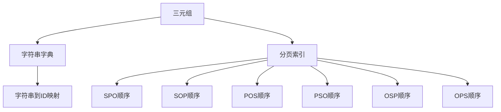
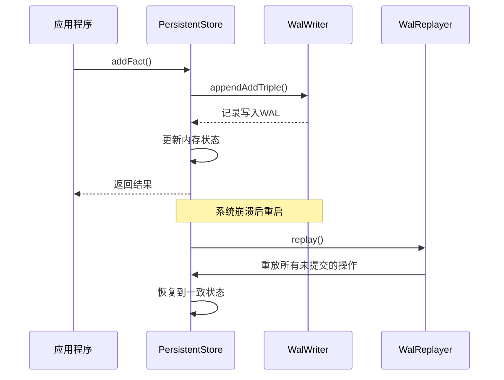
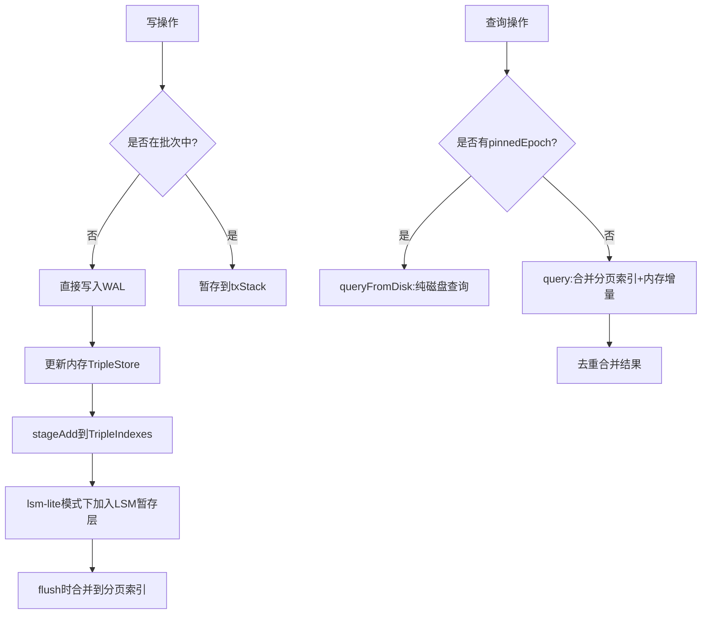
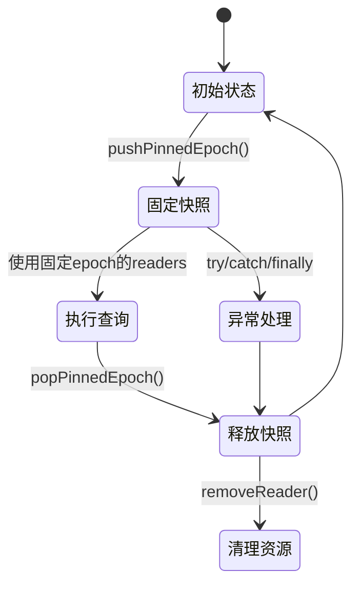
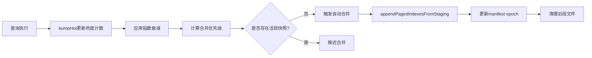
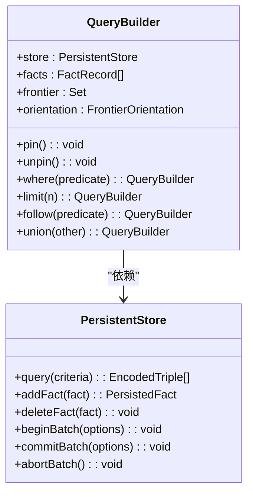

# 核心概念

<cite>
**本文档引用的文件**   
- [openOptions.ts](file://src/types/openOptions.ts)
- [persistentStore.ts](file://src/storage/persistentStore.ts)
- [wal.ts](file://src/storage/wal.ts)
- [pagedIndex.ts](file://src/storage/pagedIndex.ts)
- [hotness.ts](file://src/storage/hotness.ts)
- [queryBuilder.ts](file://src/query/queryBuilder.ts)
</cite>

## 目录
1. [三元组数据模型与物理布局](#三元组数据模型与物理布局)
2. [写前日志（WAL v2）机制](#写前日志（wal-v2）机制)
3. [分页索引与LSM-Lite策略](#分页索引与lsm-lite策略)
4. [读快照隔离与版本控制](#读快照隔离与版本控制)
5. [热度统计与自动合并优化](#热度统计与自动合并优化)
6. [配置项影响分析](#配置项影响分析)
7. [API设计哲学：链式调用](#api设计哲学：链式调用)

## 三元组数据模型与物理布局

SynapseDB采用基于三元组（Subject-Predicate-Object）的图数据模型，将现实世界中的实体关系抽象为基本的数据单元。每个三元组由主语、谓词和宾语构成，形成一个完整的陈述。在物理存储层面，系统通过字符串字典（StringDictionary）将字符串值映射为32位整数ID，从而实现高效存储与快速比较。

三元组的物理布局分为两个主要部分：主存储文件和分页索引。主存储文件包含序列化的字符串字典、属性存储等元数据，而历史三元组数据则通过分页索引进行组织。分页索引将三元组按六种预定义顺序（SPO, SOP, POS, PSO, OSP, OPS）分别存储，每种顺序对应一个独立的索引结构。这种多维索引设计使得无论查询条件如何组合，都能找到最优的访问路径。



**图表来源**
- [persistentStore.ts](file://src/storage/persistentStore.ts#L99-L238)
- [pagedIndex.ts](file://src/storage/pagedIndex.ts#L55-L70)

**章节来源**
- [persistentStore.ts](file://src/storage/persistentStore.ts#L99-L238)
- [pagedIndex.ts](file://src/storage/pagedIndex.ts#L55-L70)

## 写前日志（WAL v2）机制

写前日志（Write-Ahead Log, WAL v2）是SynapseDB确保数据持久性和崩溃恢复能力的核心组件。WAL采用二进制格式记录所有写操作，在数据真正写入主存储之前，先将变更记录追加到WAL文件中。这种机制保证了即使在系统崩溃的情况下，也能通过重放日志来恢复未完成的事务。

WAL v2协议定义了多种记录类型，包括添加三元组（0x10）、删除三元组（0x20）、设置节点属性（0x30）、设置边属性（0x31）、事务开始（0x40）、提交（0x41）和回滚（0x42）。每条记录都包含类型标识、长度信息和校验和，确保数据完整性。WAL重放器（WalReplayer）在数据库打开时会自动读取并应用这些记录，将未持久化的增量恢复到内存状态。



**图表来源**
- [wal.ts](file://src/storage/wal.ts#L32-L61)
- [wal.ts](file://src/storage/wal.ts#L145-L320)

**章节来源**
- [wal.ts](file://src/storage/wal.ts#L32-L61)
- [wal.ts](file://src/storage/wal.ts#L145-L320)

## 分页索引与LSM-Lite策略

分页索引是SynapseDB实现高效查询的关键数据结构。它将大规模的三元组数据分割成固定大小的页面（默认1024条目），每个页面按照主键值进行排序和存储。这种设计既减少了单次I/O操作的数据量，又保持了良好的局部性，显著提升了查询性能。

LSM-Lite是一种轻量级的合并策略，旨在平衡写入性能和查询效率。当启用`stagingMode='lsm-lite'`时，系统会维护一个内存中的暂存层（memtable），所有新的写操作首先被写入这个暂存层。随着数据量的增长，暂存层会被定期刷新到磁盘上的段文件中，并在后续的合并过程中与现有的分页索引整合。这种分层存储架构有效避免了频繁的随机写操作，同时通过后台合并任务保持索引的紧凑性。



**图表来源**
- [persistentStore.ts](file://src/storage/persistentStore.ts#L259-L314)
- [persistentStore.ts](file://src/storage/persistentStore.ts#L316-L434)

**章节来源**
- [persistentStore.ts](file://src/storage/persistentStore.ts#L259-L314)
- [persistentStore.ts](file://src/storage/persistentStore.ts#L316-L434)

## 读快照隔离与版本控制

读快照隔离（Snapshot Isolation）通过版本控制机制保证了查询的一致性。每当数据库状态发生变化时，系统会递增一个epoch计数器，并将其与当前的manifest文件关联。读者在执行查询时，可以通过`pushPinnedEpoch`方法固定当前的epoch版本，确保在整个查询过程中看到的是一个一致的时间点视图。

这种机制允许长时间运行的查询不受并发写入的影响，同时也支持多个读者同时访问不同的快照版本。当查询完成后，通过`popPinnedEpoch`释放固定的epoch，系统可以安全地清理不再需要的旧版本数据。此外，`registerReader`选项确保了维护任务能够感知活跃读者的存在，避免在关键操作期间中断正在进行的查询。



**图表来源**
- [persistentStore.ts](file://src/storage/persistentStore.ts#L1355-L1378)
- [persistentStore.ts](file://src/storage/persistentStore.ts#L1147-L1207)

**章节来源**
- [persistentStore.ts](file://src/storage/persistentStore.ts#L1355-L1378)
- [persistentStore.ts](file://src/storage/persistentStore.ts#L1147-L1207)

## 热度统计与自动合并优化

热度统计（hotness）与自动合并（auto-compact）协同工作，以优化数据库的性能表现。系统通过`bumpHot`方法跟踪每个索引键的访问频率，这些计数器在每次查询时都会被更新。热度数据本身也具有时间衰减特性，采用10分钟半衰期的指数衰减算法，确保近期访问模式对优化决策有更大影响。

自动合并策略利用这些热度信息来决定何时以及如何进行索引合并。高热度的索引区域会被优先处理，以减少热点数据的访问延迟。同时，系统会在后台周期性地检查`snapshotRefCount`，只有在没有活跃快照时才执行合并操作，从而避免对正在进行的查询造成干扰。这种智能的资源调度机制实现了性能优化与查询稳定性的良好平衡。



**图表来源**
- [hotness.ts](file://src/storage/hotness.ts#L43-L50)
- [persistentStore.ts](file://src/storage/persistentStore.ts#L1453-L1460)

**章节来源**
- [hotness.ts](file://src/storage/hotness.ts#L43-L50)
- [persistentStore.ts](file://src/storage/persistentStore.ts#L1453-L1460)

## 配置项影响分析

`openOptions.ts`中定义的配置项对数据库的行为和性能有着深远的影响。`indexDirectory`指定索引文件的存放位置，默认为数据库文件路径加上`.pages`后缀。`pageSize`控制每个索引页面的大小，较小的页面适合随机访问场景，而较大的页面则有利于顺序扫描。

`enableLock`启用进程级独占写锁，防止多个写者同时访问同一数据库文件导致数据损坏。`stagingMode`选择不同的写入策略，`lsm-lite`模式提供更好的写入吞吐量但增加了复杂性。`enablePersistentTxDedupe`启用跨周期的事务幂等性，通过持久化事务ID注册表来防止重复执行。

```mermaid
erDiagram
    CONFIG ||--o{ INDEX : "1:N"
    CONFIG ||--o{ LOCK : "1:N"
    CONFIG ||--o{ STAGING : "1:N"
    CONFIG ||--o{ TX_DEDUPE : "1:N"

    class CONFIG {
        +string "indexDirectory"
        +number "pageSize"
        +boolean "enableLock"
        +string "stagingMode"
        +boolean "enablePersistentTxDedupe"
        +number "maxRememberTxIds"
    }

    class INDEX {
        +string "directory"
        +number "size"
        +string "compression_codec"
    }

    class LOCK {
        +boolean "enabled"
        +string "path"
    }

    class STAGING {
        +string "mode"
        +number "memtable_size"
    }

    class TX_DEDUPE {
        +boolean "enabled"
        +string "registry_path"
        +number "maxIds"
    }
```

**图表来源**
- [openOptions.ts](file://src/types/openOptions.ts#L0-L152)
- [persistentStore.ts](file://src/storage/persistentStore.ts#L99-L238)

**章节来源**
- [openOptions.ts](file://src/types/openOptions.ts#L0-L152)
- [persistentStore.ts](file://src/storage/persistentStore.ts#L99-L238)

## API设计哲学：链式调用

QueryBuilder的链式调用机制体现了函数式编程的设计哲学。每个查询方法（如`where`, `limit`, `follow`）都返回一个新的QueryBuilder实例，而不是修改当前实例的状态。这种不可变性保证了查询构建过程的安全性和可预测性，同时也支持复杂的查询组合和重用。

链式调用的背后是精心设计的上下文管理。`pin`和`unpin`方法确保在查询执行期间固定当前的数据库状态，避免因并发修改而导致不一致的结果。`buildFindContext`等辅助函数将高层API调用转换为底层存储引擎可以理解的查询条件，实现了抽象与实现的分离。



**图表来源**
- [queryBuilder.ts](file://src/query/queryBuilder.ts#L138-L158)
- [queryBuilder.ts](file://src/query/queryBuilder.ts#L244-L261)

**章节来源**
- [queryBuilder.ts](file://src/query/queryBuilder.ts#L138-L158)
- [queryBuilder.ts](file://src/query/queryBuilder.ts#L244-L261)