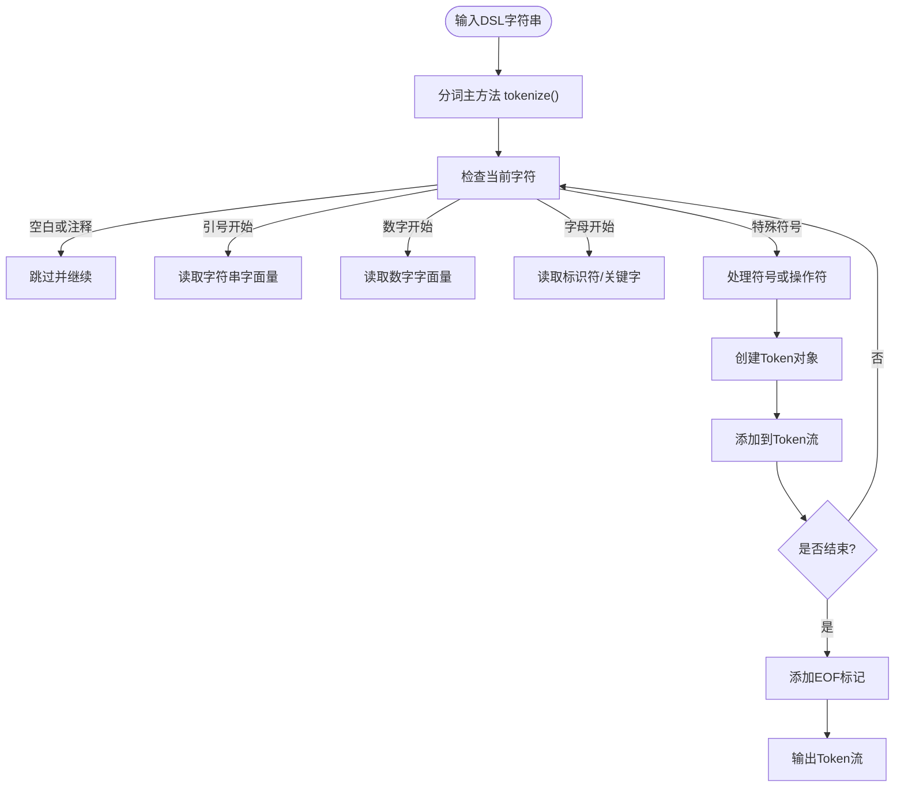
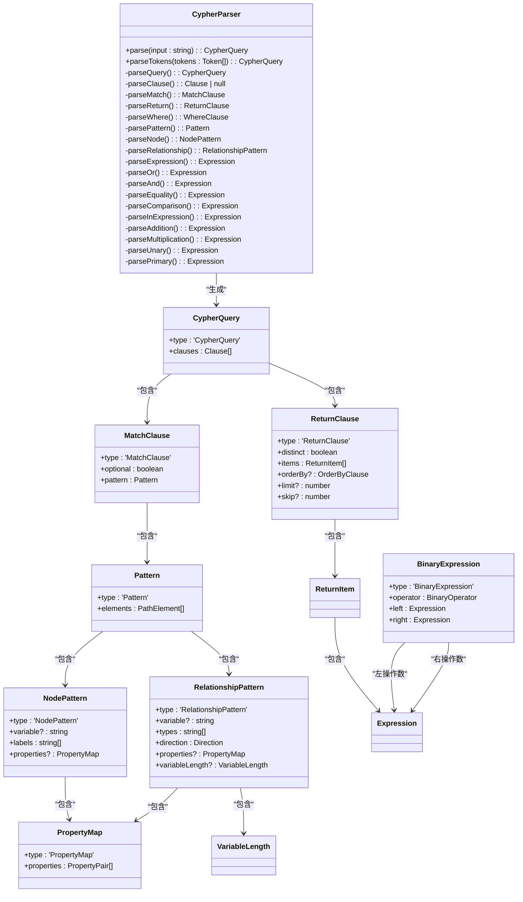
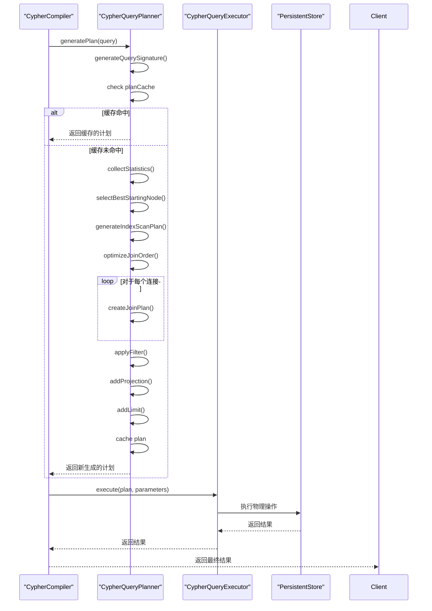
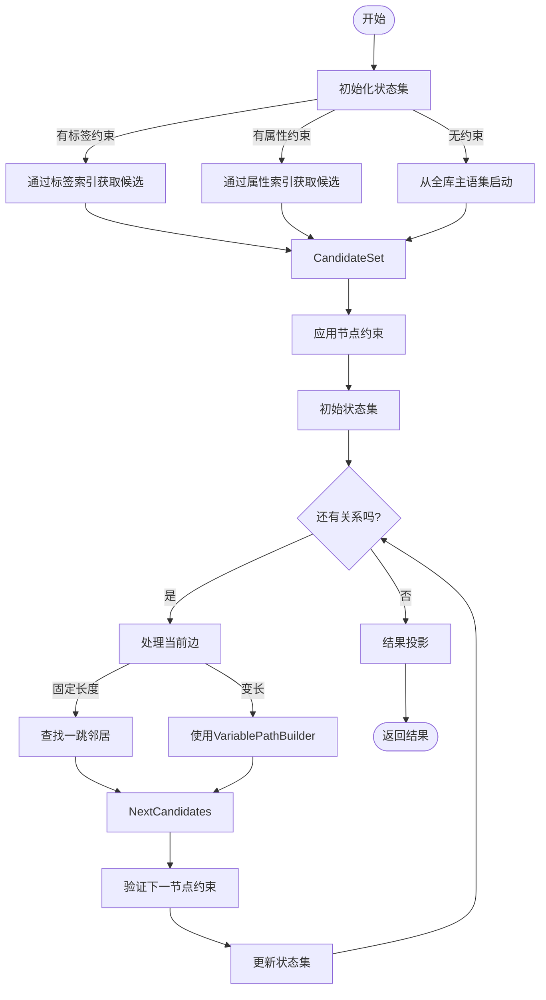
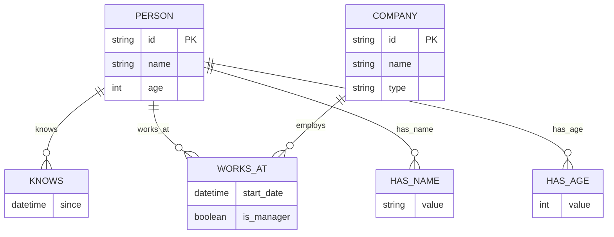

# 模式匹配引擎

<cite>
**本文档中引用的文件**  
- [lexer.ts](file://src/query/pattern/lexer.ts)
- [parser.ts](file://src/query/pattern/parser.ts)
- [ast.ts](file://src/query/pattern/ast.ts)
- [compiler.ts](file://src/query/pattern/compiler.ts)
- [planner.ts](file://src/query/pattern/planner.ts)
- [match.ts](file://src/query/pattern/match.ts)
- [cypher_basic.test.ts](file://tests/integration/query/standards/cypher_basic.test.ts)
- [cypher_optimization.test.ts](file://tests/integration/query/standards/cypher_optimization.test.ts)
- [cypher_variable_path.test.ts](file://tests/integration/query/standards/cypher_variable_path.test.ts)
</cite>

## 目录
1. [词法分析](#词法分析)
2. [语法解析与AST构建](#语法解析与ast构建)
3. [执行计划生成与优化](#执行计划生成与优化)
4. [模式匹配执行](#模式匹配执行)
5. [测试用例与功能演示](#测试用例与功能演示)
6. [性能调优建议](#性能调优建议)

## 词法分析

模式匹配系统的词法分析由 `CypherLexer` 类实现，负责将输入的Pattern DSL字符串转换为标记流（Token Stream）。该过程是查询处理的第一步，确保后续解析器能够正确理解输入文本的结构。

词法分析器支持Cypher语言的基础语法元素，包括节点、关系、属性、变量等。它通过逐字符扫描输入文本，识别出关键字、符号、字面量和标识符，并为每个标记附加上位置信息，以便在发生语法错误时提供精确的定位。

标记类型涵盖了Cypher语言的关键字（如MATCH、RETURN、WHERE）、符号（如括号、逗号、冒号）、关系方向（<-、->、-）、操作符（=、<>、<、<=、>、>=）以及各种字面量（字符串、数字、布尔值、NULL）。此外，还支持参数化查询中的参数（$param）。

词法分析器能够正确处理注释（行注释//和块注释/* */）和空白字符，这些内容在生成标记流时被忽略。对于字符串字面量，支持常见的转义序列（\n、\t、\r、\\、\'、\"）。

**图源**
- [lexer.ts](file://src/query/pattern/lexer.ts#L1-L540)

**本节来源**
- [lexer.ts](file://src/query/pattern/lexer.ts#L1-L540)

## 语法解析与AST构建

语法解析阶段由 `CypherParser` 类完成，采用递归下降算法将词法分析器生成的Token流解析为抽象语法树（AST）。AST是查询的内部表示形式，为后续的编译和执行提供了结构化的基础。

解析器从查询根节点开始，依次解析各个子句（Clause），包括MATCH、CREATE、RETURN、WHERE、WITH等。每个子句都有对应的解析方法，例如 `parseMatch()` 解析MATCH子句，`parseReturn()` 解析RETURN子句。

在解析模式（Pattern）时，解析器首先解析一个节点模式（NodePattern），然后循环解析关系-节点链。节点模式包含可选的变量名、标签列表和属性映射；关系模式包含可选的变量名、关系类型、方向、属性映射以及变长关系定义。

表达式系统支持复杂的逻辑运算，包括二元操作（AND、OR、IN、比较操作符）、一元操作（NOT、负号）以及基本的算术运算。解析器使用优先级驱动的方法来处理表达式的嵌套和结合性，确保生成正确的AST结构。

**图源**
- [parser.ts](file://src/query/pattern/parser.ts#L64-L936)
- [ast.ts](file://src/query/pattern/ast.ts#L1-L375)

**本节来源**
- [parser.ts](file://src/query/pattern/parser.ts#L64-L936)
- [ast.ts](file://src/query/pattern/ast.ts#L1-L375)

## 执行计划生成与优化

执行计划的生成和优化由 `CypherQueryPlanner` 和 `CypherCompiler` 协同完成。编译器首先将AST转换为可执行的 `MatchPlan`，而查询计划器则负责生成优化的执行计划。

`CypherCompiler` 提供了两种编译路径：传统路径和优化路径。传统路径直接将AST编译为对 `PatternBuilder` 的调用，保持向后兼容性。优化路径则利用查询计划器生成基于成本的执行计划，以提高查询效率。

查询计划器采用基于成本的优化策略，主要优化技术包括：
- **智能起始点选择**：根据索引统计信息选择基数最小的节点作为起始点，减少初始候选集。
- **连接顺序优化**：通过成本模型估算不同连接顺序的开销，选择最优的执行路径。
- **谓词下推**：将过滤条件尽可能提前执行，减少中间结果集的大小。
- **执行计划缓存**：对已生成的执行计划进行缓存，避免重复优化。

计划器会收集数据库的统计信息，如总节点数、总关系数、标签计数、属性分布等，用于基数估算和成本计算。执行计划以树形结构表示，包含索引扫描、连接、过滤、投影和限制等操作节点。

**图源**
- [compiler.ts](file://src/query/pattern/compiler.ts#L65-L750)
- [planner.ts](file://src/query/pattern/planner.ts#L90-L479)

**本节来源**
- [compiler.ts](file://src/query/pattern/compiler.ts#L65-L750)
- [planner.ts](file://src/query/pattern/planner.ts#L90-L479)

## 模式匹配执行

模式匹配的执行由 `PatternBuilder` 类实现，它根据编译后的执行计划在图数据上进行实际的模式匹配。执行过程从第一个节点开始，逐步扩展路径，直到满足整个模式。

执行流程如下：
1. **初始状态**：根据第一个节点的标签或属性约束，从索引中获取候选节点集合。如果没有约束，则从全库的主语集合启动。
2. **逐段扩展**：对于每一段关系-节点，遍历当前状态集，查找满足关系方向和类型的邻居节点，并验证下一个节点的约束条件。
3. **变长关系处理**：对于变长关系（*min..max），使用专门的 `VariablePathBuilder` 进行多跳路径搜索，支持节点唯一性、边唯一性或无唯一性约束。
4. **结果投影**：将最终的状态绑定映射为结果行，根据RETURN子句指定的列进行投影。

执行过程中，属性过滤条件被应用于相应的节点，支持等值和范围比较。过滤器通过索引查询（`queryNodesByProperty` 或 `queryNodesByRange`）高效地筛选候选节点。

**图源**
- [match.ts](file://src/query/pattern/match.ts#L21-L234)

**本节来源**
- [match.ts](file://src/query/pattern/match.ts#L21-L234)

## 测试用例与功能演示

通过测试用例可以演示模式匹配系统的各项功能，包括变量绑定、嵌套模式和条件过滤的使用方式。

### 基础查询与变量绑定
在 `cypher_basic.test.ts` 中，测试了简单的MATCH查询和变量绑定。例如，查询 `MATCH (a:Person)-[:KNOWS]->(b:Person) WHERE a.age > 25 RETURN a.name, b.name` 展示了如何通过变量 `a` 和 `b` 绑定节点，并在RETURN子句中引用它们的属性。

### 变长路径匹配
`cypher_variable_path.test.ts` 测试了变长路径的匹配能力。查询 `MATCH (x)-[:R*2..3]->(y) RETURN x,y` 要求匹配长度为2到3跳的关系路径。测试数据包含A->B->C->D的路径，预期结果应包含(A,C)和(B,D)两对节点。

### 条件过滤与嵌套模式
`cypher_optimization.test.ts` 包含了复杂的条件过滤测试。例如，`WHERE n.age > $minAge AND n.name = $name` 展示了参数化查询和复合条件过滤。嵌套模式通过EXISTS子查询实现，如 `WHERE EXISTS { MATCH (n)-[:WORKS_AT]->(:Company) }`，用于检查某个模式是否存在。

**图源**
- [cypher_basic.test.ts](file://tests/integration/query/standards/cypher_basic.test.ts#L1-L138)
- [cypher_variable_path.test.ts](file://tests/integration/query/standards/cypher_variable_path.test.ts#L1-L33)
- [cypher_optimization.test.ts](file://tests/integration/query/standards/cypher_optimization.test.ts#L1-L352)

**本节来源**
- [cypher_basic.test.ts](file://tests/integration/query/standards/cypher_basic.test.ts#L1-L138)
- [cypher_variable_path.test.ts](file://tests/integration/query/standards/cypher_variable_path.test.ts#L1-L33)
- [cypher_optimization.test.ts](file://tests/integration/query/standards/cypher_optimization.test.ts#L1-L352)

## 性能调优建议

为了获得最佳的模式匹配性能，建议采取以下调优措施：

### 索引利用策略
- **创建标签索引**：对于频繁查询的节点标签，确保已建立标签索引，以加速初始节点的查找。
- **创建属性索引**：对于经常用于过滤的属性（如age、name），建立属性索引，支持高效的等值和范围查询。
- **组合索引**：考虑创建组合索引以支持多条件查询，减少多个索引查询的开销。

### 避免笛卡尔积陷阱
- **选择最优起始点**：总是从选择性最高的节点开始查询，即基数最小的节点。这通常是有特定标签和属性约束的节点。
- **使用连接而非交叉连接**：确保查询模式是连通的，避免产生不必要的笛卡尔积。如果必须进行交叉连接，考虑使用UNION或其他替代方案。
- **尽早应用过滤**：将过滤条件（WHERE子句）尽可能提前，减少中间结果集的大小。

### 其他建议
- **启用查询优化**：使用 `enableOptimization: true` 选项让查询计划器生成优化的执行计划。
- **预热优化器**：在系统启动时调用 `warmUpOptimizer()` 收集统计信息，提高首次查询的性能。
- **监控执行计划**：使用 `getOptimizerStats()` 查看优化器的缓存状态和统计信息，诊断性能问题。

通过合理利用索引和优化查询结构，可以显著提升复杂拓扑模式的匹配效率。

**本节来源**
- [planner.ts](file://src/query/pattern/planner.ts#L90-L479)
- [compiler.ts](file://src/query/pattern/compiler.ts#L65-L750)
- [cypher_optimization.test.ts](file://tests/integration/query/standards/cypher_optimization.test.ts#L1-L352)