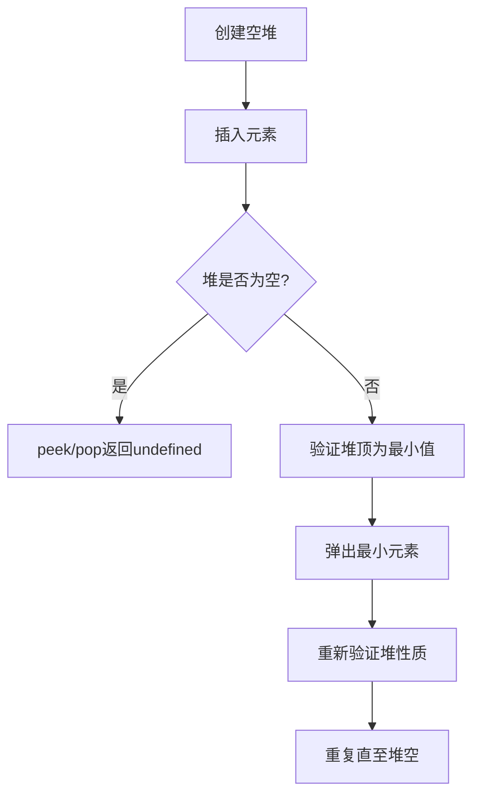
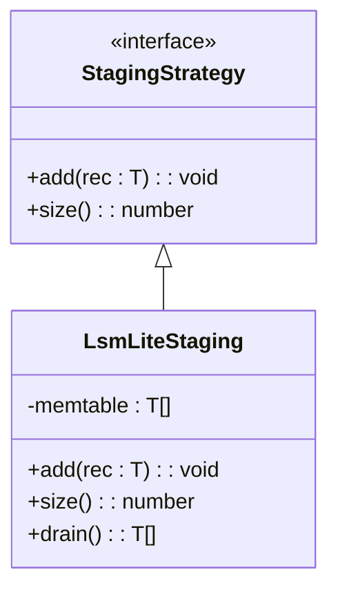

# 单元测试

<cite>
**本文档中引用的文件**   
- [minHeap.ts](file://src/utils/minHeap.ts)
- [fault.ts](file://src/utils/fault.ts)
- [lock.ts](file://src/utils/lock.ts)
- [staging.ts](file://src/storage/staging.ts)
- [tripleIndexes.ts](file://src/storage/tripleIndexes.ts)
- [txidRegistry.ts](file://src/storage/txidRegistry.ts)
- [queryBuilder.ts](file://src/query/queryBuilder.ts)
- [synapseDb.ts](file://src/synapseDb.ts)
- [minHeap.test.ts](file://tests/unit/utils/minHeap.test.ts)
- [fault.test.ts](file://tests/unit/utils/fault.test.ts)
- [lock.test.ts](file://tests/unit/utils/lock.test.ts)
- [staging.test.ts](file://tests/unit/storage/staging.test.ts)
- [tripleIndexes.test.ts](file://tests/unit/storage/tripleIndexes.test.ts)
- [txidRegistry.test.ts](file://tests/unit/storage/txidRegistry.test.ts)
- [queryBuilder.test.ts](file://tests/unit/query/queryBuilder.test.ts)
- [synapseDb.test.ts](file://tests/unit/synapseDb.test.ts)
- [vitest.config.ts](file://vitest.config.ts)
</cite>

## 目录
1. [简介](#简介)
2. [工具类模块测试策略](#工具类模块测试策略)
3. [存储组件测试策略](#存储组件测试策略)
4. [核心API测试策略](#核心api测试策略)
5. [Vitest测试框架应用](#vitest测试框架应用)
6. [新增单元测试最佳实践](#新增单元测试最佳实践)
7. [结论](#结论)

## 简介
SynapseDB采用Vitest作为主要的单元测试框架，对独立模块和函数进行隔离测试。本文档详细说明了如何对工具类（如minHeap、fault、lock）、存储组件（staging、tripleIndexes、txidRegistry）以及核心API（synapseDb、queryBuilder）进行测试。重点介绍测试用例的设计模式：输入构造、行为验证、异常处理断言。结合具体文件说明如何使用Vitest进行同步函数测试、异步逻辑覆盖和边界条件检查，并提供新增单元测试的最佳实践指南。

## 工具类模块测试策略

### minHeap测试
`minHeap`模块实现了最小堆数据结构，用于优化Dijkstra算法的优先队列性能。其测试策略包括基础操作验证、堆排序性质测试、边界条件处理和自定义比较函数支持。

**测试设计模式**：
- **输入构造**：创建包含不同优先级的测试项数组
- **行为验证**：验证插入后堆大小变化和堆顶元素正确性
- **异常处理**：测试空堆的peek和pop操作返回undefined

**代码覆盖率要求**：
- 语句覆盖率：80%
- 分支覆盖率：75%
- 函数覆盖率：80%
- 行覆盖率：80%

**测试文件来源**
- [minHeap.test.ts](file://tests/unit/utils/minHeap.test.ts#L1-L300)
- [minHeap.ts](file://src/utils/minHeap.ts#L4-L113)

### fault测试
`fault`模块提供了故障注入功能，用于模拟系统崩溃场景。测试重点验证故障点设置和触发机制。

**测试要点**：
- 验证`setCrashPoint`能正确设置故障点
- 验证`triggerCrash`在匹配故障点时抛出预期错误
- 验证故障触发后故障点被清除

**测试文件来源**
- [fault.test.ts](file://tests/unit/utils/fault.test.ts)
- [fault.ts](file://src/utils/fault.ts#L2-L13)

### lock测试
`lock`模块实现了进程级独占写锁，保证同一路径只允许一个写者。测试策略包括正常锁定流程、异常情况处理和资源清理验证。

**测试要点**：
- 验证成功获取锁时创建正确的锁文件
- 验证锁文件包含正确的进程信息
- 验证进程退出时自动释放锁
- 验证尝试获取已被占用的锁时抛出正确错误

**测试文件来源**
- [lock.test.ts](file://tests/unit/utils/lock.test.ts)
- [lock.ts](file://src/utils/lock.ts#L6-L41)

## 存储组件测试策略

### staging测试
`staging`模块实现了暂存策略接口，当前支持默认内存暂存和LSM-Lite两种模式。测试重点验证暂存策略的行为一致性。

**测试设计模式**：
- **输入构造**：创建不同类型的记录对象
- **行为验证**：验证添加记录后大小增加，清空后大小归零
- **边界条件**：测试空暂存区的操作

**测试文件来源**
- [staging.test.ts](file://tests/unit/storage/staging.test.ts)
- [staging.ts](file://src/storage/staging.ts#L3-L29)

### tripleIndexes测试
`tripleIndexes`模块管理六种顺序的三元组索引（SPO/SOP/POS/PSO/OSP/OPS），支持高效的查询和序列化。测试策略全面覆盖索引操作的各个方面。

**测试要点**：
- 验证索引构建和种子数据初始化
- 测试单个三元组添加和批量添加
- 验证基于不同条件的查询准确性
- 测试索引序列化和反序列化的完整性
- 边界条件：空索引、重复数据、极端数据量

**测试文件来源**
- [tripleIndexes.test.ts](file://tests/unit/storage/tripleIndexes.test.ts)
- [tripleIndexes.ts](file://src/storage/tripleIndexes.ts#L27-L212)

### txidRegistry测试
`txidRegistry`模块实现了事务ID注册表，支持跨周期幂等去重。测试重点验证注册表的读写一致性和合并逻辑。

**测试要点**：
- 验证新注册表的初始化状态
- 测试事务ID的添加和去重
- 验证注册表的持久化存储格式
- 测试注册表合并时的容量限制和时间排序
- 异常处理：文件读取失败时的降级处理

**测试文件来源**
- [txidRegistry.test.ts](file://tests/unit/storage/txidRegistry.test.ts)
- [txidRegistry.ts](file://src/storage/txidRegistry.ts#L9