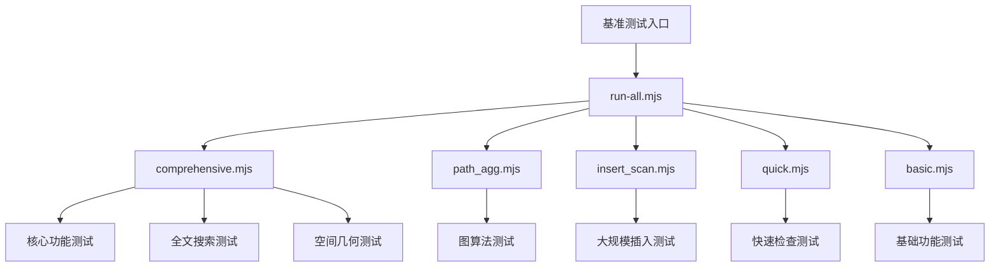

# 性能测试

<cite>
**本文档引用的文件**
- [performance_baseline.test.ts](file://tests/performance/performance_baseline.test.ts)
- [performance_large_insert.test.ts](file://tests/performance/performance_large_insert.test.ts)
- [property_index_performance.test.ts](file://tests/performance/property_index_performance.test.ts)
- [index.ts](file://src/benchmark/index.ts)
- [suites.ts](file://src/benchmark/suites.ts)
- [types.ts](file://src/benchmark/types.ts)
- [runner.ts](file://src/benchmark/runner.ts)
- [reporter.ts](file://src/benchmark/reporter.ts)
- [basic.mjs](file://benchmarks/basic.mjs)
- [comprehensive.mjs](file://benchmarks/comprehensive.mjs)
- [framework.mjs](file://benchmarks/framework.mjs)
- [insert_scan.mjs](file://benchmarks/insert_scan.mjs)
- [path_agg.mjs](file://benchmarks/path_agg.mjs)
- [quick.mjs](file://benchmarks/quick.mjs)
- [run-all.mjs](file://benchmarks/run-all.mjs) - *新增统一基准测试入口脚本*
- [benchmark.ts](file://src/cli/benchmark.ts) - *已弃用，迁移至外部脚本*
</cite>

## 更新摘要
**变更内容**
- 新增 `run-all.mjs` 统一基准测试入口脚本的文档说明
- 更新性能监控体系描述，反映从内部框架到外部脚本的迁移
- 修订运行基准测试与提交报告部分，推荐使用新的统一入口
- 标记内部基准测试框架为已弃用状态
- 更新文件引用列表，包含新脚本和已弃用文件

## 目录
1. [简介](#简介)
2. [性能监控体系](#性能监控体系)
3. [基线性能测试 (baseline)](#基线性能测试-baseline)
4. [大规模插入吞吐量测试 (large_insert)](#大规模插入吞吐量测试-large_insert)
5. [属性索引查询性能评估](#属性索引查询性能评估)
6. [性能瓶颈识别与配置对比](#性能瓶颈识别与配置对比)
7. [运行基准测试与提交报告](#运行基准测试与提交报告)
8. [结论](#结论)

## 简介
本文档旨在全面介绍 SynapseDB 的性能测试框架，重点阐述其关键路径的性能监控体系。文档将详细说明基线性能测试、大规模插入吞吐量测试以及属性索引查询性能评估的方法论。通过这些测试，贡献者可以系统地识别性能瓶颈，并量化不同配置（如压缩算法、WAL模式）对运行效率的影响。最终目标是为持续优化提供可靠的数据支持，并指导开发者如何运行和提交可对比的性能基准报告。

## 性能监控体系
SynapseDB 构建了一套分层且全面的性能监控体系，该体系由多个独立但相互关联的测试模块组成，覆盖了从核心数据操作到高级图算法的各个方面。

整个体系的核心是位于 `benchmarks` 目录下的外部脚本生态系统。**重要变更**：原有的内部基准测试框架（`src/benchmark`）已标记为弃用，将在 v2.0 版本中移除。现在推荐使用外部脚本进行基准测试。

体系的核心入口是 `benchmarks/run-all.mjs` 脚本，它提供与 CLI 兼容的统一接口，委托到现有的外部测试脚本。该脚本支持多种测试套件（`all`, `core`, `graph`, `spatial`, `quick`, `insert`, `path`）和输出格式（`console`, `json`, `html`, `csv`），并能生成包含环境信息和性能指标的综合报告。



**图源**
- [run-all.mjs](file://benchmarks/run-all.mjs) - *统一入口脚本*
- [comprehensive.mjs](file://benchmarks/comprehensive.mjs) - *综合测试脚本*
- [path_agg.mjs](file://benchmarks/path_agg.mjs) - *图算法测试脚本*

## 基线性能测试 (baseline)
基线性能测试（`performance_baseline.test.ts`）旨在评估 SynapseDB 在典型工作负载下的基本性能表现。该测试重点关注中等规模数据集的查询性能、数据库重新打开的加载性能以及内存占用情况。

测试用例包括：
- **中等数据集查询性能**：插入100条测试记录，测量插入时间、重新打开数据库的时间、全量查询时间和特定查询时间。
- **内存占用基准**：验证系统在重新打开数据库时不会将全部数据加载到内存，确保内存增长在合理范围内（少于10MB）。

该测试作为性能回归检测的基线，帮助识别架构重构或代码变更对核心性能的影响。

**节源**
- [performance_baseline.test.ts](file://tests/performance/performance_baseline.test.ts) - *基线性能测试实现*

## 大规模插入吞吐量测试 (large_insert)
大规模插入吞吐量测试（`performance_large_insert.test.ts`）用于评估系统在高负载下的数据写入能力。该测试通过插入大量记录来测量端到端的插入性能。

当前实现为占位用例，默认跳过以避免CI环境过慢。本地验证时可启用，建议插入10万条记录并统计耗时与页规模。测试应使用`beginBatch`和`commitBatch`进行批量操作，以获得最佳性能。

该测试对于评估不同配置（如WAL模式、压缩算法）对写入吞吐量的影响至关重要。

**节源**
- [performance_large_insert.test.ts](file://tests/performance/performance_large_insert.test.ts) - *大规模插入性能测试*

## 属性索引查询性能评估
属性索引查询性能评估（`property_index_performance.test.ts`）专注于测试带属性数据的索引构建和查询性能。该测试使用1万条带节点和边属性的事实记录，评估以下方面：

- **索引构建性能**：测量插入1万条带属性记录的总耗时。
- **等值查询性能**：基于属性值（如年龄=25）进行查询，要求在100ms内完成。
- **范围查询性能**：基于属性范围（如年龄20-30）进行查询，CI环境下要求在300ms内完成。
- **边属性查询性能**：基于边属性（如绩效>=8.5）进行查询，要求在150ms内完成。
- **链式查询性能**：组合属性过滤与链式查询，CI环境下要求在8秒内完成。

此外，测试还验证属性索引的内存使用情况和并发查询性能，确保系统在高负载下仍能保持稳定。

**节源**
- [property_index_performance.test.ts](file://tests/performance/property_index_performance.test.ts) - *属性索引性能测试实现*

## 性能瓶颈识别与配置对比
利用上述测试，贡献者可以系统地识别性能瓶颈并比较不同配置下的运行效率差异。

**性能瓶颈识别方法**：
1. 运行基线测试，建立性能基线。
2. 在目标配置下运行相同测试。
3. 使用回归检测功能比较结果，识别性能退化。
4. 分析慢速测试、高内存使用和低吞吐量的测试用例。

**配置对比示例**：
- **压缩算法对比**：比较不同压缩算法对插入吞吐量和查询延迟的影响。
- **WAL模式对比**：评估WAL模式（同步/异步）对写入性能和数据持久性的影响。
- **索引策略对比**：测试不同索引策略对查询性能的影响。

通过量化这些差异，可以为系统优化提供数据支持。

## 运行基准测试与提交报告
**重要变更**：基准测试现已迁移到外部脚本，内部框架已弃用。

### 推荐方法：使用统一入口脚本
```bash
# 运行所有测试套件
node benchmarks/run-all.mjs --suite=all --format=console,json --output=./reports

# 运行核心功能测试
node benchmarks/run-all.mjs --suite=core --format=json --output=./reports

# 运行图算法测试
node benchmarks/run-all.mjs --suite=graph --format=html --output=./reports
```

### 传统方法（已弃用）
```bash
# 通过CLI运行（内部已迁移到外部脚本）
pnpm benchmark run --format=console,html
```

### 提交可对比结果报告
1. 在相同硬件环境下运行基准测试。
2. 生成JSON格式的报告以便于比较。
3. 提交报告文件和测试环境信息（Node.js版本、操作系统、CPU、内存）。
4. 如果发现性能退化，附上回归检测报告。

**节源**
- [run-all.mjs](file://benchmarks/run-all.mjs) - *统一基准测试入口*
- [benchmark.ts](file://src/cli/benchmark.ts) - *已弃用的CLI实现*

## 结论
SynapseDB 的性能测试体系已成功迁移到外部脚本架构，提供了更灵活和可扩展的基准测试能力。通过基线测试、大规模插入测试和属性索引性能评估，贡献者可以全面监控系统性能，识别瓶颈，并量化优化效果。推荐使用 `benchmarks/run-all.mjs` 作为统一入口来运行和提交性能基准报告，以支持项目的持续优化决策。