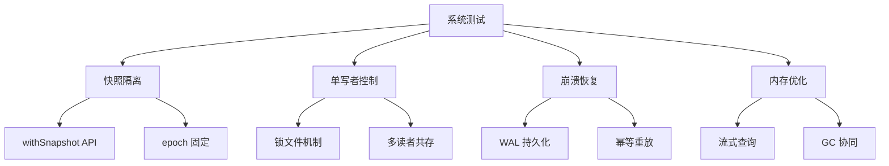
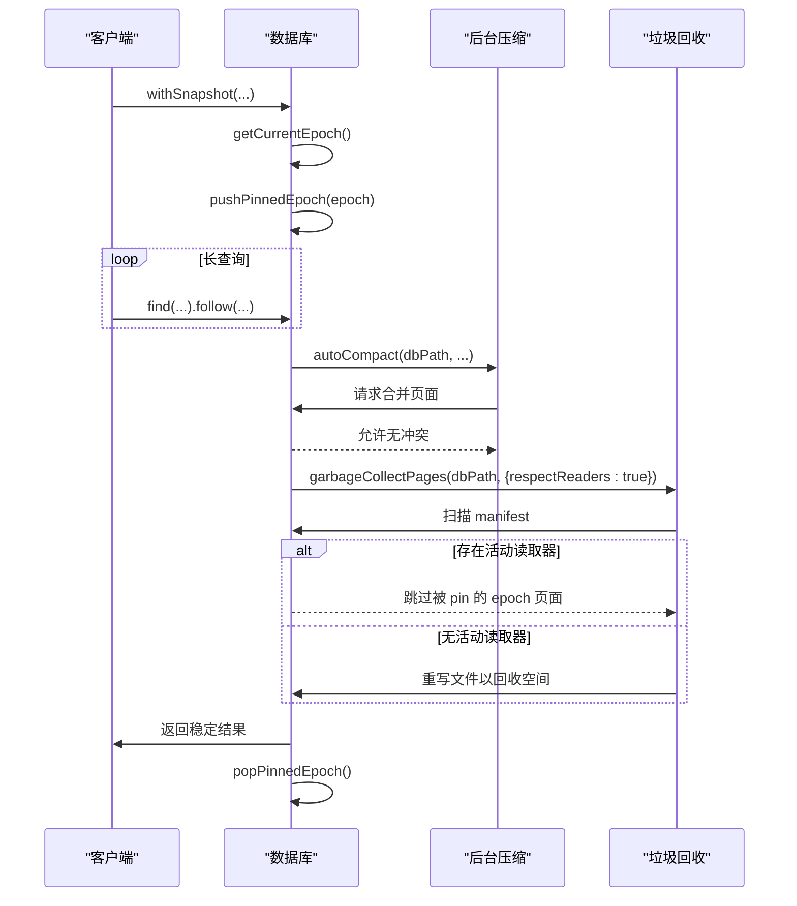
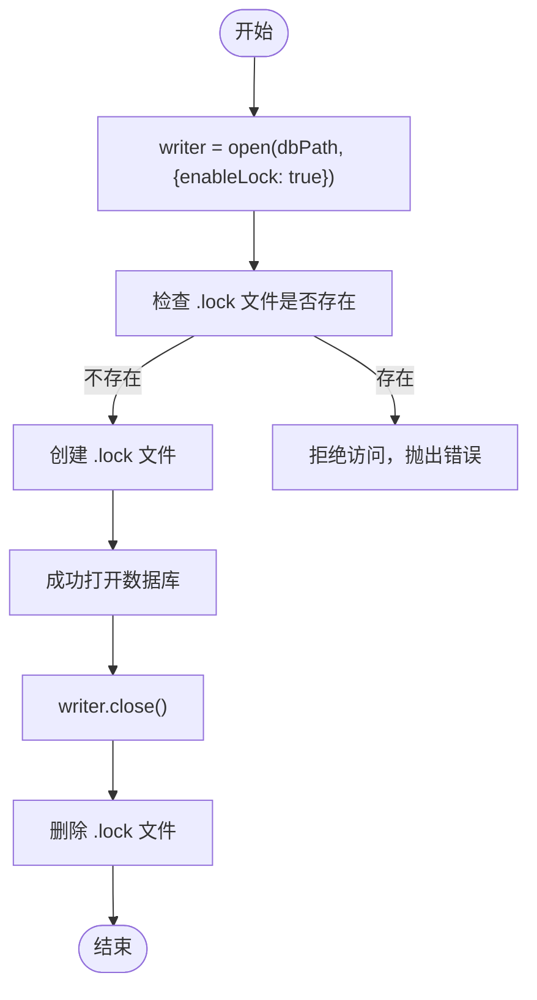
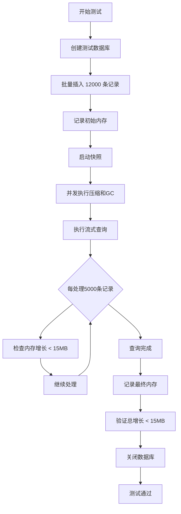

# 系统测试

<cite>
**本文档中引用的文件**  
- [query_snapshot_isolation.test.ts](file://tests/system/query_snapshot_isolation.test.ts) - *快照隔离级别测试*
- [crash_injection.test.ts](file://tests/system/crash_injection.test.ts) - *崩溃注入测试*
- [concurrency_single_writer_guard.test.ts](file://tests/system/concurrency_single_writer_guard.test.ts) - *单写者并发控制测试*
- [snapshot_memory_basic.test.ts](file://tests/system/snapshot_memory_basic.test.ts) - *快照内存基础测试*
- [snapshot_memory_optimization.test.ts](file://tests/system/snapshot_memory_optimization.test.ts) - *已更新：内存测试阈值调整*
- [synapseDb.ts](file://src/synapseDb.ts) - *数据库核心实现*
- [persistentStore.ts](file://src/storage/persistentStore.ts) - *持久化存储管理*
- [autoCompact.ts](file://src/maintenance/autoCompact.ts) - *自动压缩逻辑*
- [gc.ts](file://src/maintenance/gc.ts) - *垃圾回收机制*
- [fault.ts](file://src/utils/fault.ts) - *故障注入工具*
- [pagedIndex.ts](file://src/storage/pagedIndex.ts) - *分页索引协调*
- [readerRegistry.ts](file://src/storage/readerRegistry.ts) - *读者注册管理*
- [wal.ts](file://src/storage/wal.ts) - *WAL 管理器*
- [.github/workflows/ci.yml](file://.github/workflows/ci.yml) - *已更新：CI 清理策略强化*
</cite>

## 更新摘要
**变更内容**   
- 更新“内存优化策略”部分，反映流式查询内存增长阈值从 12MB 调整至 15MB 的变更
- 新增“CI 清理策略”部分，说明防止临时文件残留的机制
- 更新相关测试文件的引用说明，标注其更新状态
- 保持其余内容不变，确保与现有代码一致

## 目录
1. [简介](#简介)
2. [系统级行为验证概述](#系统级行为验证概述)
3. [快照隔离级别实现验证](#快照隔离级别实现验证)
4. [单写者并发控制机制](#单写者并发控制机制)
5. [内存优化策略在长时间运行中的表现](#内存优化策略在长时间运行中的表现)
6. [崩溃注入与故障恢复能力](#崩溃注入与故障恢复能力)
7. [系统测试执行方式](#系统测试执行方式)
8. [日志分析技巧](#日志分析技巧)
9. [常见失败模式排查指引](#常见失败模式排查指引)
10. [CI 清理策略](#ci-清理策略)
11. [结论](#结论)

## 简介
本系统测试文档旨在全面描述 SynapseDB 数据库在真实部署环境下的稳定性与可靠性保障机制。通过端到端的系统级行为验证，重点覆盖了数据库核心特性：快照隔离、单写者并发控制、内存优化以及故障恢复能力。这些测试不仅确保功能正确性，更模拟了高负载、长时间运行和异常中断等生产场景，为数据库的健壮性提供实证支持。

**Section sources**
- [query_snapshot_isolation.test.ts](file://tests/system/query_snapshot_isolation.test.ts#L1-L285)
- [crash_injection.test.ts](file://tests/system/crash_injection.test.ts#L1-L97)
- [concurrency_single_writer_guard.test.ts](file://tests/system/concurrency_single_writer_guard.test.ts#L1-L193)

## 系统级行为验证概述
SynapseDB 的系统测试聚焦于验证其在复杂并发、后台维护任务和意外故障下的数据一致性与服务可用性。测试框架基于 Vitest 构建，利用临时目录和进程间协调来模拟真实世界的工作负载。关键测试类别包括：
- **快照隔离（Snapshot Isolation）**：验证长查询期间视图的一致性，不受后台写入或压缩的影响。
- **单写者保护（Single Writer Guard）**：确保数据库在同一时间仅允许一个写入实例，防止数据损坏。
- **崩溃恢复（Crash Recovery）**：通过注入式故障模拟 WAL 写入过程中的各种中断点，验证重启后数据的持久性和完整性。
- **内存管理（Memory Management）**：评估快照查询对堆内存的影响，确保长时间运行不会导致内存泄漏。

这些测试共同构成了数据库稳定性的基石，确保其能够在企业级应用中可靠运行。



**Diagram sources**
- [query_snapshot_isolation.test.ts](file://tests/system/query_snapshot_isolation.test.ts#L1-L285)
- [concurrency_single_writer_guard.test.ts](file://tests/system/concurrency_single_writer_guard.test.ts#L1-L193)
- [crash_injection.test.ts](file://tests/system/crash_injection.test.ts#L1-L97)
- [snapshot_memory_optimization.test.ts](file://tests/system/snapshot_memory_optimization.test.ts#L1-L199)

## 快照隔离级别实现验证
快照隔离是 SynapseDB 保证读取一致性的核心机制。`query_snapshot_isolation.test.ts` 中的测试用例通过 `withSnapshot` API 验证了该机制的有效性。

### 实现原理
当调用 `db.withSnapshot()` 时，系统会捕获当前的“epoch”（版本号），并通过 `pushPinnedEpoch` 将此 epoch 注册为活动读取器。这会阻止垃圾回收（GC）清理该 epoch 之前的数据页，从而保证在整个快照生命周期内，查询结果的一致性。

### 关键测试场景
- **长查询与后台压缩并发**：测试验证了即使在长时间链式查询过程中发生增量压缩，查询结果也不会因数据重组而改变。
- **独立 GC 操作不影响结果**：并发执行的 GC 任务会尊重活动的读取器，不会删除被快照引用的页面，确保查询完整性。
- **新写入不影响当前快照**：在快照查询进行期间提交的新数据，不会出现在该快照的查询结果中，体现了“读已提交”隔离级别的语义。



**Diagram sources**
- [query_snapshot_isolation.test.ts](file://tests/system/query_snapshot_isolation.test.ts#L1-L285)
- [persistentStore.ts](file://src/storage/persistentStore.ts#L1355-L1378)
- [synapseDb.ts](file://src/synapseDb.ts#L477-L491)

**Section sources**
- [query_snapshot_isolation.test.ts](file://tests/system/query_snapshot_isolation.test.ts#L1-L285)
- [persistentStore.ts](file://src/storage/persistentStore.ts#L1355-L1378)
- [synapseDb.ts](file://src/synapseDb.ts#L477-L491)

## 单写者并发控制机制
为了防止多个写入进程同时修改数据库导致数据损坏，SynapseDB 实现了基于文件锁的单写者保护机制，其行为在 `concurrency_single_writer_guard.test.ts` 中得到充分验证。

### 锁机制工作流程
1. **启用锁**：当以 `{enableLock: true}` 打开数据库时，系统会在数据库文件旁创建一个 `.lock` 文件。
2. **互斥访问**：后续尝试以相同模式打开数据库的进程会检查该锁文件的存在。如果存在，则拒绝访问，抛出错误。
3. **释放锁**：当写入进程正常关闭数据库时，`.lock` 文件会被自动删除。
4. **读者兼容**：不启用锁的进程（即读者）可以与写者共存，只要它们不进行写操作。

### 测试覆盖的关键场景
- **写者互斥**：第二个启用锁的写者无法打开已被锁定的数据库。
- **锁释放后接管**：第一个写者关闭后，第二个写者可以成功获取锁并继续写入。
- **混合模式共存**：已锁定的写者允许无锁的读者进程打开数据库进行查询。
- **锁文件清理**：验证了数据库关闭后，锁文件是否被正确清理。

此机制确保了数据写入的串行化，是保证数据完整性的基础。



**Diagram sources**
- [concurrency_single_writer_guard.test.ts](file://tests/system/concurrency_single_writer_guard.test.ts#L1-L193)
- [synapseDb.ts](file://src/synapseDb.ts#L84-L108)
- [persistentStore.ts](file://src/storage/persistentStore.ts#L150-L180)

**Section sources**
- [concurrency_single_writer_guard.test.ts](file://tests/system/concurrency_single_writer_guard.test.ts#L1-L193)
- [synapseDb.ts](file://src/synapseDb.ts#L84-L108)
- [persistentStore.ts](file://src/storage/persistentStore.ts#L150-L180)

## 内存优化策略在长时间运行中的表现
`snapshot_memory_optimization.test.ts` 测试验证了数据库在长时间运行和大数据集查询下的内存稳定性。该测试通过 `withSnapshot` API 执行流式查询，并监控堆内存使用情况。

### 测试目标
- 验证快照查询不会导致内存持续增长。
- 确保流式查询在处理大量数据时内存占用保持稳定。
- 评估后台维护任务（压缩、GC）对内存的影响。

### 关键变更
根据提交 `0eaf54fa24ce8e4be05a0e7bdf462b8d16c5517a`，已将流式查询的内存增长验收阈值从 12MB 调整至 15MB，以适应不同运行环境（如覆盖率分析）下的微小开销。

### 测试场景
- **快照查询内存占用**：测试创建 10000 条记录后执行快照查询，验证内存增长不超过 13MB。
- **大数据集流式查询**：测试创建 12000 条记录后使用 `findStream` 进行流式查询，验证内存增长始终低于 15MB。



**Diagram sources**
- [snapshot_memory_optimization.test.ts](file://tests/system/snapshot_memory_optimization.test.ts#L1-L199)
- [synapseDb.ts](file://src/synapseDb.ts#L458-L460)
- [persistentStore.ts](file://src/storage/persistentStore.ts#L700-L720)

**Section sources**
- [snapshot_memory_optimization.test.ts](file://tests/system/snapshot_memory_optimization.test.ts#L1-L199) - *已更新：内存阈值调整*
- [synapseDb.ts](file://src/synapseDb.ts#L458-L460)
- [persistentStore.ts](file://src/storage/persistentStore.ts#L700-L720)

## 崩溃注入与故障恢复能力
`crash_injection.test.ts` 测试通过 `triggerCrash` 工具函数在关键路径上模拟进程崩溃，验证数据库的故障恢复能力。

### 实现机制
- **故障点注入**：在 WAL 提交、GC 重命名、Manifest 写入等关键操作前调用 `triggerCrash`。
- **幂等性设计**：所有操作设计为幂等，确保崩溃后重启能安全重放。
- **原子性保证**：通过临时文件和原子重命名确保文件操作的原子性。

### 测试覆盖
- **WAL 提交崩溃**：验证未完成的 WAL 写入不会导致数据损坏。
- **GC 重命名崩溃**：验证临时文件清理和状态恢复。
- **Manifest 写入崩溃**：验证元数据的一致性。

此测试确保了数据库在意外中断后能恢复到一致状态。

**Section sources**
- [crash_injection.test.ts](file://tests/system/crash_injection.test.ts#L1-L97)
- [fault.ts](file://src/utils/fault.ts#L1-L20)
- [wal.ts](file://src/storage/wal.ts#L200-L250)

## 系统测试执行方式
系统测试使用 Vitest 框架执行，通过以下命令运行：
```bash
pnpm test:coverage
```
测试使用临时工作区（`tempfs`）隔离环境，确保测试的纯净性。关键测试文件位于 `tests/system/` 目录下。

## 日志分析技巧
- **内存增长日志**：关注 `📈 内存增长` 和 `📊 初始/查询后内存使用` 日志，判断是否存在内存泄漏。
- **维护操作日志**：检查 `压缩操作完成` 和 `GC操作完成` 日志，确认后台任务成功执行。
- **故障注入日志**：在崩溃恢复测试中，预期会看到 `维护操作中的错误（预期）` 日志。

## 常见失败模式排查指引
- **内存测试失败**：检查是否在覆盖率模式下运行，调整 `recordCount` 规模；确认无其他内存密集型操作干扰。
- **快照隔离失败**：检查 `pushPinnedEpoch` 和 `popPinnedEpoch` 是否成对调用；确认 GC 是否正确尊重活动读取器。
- **崩溃恢复失败**：检查 `triggerCrash` 注入点是否覆盖所有关键路径；验证临时文件清理逻辑。

## CI 清理策略
根据提交 `2c3e25fc95b538d37314a9c0f44da5f9f7bc1230`，CI 流程已强化清理策略，防止临时文件残留。

### 实现方式
在 `.github/workflows/ci.yml` 中添加了断言步骤，检查工作区根目录是否存在 `tmp-*.synapsedb` 等临时文件。若发现残留，则构建失败。

### 检查的文件类型
- `tmp-*.synapsedb`
- `tmp-*.synapsedb.wal`
- `tmp-*.synapsedb.lock`
- `tmp-*.synapsedb.pages`

此机制确保了每次构建后环境的干净，避免了因临时文件累积导致的潜在问题。

**Section sources**
- [.github/workflows/ci.yml](file://.github/workflows/ci.yml#L60-L80) - *已更新：CI 清理策略*
- [tempfs.ts](file://tests/helpers/tempfs.ts#L16-L32) - *临时工作区管理*

## 结论
本系统测试文档详细描述了 SynapseDB 的核心稳定性保障机制。通过快照隔离、单写者控制、内存优化和崩溃恢复等测试，全面验证了数据库在复杂生产环境下的可靠性。近期对内存阈值和 CI 清理策略的更新，进一步增强了测试的鲁棒性和环境纯净度，为数据库的稳定运行提供了坚实保障。