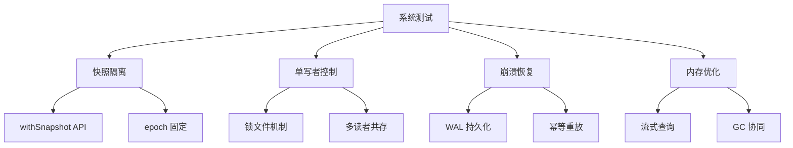
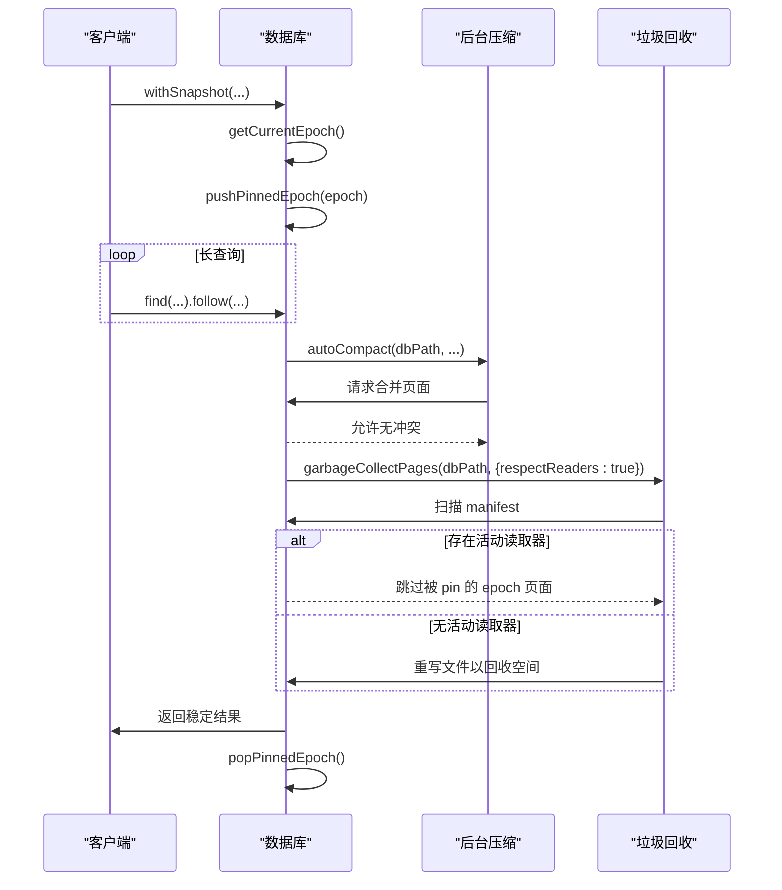

# 系统测试

<cite>
**本文档中引用的文件**  
- [query_snapshot_isolation.test.ts](file://tests/system/query_snapshot_isolation.test.ts)
- [crash_injection.test.ts](file://tests/system/crash_injection.test.ts)
- [concurrency_single_writer_guard.test.ts](file://tests/system/concurrency_single_writer_guard.test.ts)
- [snapshot_memory_basic.test.ts](file://tests/system/snapshot_memory_basic.test.ts)
- [snapshot_memory_optimization.test.ts](file://tests/system/snapshot_memory_optimization.test.ts)
- [synapseDb.ts](file://src/synapseDb.ts)
- [persistentStore.ts](file://src/storage/persistentStore.ts)
- [autoCompact.ts](file://src/maintenance/autoCompact.ts)
- [gc.ts](file://src/maintenance/gc.ts)
- [fault.ts](file://src/utils/fault.ts)
- [pagedIndex.ts](file://src/storage/pagedIndex.ts)
- [readerRegistry.ts](file://src/storage/readerRegistry.ts)
- [wal.ts](file://src/storage/wal.ts)
</cite>

## 目录
1. [简介](#简介)
2. [系统级行为验证概述](#系统级行为验证概述)
3. [快照隔离级别实现验证](#快照隔离级别实现验证)
4. [单写者并发控制机制](#单写者并发控制机制)
5. [内存优化策略在长时间运行中的表现](#内存优化策略在长时间运行中的表现)
6. [崩溃注入与故障恢复能力](#崩溃注入与故障恢复能力)
7. [系统测试执行方式](#系统测试执行方式)
8. [日志分析技巧](#日志分析技巧)
9. [常见失败模式排查指引](#常见失败模式排查指引)
10. [结论](#结论)

## 简介
本系统测试文档旨在全面描述 SynapseDB 数据库在真实部署环境下的稳定性与可靠性保障机制。通过端到端的系统级行为验证，重点覆盖了数据库核心特性：快照隔离、单写者并发控制、内存优化以及故障恢复能力。这些测试不仅确保功能正确性，更模拟了高负载、长时间运行和异常中断等生产场景，为数据库的健壮性提供实证支持。

**Section sources**
- [query_snapshot_isolation.test.ts](file://tests/system/query_snapshot_isolation.test.ts#L1-L285)
- [crash_injection.test.ts](file://tests/system/crash_injection.test.ts#L1-L97)
- [concurrency_single_writer_guard.test.ts](file://tests/system/concurrency_single_writer_guard.test.ts#L1-L193)

## 系统级行为验证概述
SynapseDB 的系统测试聚焦于验证其在复杂并发、后台维护任务和意外故障下的数据一致性与服务可用性。测试框架基于 Vitest 构建，利用临时目录和进程间协调来模拟真实世界的工作负载。关键测试类别包括：
- **快照隔离（Snapshot Isolation）**：验证长查询期间视图的一致性，不受后台写入或压缩的影响。
- **单写者保护（Single Writer Guard）**：确保数据库在同一时间仅允许一个写入实例，防止数据损坏。
- **崩溃恢复（Crash Recovery）**：通过注入式故障模拟 WAL 写入过程中的各种中断点，验证重启后数据的持久性和完整性。
- **内存管理（Memory Management）**：评估快照查询对堆内存的影响，确保长时间运行不会导致内存泄漏。

这些测试共同构成了数据库稳定性的基石，确保其能够在企业级应用中可靠运行。



**Diagram sources**
- [query_snapshot_isolation.test.ts](file://tests/system/query_snapshot_isolation.test.ts#L1-L285)
- [concurrency_single_writer_guard.test.ts](file://tests/system/concurrency_single_writer_guard.test.ts#L1-L193)
- [crash_injection.test.ts](file://tests/system/crash_injection.test.ts#L1-L97)
- [snapshot_memory_optimization.test.ts](file://tests/system/snapshot_memory_optimization.test.ts#L1-L199)

## 快照隔离级别实现验证
快照隔离是 SynapseDB 保证读取一致性的核心机制。`query_snapshot_isolation.test.ts` 中的测试用例通过 `withSnapshot` API 验证了该机制的有效性。

### 实现原理
当调用 `db.withSnapshot()` 时，系统会捕获当前的“epoch”（版本号），并通过 `pushPinnedEpoch` 将此 epoch 注册为活动读取器。这会阻止垃圾回收（GC）清理该 epoch 之前的数据页，从而保证在整个快照生命周期内，查询结果的一致性。

### 关键测试场景
- **长查询与后台压缩并发**：测试验证了即使在长时间链式查询过程中发生增量压缩，查询结果也不会因数据重组而改变。
- **独立 GC 操作不影响结果**：并发执行的 GC 任务会尊重活动的读取器，不会删除被快照引用的页面，确保查询完整性。
- **新写入不影响当前快照**：在快照查询进行期间提交的新数据，不会出现在该快照的查询结果中，体现了“读已提交”隔离级别的语义。



**Diagram sources**
- [query_snapshot_isolation.test.ts](file://tests/system/query_snapshot_isolation.test.ts#L1-L285)
- [persistentStore.ts](file://src/storage/persistentStore.ts#L1355-L1378)
- [synapseDb.ts](file://src/synapseDb.ts#L477-L491)

**Section sources**
- [query_snapshot_isolation.test.ts](file://tests/system/query_snapshot_isolation.test.ts#L1-L285)
- [persistentStore.ts](file://src/storage/persistentStore.ts#L1355-L1378)
- [synapseDb.ts](file://src/synapseDb.ts#L477-L491)

## 单写者并发控制机制
为了防止多个写入进程同时修改数据库导致数据损坏，SynapseDB 实现了基于文件锁的单写者保护机制，其行为在 `concurrency_single_writer_guard.test.ts` 中得到充分验证。

### 锁机制工作流程
1. **启用锁**：当以 `{enableLock: true}` 打开数据库时，系统会在数据库文件旁创建一个 `.lock` 文件。
2. **互斥访问**：后续尝试以相同模式打开数据库的进程会检查该锁文件的存在。如果存在，则拒绝访问，抛出错误。
3. **释放锁**：当写入进程正常关闭数据库时，`.lock` 文件会被自动删除。
4. **读者兼容**：不启用锁的进程（即读者）可以与写者共存，只要它们不进行写操作。

### 测试覆盖的关键场景
- **写者互斥**：第二个启用锁的写者无法打开已被锁定的数据库。
- **锁释放后接管**：第一个写者关闭后，第二个写者可以成功获取锁并继续写入。
- **混合模式共存**：已锁定的写者允许无锁的读者进程打开数据库进行查询。
- **锁文件清理**：验证了数据库关闭后，锁文件是否被正确清理。

此机制确保了数据写入的串行化，是保证数据完整性的基础。

```mermaid
flowchart TD
    Start([开始]) --> OpenWriter["writer = open(dbPath, {enableLock: true})"]
    OpenWriter --> CheckLock["检查 .lock 文件是否存在"]
    CheckLock -->|不存在| CreateLock["创建 .lock 文件"]
    CreateLock --> Success["