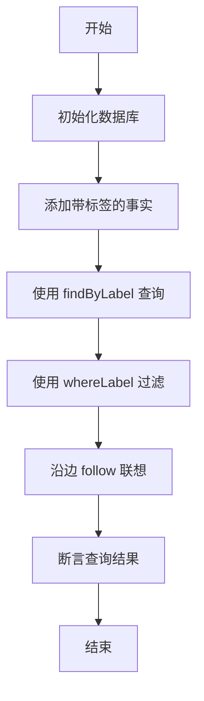
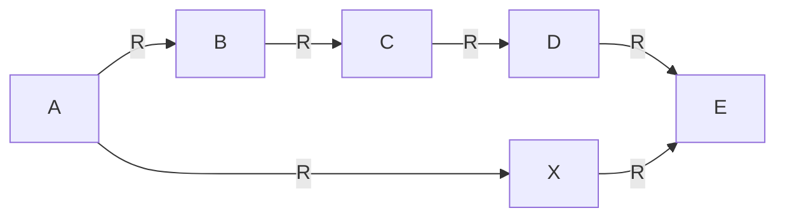
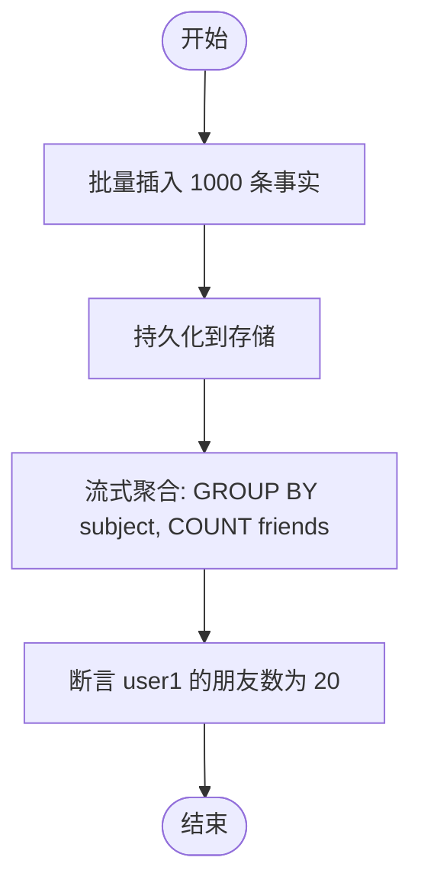
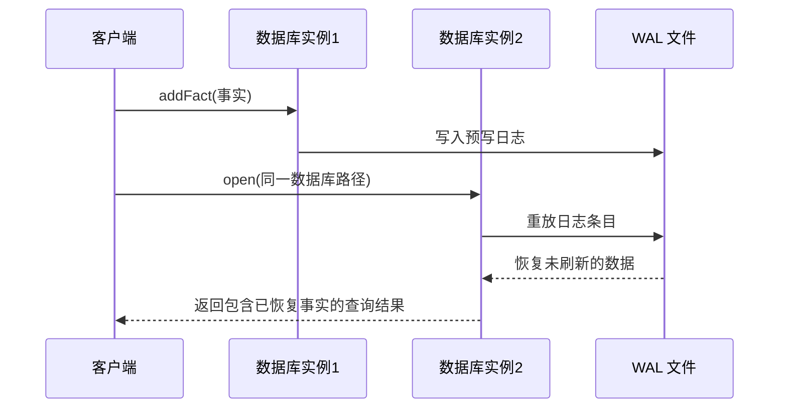
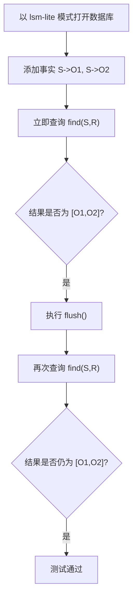
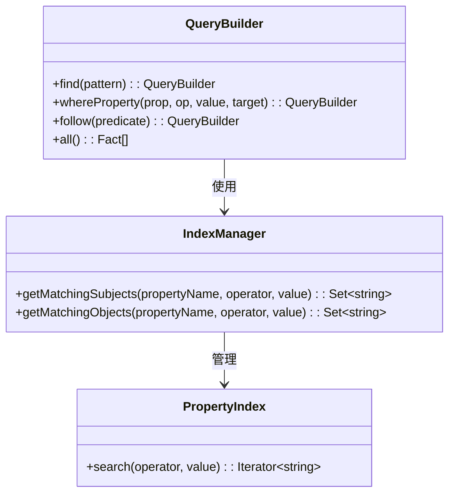
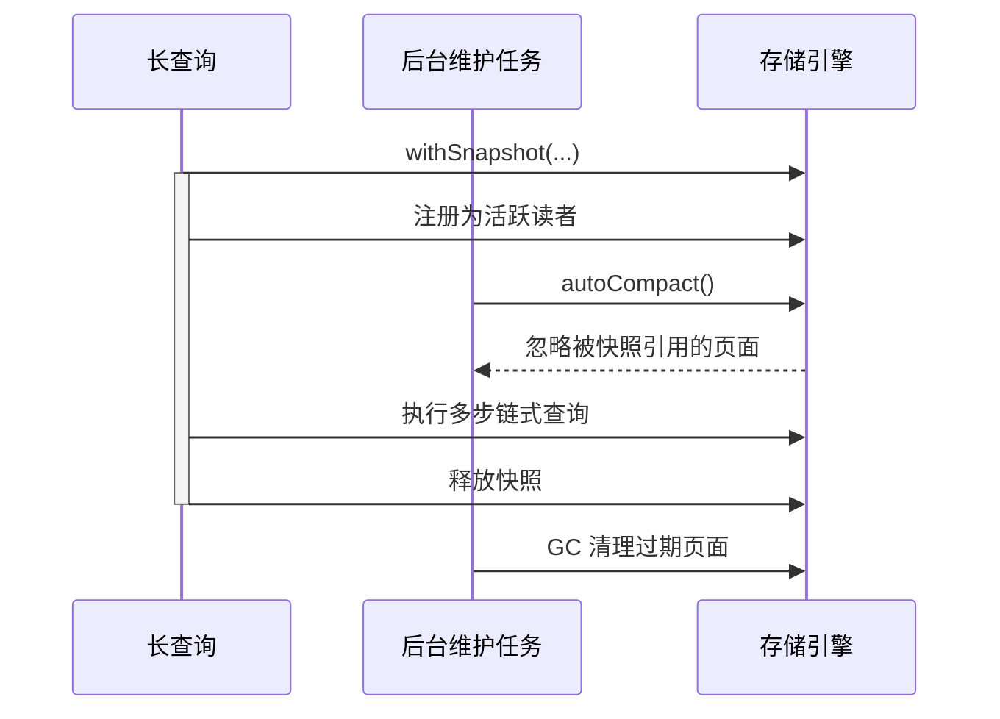

# 集成测试

<cite>
**本文档中引用的文件**  
- [label_system.test.ts](file://tests/integration/graph/label_system.test.ts)
- [cypher_basic.test.ts](file://tests/integration/query/standards/cypher_basic.test.ts)
- [graphql_basic.test.ts](file://tests/integration/query/standards/graphql_basic.test.ts)
- [gremlin_basic.test.ts](file://tests/integration/query/standards/gremlin_basic.test.ts)
- [shortest_path_bidirectional.test.ts](file://tests/integration/query/path/shortest_path_bidirectional.test.ts)
- [aggregation_streaming.test.ts](file://tests/integration/query/aggregation_streaming.test.ts)
- [wal.test.ts](file://tests/integration/storage/wal.test.ts)
- [lsm_lite_staging.test.ts](file://tests/integration/storage/lsm_lite_staging.test.ts)
- [property_index_integration.test.ts](file://tests/integration/storage/property_index_integration.test.ts)
- [property_index_pushdown.test.ts](file://tests/integration/query/property_index_pushdown.test.ts)
- [query_snapshot_isolation.test.ts](file://tests/system/query_snapshot_isolation.test.ts)
</cite>

## 目录
1. [引言](#引言)
2. [模块集成验证策略](#模块集成验证策略)
3. [图系统与查询引擎集成测试](#图系统与查询引擎集成测试)
4. [查询引擎多语言互操作性测试](#查询引擎多语言互操作性测试)
5. [存储引擎核心机制集成验证](#存储引擎核心机制集成验证)
6. [复杂场景下的数据一致性保障](#复杂场景下的数据一致性保障)
7. [开发者指南：编写新的集成测试](#开发者指南编写新的集成测试)
8. [结论](#结论)

## 引言
SynapseDB 是一个融合图系统、多语言查询引擎和高性能存储引擎的复合型数据库。其核心优势在于跨模块的深度协同，而集成测试是确保这种协同稳定可靠的关键手段。本文档旨在阐述 SynapseDB 中跨模块协作的集成测试方法，重点覆盖图系统（标签管理）、查询引擎（Cypher/GraphQL/Gremlin 多语言互操作、路径查找、聚合流式处理）与存储引擎（WAL 持久化、LSM-Lite 合并、属性索引下推）之间的交互验证。通过分析实际测试用例，揭示在事务日志同步、索引更新延迟、读写并发控制等复杂场景下的数据一致性保障机制，并为开发者提供编写新集成测试的实践指导。

**本节不涉及具体源码文件分析，因此无“节来源”**

## 模块集成验证策略
SynapseDB 的集成测试采用分层验证策略，从单一功能点到多组件协同，再到系统级压力与隔离性测试。测试框架基于 Vitest，利用临时目录和内存数据库进行环境隔离，确保测试的独立性和可重复性。每个测试用例都遵循 `beforeEach` 初始化和 `afterEach` 清理的模式，精确控制测试生命周期。关键的验证策略包括：
- **状态断言**：在执行特定操作后，立即验证系统的内部状态或查询结果是否符合预期。
- **行为观察**：通过模拟崩溃（如不调用 `flush`）来验证 WAL 的恢复能力，或通过并发操作来观察锁和快照的行为。
- **性能对比**：在相同数据集上对比不同实现（如普通过滤 vs 索引下推）的执行时间，量化优化效果。
- **边界条件测试**：验证对空查询、不存在的 ID、错误语法等异常情况的处理。

**节来源**
- [cypher_basic.test.ts](file://tests/integration/query/standards/cypher_basic.test.ts#L0-L138)
- [graphql_basic.test.ts](file://tests/integration/query/standards/graphql_basic.test.ts#L0-L363)
- [gremlin_basic.test.ts](file://tests/integration/query/standards/gremlin_basic.test.ts#L0-L311)

## 图系统与查询引擎集成测试
图系统的标签管理功能与查询引擎紧密集成，允许用户通过标签快速筛选和关联实体。`label_system.test.ts` 测试用例验证了这一集成的有效性。

**图来源**
- [label_system.test.ts](file://tests/integration/graph/label_system.test.ts#L0-L51)

该测试首先向数据库添加带有 "Person" 和 "Developer" 标签的节点。随后，它使用 `findByLabel('Person')` 作为查询起点，并结合 `whereLabel('Person')` 在链式查询中进行过滤，最后通过 `follow('KNOWS')` 查找关系。测试成功验证了标签可以作为高效的查询入口点，并且能在复杂的链式遍历中保持正确的语义。

**节来源**
- [label_system.test.ts](file://tests/integration/graph/label_system.test.ts#L0-L51)

## 查询引擎多语言互操作性测试
SynapseDB 支持 Cypher、GraphQL 和 Gremlin 三种主流图查询语言。集成测试不仅验证每种语言的基础功能，更关注它们在路径查找和流式聚合等高级特性上的表现。

### 路径查找算法验证
路径查找是图数据库的核心功能。`shortest_path_bidirectional.test.ts` 测试用例构建了一个包含两条路径（A->B->C->D->E 和 A->X->E）的图，并比较了单向 BFS 和双向 BFS 算法的结果。

**图来源**
- [shortest_path_bidirectional.test.ts](file://tests/integration/query/path/shortest_path_bidirectional.test.ts#L0-L42)

测试断言两种算法都能找到最短路径 A->X->E，并且返回的路径长度和内容完全一致。这确保了不同实现的算法在功能上是等价的，为用户提供了一致的体验。

### 流式聚合处理
对于大数据量的聚合操作，流式处理至关重要。`aggregation_streaming.test.ts` 测试用例插入了大量事实（50个用户，每人20个朋友），然后使用 `executeStreaming()` 方法执行 COUNT/GROUP BY 操作。

**图来源**
- [aggregation_streaming.test.ts](file://tests/integration/query/aggregation_streaming.test.ts#L0-L42)

该测试验证了聚合引擎能够在不将所有中间结果加载到内存的情况下完成计算，从而保证了在处理海量数据时的内存友好性和稳定性。

**节来源**
- [shortest_path_bidirectional.test.ts](file://tests/integration/query/path/shortest_path_bidirectional.test.ts#L0-L42)
- [aggregation_streaming.test.ts](file://tests/integration/query/aggregation_streaming.test.ts#L0-L42)

## 存储引擎核心机制集成验证
存储引擎是 SynapseDB 可靠性和性能的基石。集成测试深入验证了其核心机制的正确性。

### WAL 持久化与恢复
WAL (Write-Ahead Log) 机制确保了数据的持久性。`wal.test.ts` 测试用例模拟了数据库崩溃的场景：在一个实例中写入数据但不调用 `flush()`，然后立即打开另一个实例。

**图来源**
- [wal.test.ts](file://tests/integration/storage/wal.test.ts#L0-L61)

测试成功地从 WAL 文件中重放了未持久化的写入操作，证明了即使在意外崩溃后，数据也不会丢失。

### LSM-Lite 合并与可见性
LSM-Lite 结构通过合并操作来优化读取性能。`lsm_lite_staging.test.ts` 测试用例验证了在开启 `stagingMode=lsm-lite` 时，新增事实的即时查询结果与 `flush` 后的结果完全一致。

**图来源**
- [lsm_lite_staging.test.ts](file://tests/integration/storage/lsm_lite_staging.test.ts#L0-L64)

这确保了 LSM-Lite 的暂存机制对上层应用是透明的，用户无需关心数据何时被物理合并，即可获得强一致性的读取视图。

### 属性索引下推
属性索引下推是一种重要的查询优化技术。`property_index_pushdown.test.ts` 测试用例全面验证了该功能，包括等值查询、范围查询、边属性过滤以及与链式查询的组合。

**图来源**
- [property_index_pushdown.test.ts](file://tests/integration/query/property_index_pushdown.test.ts#L0-L253)

测试还包含一个性能对比实验，证明了索引下推在大数据集上的查询速度远超普通过滤器 (`where((r) => r.prop === 'value')`)，显著提升了查询效率。

**节来源**
- [wal.test.ts](file://tests/integration/storage/wal.test.ts#L0-L61)
- [lsm_lite_staging.test.ts](file://tests/integration/storage/lsm_lite_staging.test.ts#L0-L64)
- [property_index_pushdown.test.ts](file://tests/integration/query/property_index_pushdown.test.ts#L0-L253)

## 复杂场景下的数据一致性保障
在高并发和长时间运行的查询场景下，数据一致性面临严峻挑战。`query_snapshot_isolation.test.ts` 测试用例设计了一系列复杂的并发场景来验证系统的健壮性。

### 快照隔离与后台维护
该测试的核心是 `withSnapshot` API，它为长查询创建一个时间点快照。在此期间，后台可以安全地执行自动压缩 (`autoCompact`) 和垃圾回收 (`garbageCollectPages`)。

**图来源**
- [query_snapshot_isolation.test.ts](file://tests/system/query_snapshot_isolation.test.ts#L0-L285)

测试用例验证了，即使在查询过程中发生了页面合并和 epoch 推进，快照内的查询结果依然完整且一致，不会出现数据错乱或丢失。这得益于存储引擎中的读者注册机制，它能阻止正在被使用的旧版本页面被过早回收。

### 并发读写隔离
另一个测试场景是在多个并发快照查询进行时，向数据库写入新数据并执行维护任务。测试断言，每个快照查询只能看到其开始时刻之前的数据，而无法感知到新写入的内容。同时，快照结束后，外部查询能够立即看到所有新数据。这完美地实现了 MVCC (多版本并发控制) 的快照隔离级别。

**节来源**
- [query_snapshot_isolation.test.ts](file://tests/system/query_snapshot_isolation.test.ts#L0-L285)

## 开发者指南：编写新的集成测试
为了帮助开发者编写高质量的集成测试，以下是一些最佳实践：

### 环境搭建
始终使用 `mkdtemp` 创建唯一的临时目录来存放测试数据库文件，避免测试间的相互干扰。在 `beforeEach` 中打开数据库，在 `afterEach` 中务必调用 `db.close()` 并清理临时文件。

### 组件注入与依赖管理
直接通过 `import` 引入需要测试的模块（如 `SynapseDB`, `autoCompact`）。对于需要模拟的外部依赖，应考虑在单元测试中进行，集成测试应尽可能使用真实组件。

### 状态断言
使用 Vitest 的 `expect` 断言库来验证结果。对于集合，使用 `.toHaveLength()` 和 `.toEqual()`；对于异步操作，使用 `await expect(...).resolves` 或 `rejects`。

### 清理策略
清理逻辑必须健壮。使用 `try...catch` 包裹文件删除操作，并对可能存在的竞态条件（如目录非空）进行重试。确保 `afterEach` 钩子不会因为清理失败而中断。

**节来源**
- [wal.test.ts](file://tests/integration/storage/wal.test.ts#L0-L61)
- [lsm_lite_staging.test.ts](file://tests/integration/storage/lsm_lite_staging.test.ts#L0-L64)
- [query_snapshot_isolation.test.ts](file://tests/system/query_snapshot_isolation.test.ts#L0-L285)

## 结论
SynapseDB 的集成测试体系全面覆盖了图系统、查询引擎和存储引擎之间的关键交互点。通过精心设计的测试用例，系统在数据持久性、查询性能、并发控制和复杂场景下的数据一致性方面得到了充分验证。这些测试不仅是质量的守护者，也为开发者提供了清晰的实现参考。遵循本文档的指导，开发者可以有效地扩展测试套件，确保 SynapseDB 在不断演进的过程中始终保持卓越的稳定性和可靠性。

**本节为总结性内容，不涉及具体源码文件分析，因此无“节来源”**