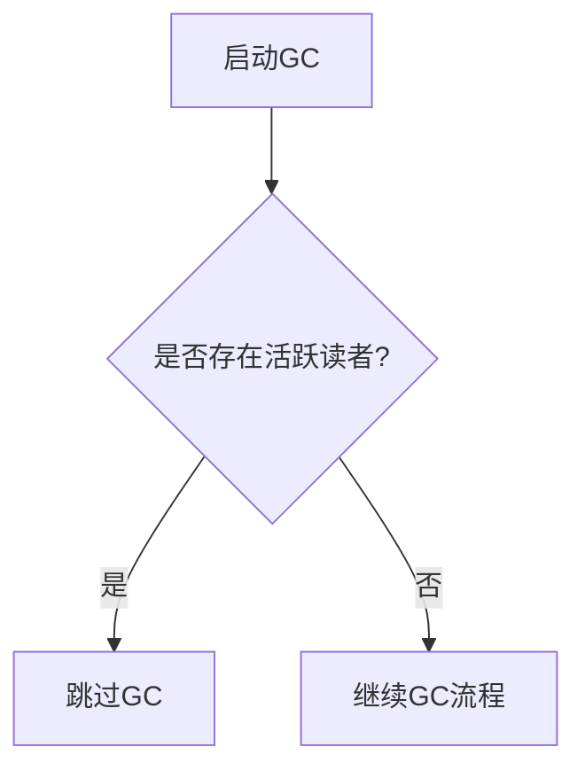
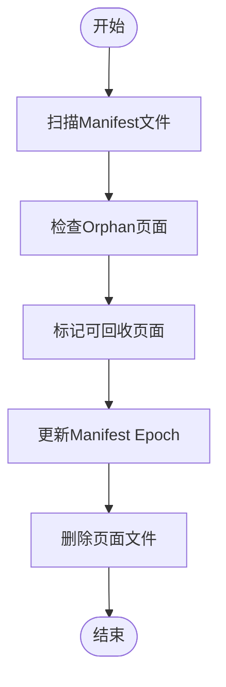
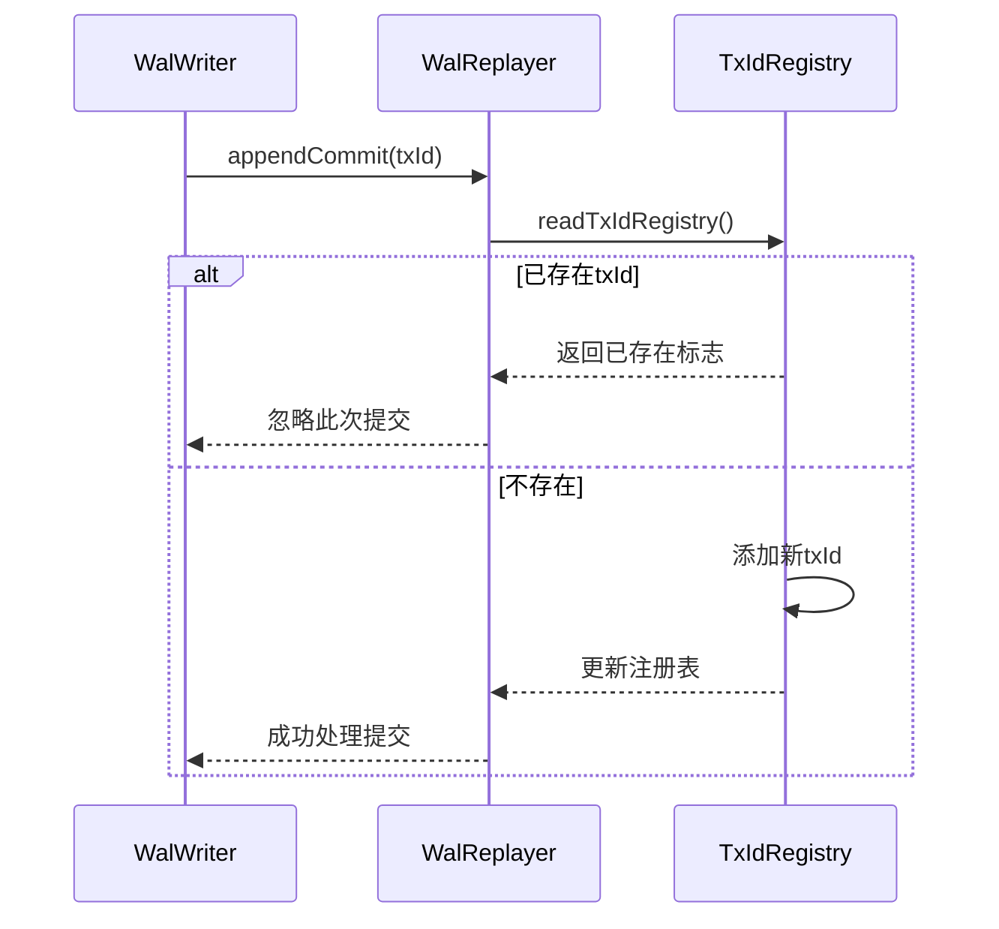

# 垃圾回收

<cite>
**本文档引用文件**  
- [gc.ts](file://src/cli/gc.ts)
- [gc.ts](file://src/maintenance/gc.ts)
- [pagedIndex.ts](file://src/storage/pagedIndex.ts)
- [readerRegistry.ts](file://src/storage/readerRegistry.ts)
- [wal.ts](file://src/storage/wal.ts)
- [txidRegistry.ts](file://src/storage/txidRegistry.ts)
- [gc_pages.test.ts](file://tests/integration/maintenance/gc_pages.test.ts)
- [gc_respect_readers.test.ts](file://tests/integration/maintenance/gc_respect_readers.test.ts)
</cite>

## 目录
1. [引言](#引言)
2. [GC设计与安全执行机制](#gc设计与安全执行机制)
3. [扫描流程、标记与清除策略](#扫描流程标记与清除策略)
4. [WAL日志中事务ID的幂等性保障](#wal日志中事务id的幂等性保障)
5. [操作方式示例](#操作方式示例)
6. [存储空间释放效果评估与监控指标](#存储空间释放效果评估与监控指标)
7. [潜在风险点及规避措施](#潜在风险点及规避措施)
8. [结论](#结论)

## 引言
SynapseDB 的垃圾回收（GC）系统旨在清理已被删除且不再被任何快照引用的数据页面。该系统通过协调读事务快照，确保不会回收仍在使用的页面。本文档将全面阐述其设计原理和安全执行机制。

## GC设计与安全执行机制
垃圾回收系统的核心在于识别并清理增量重写后不再被引用的 `orphans` 页面。为了保证数据一致性，在有活跃读者时，默认启用尊重策略以避免中断长查询。

### 协调机制
GC 与读事务快照之间的协调依赖于 `readerRegistry` 模块。当存在活跃读者时，GC 将跳过执行，从而保护正在进行的查询不受影响。



**图源**
- [readerRegistry.ts](file://src/storage/readerRegistry.ts#L0-L208)
- [gc.ts](file://src/maintenance/gc.ts#L0-L116)

**节源**
- [readerRegistry.ts](file://src/storage/readerRegistry.ts#L0-L208)
- [gc.ts](file://src/maintenance/gc.ts#L0-L116)

## 扫描流程标记与清除策略
GC 的工作分为几个阶段：扫描、标记以及最终的清除。

### 扫描流程
首先，GC 会读取分页索引的 manifest 文件来获取所有当前有效的页面信息。接着遍历每个顺序下的页面列表，并检查它们是否仍然被引用。

### 标记阶段
对于每一个未被引用的页面，即所谓的孤儿页（orphan），它会被标记为可回收状态。这些信息会被记录在 manifest 文件中的 orphans 字段里。

### 清除策略
一旦确定了哪些页面可以安全地移除，GC 便会执行实际的物理删除操作。这包括更新 manifest 文件以反映新的 epoch 值，并从磁盘上移除对应的文件块。



**图源**
- [pagedIndex.ts](file://src/storage/pagedIndex.ts#L0-L425)
- [gc.ts](file://src/maintenance/gc.ts#L0-L116)

**节源**
- [pagedIndex.ts](file://src/storage/pagedIndex.ts#L0-L425)
- [gc.ts](file://src/maintenance/gc.ts#L0-L116)

## WAL日志中事务id的幂等性保障
为了防止重复处理相同的事务，SynapseDB 在 WAL 日志中实现了基于 txId 的幂等性控制。每当一个带有特定 txId 的 COMMIT 记录被成功应用后，该 txId 就会被持久化到 `txids.json` 文件中。如果后续再次遇到相同 txId 的 COMMIT，则直接忽略。

### 实现细节
- **去重逻辑**: 使用 `readTxIdRegistry` 和 `writeTxIdRegistry` 函数管理已提交事务的历史记录。
- **性能优化**: 只保留最近 N 个 txIds 来限制内存使用量。



**图源**
- [wal.ts](file://src/storage/wal.ts#L0-L419)
- [txidRegistry.ts](file://src/storage/txidRegistry.ts#L0-L77)

**节源**
- [wal.ts](file://src/storage/wal.ts#L0-L419)
- [txidRegistry.ts](file://src/storage/txidRegistry.ts#L0-L77)

## 操作方式示例
用户可以通过 CLI 命令或 API 调用来触发垃圾回收过程。

### CLI命令
```bash
# 执行页面级GC
synapsedb gc demo.synapsedb

# 不考虑活跃读者的情况下强制执行GC
synapsedb gc demo.synapsedb --no-respect-readers
```

### 代码调用
```typescript
import { garbageCollectPages } from 'maintenance/gc';

// 触发GC
const stats = await garbageCollectPages('/path/to/db', { respectReaders: true });
console.log(stats);
```

**节源**
- [gc.ts](file://src/cli/gc.ts#L0-L16)
- [gc.ts](file://src/maintenance/gc.ts#L0-L116)

## 存储空间释放效果评估与监控指标
评估 GC 对存储空间的影响主要依靠以下几个关键指标：

- **回收前后的字节数变化**: 分别统计 GC 前后各订单所占用的空间大小。
- **已回收页数**: 显示总共清理了多少个孤立页面。
- **待回收空间趋势**: 长期跟踪未使用但尚未清理的空间增长情况。

此外，还可以利用 `stats` 命令查看更详细的数据库统计信息，如 epoch 数量、总页数等。

**节源**
- [gc.ts](file://src/maintenance/gc.ts#L0-L116)
- [gc_pages.test.ts](file://tests/integration/maintenance/gc_pages.test.ts#L0-L80)

## 潜在风险点及规避措施
尽管 GC 系统设计周密，但仍有一些需要注意的风险点：

- **长时间未提交的事务阻塞GC**: 如果某个事务长时间保持开启状态而不提交或回滚，那么它可能会阻止相关资源的释放。建议定期审查并终止异常长时间运行的事务。
- **并发访问冲突**: 多个进程同时尝试修改同一数据库可能导致竞争条件。采用文件锁或其他同步机制可以帮助缓解此类问题。

**节源**
- [gc_respect_readers.test.ts](file://tests/integration/maintenance/gc_respect_readers.test.ts#L0-L68)
- [readerRegistry.ts](file://src/storage/readerRegistry.ts#L0-L208)

## 结论
综上所述，SynapseDB 的垃圾回收系统通过精细的设计确保了高效而安全的数据清理能力。结合对读事务快照的妥善处理及强大的幂等性支持，使得整个数据库能够在不影响正常业务的前提下维持良好的性能表现。