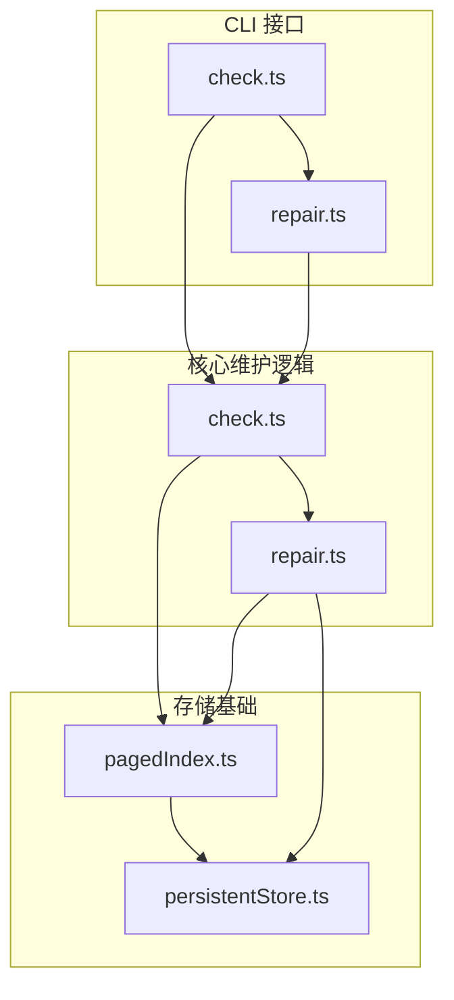
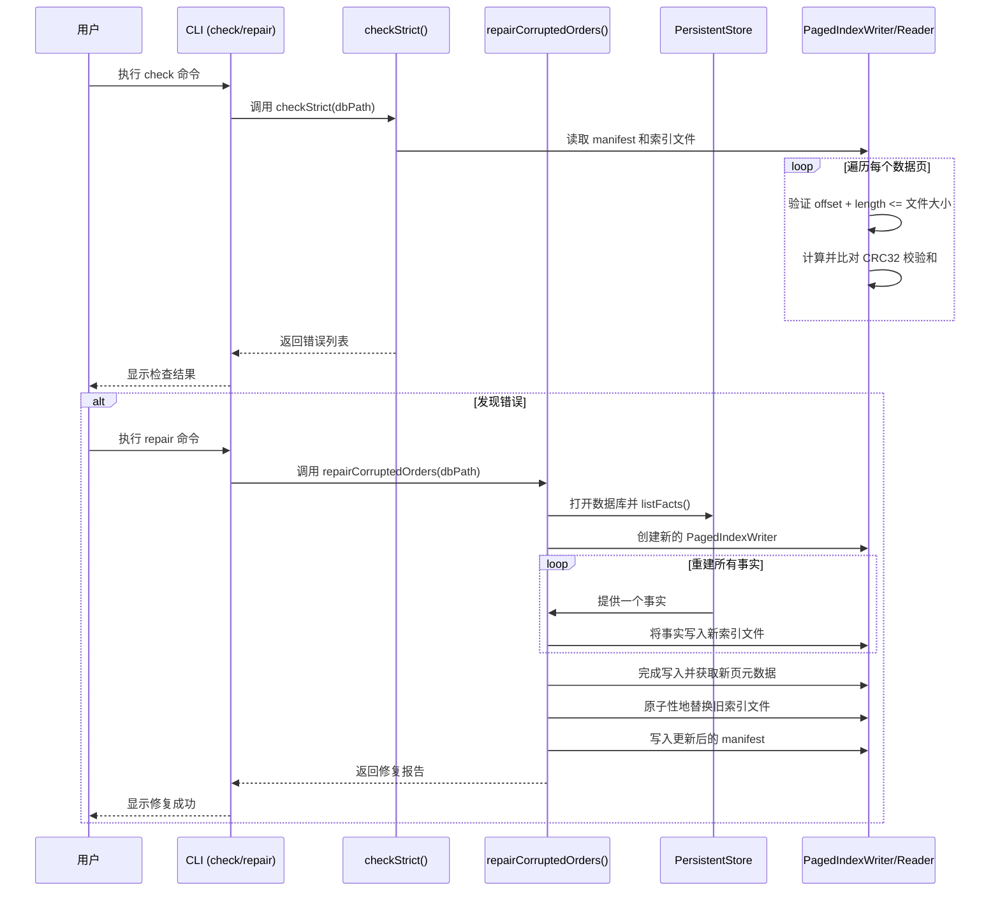
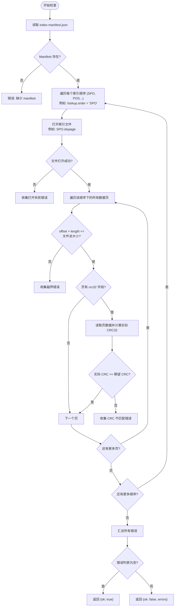
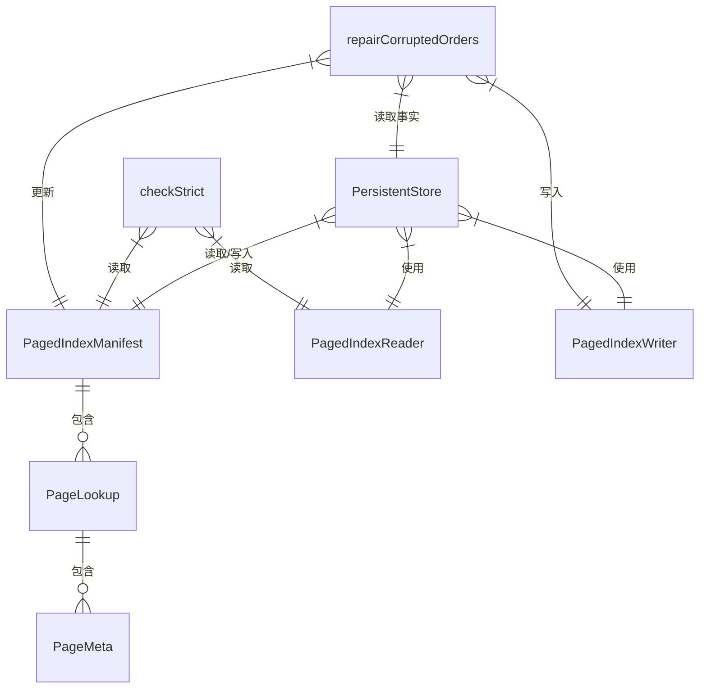

# 检查与修复

<cite>
**本文档引用的文件**
- [check.ts](file://src/cli/check.ts)
- [repair.ts](file://src/maintenance/repair.ts)
- [check.ts](file://src/maintenance/check.ts)
- [pagedIndex.ts](file://src/storage/pagedIndex.ts)
- [persistentStore.ts](file://src/storage/persistentStore.ts)
- [repair_pages.test.ts](file://tests/integration/maintenance/repair_pages.test.ts)
</cite>

## 目录
1. [简介](#简介)
2. [项目结构](#项目结构)
3. [核心组件](#核心组件)
4. [架构概述](#架构概述)
5. [详细组件分析](#详细组件分析)
6. [依赖分析](#依赖分析)
7. [性能考量](#性能考量)
8. [故障排除指南](#故障排除指南)
9. [结论](#结论)

## 简介
本文档系统化介绍了 SynapseDB 数据库的完整性检查（check）与数据修复（repair）工具的工作机制。重点说明了 `check` 命令在执行时验证的关键项目，包括页头校验和、索引结构一致性、三元组指针有效性等。同时，阐述了 `repair` 工具在检测到损坏时的恢复策略，如重建索引、跳过坏页等容错处理流程。通过集成测试用例 `repair_pages.test.ts` 说明其设计边界与恢复能力范围，并提供典型使用场景示例。

## 项目结构
SynapseDB 的维护功能主要集中在 `src/maintenance` 和 `src/cli` 目录下。`maintenance` 目录包含核心的检查与修复逻辑，而 `cli` 目录提供了命令行接口。存储层的分页索引机制是检查与修复操作的基础，相关代码位于 `src/storage/pagedIndex.ts`。

**图源**
- [check.ts](file://src/cli/check.ts#L10-L68)
- [repair.ts](file://src/maintenance/repair.ts#L13-L153)
- [pagedIndex.ts](file://src/storage/pagedIndex.ts#L7-L425)

**本节来源**
- [src/cli/check.ts](file://src/cli/check.ts#L10-L68)
- [src/maintenance/check.ts](file://src/maintenance/check.ts#L20-L79)
- [src/maintenance/repair.ts](file://src/maintenance/repair.ts#L13-L153)

## 核心组件
数据库的完整性检查与修复功能由两个核心模块构成：`checkStrict` 负责深度验证数据完整性，`repairCorruptedOrders` 和 `repairCorruptedPagesFast` 则负责根据检查结果执行相应的修复策略。这些功能共同构成了数据库异常关闭后的最后一道安全防线。

**本节来源**
- [src/maintenance/check.ts](file://src/maintenance/check.ts#L20-L79)
- [src/maintenance/repair.ts](file://src/maintenance/repair.ts#L13-L153)

## 架构概述
整个检查与修复流程遵循“先诊断，后治疗”的原则。首先，`check` 命令会读取数据库的主文件和分页索引清单（manifest），然后对每个索引文件中的数据页进行严格校验。一旦发现损坏，`repair` 命令便会介入，利用主文件中的权威事实数据来重建受损的索引结构。

**图源**
- [src/maintenance/check.ts](file://src/maintenance/check.ts#L20-L79)
- [src/maintenance/repair.ts](file://src/maintenance/repair.ts#L13-L87)
- [src/storage/pagedIndex.ts](file://src/storage/pagedIndex.ts#L28-L129)
- [src/storage/persistentStore.ts](file://src/storage/persistentStore.ts#L96-L99)

## 详细组件分析

### 检查机制分析
`checkStrict` 函数是完整性检查的核心，它会对数据库的分页索引进行严格的验证。

#### 检查项
该函数主要验证以下关键项目：
- **页范围越界**: 检查每个数据页的 `offset` 和 `length` 是否超出了其所在索引文件的实际大小。
- **CRC32 校验和**: 对于带有 `crc32` 字段的页，会重新计算其压缩后数据的 CRC32 值，并与记录在 `manifest` 中的期望值进行比对。这是防止数据静默损坏的关键手段。
- **文件可访问性**: 确保所有索引文件都能被正常打开和读取。

**图源**
- [src/maintenance/check.ts](file://src/maintenance/check.ts#L20-L79)
- [src/storage/pagedIndex.ts](file://src/storage/pagedIndex.ts#L324-L333)

**本节来源**
- [src/maintenance/check.ts](file://src/maintenance/check.ts#L20-L79)

### 修复机制分析
当 `checkStrict` 检测到错误后，`repairCorruptedOrders` 函数将启动修复流程。

#### 修复策略
该函数采用了一种稳健的恢复策略：
1.  **从主文件获取权威数据**: 修复过程首先会打开主数据库文件，并调用 `listFacts()` 获取所有现存的事实三元组。这确保了修复的数据源是绝对正确的，避免了因索引损坏而导致的数据丢失。
2.  **重建整个索引顺序**: 对于每一个损坏的索引顺序（如 `SPO`），它不会尝试去修复单个坏页，而是直接创建一个新的临时索引文件。
3.  **重放所有事实**: 将从主文件获取的所有事实，按照该索引顺序的要求，逐个写入到新的索引文件中。
4.  **原子性替换**: 新的索引文件生成后，会原子性地替换掉旧的、已损坏的索引文件。
5.  **更新清单**: 最后，会基于新的索引文件信息，生成一份全新的 `index-manifest.json` 并持久化，从而完成整个修复过程。

这种“全量重建”的策略虽然代价较高，但保证了修复后索引的绝对一致性和完整性。

**本节来源**
- [src/maintenance/repair.ts](file://src/maintenance/repair.ts#L13-L87)
- [src/storage/persistentStore.ts](file://src/storage/persistentStore.ts#L1000-L1050)

### 测试用例分析
`repair_pages.test.ts` 文件中的集成测试用例清晰地展示了该工具的设计边界和恢复能力。

#### 设计边界与恢复能力
该测试用例模拟了一个典型的损坏场景：人为修改 `SPO.idxpage` 文件中某个数据页的第一个字节，从而破坏其 CRC32 校验和。
1.  **检测能力**: 测试首先验证 `checkStrict` 能够准确地检测到这个 CRC 不匹配的错误。
2.  **恢复能力**: 随后，它调用 `repairCorruptedOrders` 进行修复。测试验证了修复函数能够成功重建 `SPO` 索引。
3.  **数据一致性**: 最关键的是，修复完成后，再次检查应无任何错误，并且通过数据库查询能正确检索到所有原始数据，证明了数据没有丢失。

此测试用例表明，该工具能够有效应对因硬件故障或意外断电导致的索引文件局部损坏，并能完全恢复数据的可用性。

**本节来源**
- [tests/integration/maintenance/repair_pages.test.ts](file://tests/integration/maintenance/repair_pages.test.ts#L1-L92)

## 依赖分析
检查与修复工具严重依赖于数据库的底层存储架构，特别是分页索引（Paged Index）的设计。

**图源**
- [src/storage/pagedIndex.ts](file://src/storage/pagedIndex.ts#L7-L13)
- [src/storage/pagedIndex.ts](file://src/storage/pagedIndex.ts#L324-L333)
- [src/storage/persistentStore.ts](file://src/storage/persistentStore.ts#L100-L150)

**本节来源**
- [src/storage/pagedIndex.ts](file://src/storage/pagedIndex.ts#L7-L425)
- [src/storage/persistentStore.ts](file://src/storage/persistentStore.ts#L100-L150)

## 性能考量
- **检查 (`check`) 的性能**: 主要取决于索引文件的大小和数量。由于需要读取每个数据页并计算 CRC32，因此 I/O 是主要瓶颈。对于大型数据库，检查可能需要较长时间。
- **修复 (`repair`) 的性能**: 性能开销远高于检查。因为它需要读取主文件中的所有事实，并为每个损坏的索引顺序重新构建整个索引文件。这是一个 I/O 和 CPU 密集型操作，应尽量避免在生产高峰期执行。

## 故障排除指南
当数据库出现无法正常启动或查询异常时，可以按以下流程使用检查与修复工具：

1.  **执行检查**: 首先运行 `synapsedb check <db_path>` 命令。
    -   如果输出 `ok: true`，则问题可能出在其他地方。
    -   如果输出 `ok: false` 并列出错误，则确认存在索引损坏。
2.  **执行修复**: 运行 `synapsedb repair <db_path>` 命令。
3.  **再次检查**: 修复完成后，再次运行 `check` 命令，确认所有错误都已解决。
4.  **重启服务**: 重启数据库服务，验证是否恢复正常。

**重要提醒**: 该工具是数据恢复的最后防线。**强烈建议配合定期备份策略**。在执行 `repair` 命令前，务必备份当前的数据库目录，以防修复过程本身出现问题。

**本节来源**
- [src/cli/check.ts](file://src/cli/check.ts#L10-L53)
- [src/cli/check.ts](file://src/cli/check.ts#L55-L68)

## 结论
SynapseDB 的 `check` 和 `repair` 工具为数据库的稳定运行提供了重要的安全保障。`check` 命令通过严格的 CRC32 校验和范围检查，能够精准定位索引文件的损坏。`repair` 命令则通过从主文件重建索引的方式，实现了对损坏数据的有效恢复。尽管修复过程成本较高，但它作为一道关键的“最后防线”，极大地增强了系统的容错能力。用户应将其纳入日常运维流程，并始终牢记“定期备份”是数据安全的根本保障。