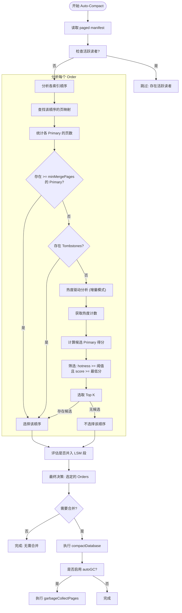
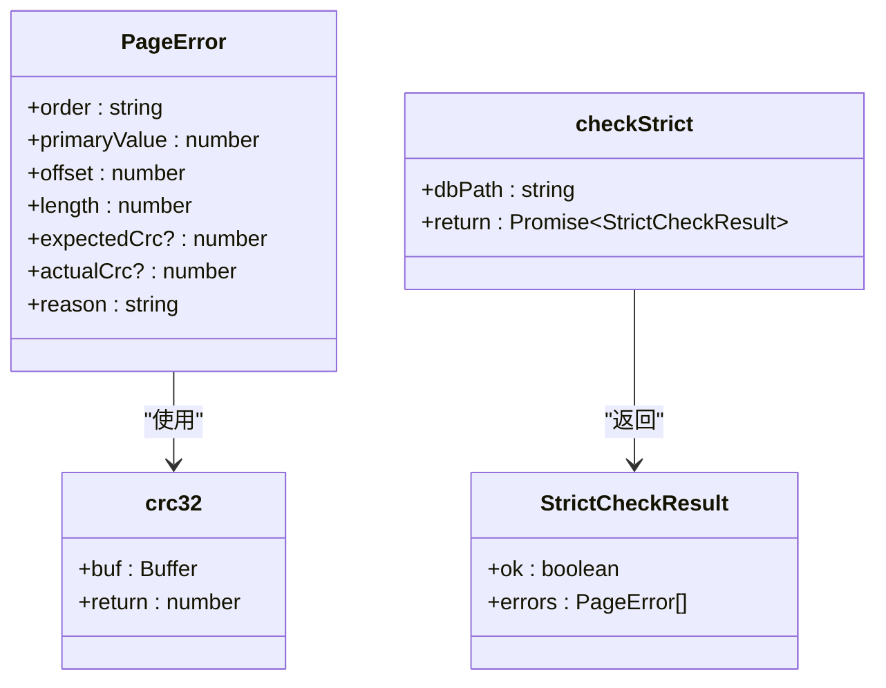

# 维护与治理

<cite>
**本文档引用的文件**
- [autoCompact.ts](file://src/maintenance/autoCompact.ts)
- [gc.ts](file://src/maintenance/gc.ts)
- [check.ts](file://src/maintenance/check.ts)
- [repair.ts](file://src/maintenance/repair.ts)
- [compaction.ts](file://src/maintenance/compaction.ts)
- [auto_compact.ts](file://src/cli/auto_compact.ts)
- [gc.ts](file://src/cli/gc.ts)
- [check.ts](file://src/cli/check.ts)
- [repair_page.ts](file://src/cli/repair_page.ts)
- [pagedIndex.ts](file://src/storage/pagedIndex.ts)
- [readerRegistry.ts](file://src/storage/readerRegistry.ts)
</cite>

## 目录
1. [引言](#引言)
2. [自动合并（Auto-Compact）](#自动合并auto-compact)
3. [垃圾回收（GC）](#垃圾回收gc)
4. [完整性校验与修复（Check & Repair）](#完整性校验与修复check--repair)
5. [运维操作实践](#运维操作实践)
6. [监控与可持续运营](#监控与可持续运营)

## 引言

SynapseDB 采用分页索引架构，将核心数据与索引分离。这种设计带来了高性能查询能力的同时，也引入了运行时健康管理的需求。本指南旨在为数据库管理员和开发者提供一套完整的维护工具使用方法，涵盖自动合并、垃圾回收、完整性校验与修复等关键功能，帮助建立一个稳定、高效且可持续的数据库运营体系。

**Section sources**
- [autoCompact.ts](file://src/maintenance/autoCompact.ts#L41-L337)
- [gc.ts](file://src/maintenance/gc.ts#L20-L115)
- [check.ts](file://src/maintenance/check.ts#L10-L53)
- [repair.ts](file://src/maintenance/repair.ts#L0-L154)

## 自动合并（Auto-Compact）

自动合并是 SynapseDB 的核心维护功能，旨在优化索引结构，减少碎片化，并清理已删除的数据。它通过分析数据库状态，智能决策何时以及如何执行合并操作。

### 触发条件

`autoCompact` 函数会根据以下条件决定是否对某个索引顺序（如 SPO, POS 等）执行合并：

1.  **多页主键（Multi-page Primaries）**: 当某个主键（Primary Value）在索引中分散在多个数据页上时，即构成“碎片”。当一个主键关联的页面数达到 `minMergePages` 阈值（默认为2）时，该索引顺序将被选中进行合并。
2.  **墓碑存在（Tombstones）**: 当数据库中存在标记为已删除的三元组（即墓碑）时，为了释放空间并提升查询效率，相关的索引顺序会被触发合并。
3.  **LSM 段合并**: 如果启用了 LSM 树存储（lsm-lite），当内存中的段数量或包含的三元组总数超过设定阈值时，系统会自动将这些段合并到主索引中。
4.  **活跃读者检查**: 默认情况下，`autoCompact` 会检查是否存在活跃的读取进程（通过 `readers.json` 文件注册）。如果存在，为了避免中断长查询，合并操作将被跳过。此行为可通过 `respectReaders` 选项控制。



**Diagram sources**
- [autoCompact.ts](file://src/maintenance/autoCompact.ts#L41-L337)

**Section sources**
- [autoCompact.ts](file://src/maintenance/autoCompact.ts#L41-L337)

### 评分算法

在增量合并模式（`mode=incremental`）下，系统会优先处理最“热”的数据。其评分算法综合考虑了三个因素：

*   **热度（Hotness）**: 该主键被访问的频率。这是最主要的驱动力。
*   **碎片程度（Fragmentation）**: 该主键当前拥有的数据页数减一（`count - 1`），代表了潜在的合并收益。
*   **墓碑因子（Tombstone Factor）**: 如果存在任何墓碑，则此项贡献一个固定分数。

**得分公式**:
`总分 = (热度 × 热度权重) + (碎片程度 × 页数权重) + (墓碑因子 × 墓碑权重)`

用户可以通过 `scoreWeights` 参数调整各项的权重，默认值为 `{hot: 1, pages: 1, tomb: 0.5}`。只有同时满足 `hot-threshold` 和 `minScore` 的主键才会被选中进行重写。

### 资源限制策略

为了防止合并操作消耗过多资源，系统提供了多项限制策略：

*   **`maxPrimariesPerOrder`**: 限制每个索引顺序最多重写的主键数量，避免单次操作过大。
*   **`dryRun`**: 模拟运行模式，仅输出决策结果而不实际修改文件，用于预演和调试。
*   **`respectReaders`**: 尊重活跃读者，避免在高并发读取时进行可能影响性能的合并。
*   **`onlyPrimaries`**: 内部参数，明确指定哪些主键需要被重写，确保操作的精确性。

**Section sources**
- [autoCompact.ts](file://src/maintenance/autoCompact.ts#L41-L337)

## 垃圾回收（GC）

垃圾回收（GC）负责清理在增量合并过程中产生的“孤儿”数据页。这些页面虽然不再被当前的索引指针所引用，但物理上仍然存在于磁盘文件中。

### 安全清理机制

GC 的核心在于安全地清理这些“孤儿”页，同时不影响正在进行的事务和查询。

1.  **原地整理（In-place Compaction）**: GC 不会创建全新的文件，而是对现有的索引文件进行“整理”。它会打开文件，从头开始按顺序读取所有有效的数据页，并将它们连续地写回同一个文件（通过临时文件和原子重命名保证原子性）。
2.  **保留有效引用**: 在整理过程中，`garbageCollectPages` 函数会重建 `pages` 数组，更新每个有效页的偏移量（offset），确保新的索引映射指向正确的位置。
3.  **清除孤儿记录**: 整理完成后，旧的“孤儿”页所占用的空间被新写入的有效数据覆盖。同时，`manifest` 文件中的 `orphans` 数组会被清空，标志着这些页面已被成功回收。
4.  **尊重活跃读者**: 与 `autoCompact` 类似，GC 也支持 `respectReaders` 选项。如果检测到有活跃的读取进程，GC 会直接跳过，以防止在整理文件时导致正在读取旧偏移量的读者出现错误。

```mermaid
sequenceDiagram
participant CLI as CLI命令
participant GC as garbageCollectPages
participant FS as 文件系统
participant Manifest as index-manifest.json
CLI->>GC : gc(dbPath, {respectReaders : true})
GC->>FS : 读取 readers.json
alt 存在活跃读者
GC-->>CLI : 返回 {skipped : true, reason : 'active_readers'}
else 无活跃读者
GC->>Manifest : 读取 manifest
loop 遍历每个索引顺序
GC->>FS : 打开 order.idx 文件
GC->>FS : 创建 order.idx.gc.tmp 临时文件
loop 遍历 manifest 中的所有有效页
GC->>FS : 从原文件读取页数据
GC->>FS : 将数据写入临时文件紧凑排列
GC : 更新页的 offset 映射
end
GC->>FS : 关闭文件句柄
GC->>FS : 原子重命名 tmp -> idx
end
GC->>Manifest : 清空 orphans 数组，epoch+1
GC->>Manifest : 写回更新后的 manifest
GC-->>CLI : 返回 GCStats
end
```

**Diagram sources**
- [gc.ts](file://src/maintenance/gc.ts#L20-L115)
- [readerRegistry.ts](file://src/storage/readerRegistry.ts#L99-L140)

**Section sources**
- [gc.ts](file://src/maintenance/gc.ts#L20-L115)

## 完整性校验与修复（Check & Repair）

`check` 和 `repair` 工具是保障数据完整性的最后一道防线。

### check 完整性校验

`check` 命令提供两种级别的校验：

*   **基础校验 (`--summary`)**: 检查主数据库文件和索引目录是否存在，以及各个索引文件能否正常打开。这是一种快速健康检查。
*   **严格校验 (`--strict`)**: 进行深度校验，包括：
    *   **范围检查**: 验证每个页的偏移量和长度是否在文件大小范围内。
    *   **CRC32 校验和**: 计算每个页数据的实际 CRC32 值，并与 `manifest` 中记录的预期值进行比对。任何不匹配都表明数据可能已损坏。



**Diagram sources**
- [check.ts](file://src/maintenance/check.ts#L10-L53)
- [check.ts](file://src/maintenance/check.ts#L0-L101)

**Section sources**
- [check.ts](file://src/maintenance/check.ts#L10-L53)

### repair 修复逻辑

当 `check --strict` 发现损坏时，`repair` 命令提供多种恢复策略：

1.  **快速修复 (`--fast`)**: 调用 `repairCorruptedPagesFast`。它会定位到损坏的主键（Primary），然后从主数据库文件中重新读取该主键下的所有事实（Facts），使用最新的数据重建对应的索引页，并更新 `manifest`。这种方式速度快，影响范围小。
2.  **按序重写**: 调用 `repairCorruptedOrders`。如果某个索引顺序整体损坏，它会直接丢弃该顺序的整个索引文件，然后遍历主数据库文件中的所有事实，完全重建该顺序的索引。
3.  **全量重建**: 如果没有发现具体损坏，但用户仍想重建索引（例如为了应用新的压缩设置），`repair` 会调用 `SynapseDB.open(rebuildIndexes=true)` 来强制重建所有索引。在此过程中，系统会尝试保留原有的 `tombstones` 信息。

**Section sources**
- [repair.ts](file://src/maintenance/repair.ts#L0-L154)

## 运维操作实践

以下是结合 CLI 命令的实际运维操作示例。

### CLI 命令行接口

| 命令 | 描述 | 示例 |
| :--- | :--- | :--- |
| `synapsedb check <db>` | 对数据库进行健康检查 | `synapsedb check demo.synapsedb --summary` |
| `synapsedb auto-compact <db>` | 执行自动合并 | `synapsedb auto-compact demo.synapsedb --mode=incremental --orders=SPO --min-merge=2 --hot-threshold=1 --max-primary=1 --auto-gc` |
| `synapsedb gc <db>` | 执行垃圾回收 | `synapsedb gc demo.synapsedb` |
| `synapsedb repair <db>` | 修复数据损坏 | `synapsedb repair demo.synapsedb --fast` |

**Section sources**
- [auto_compact.ts](file://src/cli/auto_compact.ts#L0-L77)
- [gc.ts](file://src/cli/gc.ts#L0-L16)
- [check.ts](file://src/cli/check.ts#L0-L153)
- [repair_page.ts](file://src/cli/repair_page.ts#L0-L34)

## 监控与可持续运营

为了建立可持续的数据库运营体系，建议监控以下关键指标：

*   **合并频率与决策日志**: 记录 `auto-compact` 的执行频率、选定的索引顺序和主键。这有助于理解数据访问模式和碎片化趋势。
*   **GC 释放空间**: 监控 `garbageCollectPages` 返回的 `bytesBefore` 和 `bytesAfter`，计算每次 GC 回收的空间量，评估合并策略的有效性。
*   **修复成功率**: 记录 `repair` 命令的执行情况和结果，特别是 `repairedOrders` 或 `repaired.primaryValues`，作为数据稳定性的参考。
*   **错误率**: 监控 `check --strict` 的执行结果，任何非零的错误数都应触发告警。

通过定期执行维护任务并监控这些指标，可以确保 SynapseDB 数据库长期保持最佳性能和数据完整性。

**Section sources**
- [autoCompact.ts](file://src/maintenance/autoCompact.ts#L41-L337)
- [gc.ts](file://src/maintenance/gc.ts#L20-L115)
- [check.ts](file://src/maintenance/check.ts#L10-L53)
- [repair.ts](file://src/maintenance/repair.ts#L0-L154)