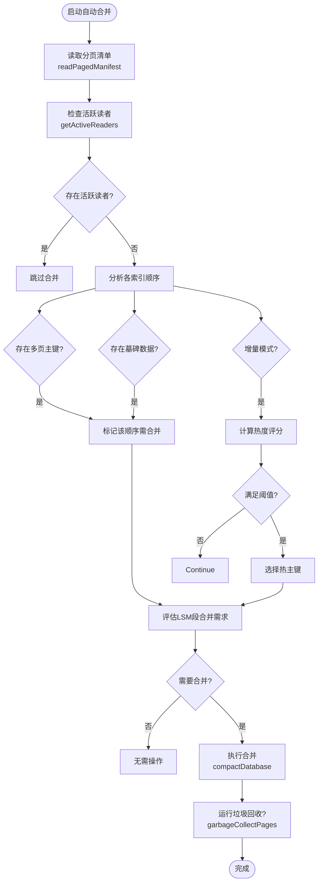
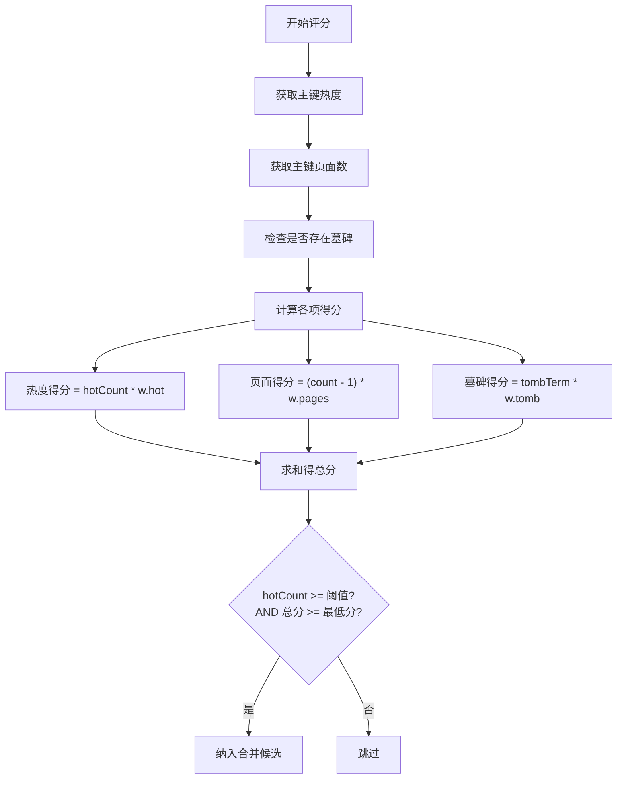
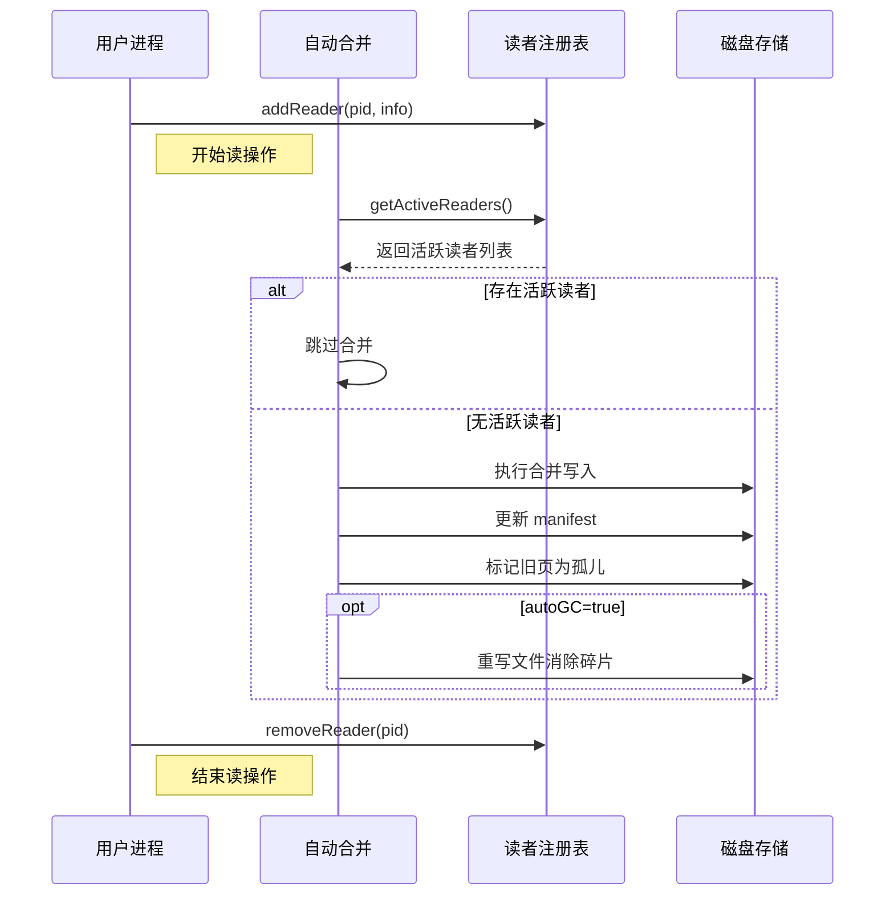
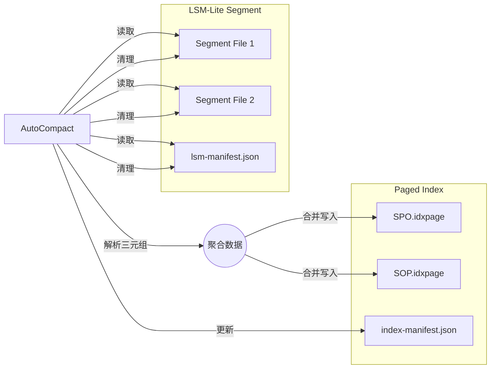

# 自动合并

<cite>
**本文档引用的文件**
- [autoCompact.ts](file://src/maintenance/autoCompact.ts)
- [compaction.ts](file://src/maintenance/compaction.ts)
- [hotness.ts](file://src/storage/hotness.ts)
- [pagedIndex.ts](file://src/storage/pagedIndex.ts)
- [gc.ts](file://src/maintenance/gc.ts)
- [readerRegistry.ts](file://src/storage/readerRegistry.ts)
</cite>

## 目录
1. [简介](#简介)
2. [自动合并机制概述](#自动合并机制概述)
3. [碎片率评分算法详解](#碎片率评分算法详解)
4. [资源限制与并发控制策略](#资源限制与并发控制策略)
5. [LSM-Lite协同工作机制](#lsm-lite协同工作机制)
6. [API与CLI配置调用方式](#api与cli配置调用方式)
7. [性能影响分析](#性能影响分析)
8. [最佳实践建议](#最佳实践建议)

## 简介
自动合并（Auto-Compact）是SynapseDB中用于优化存储结构、提升查询性能的核心维护机制。该机制通过智能化评估数据库状态，决定何时以及如何对分页索引进行重组，以减少碎片、清理墓碑数据并整合LSM段。本文档深入解析其触发条件、评分算法、资源控制策略及与LSM-Lite架构的协同工作原理。

## 自动合并机制概述

自动合并机制由`autoCompact`函数驱动，位于`src/maintenance/autoCompact.ts`文件中。该机制首先读取数据库的分页清单（manifest），分析各索引顺序（如SPO、SOP等）的页面分布情况，并根据预设策略判断是否需要执行合并操作。

核心流程包括：
1. 读取分页清单和热度数据
2. 检查是否存在活跃读事务
3. 分析每个索引顺序的多页主键和墓碑数量
4. 基于热度、页面数和墓碑因素计算综合评分
5. 决策是否触发合并及选择目标主键
6. 调用底层`compactDatabase`执行实际合并
7. 可选地执行垃圾回收（GC）



**图示来源**
- [autoCompact.ts](file://src/maintenance/autoCompact.ts#L41-L337)
- [compaction.ts](file://src/maintenance/compaction.ts#L48-L339)
- [readerRegistry.ts](file://src/storage/readerRegistry.ts#L99-L140)

**本节来源**
- [autoCompact.ts](file://src/maintenance/autoCompact.ts#L41-L337)

## 碎片率评分算法详解

自动合并的触发不仅依赖简单的页面数量判断，还引入了基于多因素加权的综合评分系统，以更精准地识别值得合并的“热点”区域。

### 评分组成要素

评分算法结合以下三个维度进行综合评估：

| 评分因子 | 描述 | 来源 |
|---------|------|------|
| **热度 (Hotness)** | 主键被访问的频率计数 | `hotness.json` 文件中的统计信息 |
| **页面数 (Pages)** | 同一主键关联的页面数量减一（即碎片程度） | 分页清单中 `pages` 数组长度 |
| **墓碑因子 (Tombstone)** | 是否存在待清理的逻辑删除记录 | 清单中的 `tombstones` 字段 |

### 评分计算公式

最终得分按如下公式计算：

```
总分 = 热度 × 热度权重 + (页面数 - 1) × 页面权重 + 墓碑因子 × 墓碑权重
```

其中：
- **热度权重 (`scoreWeights.hot`)**：默认为 `1`
- **页面权重 (`scoreWeights.pages`)**：默认为 `1`
- **墓碑权重 (`scoreWeights.tomb`)**：默认为 `0.5`
- **墓碑因子**：若存在任何墓碑则为 `1`，否则为 `0`

### 触发条件

只有当同时满足以下两个条件时，对应主键才会被选中参与增量合并：
1. **热度达标**：`hotness >= hotThreshold`
2. **分数达标**：`总分 >= minScore`（默认为 `1`）

此机制确保仅对真正“热”的且具有较高碎片或墓碑负担的数据块进行合并，避免不必要的I/O开销。



**图示来源**
- [autoCompact.ts](file://src/maintenance/autoCompact.ts#L200-L250)

**本节来源**
- [autoCompact.ts](file://src/maintenance/autoCompact.ts#L200-L250)
- [hotness.ts](file://src/storage/hotness.ts#L13-L25)

## 资源限制与并发控制策略

为了在执行自动合并时不干扰正常业务运行，系统实施了多项资源限制与并发控制策略。

### 尊重活跃读事务机制

通过`readerRegistry`模块实现跨进程的读者状态跟踪。当启用`respectReaders: true`选项时，`autoCompact`会调用`getActiveReaders()`检查当前是否有活跃的读事务。

- 若检测到至少一个活跃读者，则立即跳过本次合并操作
- 读者信息存储于`.pages/readers/`目录下的独立文件中，采用PID+时间戳命名，避免竞争
- 过期超过30秒的读者文件会被自动清理

这一机制保障了长时间运行的读查询不会因后台合并导致数据不一致或中断。

### I/O与CPU占用控制

虽然当前代码未显式实现I/O节流或CPU配额限制，但可通过以下方式间接控制资源消耗：

- **增量模式 (`mode: 'incremental'`)**：仅重写指定的热主键，而非整个索引文件，显著降低I/O量
- **压缩策略分离**：允许为热数据（`hotCompression`）和冷数据（`coldCompression`）设置不同压缩等级，平衡CPU与存储成本
- **批量写入优化**：`PagedIndexWriter`采用批处理+单次sync的策略，在保证持久性的同时减少系统调用次数

### 垃圾回收节制

合并操作产生的孤页（orphans）不会立即删除，而是标记待回收。只有在明确设置`autoGC: true`时，才会触发`garbageCollectPages`进行物理清理，从而将高开销的GC操作与合并解耦。



**图示来源**
- [autoCompact.ts](file://src/maintenance/autoCompact.ts#L70-L85)
- [readerRegistry.ts](file://src/storage/readerRegistry.ts#L99-L140)
- [gc.ts](file://src/maintenance/gc.ts#L20-L115)

**本节来源**
- [autoCompact.ts](file://src/maintenance/autoCompact.ts#L70-L85)
- [readerRegistry.ts](file://src/storage/readerRegistry.ts#L99-L140)
- [gc.ts](file://src/maintenance/gc.ts#L20-L115)

## LSM-Lite协同工作机制

自动合并机制与LSM-Lite架构深度集成，能够智能判断何时将内存中的LSM段落盘并合并至主索引。

### LSM段合并触发条件

系统支持两种方式决定是否并入LSM段：

1. **显式指定**：通过 `includeLsmSegments: true`
2. **自动评估**：通过 `includeLsmSegmentsAuto: true`，此时检查以下任一条件：
   - 段数量 ≥ `lsmSegmentsThreshold`（默认为1）
   - 三元组总数 ≥ `lsmTriplesThreshold`（默认等于页大小或1024）

### 协同流程

1. 自动合并检测到需并入LSM段
2. 读取 `lsm-manifest.json` 获取所有段文件
3. 解析各段中的三元组数据
4. 在执行`compactDatabase`时，将这些三元组作为新数据源一并处理
5. 合并完成后，删除原始LSM段文件并将清单清空

此举实现了从内存缓冲到持久化索引的平滑过渡，同时利用合并过程完成去重和排序，保持索引紧凑有序。



**图示来源**
- [autoCompact.ts](file://src/maintenance/autoCompact.ts#L260-L300)
- [compaction.ts](file://src/maintenance/compaction.ts#L100-L130)

**本节来源**
- [autoCompact.ts](file://src/maintenance/autoCompact.ts#L260-L300)
- [compaction.ts](file://src/maintenance/compaction.ts#L100-L130)

## API与CLI配置调用方式

### CLI命令示例

```bash
synapsedb auto-compact /path/to/db \
  --threshold=0.3 \
  --max-pages=1000 \
  --hot-threshold=100 \
  --min-score=2.0 \
  --respect-readers \
  --auto-gc
```

### 参数说明

| 参数 | 类型 | 默认值 | 说明 |
|------|------|--------|------|
| `--threshold` | number | - | （已弃用）原墓碑比例阈值，现由内部逻辑控制 |
| `--max-pages` | number | - | 限制最多处理的页面总数（非直接参数，需通过其他方式实现） |
| `--hot-threshold` | number | - | 触发热主键合并的最小访问次数 |
| `--min-score` | number | 1 | 触发合并的最低综合评分 |
| `--respect-readers` | flag | false | 若存在活跃读事务则跳过合并 |
| `--auto-gc` | flag | false | 合并后自动执行垃圾回收 |

### SynapseDB API调用

```typescript
import { autoCompact } from 'synapsedb';

await autoCompact('/path/to/db', {
  mode: 'incremental',
  hotThreshold: 100,
  minScore: 2.0,
  scoreWeights: { hot: 1.5, pages: 1.0, tomb: 0.8 },
  respectReaders: true,
  autoGC: true,
  includeLsmSegmentsAuto: true
});
```

**本节来源**
- [autoCompact.ts](file://src/maintenance/autoCompact.ts#L41-L337)
- [compaction.ts](file://src/maintenance/compaction.ts#L48-L339)

## 性能影响分析

### 合并期间性能波动

| 指