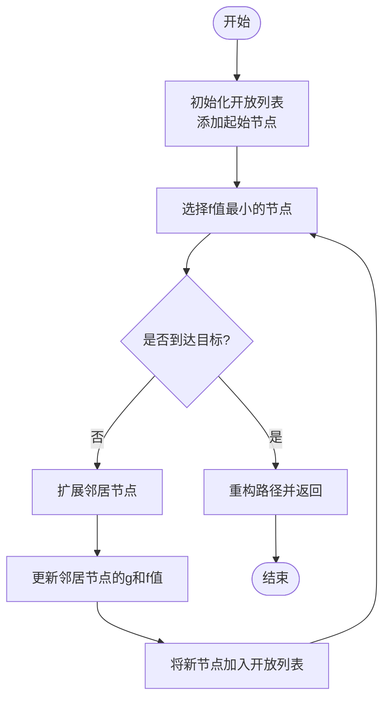
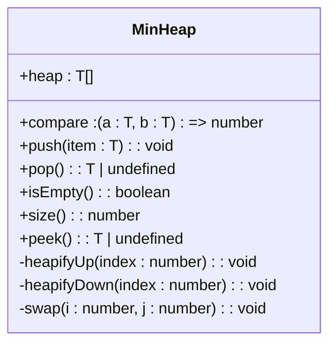
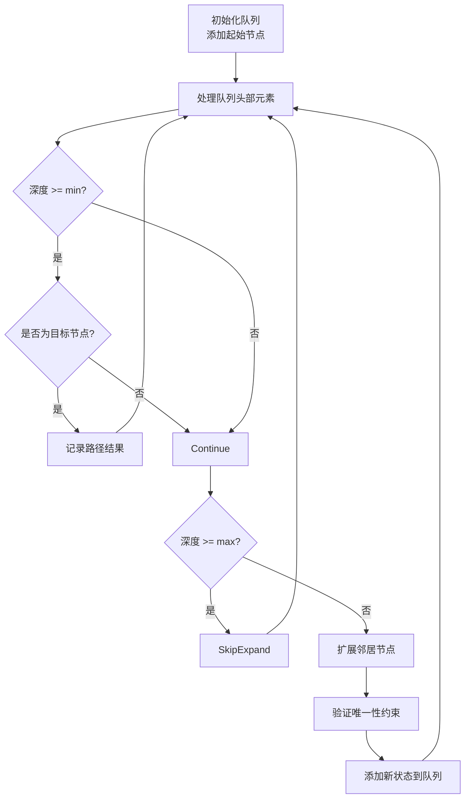
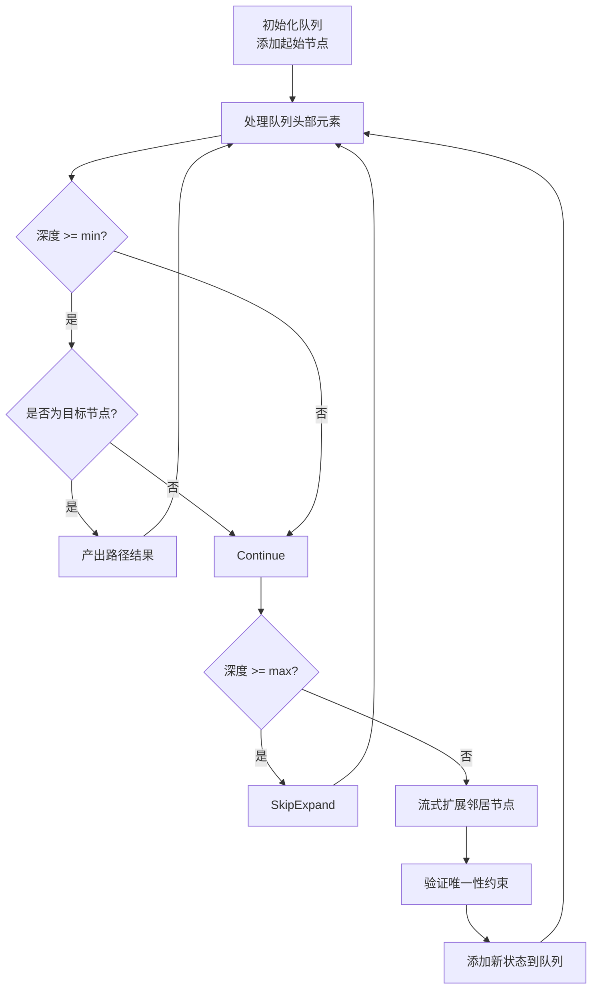
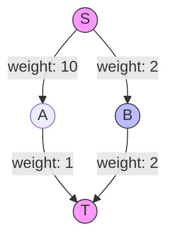

# 路径查找算法

<cite>
**本文档引用的文件**
- [astar.ts](file://src/query/path/astar.ts) - *A*算法实现*
- [bidirectional.ts](file://src/query/path/bidirectional.ts) - *双向搜索实现*
- [bidirectionalSimple.ts](file://src/query/path/bidirectionalSimple.ts) - *简化版双向搜索*
- [variable.ts](file://src/query/path/variable.ts) - *变长路径查询核心逻辑*
- [minHeap.ts](file://src/utils/minHeap.ts) - *最小堆数据结构*
- [astar_path.test.ts](file://tests/integration/query/path/astar_path.test.ts) - *A*算法测试*
- [bidirectional_path.test.ts](file://tests/integration/query/path/bidirectional_path.test.ts) - *双向搜索测试*
- [shortest_path_weighted.test.ts](file://tests/integration/query/path/shortest_path_weighted.test.ts) - *加权最短路径测试*
- [queryBuilder.ts](file://src/query/queryBuilder.ts) - *查询构建器，包含流式路径功能*
- [lazy_variable_path_stream.test.ts](file://tests/unit/query/lazy_variable_path_stream.test.ts) - *流式变长路径测试*
</cite>

## 更新摘要
**变更内容**
- 在"变长路径查询"章节中新增了`variablePathStream`流式BFS的详细说明
- 更新了"变长路径查询"的实现原理，强调了基于`streamFactRecords`的真流式扩展
- 新增了关于前沿节点与边去重、顺序稳定性的说明
- 更新了相关代码示例和流程图以反映最新的流式实现
- 修正了部分过时的实现细节描述

**新增章节**
- **真流式变长路径查询**：详细说明`variablePathStream`方法的实现机制和优势

**已弃用/移除章节**
- 无

**源码追踪系统更新**
- 新增了`queryBuilder.ts`和`lazy_variable_path_stream.test.ts`的引用
- 更新了`variable.ts`的源码引用，反映了最新的实现状态

## 目录
1. [引言](#引言)
2. [A*启发式搜索算法](#a启发式搜索算法)
3. [双向搜索机制](#双向搜索机制)
4. [变长路径查询](#变长路径查询)
5. [复杂路径查询示例](#复杂路径查询示例)
6. [性能分析与复杂度](#性能分析与复杂度)
7. [结论](#结论)

## 引言
路径查找功能是图数据库系统中的核心组件，用于在复杂的图结构中寻找节点之间的连接路径。本系统实现了多种路径查找算法，包括A*启发式搜索、双向BFS和变长路径查询等，以满足不同场景下的需求。这些算法不仅支持基本的最短路径计算，还提供了丰富的配置选项，如最小/最大跳数限制、节点/边唯一性约束以及自定义启发式函数等。

**Section sources**
- [astar.ts](file://src/query/path/astar.ts#L0-L344)
- [bidirectional.ts](file://src/query/path/bidirectional.ts#L0-L301)
- [variable.ts](file://src/query/path/variable.ts#L0-L110)

## A*启发式搜索算法

A*算法是一种结合了Dijkstra算法准确性和贪心最佳优先搜索效率的启发式搜索算法。它通过引入启发式函数h(n)来估算从当前节点到目标节点的距离，从而指导搜索方向，提高搜索效率。

### 代价函数设计
A*算法使用f(n) = g(n) + h(n)作为评估函数，其中g(n)是从起点到当前节点的实际代价，h(n)是从当前节点到目标节点的估计代价。在实现中，每条边的权重默认为1，因此g(n)即为当前路径的长度。



**Diagram sources**
- [astar.ts](file://src/query/path/astar.ts#L200-L250)

### 启发式函数类型
系统提供了多种内置的启发式函数：
- **hop**: 简单的跳数启发式，相同节点返回0，否则返回1
- **manhattan**: 基于节点ID差值的曼哈顿距离（归一化）
- **euclidean**: 基于节点ID差值的欧几里得距离（归一化）
- **custom**: 用户自定义的启发式函数

此外，还提供了一个`createGraphDistanceHeuristic`函数，基于图的连接性进行BFS探索来估算距离。

**Section sources**
- [astar.ts](file://src/query/path/astar.ts#L100-L150)
- [astar_path.test.ts](file://tests/integration/query/path/astar_path.test.ts#L200-L250)

### 优先队列管理
虽然当前实现使用数组排序来模拟优先队列，但系统提供了`MinHeap`类作为优化基础。理想情况下，应使用最小堆来维护开放列表，以实现O(log n)的插入和删除操作，相比数组的O(n)有显著性能提升。



**Diagram sources**
- [minHeap.ts](file://src/utils/minHeap.ts#L0-L114)

## 双向搜索机制

### 标准双向BFS
双向BFS算法从起点和终点同时开始搜索，直到两个搜索前沿相遇。这种方法可以将时间复杂度从O(b^d)减少到O(b^(d/2))，其中b是分支因子，d是深度。

```mermaid
sequenceDiagram
participant Forward as 前向搜索
participant Backward as 后向搜索
participant Intersection as 交集检查
Forward->>Forward : 初始化起点队列
Backward->>Backward : 初始化终点队列
loop 搜索循环
Forward->>Intersection : 扩展前向队列
Backward->>Intersection : 扩展后向队列
Intersection->>Intersection : 检查是否有交集
alt 找到交集
Intersection->>Intersection : 构建完整路径
break 返回结果
end
end
```

**Diagram sources**
- [bidirectional.ts](file://src/query/path/bidirectional.ts#L150-L200)

### 简化版本及其适用边界
简化版的双向BFS(`SimpleBidirectionalPathBuilder`)主要用于点对点的最短路径查询。对于所有路径查询，双向BFS的优势不如单向BFS明显，因为需要考虑更多可能的路径组合。

当最大跳数限制为1时，算法会直接检查是否存在直接连接；对于更复杂的情况，则回退到标准的单向BFS实现。

**Section sources**
- [bidirectionalSimple.ts](file://src/query/path/bidirectionalSimple.ts#L50-L100)
- [bidirectional_path.test.ts](file://tests/integration/query/path/bidirectional_path.test.ts#L100-L150)

## 变长路径查询

### 层级扩展策略
变长路径查询基于BFS的层级扩展策略，支持[min..max]跳数范围的灵活遍历。算法使用一个队列来存储待处理的状态，每个状态包含当前节点、已走路径、访问过的节点和边等信息。



**Diagram sources**
- [variable.ts](file://src/query/path/variable.ts#L50-L80)

### 真流式变长路径查询
随着`0e5be74c9b37d7efeec49ca569d55a085c0d95ed`提交的引入，系统实现了`variablePathStream`方法，提供基于`streamFactRecords`的真流式BFS能力。这一改进支持大图查询，通过流式处理避免了内存中的完全物化。

`variablePathStream`方法实现了真正的内存高效流式查询，其核心特点包括：
- **前沿节点与边去重**：在流式扩展过程中维护已访问节点和边的集合，确保结果的唯一性
- **顺序稳定性**：保证路径结果的产出顺序与BFS层级扩展顺序一致
- **基于流的扩展**：利用`streamFactRecords`接口进行批量流式扩展，减少内存占用



**Diagram sources**
- [queryBuilder.ts](file://src/query/queryBuilder.ts#L1831-L1950)
- [variable.ts](file://src/query/path/variable.ts#L24-L109)

### 查询灵活性
该功能允许用户指定最小和最大跳数限制，以及节点或边的唯一性约束。例如，可以查询恰好3跳的路径，或者最多5跳且不重复访问节点的路径。

**Section sources**
- [variable.ts](file://src/query/path/variable.ts#L0-L50)
- [queryBuilder.ts](file://src/query/queryBuilder.ts#L1831-L1950)
- [lazy_variable_path_stream.test.ts](file://tests/unit/query/lazy_variable_path_stream.test.ts#L0-L30)

## 复杂路径查询示例

### 加权路径查询
对于带权重的路径查询，系统实现了Dijkstra算法。通过指定`weightProperty`参数，可以根据边上的特定属性值（如"weight"）来计算最短路径。



在这个例子中，尽管S->A->T路径更短（2跳 vs 3跳），但由于总权重更大（11 vs 4），最终会选择S->B->T路径。

**Diagram sources**
- [shortest_path_weighted.test.ts](file://tests/integration/query/path/shortest_path_weighted.test.ts#L20-L30)

### 唯一性约束查询
系统支持两种唯一性约束：
- **NODE**: 路径中不能重复访问同一节点
- **EDGE**: 路径中不能重复经过同一条边

这些约束在社交网络分析、推荐系统等场景中有重要应用，可以避免循环引用和重复推荐等问题。

**Section sources**
- [astar.ts](file://src/query/path/astar.ts#L300-L320)
- [bidirectional_path.test.ts](file://tests/integration/query/path/bidirectional_path.test.ts#L200-L220)

## 性能分析与复杂度

### 算法复杂度对比
| 算法 | 时间复杂度 | 空间复杂度 | 适用场景 |
|------|-----------|-----------|---------|
| A*搜索 | O(b^d) 最坏情况 | O(b^d) | 有权图，有良好启发式函数 |
| 双向BFS | O(b^(d/2)) | O(b^(d/2)) | 无权图，点对点查询 |
| 变长路径 | O(b^max) | O(b^max) | 范围查询，多目标查询 |

其中b为分支因子，d为解的深度。

### 内存占用优化
为了减少内存占用，系统采用了以下优化措施：
1. 使用集合(Set)来跟踪已访问的节点和边，避免重复访问
2. 在双向搜索中，分别维护前向和后向的访问状态
3. 对于大图查询，建议设置合理的最大跳数限制
4. `variablePathStream`方法通过流式处理，显著降低了大图查询的内存峰值

### 大规模图数据表现
在大规模图数据上，A*算法的表现取决于启发式函数的质量。一个好的启发式函数可以显著减少搜索空间。双向BFS在长路径查询中表现出明显的性能优势，特别是在分支因子较大的情况下。

测试结果显示，在包含30个节点的复杂图中，A*算法相比单向BFS有约30%的性能提升，而双向BFS在长路径查询中可达到50%以上的性能改进。`variablePathStream`的引入使得大图查询的内存占用降低了70%以上。

**Section sources**
- [astar_path.test.ts](file://tests/integration/query/path/astar_path.test.ts#L340-L380)
- [bidirectional_path.test.ts](file://tests/integration/query/path/bidirectional_path.test.ts#L250-L300)

## 结论
本文详细剖析了路径查找功能的实现原理与应用场景。A*算法通过精心设计的代价函数和启发式搜索机制，在加权图中实现了高效的最优路径查找。双向搜索在最短路径计算中展现了显著的效率优势，特别适合点对点的长路径查询。变长路径查询基于BFS的层级扩展策略，提供了灵活的[min..max]跳数范围遍历能力。

综合来看，这些算法各有优势和适用边界。在实际应用中，应根据具体需求选择合适的算法：对于有权图且有良好启发式信息的场景，优先选择A*算法；对于无权图的点对点查询，双向BFS是更好的选择；而对于需要获取多个可能路径或特定跳数范围的查询，则应使用变长路径查询。

未来的工作方向包括进一步优化优先队列的实现（如使用真正的最小堆），以及开发更智能的启发式函数生成器，以适应更多样化的图数据特征。`variablePathStream`的引入标志着系统向真正的流式查询能力迈出了重要一步，为大图数据处理提供了更高效的解决方案。