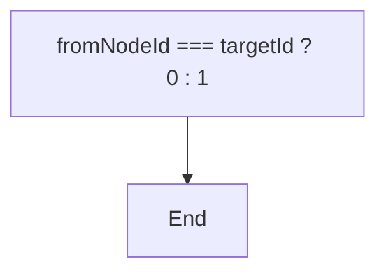
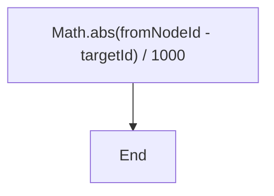
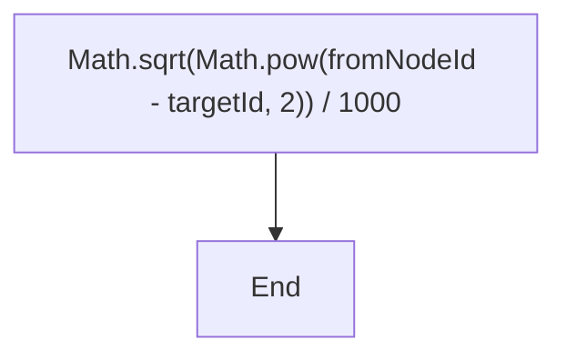
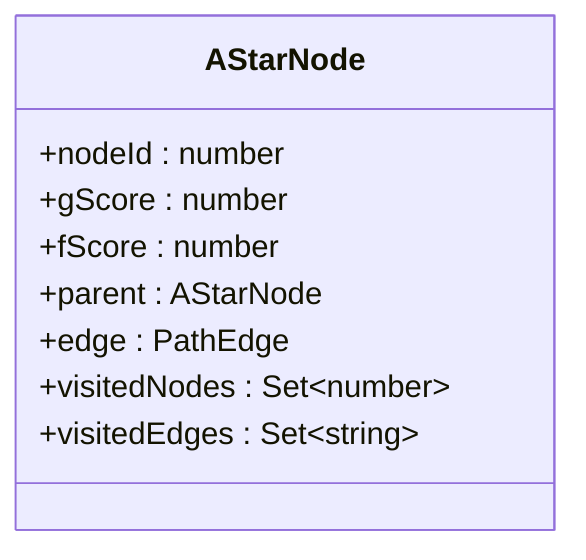
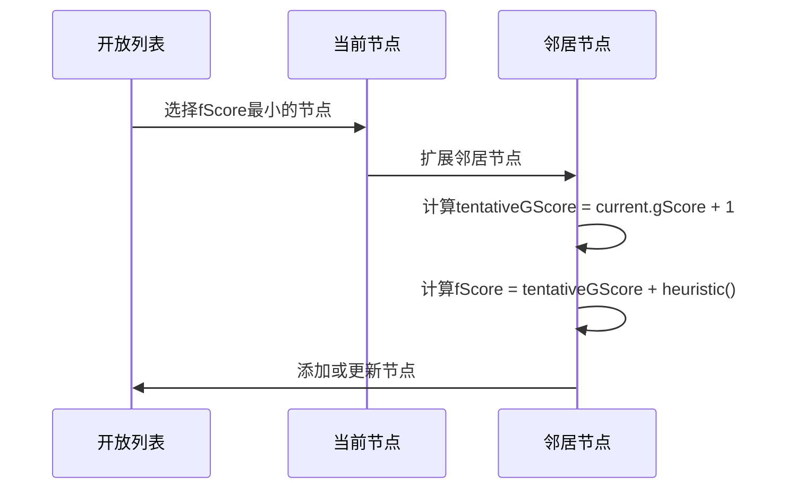
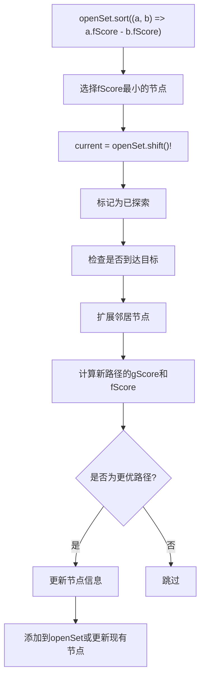
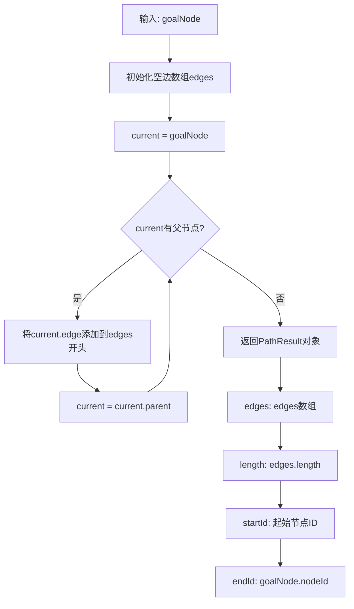
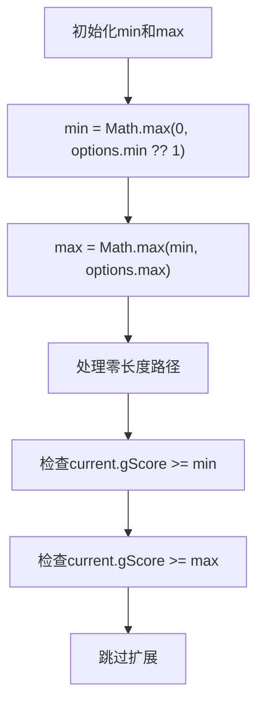
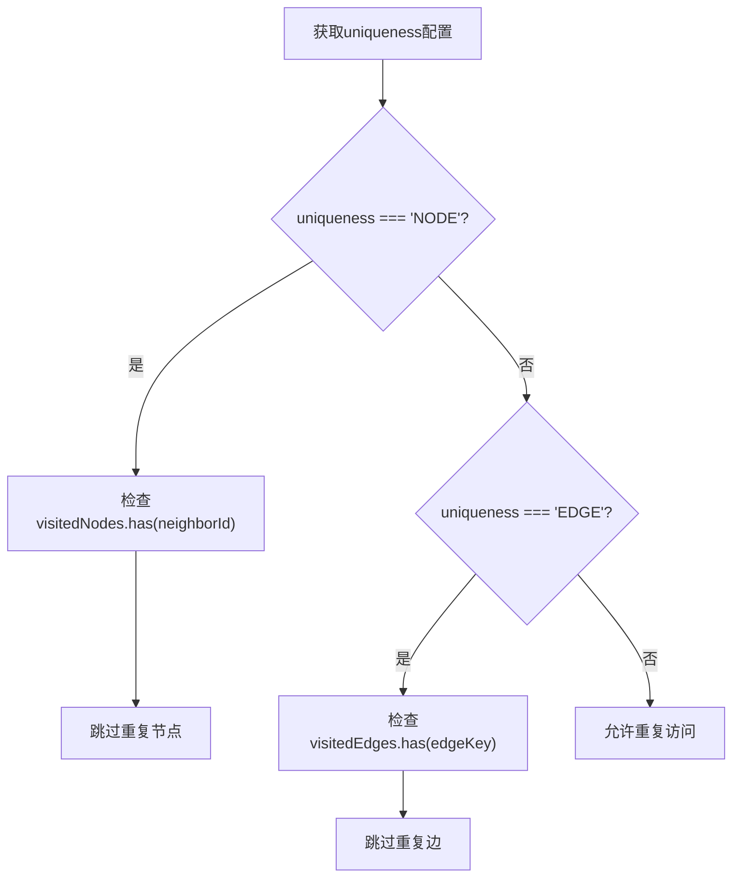
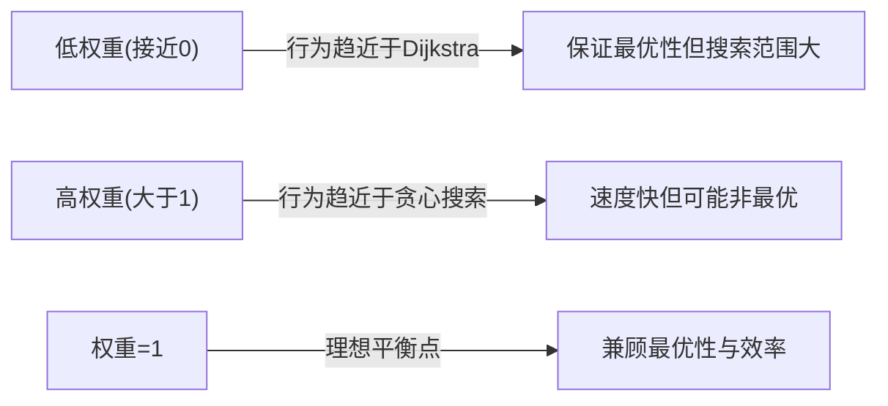

# A*搜索算法

<cite>
**本文档引用的文件**
- [astar.ts](file://src/query/path/astar.ts)
- [variable.ts](file://src/query/path/variable.ts)
- [persistentStore.ts](file://src/storage/persistentStore.ts)
</cite>

## 目录
1. [AStarPathBuilder类设计原理](#astarpathbuilder类设计原理)
2. [启发式函数详解](#启发式函数详解)
3. [gScore与fScore工作机制](#gscore与fscore工作机制)
4. [openSet节点选择机制](#openseset节点选择机制)
5. [路径重建逻辑](#路径重建逻辑)
6. [搜索空间剪枝策略](#搜索空间剪枝策略)
7. [性能调优建议](#性能调优建议)

## AStarPathBuilder类设计原理

`AStarPathBuilder` 类是A*搜索算法的核心实现，负责在图数据库中寻找最优路径。该类通过结合Dijkstra算法的准确性和贪心最佳优先搜索的效率，使用启发式函数估算从当前节点到目标的距离，从而提供最优路径搜索。

类的主要构造参数包括：
- `store`: 持久化存储实例，用于访问图数据
- `startNodes`: 起始节点集合
- `targetNodes`: 目标节点集合
- `predicateId`: 边谓词ID，定义了节点间的连接关系
- `options`: 路径查找选项，包含最小/最大跳数等约束
- `heuristicOptions`: 启发式函数配置

该类的设计体现了面向对象的封装原则，将复杂的路径查找逻辑封装在简洁的接口背后，同时保持了足够的灵活性以适应不同的搜索需求。

**Section sources**
- [astar.ts](file://src/query/path/astar.ts#L35-L268)

## 启发式函数详解

### 内置启发式类型

`AStarPathBuilder` 支持四种内置的启发式函数类型，每种类型适用于不同的场景：

#### hop（跳数）启发式


**Diagram sources**
- [astar.ts](file://src/query/path/astar.ts#L69-L72)

这是最简单的启发式函数，如果起始节点和目标节点相同则返回0，否则返回1。适用于拓扑结构简单、边权重均匀的图。

#### manhattan（曼哈顿）启发式


**Diagram sources**
- [astar.ts](file://src/query/path/astar.ts#L74-L76)

基于节点ID差值的简化版本，通过计算绝对值差并归一化来估算距离。适用于节点ID具有一定空间意义的场景。

#### euclidean（欧几里得）启发式


**Diagram sources**
- [astar.ts](file://src/query/path/astar.ts#L78-L80)

基于节点ID的简化欧几里得距离计算，同样进行了归一化处理。相比曼哈顿距离更精确地反映了"直线"距离的概念。

#### custom（自定义）启发式
允许用户传入自定义的启发式函数，提供了最大的灵活性。当未提供自定义函数时，会回退到跳数启发式。

**Section sources**
- [astar.ts](file://src/query/path/astar.ts#L53-L85)

### 自定义启发式接口契约

自定义启发式函数必须遵循以下接口契约：
```typescript
(from: number, to: number, store: PersistentStore) => number
```

参数传递规则：
- `from`: 起始节点ID
- `to`: 目标节点ID  
- `store`: 图数据库存储实例，可用于查询图的连接性信息

返回值要求：返回一个非负数值，表示从起始节点到目标节点的预估距离。返回值越小，表示预估距离越近。

此外，还支持通过`weight`参数调整启发式的影响力程度，平衡搜索精度与效率。

**Section sources**
- [astar.ts](file://src/query/path/astar.ts#L26-L33)

## gScore与fScore工作机制

### 评分系统设计

A*算法使用两个关键评分指标来指导搜索过程：



**Diagram sources**
- [astar.ts](file://src/query/path/astar.ts#L16-L24)

#### gScore（实际代价）
表示从起点到当前节点的实际代价。在本实现中，假设每条边的权重为1，因此gScore等于已走过的边数。这个值随着搜索的深入而递增，反映了到达当前节点的真实成本。

#### fScore（预估总代价）
计算公式为：`fScore = gScore + h(n)`，其中h(n)是启发式函数返回的预估距离。fScore综合考虑了已付出的代价和预计剩余的代价，用于决定下一步的搜索方向。

### 协同工作流程



**Diagram sources**
- [astar.ts](file://src/query/path/astar.ts#L181-L230)

搜索过程中，算法总是优先选择fScore最小的节点进行扩展，这样既能保证找到最优路径，又能有效减少搜索空间。

**Section sources**
- [astar.ts](file://src/query/path/astar.ts#L16-L24)

## openSet节点选择机制

### 优先队列实现

虽然代码注释中提到"使用优先队列（简化实现用数组）"，但实际上通过数组排序实现了类似优先队列的行为：



**Diagram sources**
- [astar.ts](file://src/query/path/astar.ts#L181-L230)

### 排序选择逻辑

每次迭代时，算法会对`openSet`数组按`fScore`升序排序，然后取出第一个元素作为当前处理节点。这种机制确保了：
1. 总是优先探索最有希望到达目标的节点
2. 在保证最优性的前提下，尽可能减少不必要的节点探索
3. 能够动态调整搜索方向，根据新的信息重新评估各节点的优先级

值得注意的是，尽管数组排序的时间复杂度较高，但在实际应用中，通过合理的启发式函数和剪枝策略，可以有效控制`openSet`的大小，从而保证整体性能。

**Section sources**
- [astar.ts](file://src/query/path/astar.ts#L181-L230)

## 路径重建逻辑

### 回溯机制重构

`reconstructPath`方法通过从目标节点向起始节点回溯来重建完整路径：



**Diagram sources**
- [astar.ts](file://src/query/path/astar.ts#L250-L268)

### 技术细节分析

该方法的关键技术细节包括：
- 使用`unshift()`而非`push()`操作，确保边的顺序正确
- 在回溯过程中同时确定起始节点ID
- 返回标准化的`PathResult`对象，包含路径的所有必要信息

特别值得注意的是，当`current`没有父节点时，说明已经到达起始节点，此时`current.nodeId`即为真正的起始节点ID。这种方法避免了额外的遍历操作，提高了效率。

**Section sources**
- [astar.ts](file://src/query/path/astar.ts#L250-L268)

## 搜索空间剪枝策略

### min/max跳数限制

通过`min`和`max`参数对搜索深度进行限制：



**Diagram sources**
- [astar.ts](file://src/query/path/astar.ts#L108-L115)

这种限制有效地剪枝了过短或过长的路径，避免了不必要的计算，特别是在大规模图中能显著提升性能。

### NODE/EDGE唯一性策略

通过`uniqueness`参数控制节点或边的重复访问：



**Diagram sources**
- [astar.ts](file://src/query/path/astar.ts#L210-L214)

这些配置项共同作用，形成了强大的搜索空间剪枝机制，能够在保证结果正确性的同时，大幅减少需要探索的节点数量。

**Section sources**
- [astar.ts](file://src/query/path/astar.ts#L108-L115)

## 性能调优建议

### 启发式权重设置

合理设置启发式权重是平衡搜索精度与效率的关键：



**Diagram sources**
- [astar.ts](file://src/query/path/astar.ts#L58)

建议：
1. 对于要求绝对最优解的场景，使用较低的权重（如0.5-1.0）
2. 对于实时性要求高的场景，可适当提高权重（如1.5-2.0）
3. 在大多数情况下，权重设为1.0是较好的选择

### 其他优化策略

- **合理设置max值**：避免搜索过深导致性能下降
- **选择合适的uniqueness策略**：根据业务需求选择NODE或EDGE唯一性
- **利用缓存机制**：对于频繁查询的路径，考虑缓存结果
- **预处理图数据**：对于静态图，可预先计算部分启发式信息

通过综合运用这些策略，可以在不同应用场景下获得最佳的性能表现。

**Section sources**
- [astar.ts](file://src/query/path/astar.ts#L58)