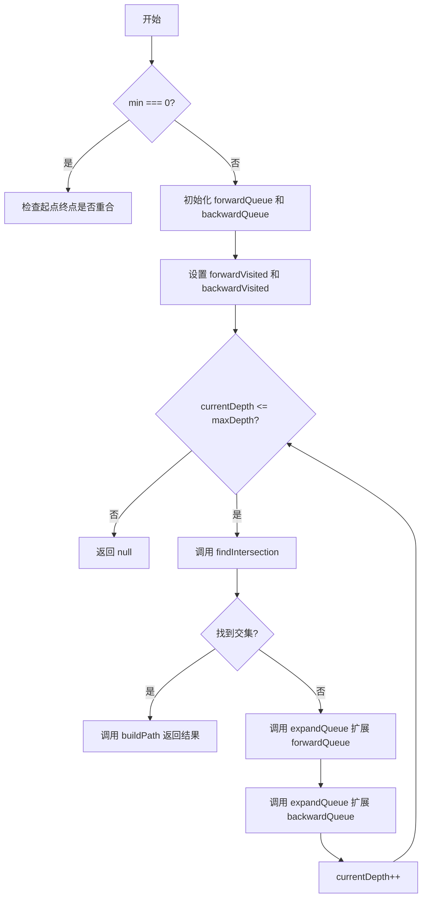
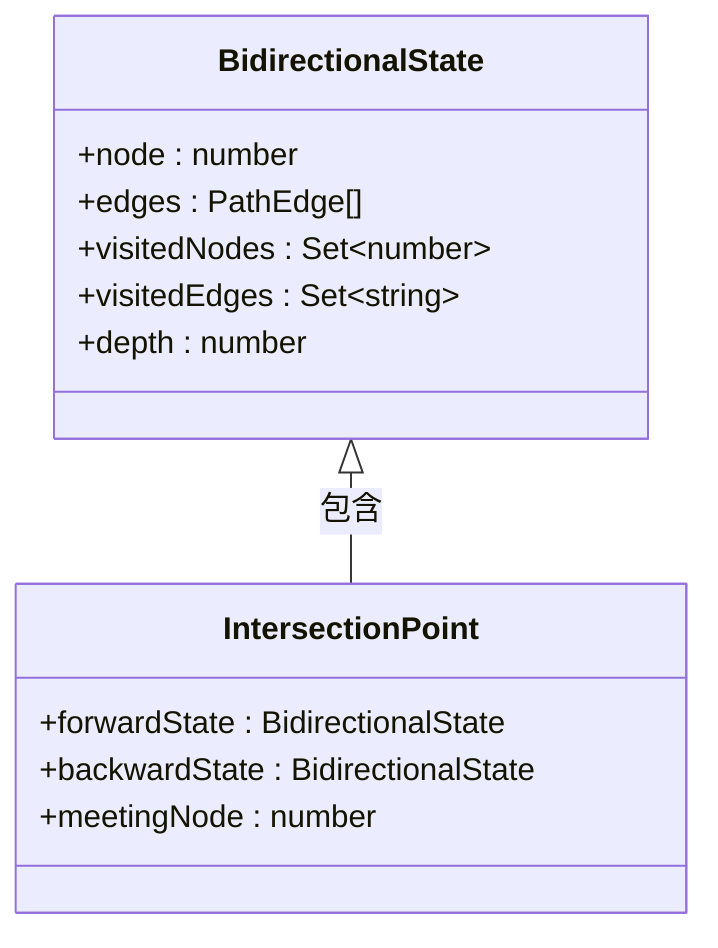

# 双向搜索算法

<cite>
**本文档引用的文件**
- [bidirectional.ts](file://src/query/path/bidirectional.ts)
- [variable.ts](file://src/query/path/variable.ts)
</cite>

## 目录
1. [简介](#简介)
2. [核心组件](#核心组件)
3. [架构概述](#架构概述)
4. [详细组件分析](#详细组件分析)
5. [性能与复杂度分析](#性能与复杂度分析)
6. [结论](#结论)

## 简介
`BidirectionalPathBuilder` 类实现了基于双向广度优先搜索（BFS）的最短路径查找算法，用于在大规模图谱中高效地查询两点之间的最短路径。该实现通过同时从起点和终点发起搜索，并在中间相遇时终止，显著减少了传统单向 BFS 的搜索空间。

本文档系统性地记录了其架构设计与关键机制，包括前向与后向队列的并行扩展、状态映射表的维护、交汇点检测逻辑、路径拼接策略以及时间复杂度优势。

## 核心组件

`BidirectionalPathBuilder` 是实现双向 BFS 搜索的核心类，封装了完整的搜索流程与状态管理。它利用两个独立的搜索方向（前向和后向）来加速路径发现过程。

**Section sources**
- [bidirectional.ts](file://src/query/path/bidirectional.ts#L30-L300)

## 架构概述



**Diagram sources**
- [bidirectional.ts](file://src/query/path/bidirectional.ts#L61-L146)

## 详细组件分析

### 前向与后向队列的并行扩展机制

`BidirectionalPathBuilder` 使用 `forwardQueue` 和 `backwardQueue` 两个队列分别存储从起点和终点出发的待探索状态。这两个队列在主循环中被交替扩展，确保两个搜索前沿同步推进。

每次迭代中，算法首先检查是否存在交汇节点，若未找到，则分别对两个队列调用 `expandQueue` 方法进行扩展。这种并行扩展机制保证了搜索过程的对称性和效率。

**Section sources**
- [bidirectional.ts](file://src/query/path/bidirectional.ts#L61-L146)

### forwardVisited 与 backwardVisited 映射表的状态维护

`forwardVisited` 和 `backwardVisited` 是两个 `Map<number, BidirectionalState>` 类型的映射表，用于记录各自方向上已访问节点的最佳状态信息。

每个 `BidirectionalState` 包含当前节点、已走过的边、访问过的节点集合、边集合及深度。当发现更短路径到达同一节点时，会更新映射表中的状态，从而保证最终找到的是最短路径。



**Diagram sources**
- [bidirectional.ts](file://src/query/path/bidirectional.ts#L16-L28)

### findIntersection 方法的核心逻辑

`findIntersection` 方法负责检测前向与后向搜索的交汇点。它遍历 `forwardVisited` 中的所有节点，检查其是否也存在于 `backwardVisited` 中。

一旦发现公共节点，即计算总长度 `totalLength = forwardState.depth + backwardState.depth`。只有当 `totalLength >= minLength` 时，才认为找到了合法的交汇点并返回。这一条件确保了即使提前相遇，也能满足用户指定的最小路径长度要求。

**Section sources**
- [bidirectional.ts](file://src/query/path/bidirectional.ts#L206-L226)

### expandQueue 中的按深度分层处理策略

`expandQueue` 方法采用分层处理策略，确保每次只扩展当前深度的所有节点。方法内部使用一个临时数组 `newStates` 来暂存新生成的状态。

在处理队列时，仅对深度等于 `targetDepth` 的节点进行邻居扩展，其他深度的节点则重新放回队列。这样可以严格控制搜索按层级展开，避免过早进入下一层，保证了 BFS 的正确性。

**Section sources**
- [bidirectional.ts](file://src/query/path/bidirectional.ts#L148-L204)

### buildPath 中后向路径的反转操作

`buildPath` 方法负责将前后两个方向的路径片段拼接成完整路径。由于后向搜索的路径是反向构建的，因此需要将其边序列进行反转。

具体操作为：使用 `reverse()` 方法反转 `backwardState.edges` 数组，并将每条边的方向取反（通过 `reverseDirection` 方法）。这保证了最终路径的方向一致性与正确性。

**Section sources**
- [bidirectional.ts](file://src/query/path/bidirectional.ts#L228-L258)

## 性能与复杂度分析

### 时间复杂度优势

传统的单向 BFS 在最坏情况下的时间复杂度为 O(b^d)，其中 b 是分支因子，d 是路径深度。而双向 BFS 将搜索空间从两端同时缩小，其时间复杂度降低至 O(b^(d/2))。

这种指数级的优化使得双向搜索在处理长距离路径查找时具有显著性能优势，尤其适用于大规模图谱场景。

```mermaid
flowchart LR
A[单向BFS] --> B[O(b^d)]
C[双向BFS] --> D[O(b^(d/2))]
B --> E[搜索空间大]
D --> F[搜索空间小]
E --> G[性能较差]
F --> H[性能优越]
```

**Diagram sources**
- [bidirectional.ts](file://src/query/path/bidirectional.ts#L1-L10)

### 内存消耗代价

尽管双向 BFS 在时间上表现优异，但其内存消耗较高。算法需要维护两套独立的队列和访问映射表（`forwardQueue`, `backwardQueue`, `forwardVisited`, `backwardVisited`），导致内存占用约为单向 BFS 的两倍。

开发者应根据实际应用场景权衡选择：对于追求速度且内存充足的长路径查询，推荐使用双向搜索；而对于内存敏感或短路径场景，单向 BFS 可能更为合适。

**Section sources**
- [bidirectional.ts](file://src/query/path/bidirectional.ts#L61-L300)

## 结论
`BidirectionalPathBuilder` 提供了一种高效的双向 BFS 实现，通过并行扩展机制、精确的状态维护和智能的交汇检测，在大规模图数据中实现了快速最短路径查找。其时间复杂度从 O(b^d) 降至 O(b^(d/2))，展现出卓越的性能潜力。然而，更高的内存开销也需要开发者在使用时做出合理权衡。该设计充分体现了算法优化中“以空间换时间”的经典思想。