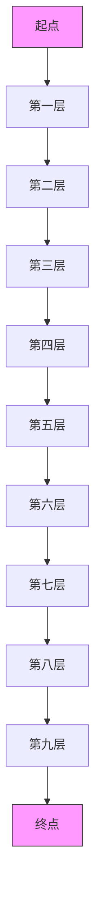
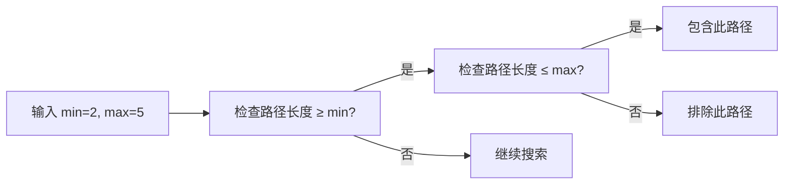

# 路径查找算法

<cite>
**本文档引用的文件**
- [synapseDb.ts](file://src/synapseDb.ts)
- [variable.ts](file://src/query/path/variable.ts)
- [bidirectional.ts](file://src/query/path/bidirectional.ts)
- [astar.ts](file://src/query/path/astar.ts)
- [persistentStore.ts](file://src/storage/persistentStore.ts)
</cite>

## 目录
1. [简介](#简介)
2. [核心API契约与适用场景](#核心api契约与适用场景)
3. [BFS单向搜索与双向BFS性能对比](#bfs单向搜索与双向bfs性能对比)
4. [A*算法与启发式函数设计](#a算法与启发式函数设计)
5. [路径约束参数详解](#路径约束参数详解)
6. [返回值结构定义](#返回值结构定义)

## 简介
本项目实现了一套完整的路径查找算法体系，支持无权图的最短路径搜索（BFS、双向BFS）和加权图的最优路径搜索（A*）。这些算法被封装在`SynapseDB`数据库系统中，用于高效查询三元组知识库中的实体关系。文档将详细说明各算法的API契约、时间复杂度优势、参数配置及其对查询结果的影响。

## 核心API契约与适用场景

### shortestPath (基础BFS)
该方法是基于广度优先搜索（BFS）的最短路径查找，适用于无权图或所有边权重相等的场景。它从起始节点开始逐层扩展，直到找到目标节点，保证返回的是跳数最少的路径。

**适用场景**：
- 查询两个实体之间的最短连接路径
- 在社交网络中查找用户间的最短关系链
- 图遍历中寻找最小跳数的可达路径

**Section sources**
- [synapseDb.ts](file://src/synapseDb.ts#L513-L577)

### BidirectionalPathBuilder (双向BFS)
该类实现了双向广度优先搜索算法，同时从起点和终点开始搜索，当两个搜索前沿相遇时即找到最短路径。相比单向BFS，它能显著减少搜索空间。

**适用场景**：
- 大规模稀疏图中的点到点最短路径查询
- 需要高性能响应的实时路径查询服务
- 搜索深度较大的图结构分析

**Section sources**
- [bidirectional.ts](file://src/query/path/bidirectional.ts#L30-L269)

### AStarPathBuilder (A*算法)
该类实现了A*启发式搜索算法，结合了Dijkstra算法的准确性和贪心搜索的效率。通过引入启发式函数估算到目标的距离，优先探索更有希望的路径分支。

**适用场景**：
- 加权图中的最短路径查找
- 地理信息系统（GIS）中的路线规划
- 需要自定义距离估算策略的复杂图分析

**Section sources**
- [astar.ts](file://src/query/path/astar.ts#L35-L268)

## BFS单向搜索与双向BFS性能对比

### 时间复杂度分析
| 算法 | 时间复杂度 | 空间复杂度 |
|------|----------|----------|
| 单向BFS | O(b^d) | O(b^d) |
| 双向BFS | O(b^(d/2)) | O(b^(d/2)) |

其中，b为分支因子（平均每个节点的邻居数），d为目标深度。

### 稀疏图中的表现差异
在稀疏图中，双向BFS的优势尤为明显。由于其搜索空间呈指数级减少，实际执行时间通常比单向BFS快一个数量级以上。例如，在一个分支因子为3、深度为10的路径查询中：

- 单向BFS需要探索约 3^10 = 59,049 个节点
- 双向BFS每侧只需探索约 3^5 = 243 个节点，总计约 486 个节点

这使得双向BFS在处理长路径查询时具有显著的性能优势。



**Diagram sources**
- [bidirectional.ts](file://src/query/path/bidirectional.ts#L30-L269)

**Section sources**
- [bidirectional.ts](file://src/query/path/bidirectional.ts#L30-L269)
- [synapseDb.ts](file://src/synapseDb.ts#L513-L577)

## A*算法与启发式函数设计

### 启发式函数类型
A*算法支持多种内置启发式函数，并允许用户自定义：

- **hop**: 基于跳数的简单启发式，相同节点返回0，否则返回1
- **manhattan**: 曼哈顿距离，基于节点ID差值的简化版本
- **euclidean**: 欧几里得距离，基于节点ID的平方差
- **custom**: 用户自定义启发式函数

### 自定义距离估算
通过`heuristicOptions`参数可以传入自定义的启发式函数，实现特定领域的距离估算。例如，可以基于图的拓扑结构、节点属性或外部数据源来计算更精确的预估距离。

```typescript
const customHeuristic = (from: number, to: number, store: PersistentStore) => {
    // 基于节点属性的自定义距离计算
    const fromProps = store.getNodeProperties(from);
    const toProps = store.getNodeProperties(to);
    // 实现特定业务逻辑的距离估算
    return calculateDistance(fromProps, toProps);
};
```

### 启发式权重调节
通过`weight`参数可以调节启发式的影响力：
- weight < 1：更偏向Dijkstra算法，保证最优解但搜索范围较大
- weight = 1：标准A*算法平衡性最佳
- weight > 1：更偏向贪心搜索，速度快但可能不是最优解

**Section sources**
- [astar.ts](file://src/query/path/astar.ts#L35-L268)

## 路径约束参数详解

### min/max跳数限制
通过`min`和`max`参数可以限定路径的长度范围：
- `min`: 最小跳数，用于排除过短的路径
- `max`: 最大跳数，防止搜索陷入无限循环



**Diagram sources**
- [astar.ts](file://src/query/path/astar.ts#L35-L268)
- [bidirectional.ts](file://src/query/path/bidirectional.ts#L30-L269)

### 方向性控制
通过`direction`参数控制搜索方向：
- `forward`: 正向搜索，沿边的方向前进
- `reverse`: 反向搜索，逆着边的方向回溯
- `both`: 双向搜索，同时考虑正向和反向边

### 遍历唯一性策略
通过`uniqueness`参数控制路径中元素的重复规则：
- `NODE`: 节点不重复，确保路径中没有环路
- `EDGE`: 边不重复，允许节点重复但边不能重复
- `NONE`: 不限制重复，可用于查找包含环路的路径

**Section sources**
- [variable.ts](file://src/query/path/variable.ts#L5-L16)
- [astar.ts](file://src/query/path/astar