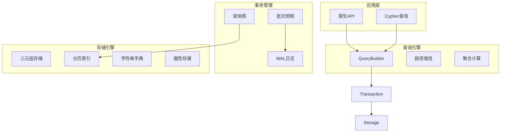
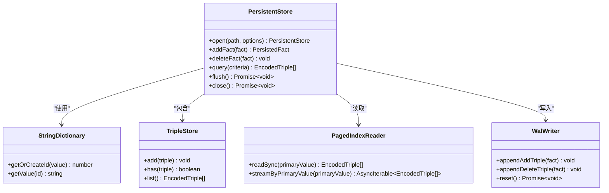
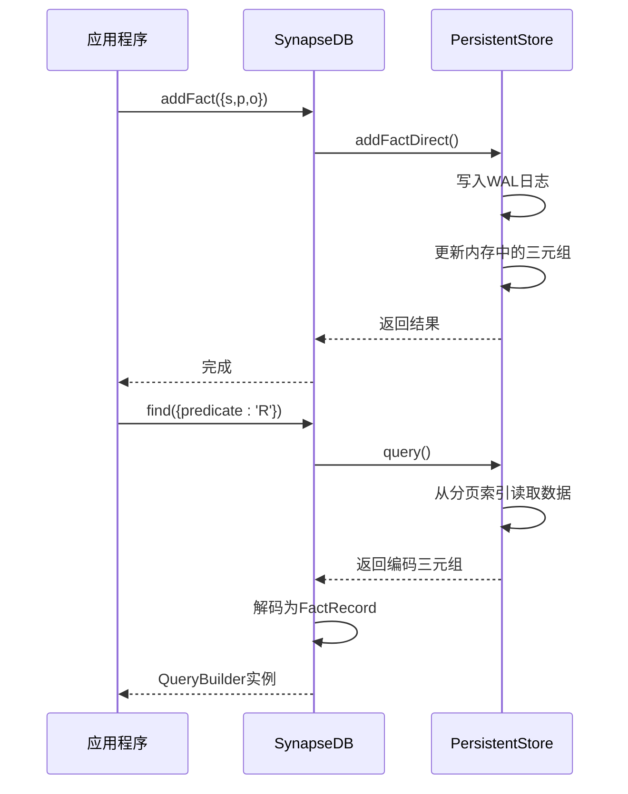
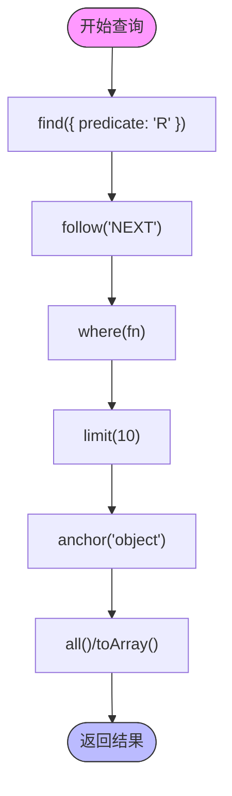

# 项目概述

<cite>
**本文档引用的文件**
- [README.md](file://README.md)
- [src/synapseDb.ts](file://src/synapseDb.ts)
- [src/storage/persistentStore.ts](file://src/storage/persistentStore.ts)
- [src/query/queryBuilder.ts](file://src/query/queryBuilder.ts)
</cite>

## 目录
1. [简介](#简介)
2. [核心设计目标与技术特点](#核心设计目标与技术特点)
3. [系统架构层次](#系统架构层次)
4. [核心模块与工作流程](#核心模块与工作流程)
5. [关键概念解析](#关键概念解析)
6. [高级技术实现](#高级技术实现)
7. [典型应用场景](#典型应用场景)

## 简介

SynapseDB 是一个用 TypeScript/Node.js 实现的嵌入式三元组知识库，专为本地应用提供高性能、强一致性的图数据存储能力。它面向代码知识管理、配置关系图谱、轻量级推理引擎和本地智能代理等场景，强调“可恢复、可治理、可扩展”的设计理念。

该项目采用单文件主数据（`*.synapsedb`）加分页索引目录（`*.synapsedb.pages/`）的存储布局，支持六种顺序索引（SPO/SOP/POS/PSO/OSP/OPS），并实现了WAL v2崩溃恢复机制。通过读快照一致性保证了查询过程中的视图稳定性，同时提供了链式联想查询和多模型交互能力。

**Section sources**
- [README.md](file://README.md#L0-L354)

## 核心设计目标与技术特点

SynapseDB的设计初衷是为边缘计算和本地化应用提供一个轻量级但功能完备的知识存储解决方案。其核心目标包括：

- **高性能图数据存储**：通过分页索引和多种优化策略实现高效的三元组存取。
- **强一致性保障**：利用WAL（Write-Ahead Logging）机制确保数据持久性和崩溃后的可恢复性。
- **链式联想查询**：支持基于`follow()`和`followReverse()`方法的连续遍历查询，便于发现实体间的关联关系。
- **多模型交互**：除了原生API外，还支持Cypher查询语言子集，方便开发者进行复杂模式匹配。

关键技术特点体现在以下几个方面：
- 支持增量合并（incremental compaction）和全量重写（rewrite）两种索引维护模式
- 实现了基于半衰期算法的热度统计机制，用于指导自动合并决策
- 提供进程级写锁保护，防止并发写入冲突
- 支持事务批次操作，允许将多个写入操作组合成一个原子提交

**Section sources**
- [README.md](file://README.md#L0-L354)

## 系统架构层次

SynapseDB的系统架构由四个主要层次构成：存储引擎、查询引擎、事务管理以及运维工具。这些组件协同工作，共同构成了完整的知识库存储系统。



**Diagram sources**
- [src/synapseDb.ts](file://src/synapseDb.ts#L57-L915)
- [src/storage/persistentStore.ts](file://src/storage/persistentStore.ts#L61-L1633)

## 核心模块与工作流程

SynapseDB的核心模块主要包括PersistentStore、SynapseDB类和QueryBuilder，它们之间的协作形成了完整的工作流程。

### PersistentStore 模块

PersistentStore是底层存储引擎的核心实现，负责管理所有持久化数据的读写操作。它封装了对主数据文件、分页索引、WAL日志等的访问逻辑，并提供了基本的数据操作接口。



**Diagram sources**
- [src/storage/persistentStore.ts](file://src/storage/persistentStore.ts#L61-L1633)

### SynapseDB 类

SynapseDB类作为对外暴露的主要接口，包装了PersistentStore的功能，向用户提供更友好的API。它实现了诸如`addFact()`、`find()`、`withSnapshot()`等方法，使得开发者可以方便地进行数据操作。



**Diagram sources**
- [src/synapseDb.ts](file://src/synapseDb.ts#L57-L915)

### QueryBuilder 模块

QueryBuilder模块提供了链式查询的能力，允许用户通过一系列方法调用来构建复杂的查询逻辑。它是实现联想查询的关键组件。



**Diagram sources**
- [src/query/queryBuilder.ts](file://src/query/queryBuilder.ts#L38-L812)

## 关键概念解析

### 三元组模型（SPO）

三元组模型是SynapseDB的基础数据结构，每个事实由主体（Subject）、谓词（Predicate）和客体（Object）三个部分组成。这种表示方式非常适合描述实体间的关系网络。

例如，在代码知识图谱中：
- 主体：`file:/src/user.ts`
- 谓词：`DEFINES`
- 客体：`class:User`

这表示"user.ts"文件定义了一个名为"User"的类。

### 读快照一致性

读快照一致性是指在一次查询过程中，数据库的视图保持不变。即使其他线程正在进行写入或索引合并操作，当前查询看到的数据状态也不会发生变化。这是通过`withSnapshot()`方法实现的，该方法会在回调执行期间固定manifest的epoch版本号。

### WAL机制

WAL（Write-Ahead Logging）机制是一种预写式日志技术，所有修改操作都会先记录到WAL文件中，然后再应用到主数据结构。这样做的好处是：
- 确保数据持久性：即使系统崩溃，也可以通过重放WAL日志来恢复未完成的事务
- 提高性能：批量写入减少了磁盘I/O次数
- 支持幂等性：通过txId实现跨周期的重复提交去重

**Section sources**
- [README.md](file://README.md#L0-L354)

## 高级技术实现

### 崩溃恢复

SynapseDB的崩溃恢复流程如下：
1. 启动时检查是否存在有效的WAL文件
2. 如果存在，则按顺序重放WAL中的记录
3. 在校验失败处安全截断日志，确保下次打开时不会重复处理损坏的记录
4. 将已提交的事务ID注册表与历史记录合并，避免重复执行

这一过程保证了即使在异常关闭后，数据库也能恢复到最近的一致状态。

### LSM-Lite合并策略

LSM-Lite是一种实验性的暂存策略，类似于LSM-Tree的思想。新增的数据首先写入内存中的memtable，当达到一定规模后才会被刷入磁盘的分页索引。这种方式的优势在于：
- 减少了随机写入的频率
- 可以批量处理合并操作，提高整体吞吐量
- 支持异步压缩，不影响前台查询性能

### 热点页统计

热点页统计功能通过`hotness.json`文件记录各个primary值的访问频率。每次查询命中某个页面时，对应的计数器就会增加。为了防止无限增长，系统采用了半衰期算法对旧的计数进行衰减：

```
衰减因子 = 0.5^(经过时间 / 半衰期)
```

默认半衰期为10分钟，这意味着10分钟后计数值会减半。这个机制帮助系统识别出真正频繁访问的热点数据，从而优先对其进行优化处理。

**Section sources**
- [src/storage/persistentStore.ts](file://src/storage/persistentStore.ts#L61-L1633)
- [src/maintenance/autoCompact.ts](file://src/maintenance/autoCompact.ts#L81-L266)

## 典型应用场景

根据README.md中的使用示例，SynapseDB适用于以下几种典型场景：

### 知识图谱

构建领域知识图谱，如医学术语关系网、法律条文引用体系等。利用链式查询功能可以轻松探索概念之间的深层联系。

### 推理引擎

作为规则推理系统的后端存储，支持基于事实的演绎推理。例如，通过`shortestPath()`方法寻找两个实体间的最短推理路径。

### 本地智能代理

为桌面应用程序或移动设备上的AI助手提供本地化的记忆存储。由于其嵌入式特性，无需依赖外部服务即可实现上下文感知和个性化推荐。

### 代码分析工具

建立代码库的静态分析结果存储，追踪类、函数、变量之间的依赖关系。配合QueryBuilder的流式查询能力，能够高效处理大型项目的复杂关系网络。

**Section sources**
- [README.md](file://README.md#L0-L354)