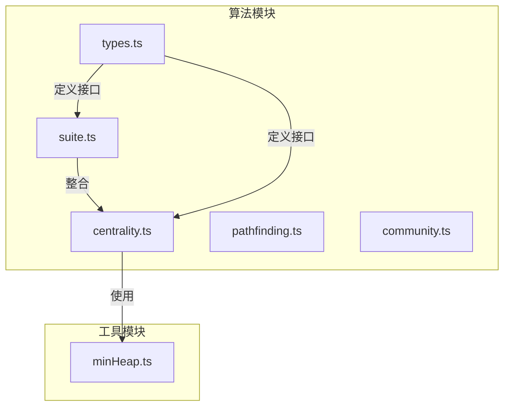
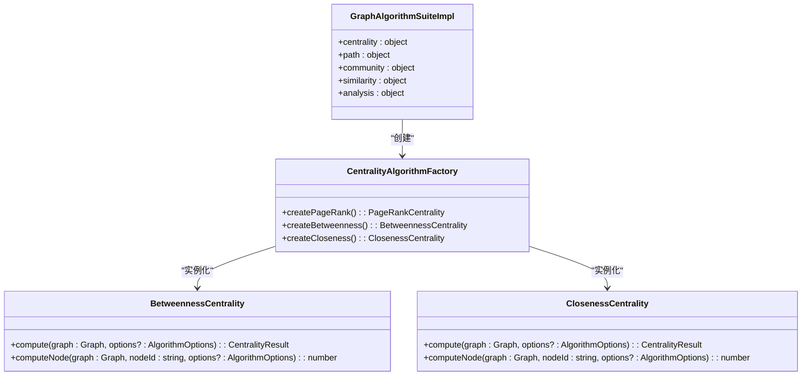
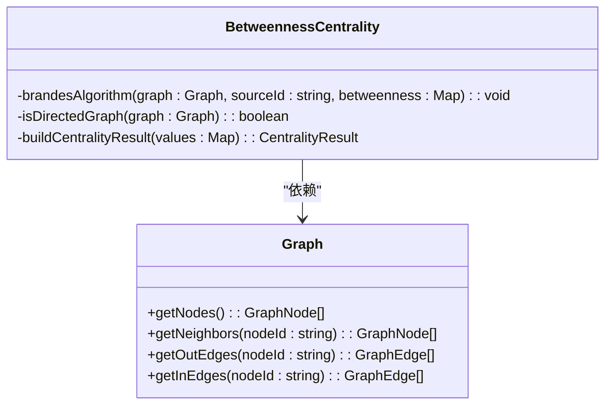
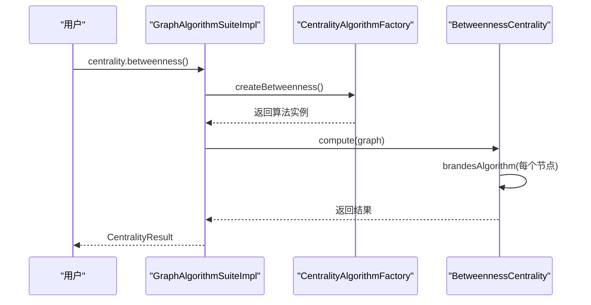
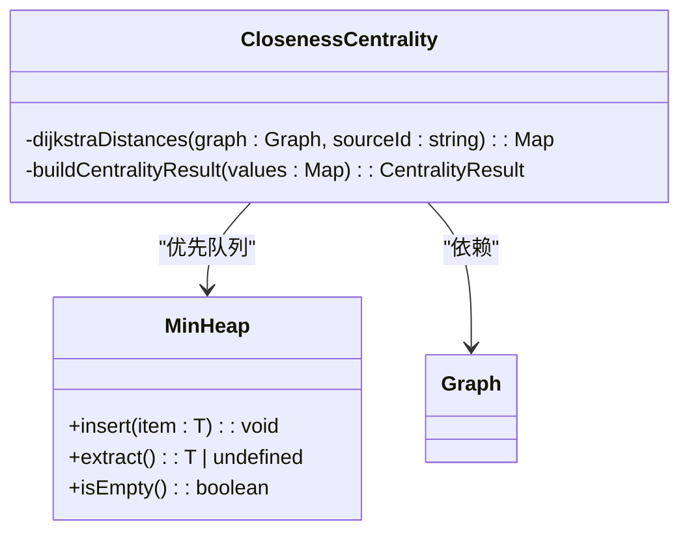
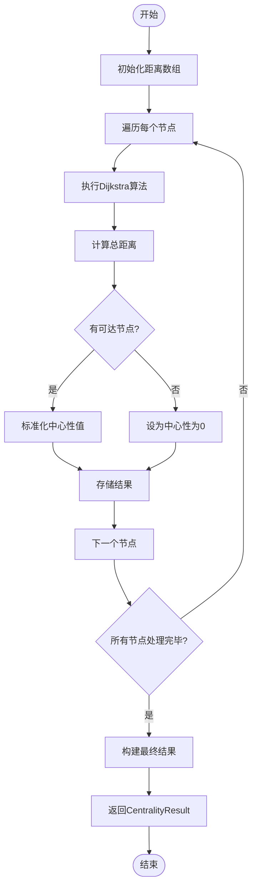
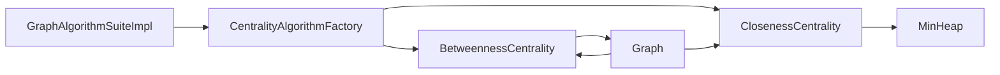

# 中心性算法

<cite>
**本文档引用的文件**   
- [centrality.ts](file://src/algorithms/centrality.ts)
- [suite.ts](file://src/algorithms/suite.ts)
- [types.ts](file://src/algorithms/types.ts)
- [minHeap.ts](file://src/utils/minHeap.ts)
</cite>

## 目录
1. [引言](#引言)
2. [项目结构](#项目结构)
3. [核心组件](#核心组件)
4. [架构概述](#架构概述)
5. [详细组件分析](#详细组件分析)
6. [依赖分析](#依赖分析)
7. [性能考虑](#性能考虑)
8. [故障排除指南](#故障排除指南)
9. [结论](#结论)

## 引言
SynapseDB 是一个图数据库系统，提供多种图分析算法来评估知识图谱中节点的重要性。本文档深入解析其中实现的中心性算法，包括接近中心性（Closeness Centrality）和介数中心性（Betweenness Centrality），并探讨其在大规模图数据上的应用与优化策略。

## 项目结构
SynapseDB 的源码组织清晰，主要功能模块位于 `src` 目录下。与中心性算法相关的代码集中在 `src/algorithms` 子目录中，特别是 `centrality.ts` 文件实现了各种中心性度量方法。整个项目的结构支持可扩展性和模块化设计，便于集成新的图算法。

**图表来源**
- [centrality.ts](file://src/algorithms/centrality.ts)
- [suite.ts](file://src/algorithms/suite.ts)
- [types.ts](file://src/algorithms/types.ts)
- [minHeap.ts](file://src/utils/minHeap.ts)

**章节来源**
- [centrality.ts](file://src/algorithms/centrality.ts#L1-L650)
- [suite.ts](file://src/algorithms/suite.ts#L1-L530)
- [types.ts](file://src/algorithms/types.ts#L1-L360)

## 核心组件
SynapseDB 的中心性算法基于统一的接口设计，所有算法都实现了 `CentralityAlgorithm` 接口。该接口定义了两个核心方法：`compute` 用于计算图中所有节点的中心性值，`computeNode` 则针对单个节点进行计算。这种设计确保了不同算法之间的互操作性和一致性。

**章节来源**
- [types.ts](file://src/algorithms/types.ts#L229-L235)
- [centrality.ts](file://src/algorithms/centrality.ts#L129-L254)
- [centrality.ts](file://src/algorithms/centrality.ts#L259-L361)

## 架构概述
SynapseDB 提供了一个统一的图算法套件 `GraphAlgorithmSuiteImpl`，通过工厂模式封装了所有图算法的访问入口。用户可以通过 `centrality` 属性直接调用不同的中心性算法，如 `pageRank`、`betweenness` 和 `closeness` 等。这种设计简化了 API 使用，并提供了良好的扩展性。

**图表来源**
- [suite.ts](file://src/algorithms/suite.ts#L61-L406)
- [centrality.ts](file://src/algorithms/centrality.ts#L129-L254)
- [centrality.ts](file://src/algorithms/centrality.ts#L259-L361)

## 详细组件分析

### 介数中心性分析
介数中心性衡量的是一个节点在网络中最短路径中出现的频率。SynapseDB 使用 Brandes 算法高效地计算这一指标。对于每个节点作为源点执行一次 BFS 遍历，记录最短路径数量和前驱节点信息，然后通过依赖累积阶段更新中介中心性值。

#### 对象导向组件：

**图表来源**
- [centrality.ts](file://src/algorithms/centrality.ts#L129-L254)

#### API/服务组件：

**图表来源**
- [suite.ts](file://src/algorithms/suite.ts#L61-L90)
- [centrality.ts](file://src/algorithms/centrality.ts#L129-L254)

### 接近中心性分析
接近中心性反映了一个节点到其他所有可达节点的平均距离倒数。SynapseDB 使用 Dijkstra 算法计算从每个节点出发的单源最短路径，然后根据总距离和可达节点数标准化得到最终的中心性值。

#### 对象导向组件：

**图表来源**
- [centrality.ts](file://src/algorithms/centrality.ts#L259-L361)
- [minHeap.ts](file://src/utils/minHeap.ts#L4-L113)

#### 复杂逻辑组件：

**图表来源**
- [centrality.ts](file://src/algorithms/centrality.ts#L259-L361)

**章节来源**
- [centrality.ts](file://src/algorithms/centrality.ts#L259-L361)
- [minHeap.ts](file://src/utils/minHeap.ts#L4-L113)

## 依赖分析
SynapseDB 的中心性算法高度依赖于底层图数据结构和辅助工具类。`MinHeap` 被用于优化 Dijkstra 算法中的优先队列操作，显著提升了性能。同时，所有算法都遵循相同的接口规范，使得它们可以无缝集成到 `GraphAlgorithmSuiteImpl` 中。

**图表来源**
- [centrality.ts](file://src/algorithms/centrality.ts)
- [suite.ts](file://src/algorithms/suite.ts)
- [minHeap.ts](file://src/utils/minHeap.ts)

**章节来源**
- [centrality.ts](file://src/algorithms/centrality.ts#L1-L650)
- [suite.ts](file://src/algorithms/suite.ts#L1-L530)
- [minHeap.ts](file://src/utils/minHeap.ts#L1-L110)

## 性能考虑
介数中心性的计算复杂度为 O(nm)，其中 n 是节点数，m 是边数，因此在大规模图上可能成为瓶颈。接近中心性由于需要对每个节点运行 Dijkstra 算法，时间复杂度更高，达到 O(n(m + n log n))。为了应对这些挑战，建议在实际应用中采用采样或近似算法来减少计算开销。

## 故障排除指南
当遇到性能问题时，首先检查图的规模是否过大。对于非常大的图，考虑使用分布式计算框架或将算法限制在子图范围内执行。此外，确保正确配置内存设置以避免溢出错误。如果发现结果异常，请验证输入图的数据完整性以及权重字段的有效性。

**章节来源**
- [centrality.ts](file://src/algorithms/centrality.ts#L129-L254)
- [centrality.ts](file://src/algorithms/centrality.ts#L259-L361)

## 结论
SynapseDB 提供了一套完整的中心性算法实现，能够有效评估知识图谱中节点的重要性。通过合理的架构设计和高效的算法选择，系统能够在保持准确性的同时满足实际应用场景的需求。未来的工作方向包括引入更多近似算法以进一步提升大规模图上的性能表现。