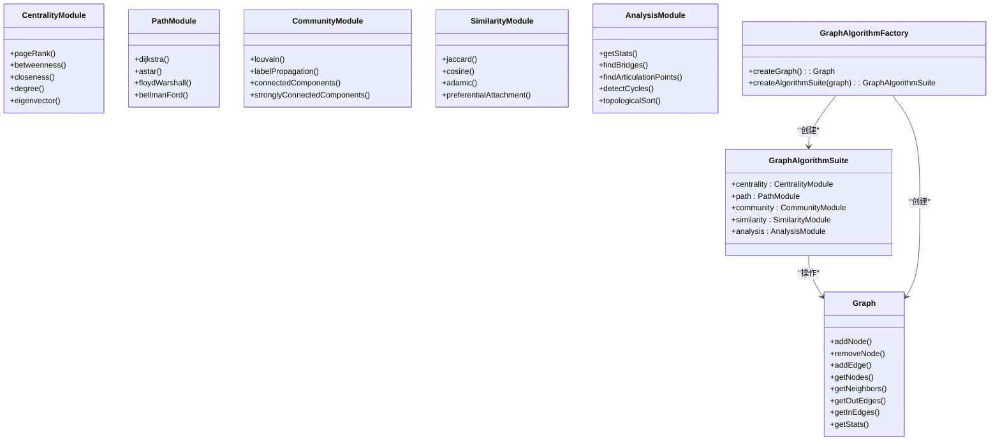
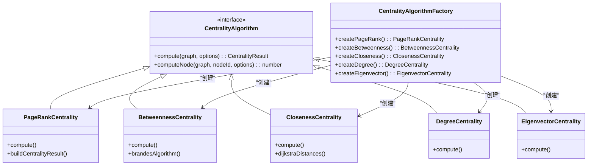
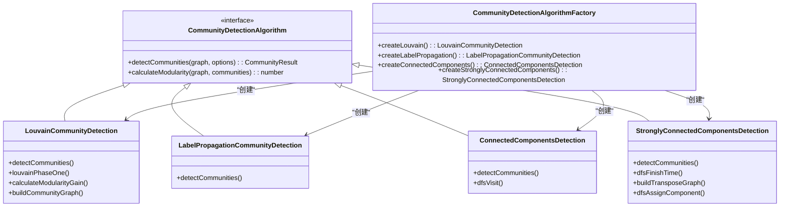
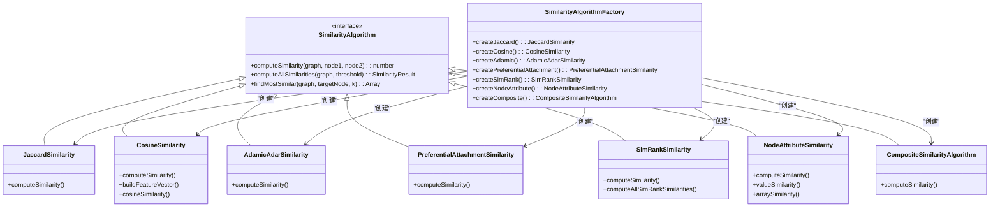

# 图算法

<cite>
**本文档引用的文件**   
- [suite.ts](file://src/algorithms/suite.ts)
- [types.ts](file://src/algorithms/types.ts)
- [centrality.ts](file://src/algorithms/centrality.ts)
- [community.ts](file://src/algorithms/community.ts)
- [similarity.ts](file://src/algorithms/similarity.ts)
- [pathfinding.ts](file://src/algorithms/pathfinding.ts)
- [graph.ts](file://src/algorithms/graph.ts)
</cite>

## 目录
1. [引言](#引言)
2. [图算法套件架构](#图算法套件架构)
3. [核心算法模块分析](#核心算法模块分析)
4. [中心性计算算法](#中心性计算算法)
5. [社区发现算法](#社区发现算法)
6. [节点相似度度量](#节点相似度度量)
7. [高级路径查找算法](#高级路径查找算法)
8. [图数据结构与工具函数](#图数据结构与工具函数)
9. [性能调优与最佳实践](#性能调优与最佳实践)
10. [扩展与自定义算法插件](#扩展与自定义算法插件)

## 引言

SynapseDB中的图算法套件（AlgorithmSuite）提供了一整套完整的图分析功能，支持在知识图谱上执行复杂的图计算任务。该套件设计为模块化、可扩展的架构，涵盖了中心性分析、社区发现、相似度计算和路径查找等核心图算法。通过统一的接口设计，开发者可以轻松地对大规模图数据进行高级分析，识别关键节点、发现潜在社区结构，并量化节点间的关联程度。本文档深入解析该算法套件的实现原理、数学基础、时间复杂度以及在实际场景中的应用。

## 图算法套件架构

**图表来源**
- [suite.ts](file://src/algorithms/suite.ts#L61-L406)
- [types.ts](file://src/algorithms/types.ts#L274-L316)

**章节来源**
- [suite.ts](file://src/algorithms/suite.ts#L61-L406)
- [types.ts](file://src/algorithms/types.ts#L274-L316)

## 核心算法模块分析

SynapseDB的图算法套件采用分层架构设计，以`GraphAlgorithmSuiteImpl`为核心，将不同类别的算法组织成独立的模块。这种设计遵循了单一职责原则，使得代码结构清晰且易于维护。套件通过依赖注入的方式，利用工厂模式（`CentralityAlgorithmFactory`, `PathAlgorithmFactory`等）来实例化具体的算法实现，从而实现了算法逻辑与调用逻辑的解耦。整个系统围绕`Graph`接口构建，确保了算法可以无缝应用于任何符合该接口的图数据结构。

**章节来源**
- [suite.ts](file://src/algorithms/suite.ts#L61-L406)
- [types.ts](file://src/algorithms/types.ts#L274-L316)

## 中心性计算算法

### PageRank 算法
PageRank算法用于衡量图中节点的重要性，其数学原理基于随机冲浪者模型。一个节点的PageRank值由其入链节点的PageRank值加权求和决定。公式如下：
$$PR(u) = \frac{1-d}{N} + d \sum_{v \in M(u)} \frac{PR(v)}{L(v)}$$
其中，$d$是阻尼因子（通常为0.85），$N$是总节点数，$M(u)$是链接到$u$的节点集合，$L(v)$是节点$v$的出链数量。该算法的时间复杂度为$O(nm)$，其中$n$是节点数，$m$是边数。

### 介数中心性 (Betweenness Centrality)
介数中心性衡量一个节点作为其他节点间最短路径中介的频率。它基于Brandes算法高效实现，通过两次遍历（BFS和依赖累积）来计算。对于无向图，结果需要除以2。其时间复杂度为$O(nm)$，适用于中等规模的图。

### 接近中心性 (Closeness Centrality)
接近中心性反映了一个节点到达图中所有其他节点的平均距离。标准化后的接近中心性计算公式为：$\frac{(n-1)^2}{\sum_{v \neq u} d(u,v)}$，其中$d(u,v)$是节点$u$到$v$的最短距离。该算法内部使用Dijkstra算法计算单源最短路径，时间复杂度为$O(n(m + n\log n))$。

### 度中心性 (Degree Centrality)
度中心性是最简单的中心性度量，直接等于节点的度数（邻居数量）。其计算时间复杂度为$O(1)$，因为可以直接从图的邻接表获取。

### 特征向量中心性 (Eigenvector Centrality)
特征向量中心性认为，一个节点的重要性取决于其邻居节点的重要性。它通过幂迭代法求解邻接矩阵的最大特征值对应的特征向量来实现。时间复杂度主要取决于迭代次数，每次迭代为$O(n^2)$。

**图表来源**
- [centrality.ts](file://src/algorithms/centrality.ts#L18-L650)
- [types.ts](file://src/algorithms/types.ts#L229-L235)

**章节来源**
- [centrality.ts](file://src/algorithms/centrality.ts#L18-L650)

## 社区发现算法

### Louvain 算法
Louvain算法是一种基于模块度优化的层次化社区发现算法。它分为两个阶段：首先，在每个节点上尝试将其移动到能最大化模块度增益的邻居社区；然后，将同一社区内的节点合并为一个超节点，形成新的图。这个过程重复进行，直到模块度不再显著提升。其时间复杂度约为$O(n\log n)$，非常适合大规模网络。

### 标签传播算法 (Label Propagation Algorithm)
标签传播算法假设相连的节点更可能属于同一个社区。算法初始化时为每个节点分配一个唯一的标签，然后迭代更新每个节点的标签为其邻居中最频繁出现的标签。该算法简单高效，时间复杂度为$O(m)$，但结果具有随机性。

### 连通分量检测
连通分量检测使用深度优先搜索（DFS）来识别图中的各个连通子图。对于无向图，这可以找出所有孤立的子网络。时间复杂度为$O(n+m)$。

### 强连通分量检测
强连通分量检测使用Kosaraju算法，通过两次DFS遍历来识别有向图中的强连通分量。第一次DFS确定节点的完成顺序，第二次在转置图上按此逆序访问。时间复杂度为$O(n+m)$。

**图表来源**
- [community.ts](file://src/algorithms/community.ts#L18-L617)
- [types.ts](file://src/algorithms/types.ts#L251-L258)

**章节来源**
- [community.ts](file://src/algorithms/community.ts#L18-L617)

## 节点相似度度量

### Jaccard 系数
Jaccard系数衡量两个节点共同邻居的比例。计算公式为：$J(A,B) = \frac{|N(A) \cap N(B)|}{|N(A) \cup N(B)|}$，其中$N(A)$是节点A的邻居集合。其时间复杂度为$O(d_A + d_B)$，$d$代表度数。

### 余弦相似度
余弦相似度将节点表示为基于谓词类型（边类型）的度数向量，然后计算这两个向量夹角的余弦值。它考虑了图的语义信息，比Jaccard系数更能反映节点的结构角色。时间复杂度为$O(k)$，$k$是谓词类型的数量。

### Adamic-Adar 指数
Adamic-Adar指数认为，连接到低度数共同邻居的节点对更相似。其计算公式为：$\sum_{z \in N(A) \cap N(B)} \frac{1}{\log |N(z)|}$。它倾向于发现更紧密、更有意义的连接。

### 优先连接指数
优先连接指数基于“富者愈富”的原则，计算公式为：$PA(A,B) = deg(A) \times deg(B)$。它预测高度数节点之间更有可能建立连接。

**图表来源**
- [similarity.ts](file://src/algorithms/similarity.ts#L18-L759)
- [types.ts](file://src/algorithms/types.ts#L211-L218)

**章节来源**
- [similarity.ts](file://src/algorithms/similarity.ts#L18-L759)

## 高级路径查找算法

### Dijkstra 算法
Dijkstra算法用于解决带权图的单源最短路径问题。它使用最小堆（MinHeap）来高效选择当前距离最短的节点。该实现支持权重函数和最大跳数限制。时间复杂度为$O((n + m)\log n)$。

### A* 算法
A*算法是Dijkstra算法的启发式改进版，通过引入启发式函数$h(n)$来引导搜索方向。其评估函数为$f(n) = g(n) + h(n)$，其中$g(n)$是从起点到$n$的实际代价，$h(n)$是从$n$到目标的估计代价。当$h(n)=0$时，退化为Dijkstra算法。

### Floyd-Warshall 算法
Floyd-Warshall算法用于计算所有节点对之间的最短路径。它通过动态规划的思想，逐步允许中间节点的加入来更新距离矩阵。时间复杂度为$O(n^3)$，空间复杂度为$O(n^2)$，适合稠密图或需要全源最短路径的场景。

### Bellman-Ford 算法
Bellman-Ford算法能够处理包含负权重边的图