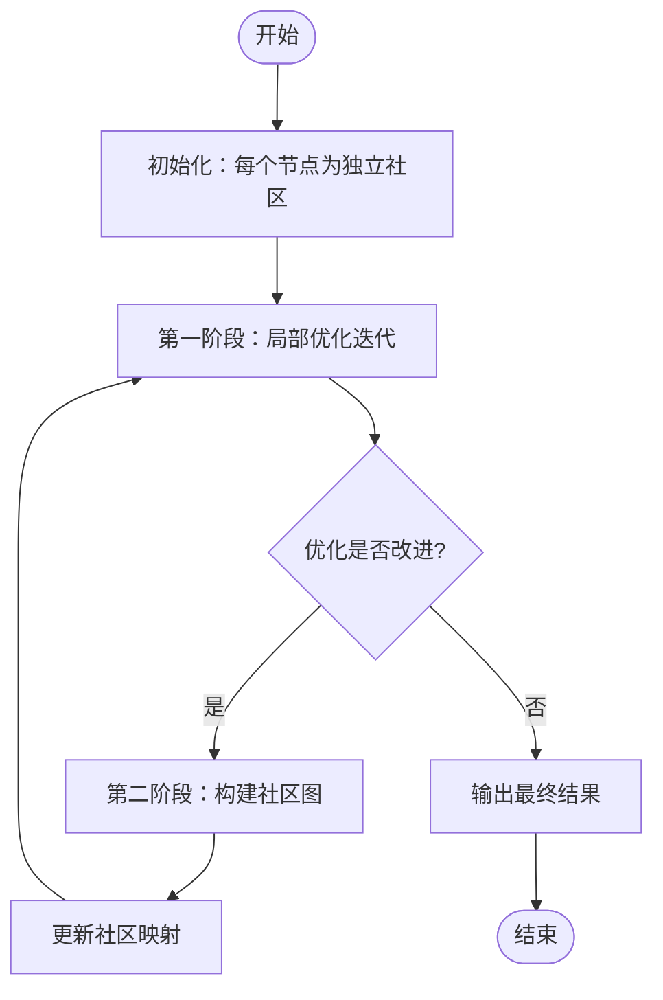
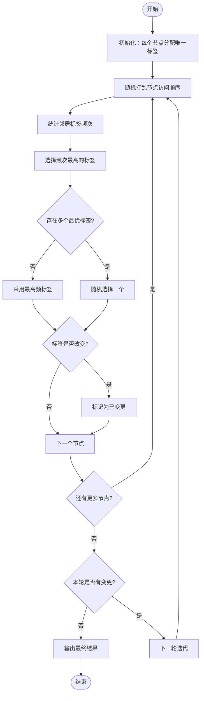

# 社区发现算法

<cite>
**本文档引用文件**   
- [community.ts](file://src/algorithms/community.ts)
- [types.ts](file://src/algorithms/types.ts)
</cite>

## 目录
1. [引言](#引言)
2. [核心算法实现](#核心算法实现)
3. [基于模块度优化的Louvain算法](#基于模块度优化的louvain算法)
4. [基于标签传播的社区发现](#基于标签传播的社区发现)
5. [配置参数与运行方式](#配置参数与运行方式)
6. [算法稳定性与适应性分析](#算法稳定性与适应性分析)
7. [总结](#总结)

## 引言
SynapseDB提供多种社区发现算法，用于识别图结构中的高内聚、低耦合子结构。这些算法在社交网络分析、知识图谱聚类等场景中具有广泛应用。本文重点阐述基于**标签传播（Label Propagation）** 和 **模块度优化（Modularity Optimization）** 的两种主要实现方式，并结合源码深入分析其迭代规则、收敛条件及并行处理策略。

**Section sources**
- [community.ts](file://src/algorithms/community.ts#L0-L617)
- [types.ts](file://src/algorithms/types.ts#L0-L365)

## 核心算法实现
SynapseDB通过 `CommunityDetectionAlgorithm` 接口统一管理各类社区发现算法，确保接口一致性。该接口定义了两个核心方法：
- `detectCommunities`: 执行社区划分，返回包含节点-社区映射、层次结构和模块度的结果。
- `calculateModularity`: 计算当前社区划分的模块度值，衡量社区划分质量。

系统实现了四种具体算法：
- `LouvainCommunityDetection`: 基于模块度优化的多层次社区发现。
- `LabelPropagationCommunityDetection`: 基于标签传播的快速社区发现。
- `ConnectedComponentsDetection`: 无向图连通分量检测。
- `StronglyConnectedComponentsDetection`: 有向图强连通分量检测。

通过工厂模式 `CommunityDetectionAlgorithmFactory` 提供便捷的实例创建方式，支持按类型动态获取算法实例。

**Section sources**
- [community.ts](file://src/algorithms/community.ts#L250-L256)
- [community.ts](file://src/algorithms/community.ts#L19-L257)
- [community.ts](file://src/algorithms/community.ts#L262-L371)
- [community.ts](file://src/algorithms/community.ts#L376-L436)
- [community.ts](file://src/algorithms/community.ts#L438-L581)
- [community.ts](file://src/algorithms/community.ts#L586-L616)

## 基于模块度优化的Louvain算法
Louvain算法是一种经典的多层次社区发现算法，通过最大化模块度来识别社区结构。其核心思想是将节点逐步合并到能带来最大模块度增益的社区中。

### 算法流程


**Diagram sources**
- [community.ts](file://src/algorithms/community.ts#L19-L257)

### 迭代更新规则
算法采用两阶段循环：
1. **局部优化阶段** (`louvainPhaseOne`)：遍历所有节点，尝试将其移动到邻居社区中能带来最大模块度增益的位置。增益计算公式为：
   ```
   ΔQ = (内部连接权重增量 - 期望连接权重增量) × 分辨率参数
   ```
   具体实现中，增益正比于目标社区的边权总和减去原社区的边权总和。

2. **图折叠阶段** (`buildCommunityGraph`)：将同一社区内的节点合并为一个超节点，形成新的抽象图，进入下一轮优化。

### 收敛条件
算法在以下任一条件下终止：
- 局部优化阶段未发生任何节点移动（`hasChange === false`）。
- 达到最大迭代次数 (`maxIterations`)。
- 模块度增益低于容忍度阈值 (`tolerance`)。

### 配置参数
| 参数 | 类型 | 默认值 | 说明 |
|------|------|--------|------|
| `resolution` | number | 1.0 | 分辨率参数，控制社区粒度，值越大社区越细 |
| `maxIterations` | number | 100 | 最大迭代次数 |
| `tolerance` | number | 1e-6 | 模块度增益收敛容忍度 |
| `randomness` | number | 0.01 | 随机扰动因子，用于打破平局 |

**Section sources**
- [community.ts](file://src/algorithms/community.ts#L19-L257)
- [types.ts](file://src/algorithms/types.ts#L211-L216)

## 基于标签传播的社区发现
标签传播算法（Label Propagation Algorithm, LPA）是一种高效的社区发现方法，其核心思想是节点倾向于与其邻居属于同一社区。

### 算法流程


**Diagram sources**
- [community.ts](file://src/algorithms/community.ts#L262-L371)

### 迭代更新规则
1. 初始化时，每个节点被赋予唯一的初始标签。
2. 在每轮迭代中，随机访问节点，统计其所有邻居的标签出现频率。
3. 节点采纳频率最高的邻居标签作为新标签；若存在多个最高频标签，则随机选择其一。
4. 当某轮迭代中所有节点的标签均未发生变化时，算法收敛。

### 收敛条件
- 连续一轮迭代中没有任何节点更改标签。
- 达到预设的最大迭代次数 (`maxIterations`)。

### 并行处理策略
虽然当前实现为串行版本，但标签传播算法天然适合并行化。未来可通过以下方式提升性能：
- 使用异步更新或同步批量更新策略。
- 利用图分区技术实现分布式计算。

### 配置参数
| 参数 | 类型 | 默认值 | 说明 |
|------|------|--------|------|
| `maxIterations` | number | 100 | 最大迭代次数 |
| `tolerance` | number | 1e-6 | 收敛容忍度（实际未使用） |

**Section sources**
- [community.ts](file://src/algorithms/community.ts#L262-L371)
- [types.ts](file://src/algorithms/types.ts#L187-L198)

## 配置参数与运行方式
### 通用配置选项
所有算法共享基础配置项，定义于 `AlgorithmOptions` 接口中：
- `maxIterations`: 控制算法最大执行轮数。
- `tolerance`: 决定收敛精度。
- `seed`: 随机种子，保证结果可复现（影响节点访问顺序和标签选择）。

### 注册与运行示例
```typescript
// 创建图实例
const graph = new Graph();

// 添加节点和边...
graph.addNode({ id: 'A', value: 'User' });
graph.addNode({ id: 'B', value: 'User' });
graph.addEdge({ source: 'A', target: 'B', type: 'FRIEND', weight: 1 });

// 创建Louvain算法实例
const louvain = CommunityDetectionAlgorithmFactory.create('louvain');
const result = louvain.detectCommunities(graph, {
  resolution: 1.5,
  maxIterations: 50
});

console.log(result.communities); // 节点所属社区映射
console.log(result.modularity);  // 模块度得分
```

**Section sources**
- [community.ts](file://src/algorithms/community.ts#L586-L616)
- [types.ts](file://src/algorithms/types.ts#L187-L198)

## 算法稳定性与适应性分析
### 算法稳定性
- **Louvain算法**：由于节点访问顺序随机化，多次运行可能产生不同结果。可通过固定随机种子提高可复现性。
- **标签传播算法**：对初始标签和投票平局处理敏感，结果波动较大。建议多次运行取平均或使用确定性策略解决平局。

### 分辨率限制
Louvain算法存在著名的“分辨率极限”问题：当分辨率参数设置不合理时，可能无法检测到较小规模的真实社区。用户需根据应用场景调整 `resolution` 参数以平衡社区粒度。

### 动态图适应性
当前实现主要针对静态图。对于动态图（频繁增删节点/边），直接重新运行算法成本较高。可行的优化方向包括：
- 实现增量式更新机制，仅对受影响区域进行局部重计算。
- 结合时间窗口滑动模型，定期触发社区重组。

**Section sources**
- [community.ts](file://src/algorithms/community.ts#L19-L257)
- [community.ts](file://src/algorithms/community.ts#L262-L371)

## 总结
SynapseDB提供了功能完备的社区发现能力，涵盖从精确优化到快速启发式的多种算法。Louvain算法适用于追求高质量社区划分的场景，而标签传播算法则在大规模图上表现出卓越的效率。开发者可根据具体需求选择合适的算法，并通过灵活的参数配置优化结果。未来可通过引入并行计算和增量更新机制进一步提升性能与实用性。