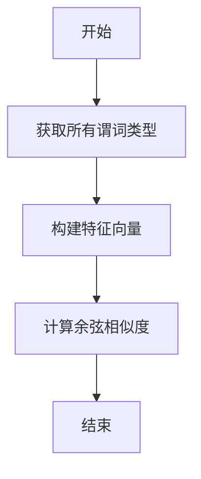
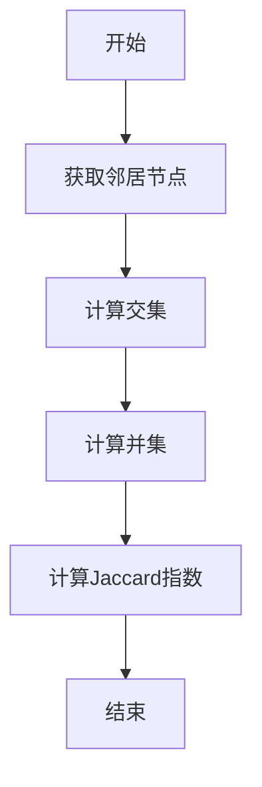
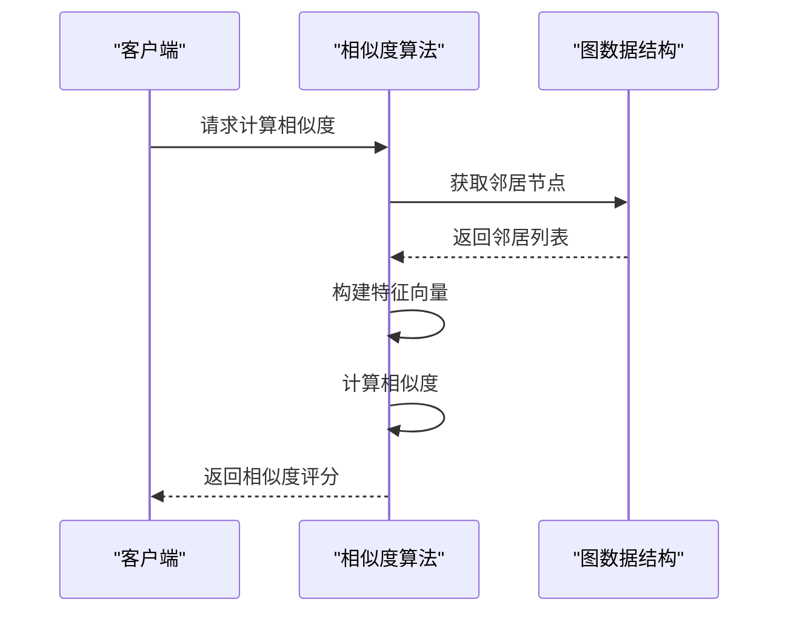
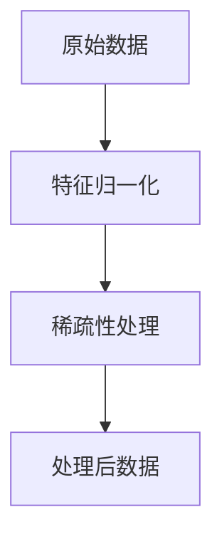
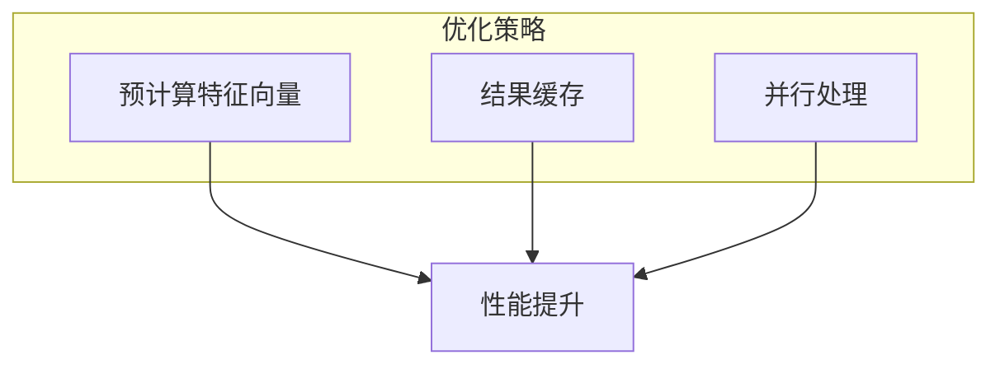

# 节点相似度度量

<cite>
**本文档引用的文件**
- [similarity.ts](file://src/algorithms/similarity.ts)
- [types.ts](file://src/algorithms/types.ts)
- [algorithms_similarity.test.ts](file://tests/unit/graph/algorithms_similarity.test.ts)
</cite>

## 目录
1. [引言](#引言)
2. [余弦相似度算法](#余弦相似度算法)
3. [Jaccard系数算法](#jaccard系数算法)
4. [其他相似度算法](#其他相似度算法)
5. [属性向量构建与邻接关系比较](#属性向量构建与邻接关系比较)
6. [API调用示例](#api调用示例)
7. [预处理技术](#预处理技术)
8. [不同度量方式的适用边界](#不同度量方式的适用边界)
9. [计算效率优化手段](#计算效率优化手段)
10. [应用价值](#应用价值)

## 引言
SynapseDB提供了多种节点相似度计算方法，包括余弦相似度（Cosine Similarity）和Jaccard系数（Jaccard Index）。这些度量在推荐系统、关联挖掘中具有重要应用价值。本文将详细解析这些算法的数学定义与工程实现，并结合代码逻辑说明关键步骤。

## 余弦相似度算法
余弦相似度基于节点度数向量的余弦值来衡量两个节点之间的相似性。其核心思想是通过计算两个向量夹角的余弦值来评估它们的方向一致性。

### 数学定义
对于两个向量 \( \vec{A} \) 和 \( \vec{B} \)，余弦相似度定义为：
\[
\text{cosine similarity} = \frac{\vec{A} \cdot \vec{B}}{\|\vec{A}\| \|\vec{B}\|}
\]

### 工程实现
在`CosineSimilarity`类中，首先获取所有可能的谓词类型，然后为每个节点构建特征向量，最后计算这两个向量的余弦相似度。



**图源**
- [similarity.ts](file://src/algorithms/similarity.ts#L91-L195)

**节源**
- [similarity.ts](file://src/algorithms/similarity.ts#L91-L195)

## Jaccard系数算法
Jaccard系数基于共同邻居的集合相似度来计算两个节点的相似性。它反映了两个节点共享邻居的比例。

### 数学定义
对于两个集合 \( A \) 和 \( B \)，Jaccard系数定义为：
\[
\text{Jaccard index} = \frac{|A \cap B|}{|A \cup B|}
\]

### 工程实现
在`JaccardSimilarity`类中，首先获取两个节点的所有邻居，然后计算交集和并集的大小，最终得出Jaccard系数。



**图源**
- [similarity.ts](file://src/algorithms/similarity.ts#L19-L85)

**节源**
- [similarity.ts](file://src/algorithms/similarity.ts#L19-L85)

## 其他相似度算法
除了余弦相似度和Jaccard系数外，SynapseDB还实现了Adamic-Adar相似度、优先连接相似度等算法。

### Adamic-Adar相似度
该算法基于共同邻居的重要性加权相似度，特别适用于社交网络分析。

### 优先连接相似度
基于度数乘积的相似度计算，反映节点间潜在的连接倾向。

```mermaid
classDiagram
class SimilarityAlgorithm {
+computeSimilarity(graph : Graph, node1 : string, node2 : string) : number
+computeAllSimilarities(graph : Graph, threshold? : number) : SimilarityResult
+findMostSimilar(graph : Graph, targetNode : string, k : number) : Array<{ nodeId : string; similarity : number }>
}
class CosineSimilarity {
-buildFeatureVector(graph : Graph, nodeId : string, predicates : Set<string>) : number[]
-cosineSimilarity(vector1 : number[], vector2 : number[]) : number
}
class JaccardSimilarity {
-getIntersection(neighbors1 : Set<string>, neighbors2 : Set<string>) : Set<string>
-getUnion(neighbors1 : Set<string>, neighbors2 : Set<string>) : Set<string>
}
class AdamicAdarSimilarity {
-calculateScore(commonNeighbors : string[], graph : Graph) : number
}
class PreferentialAttachmentSimilarity {
-getDegreeProduct(degree1 : number, degree2 : number) : number
}
SimilarityAlgorithm <|-- CosineSimilarity
SimilarityAlgorithm <|-- JaccardSimilarity
SimilarityAlgorithm <|-- AdamicAdarSimilarity
SimilarityAlgorithm <|-- PreferentialAttachmentSimilarity
```

**图源**
- [similarity.ts](file://src/algorithms/similarity.ts#L19-L85)
- [similarity.ts](file://src/algorithms/similarity.ts#L91-L195)
- [similarity.ts](file://src/algorithms/similarity.ts#L201-L270)
- [similarity.ts](file://src/algorithms/similarity.ts#L277-L315)

**节源**
- [similarity.ts](file://src/algorithms/similarity.ts#L19-L85)
- [similarity.ts](file://src/algorithms/similarity.ts#L91-L195)
- [similarity.ts](file://src/algorithms/similarity.ts#L201-L270)
- [similarity.ts](file://src/algorithms/similarity.ts#L277-L315)

## 属性向量构建与邻接关系比较
在计算节点相似度时，需要先构建属性向量并对邻接关系进行比较。这一步骤涉及从图中提取节点及其邻居的信息，并将其转换为可用于计算的数值形式。

### 关键步骤
1. 获取节点的所有邻居。
2. 构建基于谓词类型的度数向量。
3. 计算向量间的相似度。



**图源**
- [similarity.ts](file://src/algorithms/similarity.ts#L91-L195)
- [types.ts](file://src/algorithms/types.ts#L130-L184)

**节源**
- [similarity.ts](file://src/algorithms/similarity.ts#L91-L195)
- [types.ts](file://src/algorithms/types.ts#L130-L184)

## API调用示例
以下是一个使用`SimilarityAlgorithmFactory`创建余弦相似度算法实例并计算两个节点间相似性的示例：

```typescript
import { SimilarityAlgorithmFactory } from '@/algorithms/similarity';
import { GraphBuilder } from '@/algorithms/graph';

// 创建图实例
const graph = new GraphBuilder()
  .addNode('A')
  .addNode('B')
  .addEdge('A', 'B', 'FRIEND')
  .build();

// 创建余弦相似度算法实例
const cosineSim = SimilarityAlgorithmFactory.createCosine();

// 计算节点A和B的相似度
const similarity = cosineSim.computeSimilarity(graph, 'A', 'B');
console.log(`节点A和B的余弦相似度: ${similarity}`);
```

**节源**
- [similarity.ts](file://src/algorithms/similarity.ts#L629-L631)
- [algorithms_similarity.test.ts](file://tests/unit/graph/algorithms_similarity.test.ts#L46-L55)

## 预处理技术
为了提高相似度计算的准确性和效率，通常需要对数据进行预处理，包括特征归一化和稀疏性处理。

### 特征归一化
通过对特征向量进行归一化，可以消除不同尺度带来的影响，使得相似度计算更加公平。

### 稀疏性处理
针对大规模图数据中存在的稀疏性问题，采用适当的压缩和索引技术以减少存储空间和计算时间。



**图源**
- [similarity.ts](file://src/algorithms/similarity.ts#L91-L195)
- [similarity.ts](file://src/algorithms/similarity.ts#L19-L85)

**节源**
- [similarity.ts](file://src/algorithms/similarity.ts#L91-L195)
- [similarity.ts](file://src/algorithms/similarity.ts#L19-L85)

## 不同度量方式的适用边界
不同的相似度度量方法适用于不同类型的数据和应用场景。例如，余弦相似度适合于高维稀疏数据，而Jaccard系数更适合于集合数据。

### 选择指南
- **余弦相似度**：适用于文本、推荐系统等场景。
- **Jaccard系数**：适用于社交网络、共现分析等场景。
- **Adamic-Adar相似度**：适用于强调共同邻居重要性的场景。
- **优先连接相似度**：适用于预测新链接形成的场景。

## 计算效率优化手段
为了提升大规模图数据上的相似度计算性能，采取了多种优化措施，如预计算特征向量、利用哈希表加速查找等。

### 优化策略
1. **预计算**：提前计算所有节点的特征向量，避免重复计算。
2. **缓存机制**：缓存已计算的结果，减少冗余运算。
3. **并行处理**：利用多线程或分布式计算框架加速计算过程。



**图源**
- [similarity.ts](file://src/algorithms/similarity.ts#L91-L195)
- [similarity.ts](file://src/algorithms/similarity.ts#L151-L195)

**节源**
- [similarity.ts](file://src/algorithms/similarity.ts#L91-L195)
- [similarity.ts](file://src/algorithms/similarity.ts#L151-L195)

## 应用价值
节点相似度计算在多个领域展现出巨大潜力，特别是在推荐系统和关联挖掘方面。

### 推荐系统
通过计算用户