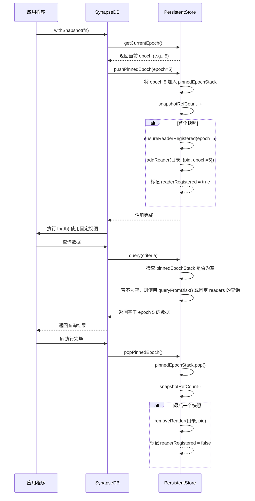
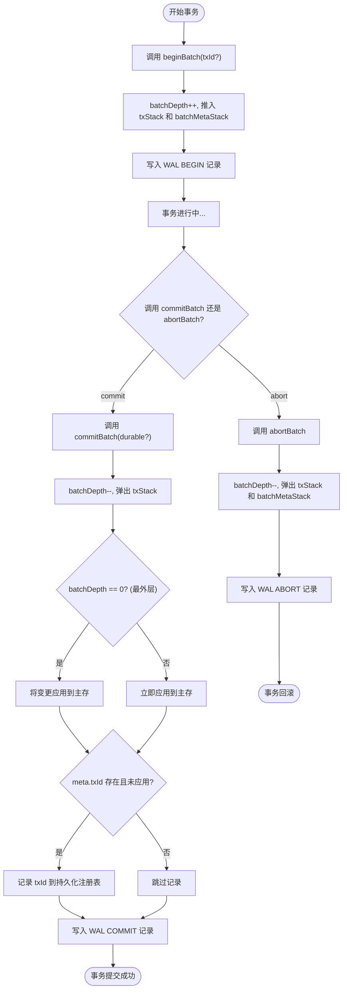

# 事务并发模型

<cite>
**本文档引用的文件**
- [snapshot_memory_basic.test.ts](file://tests/system/snapshot_memory_basic.test.ts)
- [wal.ts](file://src/storage/wal.ts)
- [persistentStore.ts](file://src/storage/persistentStore.ts)
- [synapseDb.ts](file://src/synapseDb.ts)
- [txidRegistry.ts](file://src/storage/txidRegistry.ts)
- [readerRegistry.ts](file://src/storage/readerRegistry.ts)
</cite>

## 目录
1. [简介](#简介)
2. [基于WAL的MVCC与快照隔离](#基于wal的mvcc与快照隔离)
3. [嵌套事务的状态机与全局事务ID分配](#嵌套事务的状态机与全局事务id分配)
4. [事务边界在WAL中的表示](#事务边界在wal中的表示)
5. [隔离级别验证与长读事务影响](#隔离级别验证与长读事务影响)
6. [结论](#结论)

## 简介
本文档深入分析SynapseDB中基于预写式日志（WAL）的多版本并发控制（MVCC）模型。重点阐述了事务开始时获取的读版本号如何实现快照隔离，详细描述了嵌套事务的begin/commit/abort状态机转换及其对全局事务ID（txid）分配的影响，并结合appendBegin/appendCommit等WAL记录类型，说明事务边界在持久化日志中的表示方式。通过分析`snapshot_memory_basic.test.ts`等测试用例来验证隔离级别，并讨论长读事务对存储空间占用的影响及应对策略。

## 基于WAL的MVCC与快照隔离

SynapseDB通过维护一个“epoch”系统和读者注册机制来实现MVCC和快照隔离。当一个事务以只读模式启动时，它会获取当前的`currentEpoch`并将其压入`pinnedEpochStack`。这个`epoch`值代表了数据库在那一刻的一致性视图。



**图表来源**
- [persistentStore.ts](file://src/storage/persistentStore.ts#L1379-L1381)
- [persistentStore.ts](file://src/storage/persistentStore.ts#L1355-L1363)
- [persistentStore.ts](file://src/storage/persistentStore.ts#L1365-L1378)
- [readerRegistry.ts](file://src/storage/readerRegistry.ts#L55-L66)
- [readerRegistry.ts](file://src/storage/readerRegistry.ts#L72-L93)
- [synapseDb.ts](file://src/synapseDb.ts#L477-L491)

**本节来源**
- [persistentStore.ts](file://src/storage/persistentStore.ts#L1379-L1381)
- [persistentStore.ts](file://src/storage/persistentStore.ts#L1355-L1363)
- [persistentStore.ts](file://src/storage/persistentStore.ts#L1365-L1378)
- [synapseDb.ts](file://src/synapseDb.ts#L477-L491)

## 嵌套事务的状态机与全局事务ID分配

SynapseDB支持嵌套事务，其核心是一个栈式状态机，由`batchDepth`、`txStack`和`batchMetaStack`共同管理。

### 状态机转换
- **BEGIN**: 调用`beginBatch()`时，`batchDepth`递增，一个新的暂存层被推入`txStack`，同时元信息（如`txId`）被推入`batchMetaStack`。对应的WAL记录为`appendBegin()`。
- **COMMIT**: 调用`commitBatch()`时，`batchDepth`递减，顶层暂存层从`txStack`弹出。如果这是最外层提交（`batchDepth === 0`），则将变更应用到主存；如果是内层提交，则立即应用到主存，使其不受外层ABORT影响。对应的WAL记录为`appendCommit()`或`appendCommitDurable()`。
- **ABORT**: 调用`abortBatch()`时，`batchDepth`递减，顶层暂存层和元信息从各自的栈中被丢弃。对应的WAL记录为`appendAbort()`。

### 全局事务ID（txid）分配与幂等性
`txId`是可选的幂等性控制标识符。当一个事务携带`txId`提交时：
1.  在`commitBatch()`时，系统会检查该`txId`是否已存在于已知集合中。
2.  如果存在，则整个提交操作被忽略，确保了幂等性。
3.  如果不存在，则执行正常提交流程，并将该`txId`记录到持久化的`txidRegistry`中，以便在数据库重启后也能识别重复的事务。



**图表来源**
- [persistentStore.ts](file://src/storage/persistentStore.ts#L714-L725)
- [persistentStore.ts](file://src/storage/persistentStore.ts#L727-L763)
- [persistentStore.ts](file://src/storage/persistentStore.ts#L765-L773)
- [wal.ts](file://src/storage/wal.ts#L96-L99)
- [wal.ts](file://src/storage/wal.ts#L101-L103)
- [wal.ts](file://src/storage/wal.ts#L110-L112)
- [txidRegistry.ts](file://src/storage/txidRegistry.ts#L9-L13)

**本节来源**
- [persistentStore.ts](file://src/storage/persistentStore.ts#L714-L773)
- [wal.ts](file://src/storage/wal.ts#L96-L112)

## 事务边界在WAL中的表示

事务的边界通过特定类型的WAL记录来表示，这些记录构成了一个可以重放的逻辑栈。

### WAL记录类型
- **0x40 (BEGIN)**: 表示一个新事务批次的开始。其有效载荷包含可选的元信息（`WalBeginMeta`），如`txId`和`sessionId`，通过`encodeBeginMeta()`函数编码。
- **0x41 (COMMIT)**: 表示一个事务批次的提交。其有效载荷为空。`appendCommitDurable()`版本会在写入记录后强制调用`fsync`，提供更强的持久性保证。
- **0x42 (ABORT)**: 表示一个事务批次的中止。其有效载荷为空。

### 重放过程中的语义
在数据库恢复时，`WalReplayer`会按顺序处理这些记录：
- 遇到`BEGIN`时，在内存中创建一个新的暂存层。
- 遇到`ADD/DELETE/SET`等数据修改记录时，根据当前栈的深度，将它们添加到顶层暂存层或直接应用到全局结果集。
- 遇到`COMMIT`时，弹出顶层暂存层。如果栈非空（内层提交），则立即将其内容提升为全局可见；如果栈为空（最外层提交），则检查`txId`的幂等性后再决定是否应用。
- 遇到`ABORT`时，直接丢弃顶层暂存层。

这种设计使得WAL不仅记录了数据变更，还完整地记录了事务的嵌套结构和提交/中止决策。

**本节来源**
- [wal.ts](file://src/storage/wal.ts#L96-L112)
- [wal.ts](file://src/storage/wal.ts#L341-L361)
- [wal.ts](file://src/storage/wal.ts#L363-L389)
- [wal.ts](file://src/storage/wal.ts#L145-L320)

## 隔离级别验证与长读事务影响

### 隔离级别验证
`snapshot_memory_basic.test.ts`测试用例验证了快照隔离的核心特性：在`withSnapshot`回调期间，无论外部发生何种写入，内部的查询结果都保持稳定。

```typescript
// 测试用例关键逻辑
const result = await db.withSnapshot((snap) => {
  // 快照内做多次查询，结果应稳定
  const a = snap.find({ predicate: 'link' }).all().length;
  const b = snap.find({ predicate: 'link' }).follow('link').limit(50).all().length;
  return { a, b };
});

// 快照外追加数据
db.addFact({ subject: 'extra: