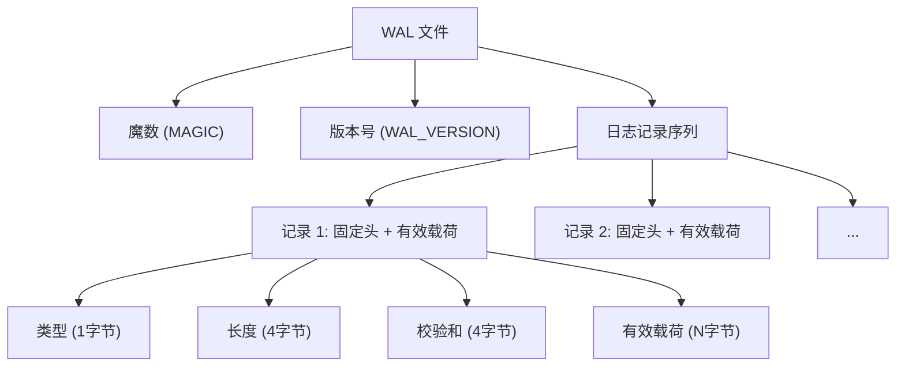
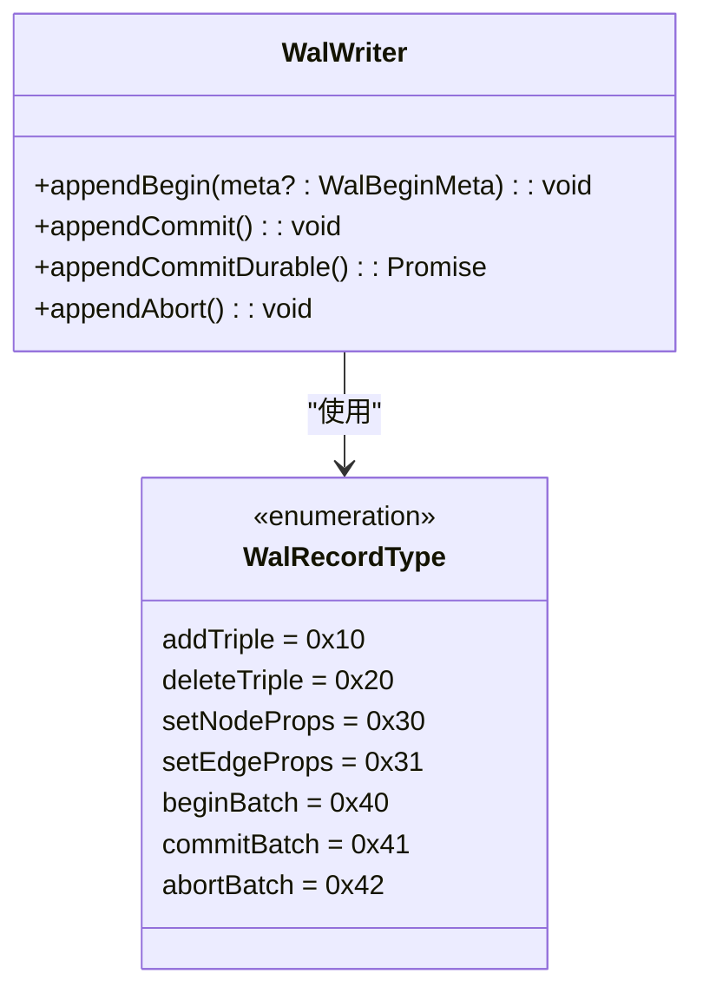
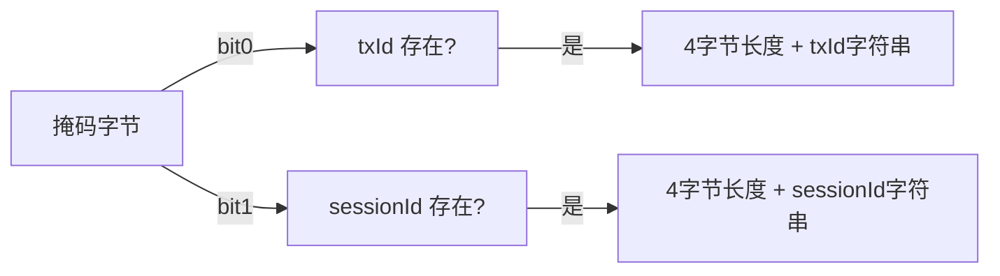
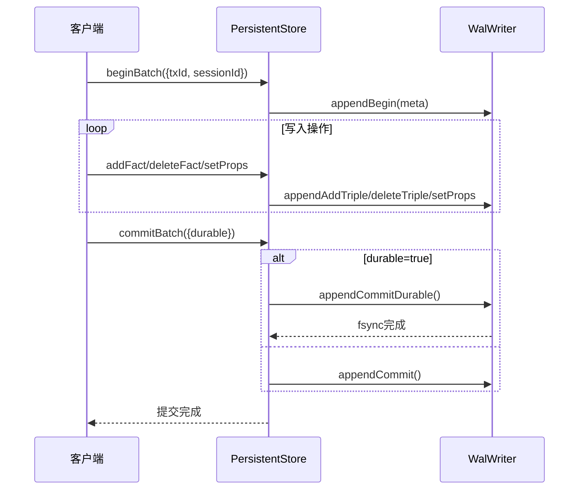
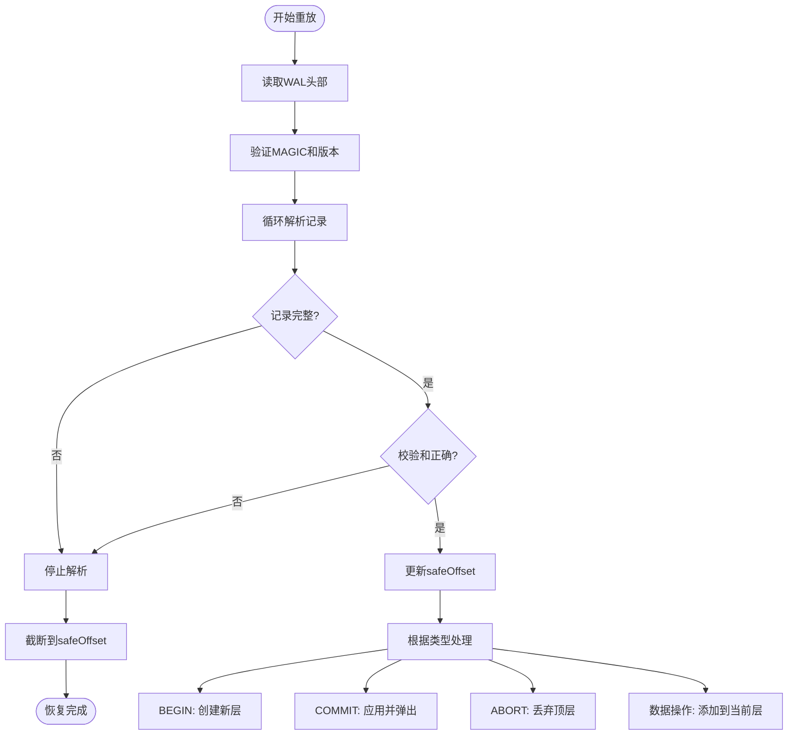

# 基于WAL的事务边界表示

<cite>
**本文档引用文件**
- [wal.ts](file://src/storage/wal.ts)
- [persistentStore.ts](file://src/storage/persistentStore.ts)
- [教程-04-事务-WAL-幂等.md](file://docs/教学文档/教程-04-事务-WAL-幂等.md)
- [ROADMAP.md](file://docs/项目发展路线图/ROADMAP.md)
- [claude-0918-16:47.md](file://docs/项目审查文档/claude-0918-16:47.md)
- [wal.test.ts](file://tests/integration/storage/wal.test.ts)
- [wal_nested_bug_reproduce.test.ts](file://tests/integration/storage/wal_nested_bug_reproduce.test.ts)
- [wal_txid_idempotent.test.ts](file://tests/integration/storage/wal_txid_idempotent.test.ts)
- [wal_commit_durable.test.ts](file://tests/integration/storage/wal_commit_durable.test.ts)
- [wal_abort_semantics.test.ts](file://tests/integration/storage/wal_abort_semantics.test.ts)
- [wal_tail_truncation.test.ts](file://tests/integration/storage/wal_tail_truncation.test.ts)
</cite>

## 目录
1. [引言](#引言)
2. [日志记录格式与语义](#日志记录格式与语义)
3. [事务边界操作结构](#事务边界操作结构)
4. [元数据字段详解](#元数据字段详解)
5. [原子性与持久性保障](#原子性与持久性保障)
6. [崩溃恢复机制](#崩溃恢复机制)
7. [实际日志序列示例](#实际日志序列示例)
8. [检查点机制对齐](#检查点机制对齐)
9. [嵌套事务处理](#嵌套事务处理)
10. [幂等性支持](#幂等性支持)

## 引言
本文档系统性地描述了SynapseDB中WAL v2版本的事务边界日志记录格式及其语义含义。重点阐述`appendBegin`、`appendCommit`等核心操作在日志流中的结构布局，以及txid、timestamp、parentTxid等关键元数据字段的作用。通过分析这些记录如何协同工作，说明系统如何实现事务的原子性、持久性保障及崩溃后的可靠重放恢复。同时，文档将展示单个事务和嵌套事务在WAL中的完整生命周期，并解释检查点机制如何与事务边界对齐以优化数据库启动性能。

**本节内容未直接分析具体源代码文件**

## 日志记录格式与语义
WAL（Write-Ahead Log）v2是SynapseDB的核心事务日志系统，采用二进制格式确保高效写入和解析。每个日志记录由固定头部和可变长度的有效载荷组成，遵循严格的结构定义以保证数据完整性。



**Diagram sources**
- [wal.ts](file://src/storage/wal.ts#L3-L10)
- [wal.ts](file://src/storage/wal.ts#L19-L19)

**本节内容来源**
- [wal.ts](file://src/storage/wal.ts#L3-L19)

## 事务边界操作结构
事务边界操作通过特定的日志记录类型来标识，主要包括`beginBatch`、`commitBatch`和`abortBatch`三种操作，它们在WAL中分别用不同的类型码表示。

### BEGIN 操作 (0x40)
`appendBegin`操作标志着一个新事务批次的开始。该操作会向WAL追加一条类型为`0x40`的记录，其有效载荷包含可选的元数据信息。

### COMMIT 操作 (0x41)
`appendCommit`操作表示当前事务批次的成功提交。该操作生成类型为`0x41`的记录，有效载荷为空。对于需要更强持久性保证的场景，可使用`appendCommitDurable`方法，在写入提交记录后立即执行`fsync`操作。

### ABORT 操作 (0x42)
`appendAbort`操作用于放弃当前事务批次的所有修改。该操作生成类型为`0x42`的记录，同样不携带有效载荷，指示重放器丢弃对应的变更层。



**Diagram sources**
- [wal.ts](file://src/storage/wal.ts#L3-L10)
- [wal.ts](file://src/storage/wal.ts#L96-L110)

**本节内容来源**
- [wal.ts](file://src/storage/wal.ts#L3-L10)
- [wal.ts](file://src/storage/wal.ts#L96-L110)

## 元数据字段详解
事务的BEGIN记录可以携带丰富的元数据信息，这些信息对于实现高级功能如幂等性和会话追踪至关重要。

### txId 字段
`txId`是一个可选的字符串字段，用于唯一标识一个事务。当配置启用持久化去重(`enablePersistentTxDedupe`)时，相同的`txId`在重放过程中会被跳过，从而实现跨周期的幂等性。

### sessionId 字段
`sessionId`也是一个可选的字符串字段，用于标识发起事务的客户端会话。这有助于在运维工具中按会话聚合事务信息，便于监控和治理。

### 编码格式
元数据字段采用紧凑的二进制编码格式：
1. 首先是一个掩码字节，指示哪些字段存在
2. 如果存在`txId`，则紧随其后的是4字节长度前缀和UTF-8编码的字符串
3. `sessionId`的编码方式与`txId`相同



**Diagram sources**
- [wal.ts](file://src/storage/wal.ts#L21-L24)
- [wal.ts](file://src/storage/wal.ts#L331-L350)

**本节内容来源**
- [wal.ts](file://src/storage/wal.ts#L21-L24)
- [wal.ts](file://src/storage/wal.ts#L331-L350)

## 原子性与持久性保障
WAL v2通过精心设计的日志协议确保事务的ACID特性，特别是原子性和持久性。

### 原子性实现
原子性通过"两阶段提交"式的日志协议实现：
1. 所有变更首先被记录到WAL中，但处于暂存状态
2. 只有当收到`COMMIT`记录时，这些变更才会被应用到主存储
3. 若遇到`ABORT`记录或未完成的`BEGIN`，则对应变更被完全忽略

### 持久性级别
系统提供两种持久性级别：
- **标准提交**：仅保证记录写入操作系统缓冲区
- **持久化提交**：通过`fsync`确保记录物理落盘，提供更强的崩溃保护



**Diagram sources**
- [wal.ts](file://src/storage/wal.ts#L96-L110)
- [persistentStore.ts](file://src/storage/persistentStore.ts#L716-L732)

**本节内容来源**
- [wal.ts](file://src/storage/wal.ts#L96-L110)
- [persistentStore.ts](file://src/storage/persistentStore.ts#L716-L732)

## 崩溃恢复机制
崩溃恢复是WAL系统的核心价值所在，确保数据库在意外中断后能够恢复到一致状态。

### 重放流程
`WalReplayer`负责执行崩溃恢复，其主要步骤包括：
1. 读取WAL文件头部，验证魔数和版本
2. 从头开始逐条解析日志记录
3. 维护一个事务栈来管理嵌套事务
4. 遇到`BEGIN`时创建新的变更层
5. 遇到`COMMIT`时弹出顶层并应用变更
6. 遇到`ABORT`时直接丢弃顶层

### 尾部安全截断
为了处理不完整的日志记录，系统实现了尾部安全截断机制：
- 在解析过程中维护`safеOffset`指针
- 当遇到长度不完整或校验和错误的记录时停止
- 在数据库打开时自动将WAL文件截断到`safеOffset`



**Diagram sources**
- [wal.ts](file://src/storage/wal.ts#L142-L321)
- [wal_tail_truncation.test.ts](file://tests/integration/storage/wal_tail_truncation.test.ts#L45-L86)

**本节内容来源**
- [wal.ts](file://src/storage/wal.ts#L142-L321)
- [wal_tail_truncation.test.ts](file://tests/integration/storage/wal_tail_truncation.test.ts#L45-L86)

## 实际日志序列示例
以下示例展示了典型事务在WAL中的完整生命周期。

### 单个事务序列
一个简单的事务包含BEGIN、数据操作和COMMIT三个阶段：

```
[0x40][0x0A][...] -- BEGIN (txId: 'TX-001')
[0x10][0x0C][...] -- addTriple (SPO三元组)
[0x30][0x15][...] -- setNodeProps (节点属性)
[0x41][0x00][...] -- COMMIT
```

### 嵌套事务序列
嵌套事务展示了更复杂的交互模式：

```
[0x40][0x00][...] -- 外层BEGIN
[0x10][0x0C][...] -- 外层addTriple
[0x4