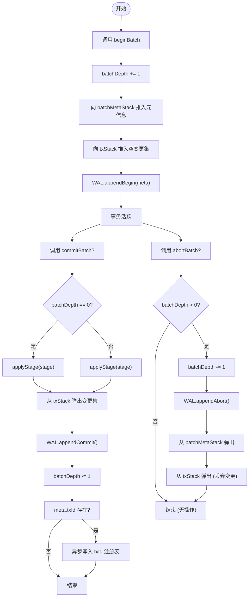

# 嵌套事务状态机

<cite>
**本文档引用的文件**
- [persistentStore.ts](file://src/storage/persistentStore.ts)
- [wal.ts](file://src/storage/wal.ts)
- [txidRegistry.ts](file://src/storage/txidRegistry.ts)
</cite>

## 目录
1. [引言](#引言)
2. [嵌套事务的状态管理机制](#嵌套事务的状态管理机制)
3. [变更集与事务栈](#变更集与事务栈)
4. [WAL日志持久化与崩溃恢复](#wal日志持久化与崩溃恢复)
5. [全局事务ID分配与幂等性保证](#全局事务id分配与幂等性保证)
6. [状态转换流程图](#状态转换流程图)

## 引言
本文深入剖析SynapseDB中嵌套事务的状态管理机制。通过分析`beginBatch`、`commitBatch`和`abortBatch`方法调用所引发的内部状态转换过程，揭示数据库如何在多层嵌套结构中维护数据一致性，并支持崩溃后的可靠恢复。

**Section sources**
- [persistentStore.ts](file://src/storage/persistentStore.ts#L714-L773)

## 嵌套事务的状态管理机制
SynapseDB采用基于栈的嵌套事务模型，允许开发者通过`beginBatch`开启新的事务层级，使用`commitBatch`提交当前层级的更改，或通过`abortBatch`回滚当前层级的所有操作。该机制的核心在于维护一个独立的事务深度计数器（`batchDepth`）以及两个并行的栈结构：`txStack`用于存储各层级的变更集，`batchMetaStack`则记录每层事务的元信息（如可选的`txId`和`sessionId`）。

当调用`beginBatch`时，系统会递增`batchDepth`，并将包含空变更集的新条目压入`txStack`，同时将传入的元信息推入`batchMetaStack`。每次`commitBatch`或`abortBatch`都会使`batchDepth`减一，并对顶层栈帧进行相应处理——提交则应用变更，回滚则直接丢弃。

这种设计确保了内层事务的提交结果可以立即对外部查询可见（即使外层尚未提交），而外层的`abortBatch`仅影响其自身及未提交的内层变更，已提交的内层变更不受影响。

**Section sources**
- [persistentStore.ts](file://src/storage/persistentStore.ts#L714-L773)

## 变更集与事务栈
每个嵌套层级都维护着独立的变更集（`txStack`中的元素），具体包括：
- `adds`: 待添加的事实三元组集合
- `dels`: 待删除的事实三元组集合
- `nodeProps`: 节点属性变更映射表
- `edgeProps`: 边缘属性变更映射表

这些变更集在事务处于活动状态时不直接影响主存储，而是暂存于内存中。只有当`commitBatch`被调用且`batchDepth`降至0（即最外层提交）时，变更才会通过`applyStage`方法正式应用到主存。对于非最外层的`commitBatch`，变更同样会被立即应用，以实现“部分提交”的语义。

`abortBatch`操作则简单地从`txStack`和`batchMetaStack`中弹出顶层元素，从而完全丢弃该层级的所有变更，实现局部回滚。

**Section sources**
- [persistentStore.ts](file://src/storage/persistentStore.ts#L714-L773)
- [persistentStore.ts](file://src/storage/persistentStore.ts#L1468-L1504)

## WAL日志持久化与崩溃恢复
为了支持崩溃恢复，所有事务边界操作均被记录到预写式日志（Write-Ahead Log, WAL）中。WAL定义了多种记录类型，其中与事务控制相关的有：
- `appendBegin`: 记录`beginBatch`调用及其元信息
- `appendCommit` / `appendCommitDurable`: 记录`commitBatch`调用
- `appendAbort`: 记录`abortBatch`调用

这些WAL记录不仅用于正常运行时的重放，还在数据库重启时由`WalReplayer`读取，重建`StagedLayer`栈来模拟事务的执行历史。`replay`方法会逐条解析WAL记录，根据`BEGIN`、`COMMIT`、`ABORT`指令精确还原`stack`的状态，最终将已确认提交的变更应用到内存状态中。此外，`replay`还会自动截断WAL尾部不完整的记录，确保恢复过程的幂等性和安全性。

**Section sources**
- [wal.ts](file://src/storage/wal.ts#L73-L123)
- [wal.ts](file://src/storage/wal.ts#L248-L278)
- [persistentStore.ts](file://src/storage/persistentStore.ts#L174-L201)

## 全局事务ID分配与幂等性保证
全局事务ID（`txId`）在`beginBatch`调用时由外部提供，并随`appendBegin`记录一同写入WAL。`txId`的唯一性和顺序性由应用层保证，数据库本身不负责生成ID，但提供了基于`txId`的幂等性去重机制。

当最外层事务提交时，若存在`txId`，系统会异步将其写入位于索引目录下的`txids.json`注册表文件中。此过程由`txidRegistry.ts`模块中的`readTxIdRegistry`、`writeTxIdRegistry`和`mergeTxIds`函数协同完成。`mergeTxIds`函数确保相同的`txId`不会被重复记录，并可根据配置限制注册表大小，保留最近的N个已提交事务ID。

在数据库启动时，`WalReplayer`会读取现有的`txId`注册表，构建一个已知ID的集合（`appliedTxIds`）。在重放WAL过程中，如果遇到带有`txId`的最外层`COMMIT`记录，且该`txId`已在集合中，则整个提交操作将被跳过，从而防止同一逻辑事务被重复执行。

**Section sources**
- [persistentStore.ts](file://src/storage/persistentStore.ts#L759-L773)
- [txidRegistry.ts](file://src/storage/txidRegistry.ts#L0-L76)
- [wal.ts](file://src/storage/wal.ts#L248-L278)

## 状态转换流程图

**Diagram sources**
- [persistentStore.ts](file://src/storage/persistentStore.ts#L714-L773)
- [wal.ts](file://src/storage/wal.ts#L73-L123)

**Section sources**
- [persistentStore.ts](file://src/storage/persistentStore.ts#L714-L773)
- [wal.ts](file://src/storage/wal.ts#L73-L123)